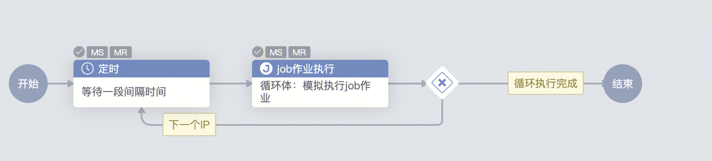
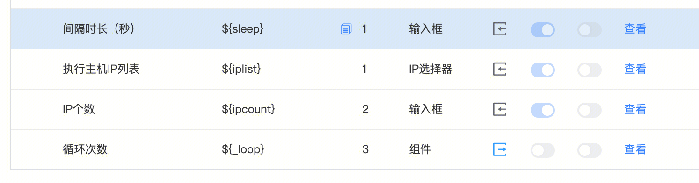
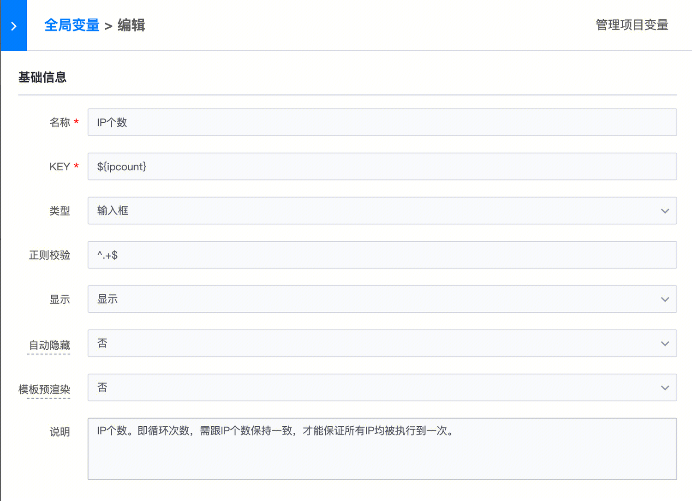
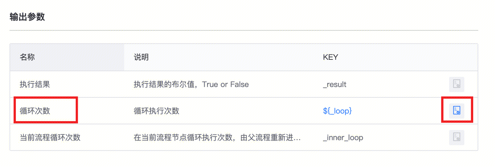
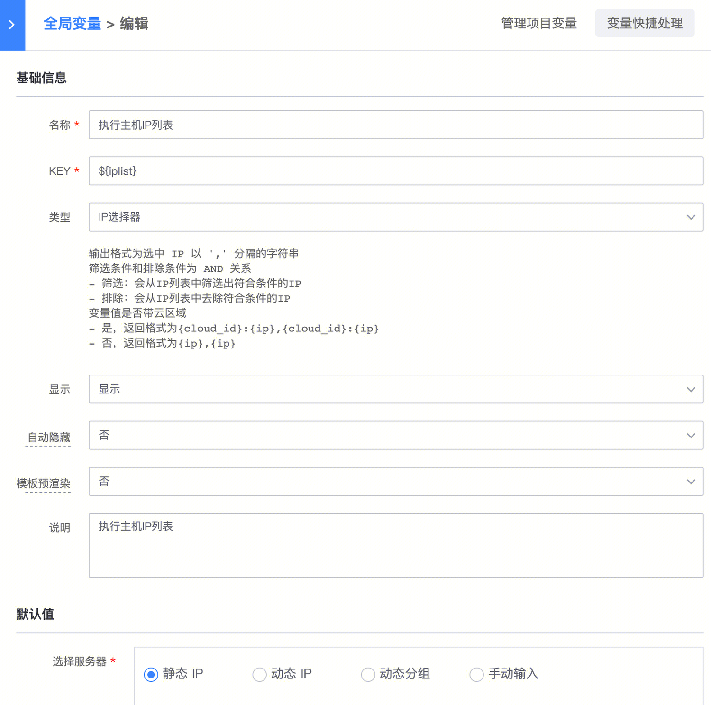
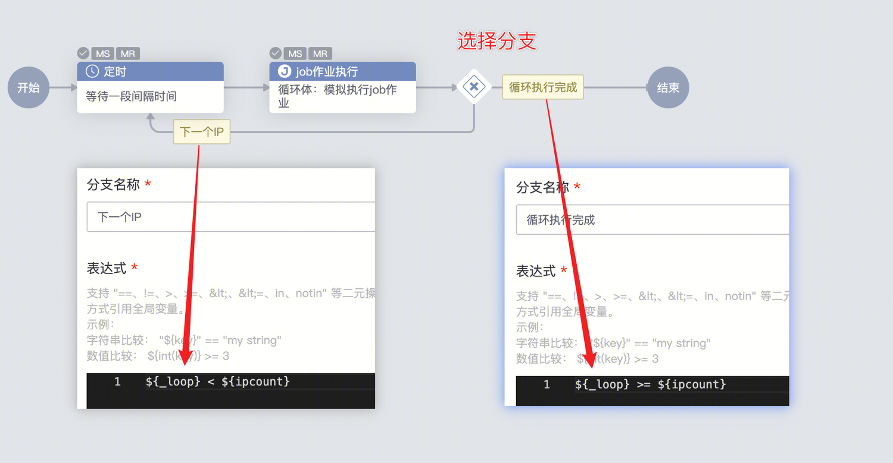
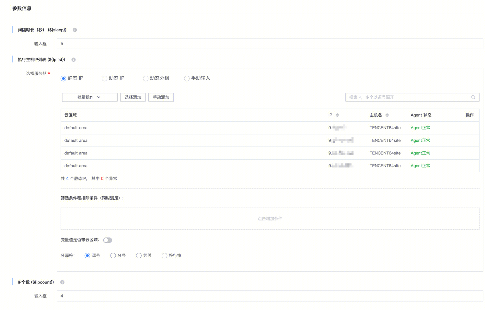
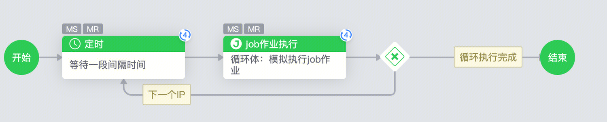
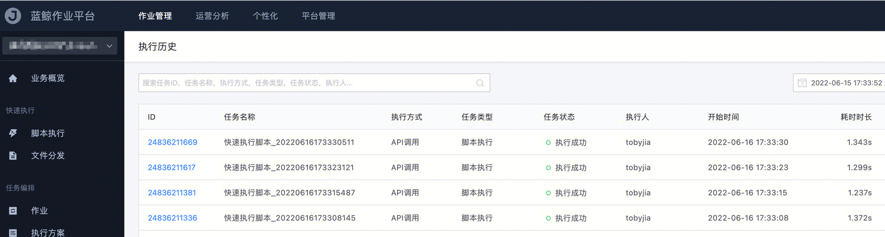

[TOC]

# 概述

标准运维提供了分支网关的功能，可以通过分支网关的判断语句，编排出循环执行的功能。

本文提供样例、模板、以及详细说明，讲解循环功能是如何编排出来的。

# 样例

**流程图示：**

如图，本例要实现要将”定时“和”job作业执行“两个节点，进行循环执行。每次循环只执行”一组主机列表中的一台主机“。

其中”定时“，用于实现循环一次后，等待一段间隔时间的功能。”job作业执行“，用于实际的执行内容，执行实际的作业。

”定时“+”job作业执行“  ：这两个节点每次循环时，都需要执行一次，本文把他们叫做“循环体”。

  
**变量图示：**

**模板下载：**

下载模板后，导入标准运维后，即可使用。

[循环模板bk_sops_5000288_20220616192702.yaml](https://iwiki.woa.com/tencent/api/attachments/s3/url?attachmentid=626825)

# 原理说明

编排出循环功能，最有三项关键步骤：

1、控制循环次数

2、循环时，每次job作业，只执行一个IP

3、循环判断条件

下面进行详细说明：

## 1、 控制循环次数

控制循环次数，是循环执行的核心目的。实现循环，需要有两个次数变量：

### （1）总循环次数：

用于告诉系统，循环体总共要执行多少次。

在本例中，循环的总次数，为主机列表的数量。在全局变量中，创建 ”IP个数（ipcount）”这个变量，用于填写主机列表中的IP总数。

### （2）当前循环的次数：

节点的“输出参数”，新增加了“循环次数”的系统变量。该变量会在该节点每次执行时，进行同步更新，表明当前的循环次数。

如；该节点第1次执行时，“循环次数”的值为1；该节点第2次执行时，循环次数的值为2……

在循环体的第1个节点（本例中为“定时”节点）上配置节点，将“输出参数”的“循环次数”变量，勾选右侧的“勾选为全局变量”按钮。以便后续节点，获取和引用该参数。

通过"当前循环次数"与“总循环次数”的比较，我们可以告诉系统，是该继续循环、还是该结束循环。（在第3节，循环判断条件，详细说明）

## 2、循环时，每次job作业，只执行一个IP

循环时，job作业的执行ip参数，需要进行调整，才能保证每次只执行一个ip。

创建一个“IP选择器”全局变量，“执行主机IP列表（iplist）”，用于存储该job作业，需要执行的全部ip信息。

在job执行作业节点中，目标IP字段，填写${iplist.split(',')[_loop-1]}参数。实现每次根据循环，只执行一个ip的目的。

### 参数详细解释

${iplist}：为主机列表的字符串，格式为IP选择器的返回格式。例如：1.1.1.1, 2.2.2.2, 3.3.3.3, 4.4.4.4

${iplist.split(','))：将主机列表字符串，按照逗号分隔为数组。例如：["1.1.1.1", "2.2.2.2", "3.3.3.3", "4.4.4.4"]

${_loop}：该变量为循环体第一个节点的执行次数。例如；该节点第1次执行时，_loop值为1；该节点第2次执行时，_loop值为2……

${_loop-1}：将循环次数-1，用于取数组中的每个元素。即，该节点第1次执行时，_loop值为1，_loop-1值为0，数组array[0]即取数组的第1个元素。

组合起来，${iplist.split(',')[_loop-1]}，即表示，节点第n次执行时，该值为iplist变量的第n台ip信息。

## 3、循环判断条件

拖拽“选择分支”的节点，放到循环体的最后一个节点（本例为“job作业执行”）后面，拉出两条分支。

### （1）循环分支

一条指向循环体的第一个节点（本例为“定时”），用于循环未结束时，返回第一步继续循环。

该分支判断条件为：${_loop} < ${ipcount} ，即“当前执行次数”小于“总循环次数”时，继续循环。

### （2）结束分支

一条指向结束的分支，用户循环结束时，跳出循环体。

改分支判断条件为：${_loop} >= ${ipcount}，即“当前执行次数”大于等于“总循环次数”时，循环结束。

# 执行演示

新建该流程任务，选择四个主机，执行作业，每间隔5秒再进行下一次的job作业执行。

执行后，循环体中的两个节点，确实执行了4次。

在job中查看执行记录，确实有四条。

  

  
