概述

标准运维提供了多种类型的全局变量，本文进行介绍。

详细使用配置方式，请参阅：[标准运维各类全局变量使用说明](https://iwiki.woa.com/p/438435460)

# 普通变量

## 输入框

单行字符串，无换行符。

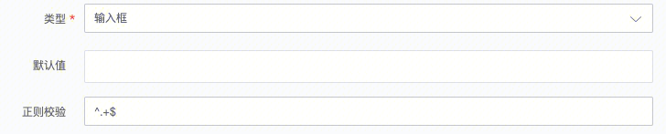

## 文本框

多行字符串，包含换行符。

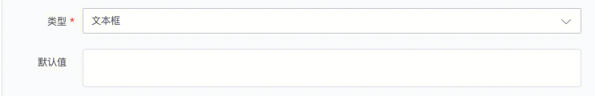

## 日期时间

格式为yyyy-mm-dd hh:mm:ss的字符串，可以根据日期时间选择框进行鼠标选择。

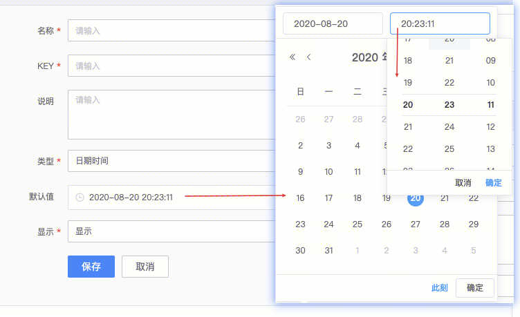

## 整形

无符号整形数字，默认值为0。

## 日期

选择日期。

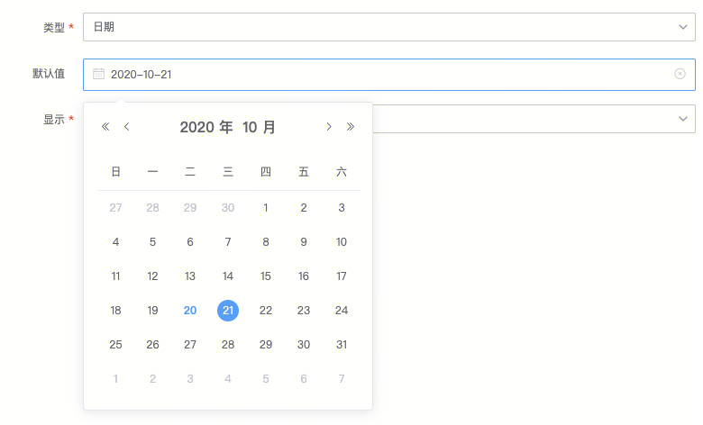

## 时间

选择时间。

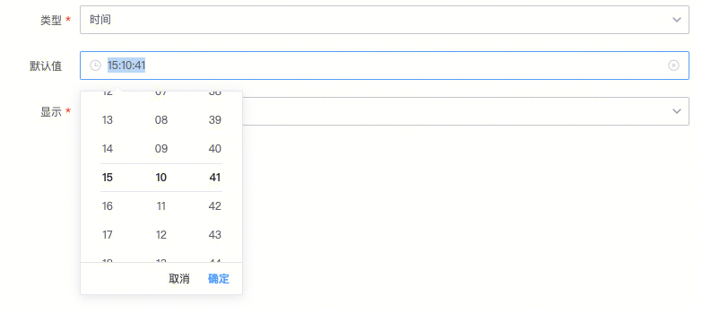

## 密码

输入后以*号显示，后台以加密字段存储，不能粘贴复制，重新点击输入框即需重新输入密码。配合部分插件可以自动就进行加解密转换，用户无需干预。填写时可触发浏览器的密码保存询问功能。

## 人员选择器

输入人名时，会自动搜索人名，并且填充为ename(中文名);的形式。多个名字用英文分号分隔。

## IP选择器

跟CMDB联动，可以通过静态ip、或动态ip进行ip选择。可以通过筛选条件和排除条件过滤主机。

**左图：** 静态ip添加，添加后主机不变。**右图：**动态ip添加，添加后，每次执行时，获取当前set或model下的主机。

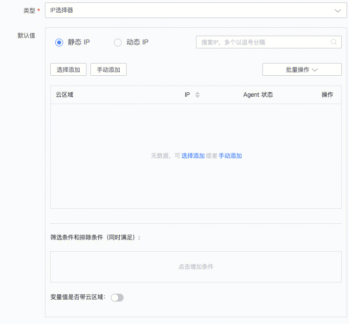

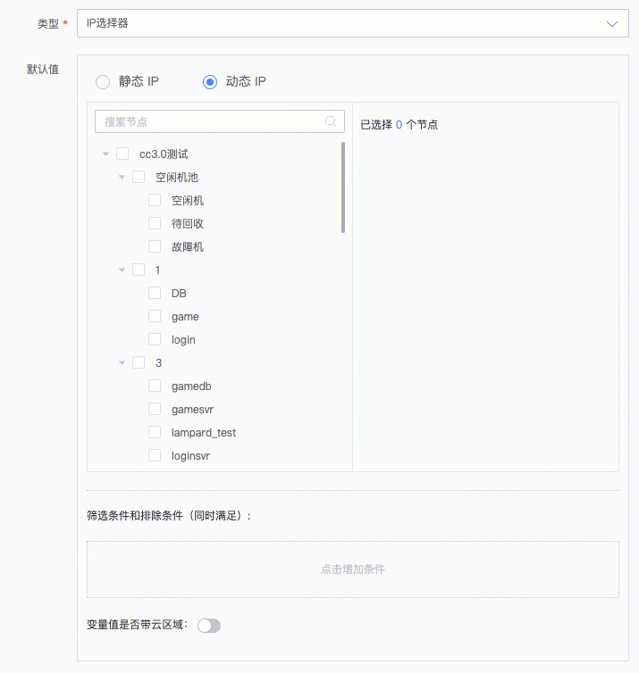

## 人员选择器

匹配企业微信人员名字信息，设置人员列表。

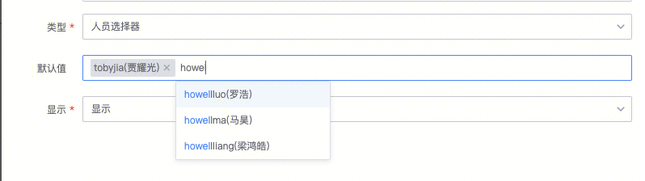

## 云石版本文件

调用云石版本文件信息，选择文件列表。

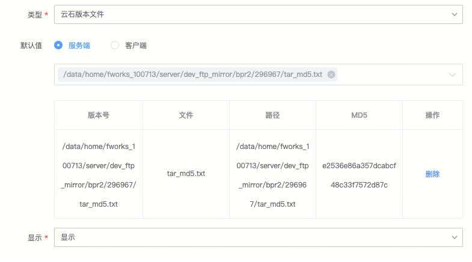

## 集群资源筛选

对标IEG老标准运维的开区模板、扩容模板中的“资源分配”功能

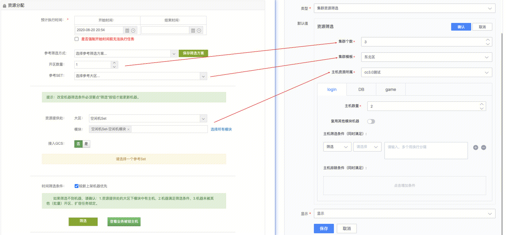

## 主机属性查询器

和CMDB联动，输入ip，查询该主机在CMDB中的属性字段。

## 系统当前时间

默认获取执行时的系统当前时间。

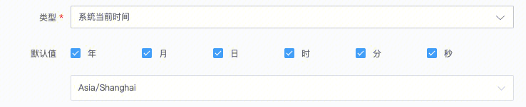

## 人员分组选择器

可以组合多个人员组到同一个变量中。

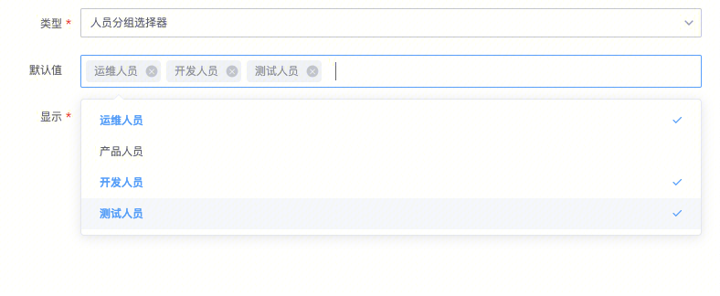

## 集群模块选择器

根据CMDB中的集群名，选择模块列表。

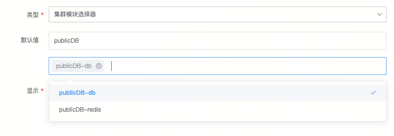

# 元变量

## 下拉框

以json格式标记的下拉框的text和value的描述形式，可以自定义直接输入json串，或者填写url，远程加载json串。

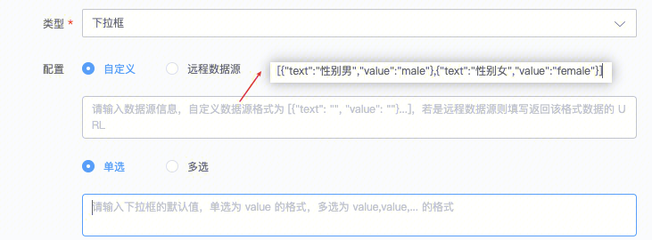

执行时，插件渲染出下拉框的形式进行展示，前台以text为选项名，供用户选择。后台变量赋值为value的值。

## 表格

以json格式标记的表格的列描述形式，定义表头和行内容。

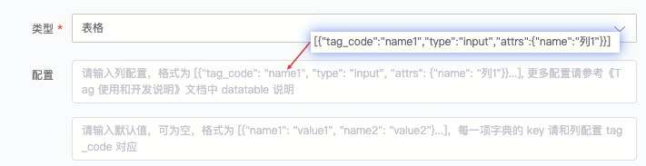

执行时，插件会渲染出表格的形式，展示表头和行内容，并可增删改行内容。提供导入导出功能。

