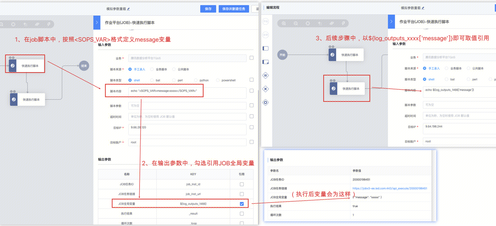
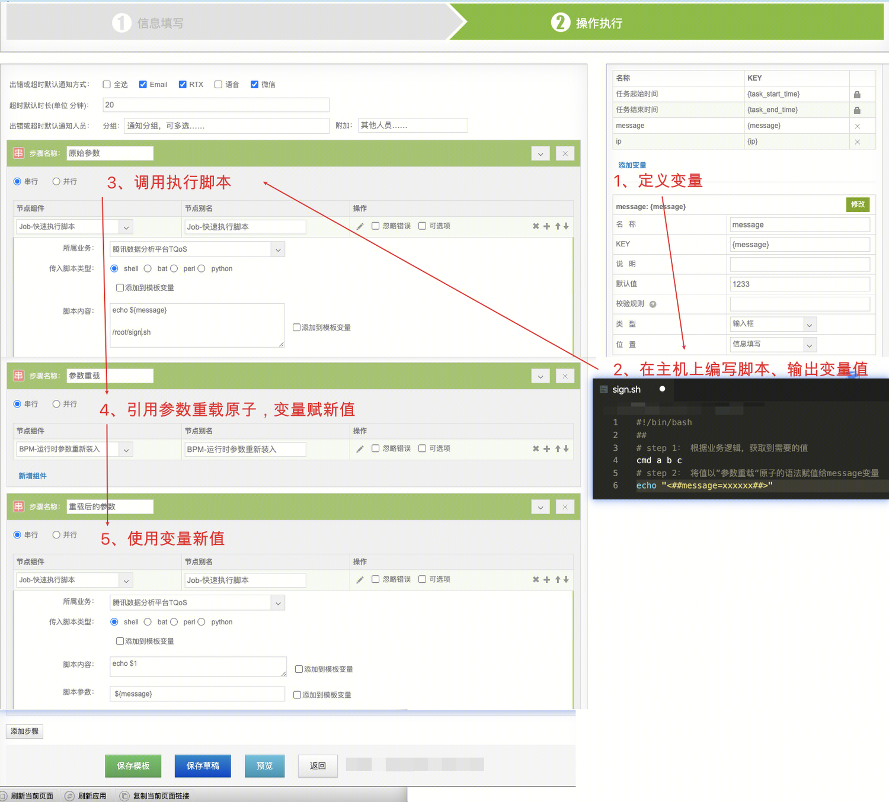

[TOC]

在标准运维V1版本中，步骤的输出结果，无法直接传入后一步骤，作为输入参数使用。这个需求，却时常需要被运维使用。

例如，需要根据上一步骤中，在主机上获取到的”环境变量“、”标记文件“等信息，区分主机是正式环境还是测试主机、或者是logic模块还是login模块，作为下一步骤中的输入变量，从而执行不同的操作。

针对上述需求场景，标准运维团队在IEG内部使用的V1版本中，新增加了”参数重载“的原子，从而间接的实现了这个功能。


而标准运维V3版本和作业平台V3版本（即蓝鲸上云版中的标准运维和作业平台），天然的具有这个功能，所以不再需要单独一个”参数重载“的原子插件去间接的实现。

本文详细讲述其原理，引导运维如何直接使用“参数重载”功能。即：将前一步骤的输出结果，传入后一步骤，作为输入参数使用。


## 在标准运维上云版本上，如何实现：

举例：运维需要获取主机（1.1.1.1）上的message信息，将其传入下一个步骤




###  小贴士

目前已经兼容了 <##{key}=val##> 老版本重载语法的变量提取，新迁移的业务可以不再调整 JOB 侧的脚本，只将标准运维侧的变量引用修改为 log_outputs["{key}"] 即可


1、在标准运维的任意步骤中，通过JOB原子（快速执行脚本、执行作业），输出<SOPS_VAR>key:val</SOPS_VAR>格式的字符串，即将变量key赋值val。例如上图，echo "<SOPS_VAR>message:xxxxx</SOPS_VAR>"，则 key为message，value为xxxxx。

2、在输出参数中，勾选引用“JOB全局变量“，即可将这个${log_outputs_abcd}作为<SOPS_VAR>的输出变量。（abcd为随机字符串，用于唯一标识这个步骤的log_outputs变量）

3、在后续步骤中，使用${log_outputs_abcd['message']}，即可获取到message的值xxxxxx。


## 如何使用多个变量：

多个变量，只要key不同，只需要使用<SOPS_VAR>key:val</SOPS_VAR>的语法，就可以定义多个。

例如：

```bash
echo "<SOPS_VAR>message1:xxxxx</SOPS_VAR>"
echo "<SOPS_VAR>message2:xxxxx</SOPS_VAR>"
或者
echo "<SOPS_VAR>message1:xxxxx</SOPS_VAR><SOPS_VAR>message2:xxxxx</SOPS_VAR>"
```

使用${log_outputs_abcd['message1']}和${log_outputs_abcd['message2']}，可以获取多个变量。

## 复杂使用小妙招

目前参数重载的标记符号为：<SOPS_VAR>message:xxxxxxx</SOPS_VAR>

其中的value不支持换行。如果需要在后续引用换行的格式，可以通过其他符号标记，在后续变量引用中，使用python的替换语法使用。

### 举例1：

变量为： <SOPS_VAR>message:123|456|789</SOPS_VAR>

引用时用换行替换竖线：${'\n'.join(log_outputs_xxxx['message'].split('|'))}

变量执行时，值为：

123

456

789

### 举例2：

变量为：<SOPS_VAR>message:1.1.1.1@name1|2.2.2.2@name2|3.3.3.3@name3</SOPS_VAR>

引用时，先用空格替换@，再用换行替换竖线：${'\n'.join(' '.join(log_outputs_xxxx['message'].split('@')).split('|'))}

变量执行时，值为：

1.1.1.1 name1  
2.2.2.2 name2  
3.3.3.3 name3


## 额外说明：

标准运维的所有job执行脚本、作业的节点，都是支持将作业输出中的<SOPS_VAR>key:val</SOPS_VAR>字符串捕获，然后在“输出参数”的log_outputs['key']去给后一个节点引用。

  
这个实现，与你job中用什么语法无关，与你job作业的输出结果有关。

即：不管你用bash、还是python。只要能在job输出结果中，打印出<SOPS_VAR>key:val</SOPS_VAR>字符串，那么就应该能捕获到。

举例：如果你用bash，可以使用下面语句，输出结果：

```bash
echo "<SOPS_VAR>key:val</SOPS_VAR>"
```

  
如果你用python，可以使用下面语句，输出结果：

```py
print("<SOPS_VAR>key:val</SOPS_VAR>")
```


## ”参数重载“原子的使用举例：

该章节为标准运维V1版本（已下线）的样例。供大家了解原理。

举例：运维需要获取主机（1.1.1.1）上的message信息，将其传入下一个步骤中使用。



1、首先需要在标准运维中，定义一个空变量message。

2、在主机（1.1.1.1）上面，编写、放置一个脚本（例如为/root/sign.sh），用于获取主机上的所需要的信息，并将其输出为echo "<##message=xxxxxx##>"的语法格式。

3、在标准运维中，编排步骤一，脚本执行，执行该主机的/root/sign.sh脚本。

4、编排步骤二，参数重载。此时该步骤执行时，可以将上面步骤中的脚本执行返回结果中的<##message=xxxxxx##>语法进行解析，将其中的xxxxx赋值给全局变量message，此时全局变量message获取到新值。

5、编排步骤三，执行作业，此时在这里调用message参数，拿到的即是xxxxx这个值。

## 迁移说明：

看懂了原理以后，就很容易进行改造迁移拉~

1、将你在机器上执行的作业中的 <##key=val##>语法，修改为<SOPS_VAR>key:val</SOPS_VAR>的语法。

2、在标准运维上，调用这个这个作业，将输出参数中，勾选引用“JOB全局变量${log_outputs_abcd}”。（也可以将这个脚本直接放在标准运维的快速执行脚本中，或者放到作业平台的执行作业中，就不用在主机上维护独立脚本啦~）

3、后续步骤中，将原来使用的变量例如${key}，修改为${log_outputs_abcd['key']}即可取到。


如果还有任何问题，请联系tobyjia解决。