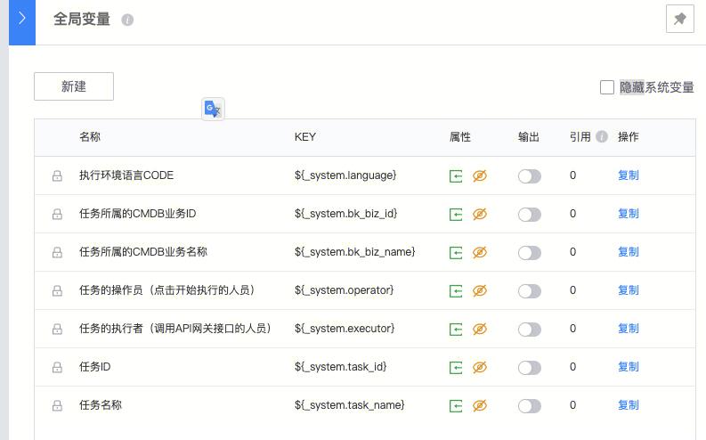
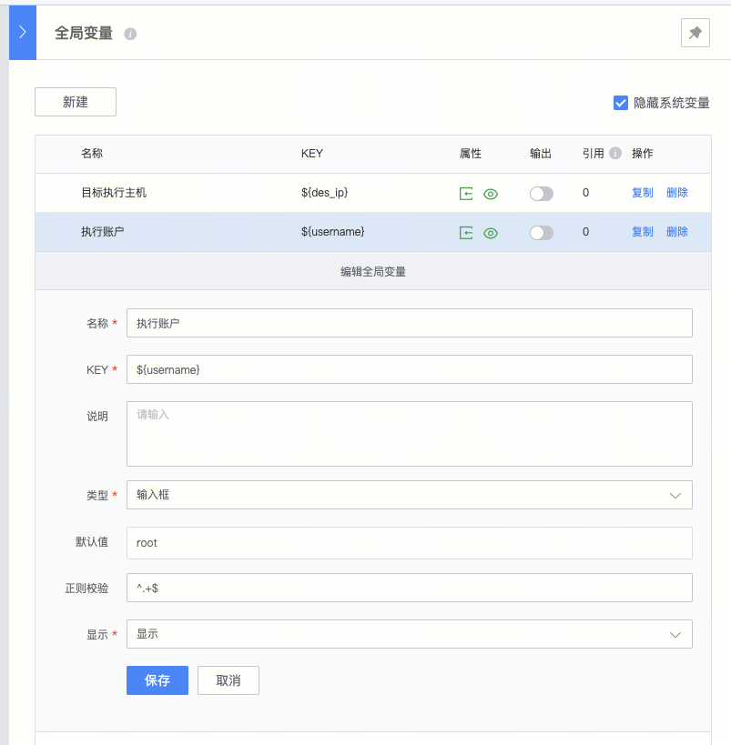
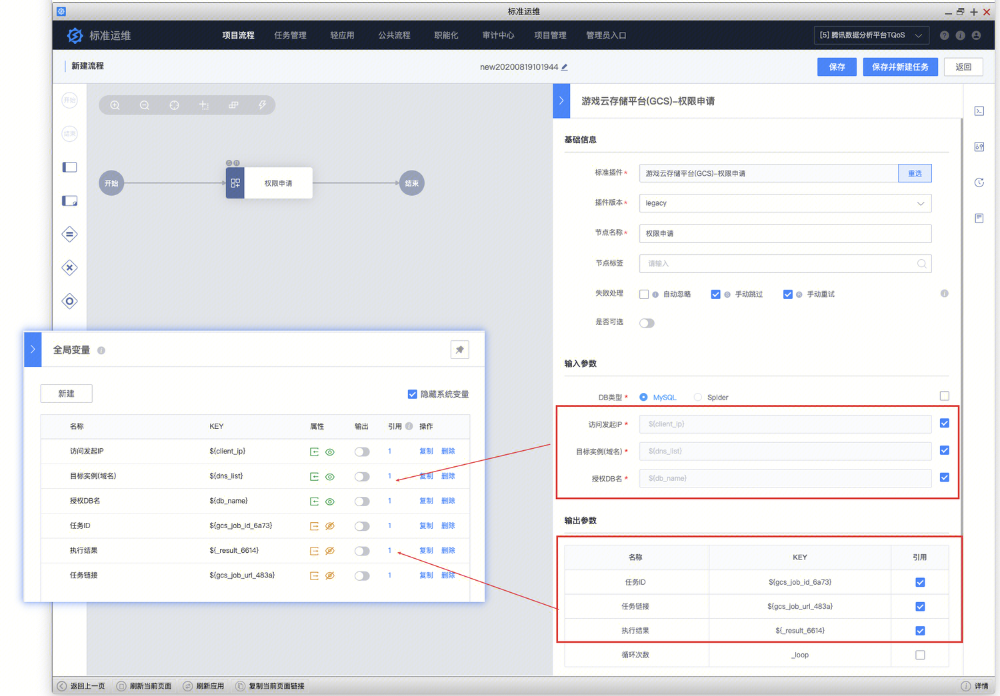
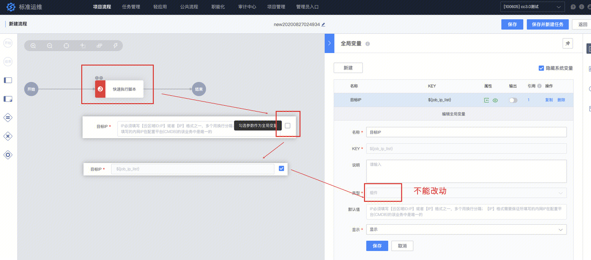
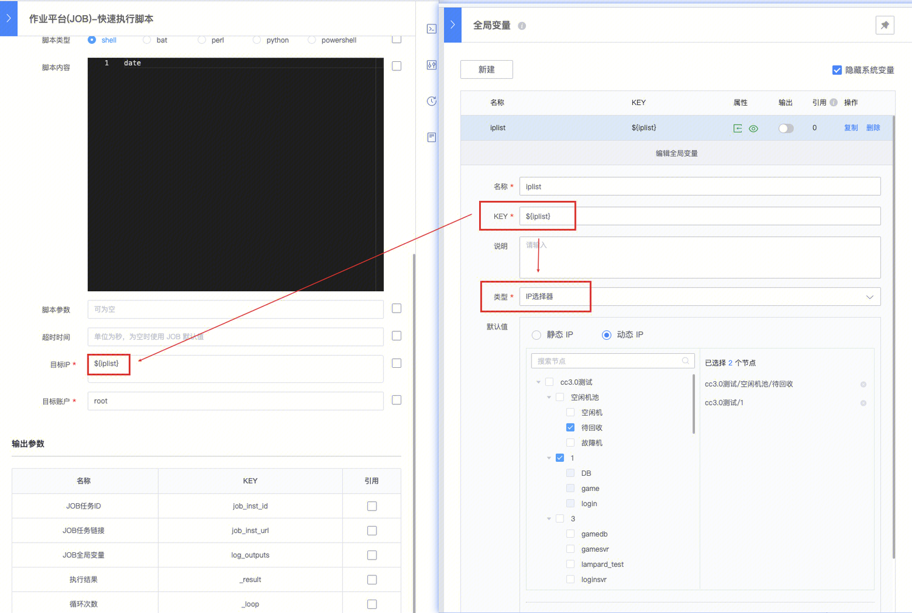
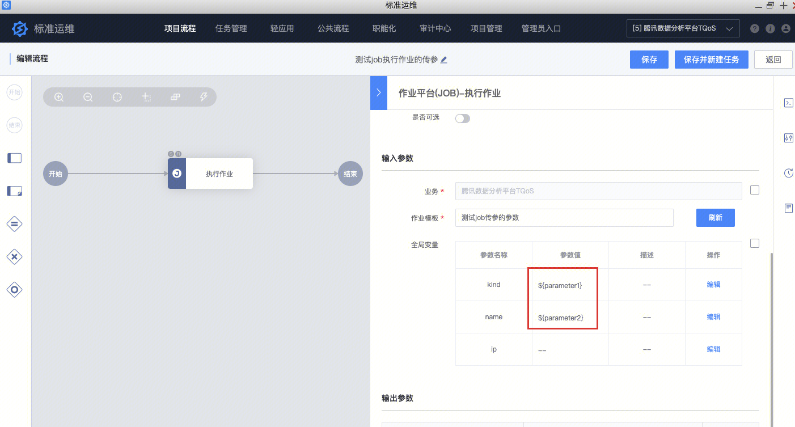
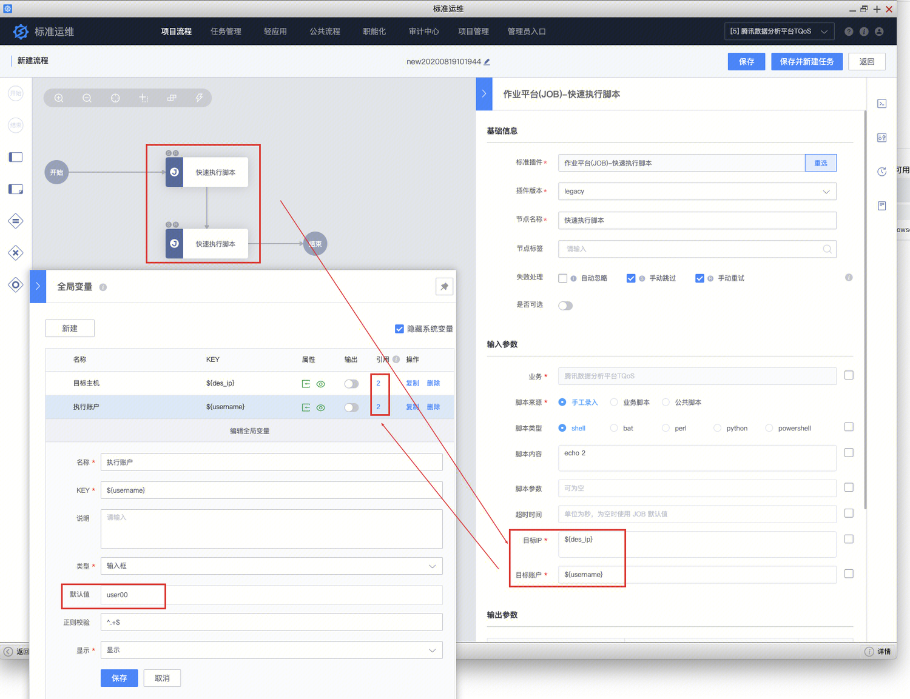
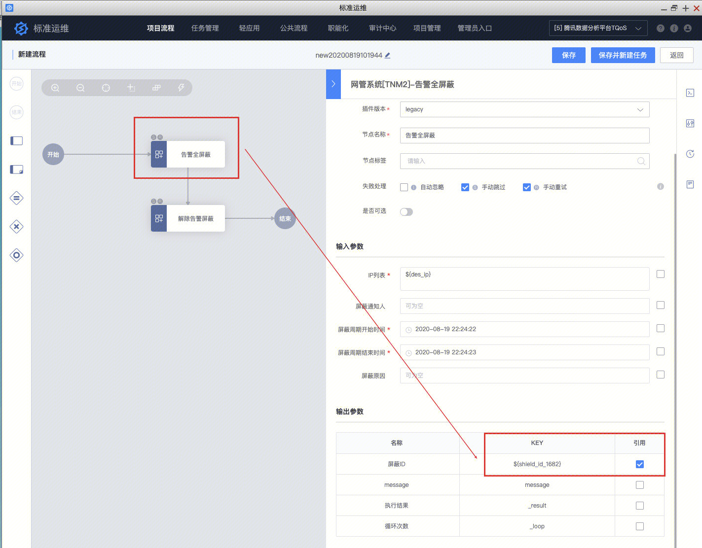
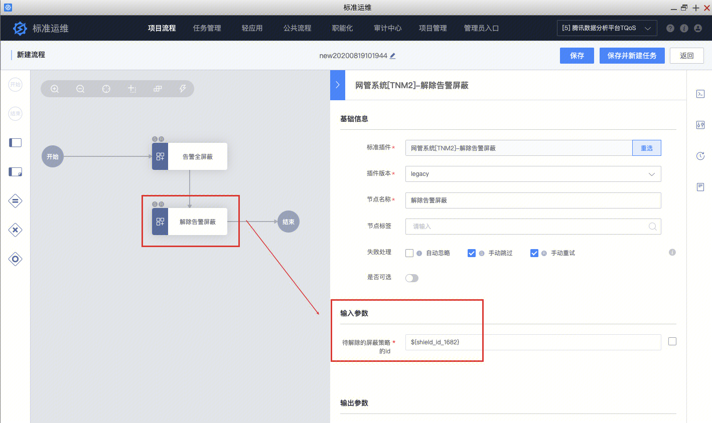

[TOC]

# 概要

全局变量是准运维的强大的参数设置功能。

可以在任意插件的配置中进行引用；可以在上下两个流程中进行同时使用；可以在输入输出参数中串联使用；可以设计出通用性强的运维流程作业。是灵活编排流程中的高级操作。

灵活使用全局变量，可以极大的提高运维作业流程的通用性。

# 全局变量的种类

### 1、系统变量

新建流程时，系统即创建好了这些变量。这些变量key命名以  _system.  开头，与流程的基础属性有关，在流程执行的任务中，默认不被显示。这些流程不能被修改和删除，只允许被引用。

### 2、用户新建变量

用户通过“全局变量”页面的“新建”按钮，新建的变量，拥有最大自由度的配置权限。可以任意的命名，任意的设定变量类型，任意的设置默认值，任意的设置正则校验规则，任意的控制该变量是否会在任务执行时显示。

### tips

“显示”配置项，表示在创建任务时，是否将这个变量展示给用户，使其能够被用户赋值、更改。

如配置为显示，则在任务执行时，会被显示出来，用户可配置。

如配置为不显示，则在任务执行时，该变量不会被显示，而使用默认值。输出参数的全局变量，该配置为不显示。

### 3、节点中的输入输出参数 转换为 的全局变量

插件节点中，每个可配置的输入参数、以及每个输出参数，均可以转换为全局变量。勾选配置项后面的复选框，即转换为全局变量。此时全局变量页面会新增该变量，并显示引用次数为1，同时配置项被填入该变量key，并置灰不允许更改。

（1）转换后的全局变量，为该插件内置固定的变量名（key）和变量类型，均无法进行改变。

（2）输入参数的全局变量，可以对默认值进行配置；输出参数的全局变量，在任务执行时不对用户显示。

### 注意

注意:

通过这种方式转换成的全局变量，类型是系统默认的组件类型，不能变动。

如果想使用其他类型的变量（例如ip选择器、时间选择器等），请新建全局变量，即可选择类型。然后将变量复制、填入输入框引用即可。

# 全局变量的使用方式

所有的全局变量，均是以${key}的方式，在任意输入参数配置项处进行引用使用。常见有如下的使用方式：

### 1、在任意地方使用全局变量

可以将全局变量的key，以${key}的语法形式，在任意地方进行使用。

### 2、使用同一个全局变量，在多步骤中，多次引用

在很多场景中，我们会多次引用同一个变量，来减少执行时，需要配置的参数。

如在多个执行步骤中，均需要对要发布的主机ip进行job作业，并且脚本执行账户均为user00。那么我们可以新建两个全局变量${des_ip}和${username}（默认值为user00），在多个步骤中多次使用。

### 3、将上个步骤的输出值，传给下个步骤，作为参数。

在很多系统中，我们通常会将上个步骤的输出值，作为后续某个步骤的输入参数。例如：

（1）在TNM2系统中，我们会在发布时屏蔽告警、在后续发布完成时解除告警。我们需要将屏蔽告警步骤输出的告警id，作为后面解除告警步骤的输入参数。

（2）在GCS系统中，我们会先申请一个单据，请dba审批；审批后，在后一个步骤中，去执行这个单号。我们需要将申请单步骤输出参数的单号，作为后面执行单据的输出参数。

（3）在JOB平台中，我们某个job作业中定义的可变变量的值，需要作为后面作业的输入参数。我们需要将这个job作业的输出参数中的该变量，作为后面作业的输入参数。

等等，任何需要这样的场景的地方，我们都可以使用这样的编排方案。拿例子1进行示意：

step 1：在屏蔽告警的步骤中，将输出参数的屏蔽id，勾选为全局变量。

step2：在后续的解除告警步骤中，将输入参数填入该屏蔽id的key。即可实现这种场景。

# 全局变量的类型

全局变量提供多种类型的变量。详细说明请参阅：[全局变量有哪些类型](https://iwiki.woa.com/p/309878327)

