# 输入框

创建

输入**名称**和**KEY**值

**正则校验**：输入正则校验输入的内容是否符合预期

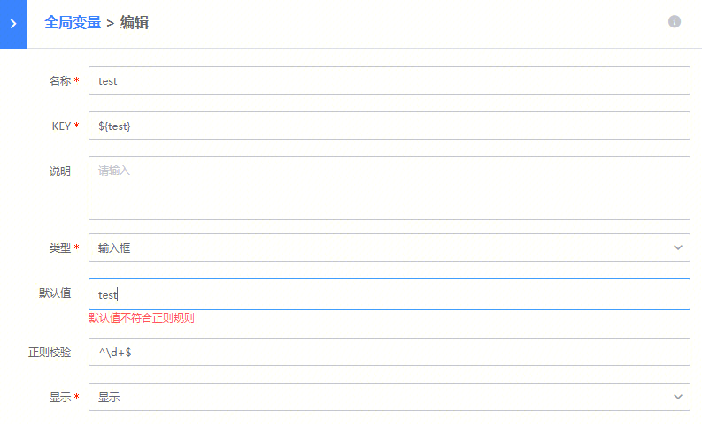

### 引用

${KEY}

---

## 文本框

### 创建

输入**名称**和**KEY**值

### 引用

${KEY}

## 日期

### 创建

输入**名称**和**KEY**值

### 引用

${KEY}

## 时间

### 创建

输入**名称**和**KEY**值

### 引用

${KEY}

## 日期时间

### 创建

输入**名称**和**KEY**值

### 引用

${KEY}

## 系统当前时间

此变量用于获取系统当前时间（按所选择的时区）

### 创建

输入**名称**和**KEY**值

### 引用

${KEY}

- 引用${KEY}，返回类型为字符串，值为用户所指定的值，日期之间用-连接，时间用:连接

## 系统当前时间(支持格式自定义)

此变量用于获取系统当前时间（按所选择的时区）

### 创建

输入**名称**和**KEY**值

### 引用

${KEY}

- 引用${KEY}，返回类型为字符串，格式为用户所指定的格式

## 整数

### 创建

输入**名称**和**KEY**值

### 引用

${KEY}

## 密码

### 创建

输入**名称**和**KEY**值

### 引用

${KEY}

## IP选择器

### 创建

输入**名称**和**KEY**值

### 引用

${KEY}

返回的格式为用英文逗号,分隔开的IP信息。

### 使用

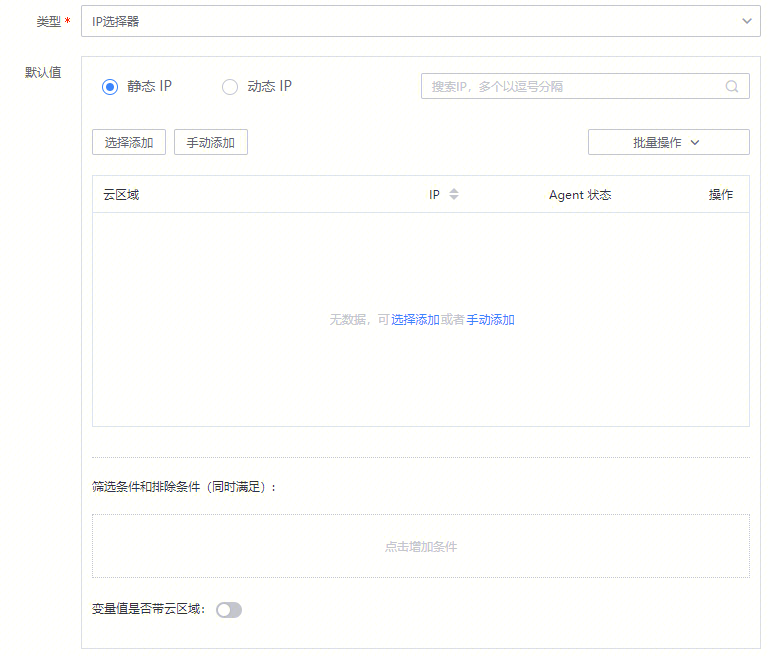

- 总共有两种类型的IP，一种为**静态IP**，一种为**动态IP**

    - 静态IP有两种添加方式
    
        选择添加：页面中会列出所属当前业务下的所有主机，选择需要的主机即可。

    
    
        手动添加：需要用户输入一个或多个IP，中间使用英文逗号,或换行分隔，后台确认这些IP地址**是否属于当前业务**，如果属于则添加到主机列表中，不属于则会显示不存在的IP地址，需要去除后重新输入。

    
    - 动态IP：左侧显示当前业务下的拓扑树，用户选择相应结点，后台根据用户选择的结点来获取结点下所属的IP列表。
    
- 筛选条件和排除条件（同时满足）

    - 筛选：会从IP列表中筛选出符合条件的IP。
    - 排除：会从IP列表中去除符合条件的IP。
    
- 变量值是否带云区域

    - 是，返回格式为{cloud}:{ip},{cloud}:{ip}
    - 否，返回格式为{ip},{ip}
    

## 人员选择器

### 创建

输入**名称**和**KEY**值

### 引用

${KEY}

### 使用

输入目标用户名，如果存在则在下拉框中选择后按回车键确认

## 人员分组选择器

### 创建

输入**名称**和**KEY**值

### 引用

${KEY}

- 引用${KEY}，返回所选人员分组成员的RTX，用英文逗号,分隔开

### 使用

1. 创建并保存变量

    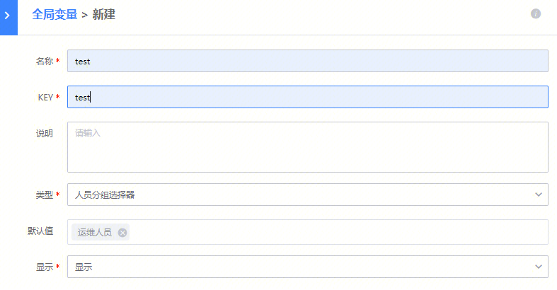


2. 引用变量

    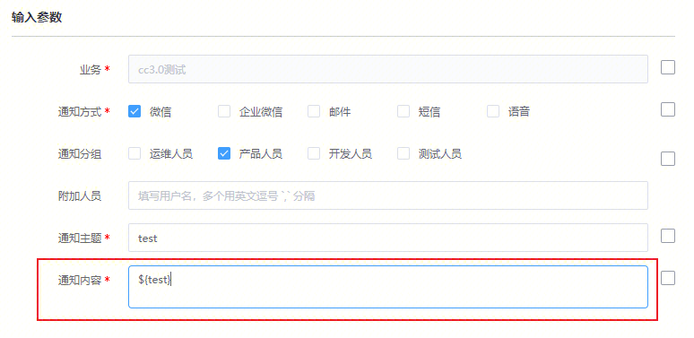


3. 假设运维人员为admin(管理员),azhang(小张),bliu(小刘)

    则通知内容为：admin,azhang,bliu


## 集群资源筛选

此变量用于按照资源筛选方案创建新的集群。

### 创建

输入**名称**和**KEY**值

### 引用

${KEY}

- 引用${KEY}，返回的是创建集群成功的信息Allocate {set_number} sets with names: {set_names}
- 引用${KEY._module}，返回的是集群下的模块信息，类型为字典，键为模块名，值为模块下的主机列表
- 引用${KEY.{集群属性编码}}，返回的是本次操作创建的所有集群的指定属性值的列表

    


    集群属性编码，请按照cc中的字段规则的英文名填写。

    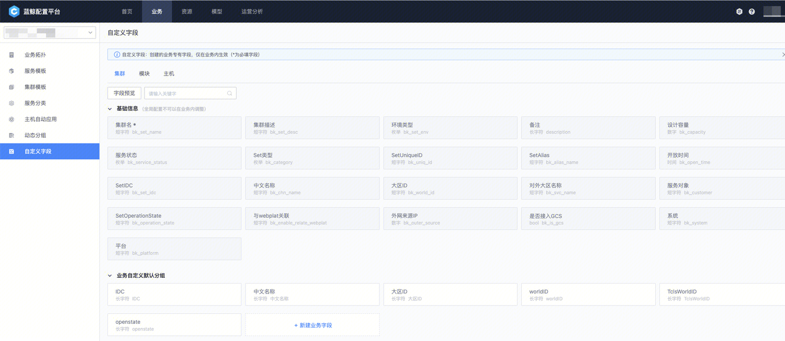

    如：

    - 获取集群的名称列表
    
        ${KEY.bk_set_name}

    
    - 获取集群环境类型
    
        ${KEY.bk_set_env}

    
    
- 引用${KEY.flat__{集群属性编码}}，返回的是本次操作创建的所有集群的指定属性值，用英文逗号,连接

    如：


    - 获取集群的名称值
    
        ${KEY.flat__bk_set_name}

    
    - 获取集群环境类型值
    
        ${KEY.flat__bk_set_env}

    
    
- 引用${KEY.flat__ip_list}，返回的是本次操作创建的所有集群下的主机（去重后），用英文逗号,连接
- 引用${KEY.flat__verbose_ip_list}，返回的是本次操作创建的所有集群下的主机（未去重），用英文逗号,连接
- 引用${KEY.flat__verbose_ip_module_list}，返回的是本次操作创建的所有模块名称，格式为set_name>module_name，用英文逗号,连接

### 使用


1. 点击**资源筛选**，进入创建资源筛选方案页面

    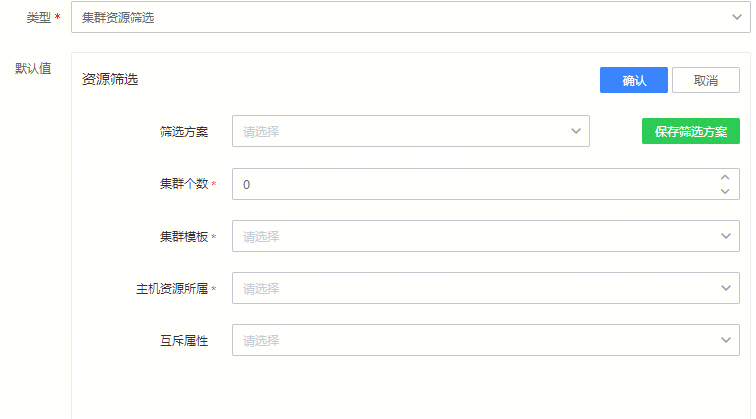


    - 筛选方案：可选择之前保存过的资源方案。
    - 集群个数：本次需要创建的集群个数。
    - 集群模板：选择集群模板，根据集群模板生成模块。
    - 主机资源所属：页面中显示当前业务的拓扑树，后台根据选择的结点来确定主机列表。
    - 互斥属性：互斥属性为主机的所有属性，选择互斥属性之后根据互斥方案确定集群下对应模块所属的主机。
    

    选择集群模板之后，资源筛选表单下方会出现一个标签页【tabs】，上方的选项卡是根据集群模板生成的模块名称


    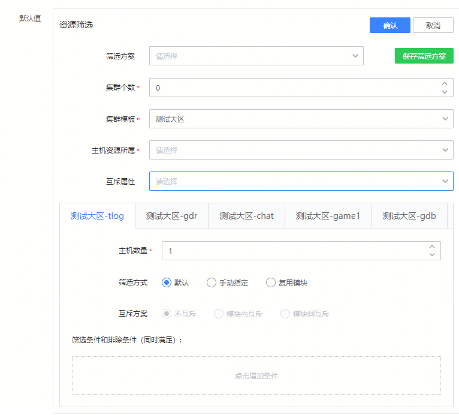


2. 主机数量：该模块下的主机数量

    筛选方式：


    - 默认：从当前的主机列表中按下方的筛选条件筛选后，按顺序根据主机数量选取主机。
    - 手动指定：输入指定的IP，后台会筛选出属于本业务下的主机。
    

    复用模块：选择其他模块（也是本次新建的模块）作为被复用的模块。


    互斥方案：


    - 不互斥：不采用互斥方案
    - 模块内互斥：当本模块下已有【互斥属性】的主机，则不会加入和该主机【互斥属性】值相同的主机
    

    模块间互斥：互斥方案对本模块无效，对选择的互斥模块有效。


    筛选条件和排除条件（同时满足）


    - 筛选：会从IP列表中筛选出符合条件的IP。
    - 排除：会从IP列表中去除符合条件的IP。
    
        选择其中的一个选项卡

    
    

点击确认后，返回到上一个页面，后台根据填写的资源筛选方案创建出对应的集群

> 如果想要保存当前的资源筛选方案以便于下次使用，请点击**保存资源筛选方案**。

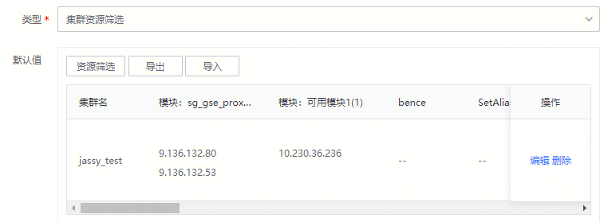

1. 填写相关的集群信息。
2. 引用变量

    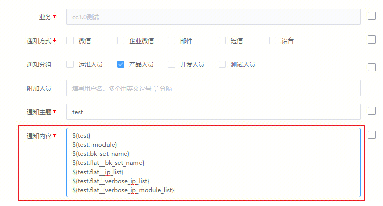


3. 实际的结果为

    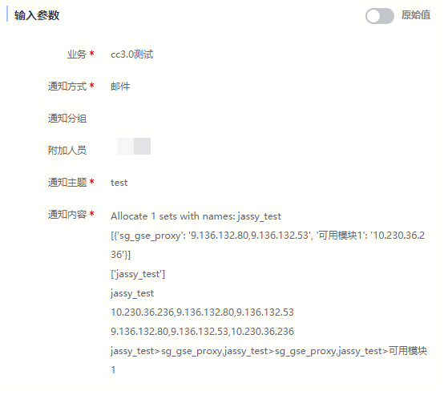


## 集群模块选择器

此变量用于获取集群和模块的信息（名称或ID）

### 创建

输入**名称**和**KEY**值

### 引用

${KEY}

- 引用${KEY}，返回类型为字符串，值的格式为set: {用英文逗号连接的集群名称}, modules: {用英文逗号连接的模块名称}
- 引用${KEY.set_name}，返回类型为列表，列表值为集群名称
- 引用${KEY.set_id}，返回类型为列表，列表值为集群ID
- 引用${KEY.module_name}，返回类型为列表，列表值为模块名称
- 引用${KEY.flat__module_name}，返回类型为字符串，值为用英文逗号,连接的模块名称
- 引用${KEY.module_id}，返回类型为列表，列表值为模块ID
- 引用${KEY.flat__module_id}，返回类型为字符串，值为用英文逗号,连接的模块ID

### 使用

1. 创建变量，并选择集群和模块

    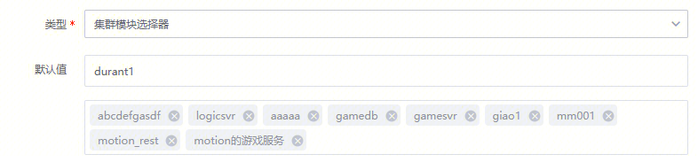


2. 引用变量

    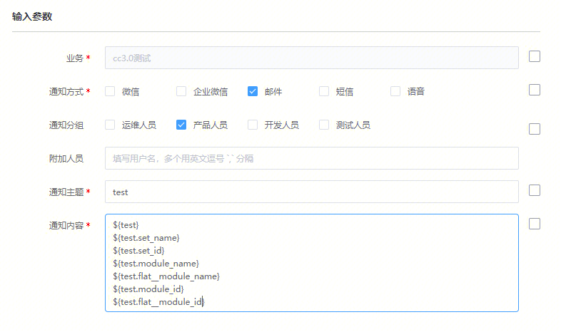


3. 实际的结果为

    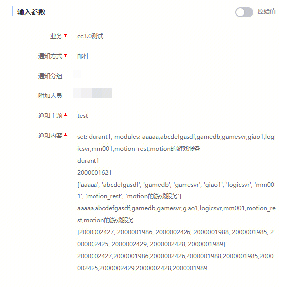


## 集群模块IP选择器

此变量用于获取集群和模块下的IP

### 创建

输入**名称**和**KEY**值

### 引用

${KEY}

- 引用${KEY}，返回类型为字符串，值为用英文逗号,连接的用户选择的集群和模块下的IP

### 使用

- 自定义输入ip

    


    - ip: IP必须填写【云区域ID:IP】或者【IP】格式之一，多个用换行分隔；【IP】格式需要保证所填写的内网IP在配置平台(CMDB)的该业务中是唯一的
    - 筛选集群: 筛选集群名称，英文逗号分隔
    - 筛选服务模板: 筛选服务模板名称，英文逗号分隔
    
- 选择集群模块

    


    - 集群: 选择集群
    - 服务模板: 选择服务模板
    - 模块属性: 输入模块属性，为空时默认使用ip
    

- 筛选集群: 筛选集群名称，英文逗号分隔

    - 筛选服务模板: 筛选服务模板名称，英文逗号分隔
    

- 手动输入集群模块

    


    - 集群: 输入集群
    - 服务模板: 输入服务模板
    - 模块属性: 输入模块属性，为空时默认使用ip
    - 筛选集群: 筛选集群名称，英文逗号分隔
    - 筛选服务模板: 筛选服务模板名称，英文逗号分隔
    

1. 创建变量（以选择集群模块为例）

    


2. 引用变量

    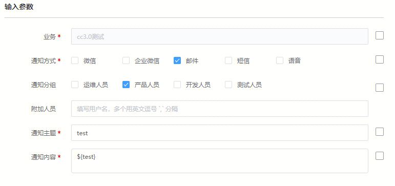


3. 实际的结果为

    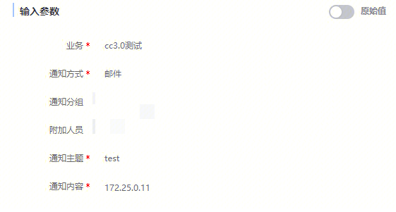


## 主机属性查询器

此变量用于查询主机列表的属性值

### 创建

输入**名称**和**KEY**值

### 引用

${KEY}

- 引用${KEY}，返回类型为字典，键为主机IP，值为主机所有的属性值字典（键为属性，值为属性值）

### 使用

1. 创建变量

    


2. 引用变量

    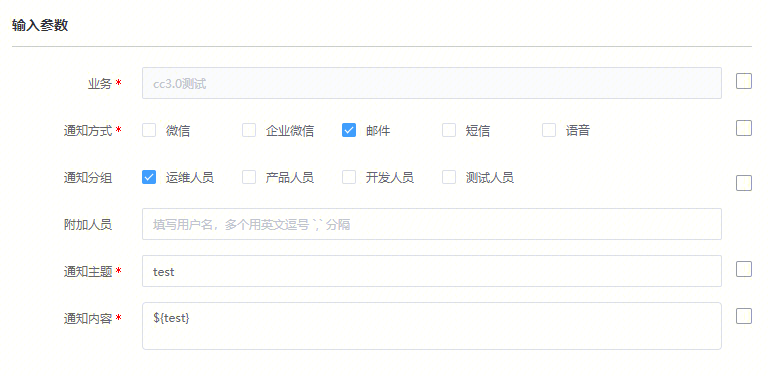


3. 实际结果

    通知内容为：


    {  
     '10.230.36.236': {  
      'bk_cpu': None,  
      'bk_isp_name': None,  
      'bk_os_name': '',  
      'bk_province_name': None,  
      'bk_host_id': 2000000097,  
      'import_from': '1',  
      'bk_os_version': '',  
      'bk_disk': None,  
      'operator': 'lampardtang',  
      'bk_mem': None,  
      'bk_host_name': '',  
      'bk_host_innerip': '10.230.36.236',  
      'bk_comment': '',  
      'bk_os_bit': '',  
      'bk_outer_mac': '',  
      'bk_asset_id': '',  
      'bk_sla': '4',  
      'bk_cpu_mhz': None,  
      'bk_host_outerip': '',  
      'bk_state_name': None,  
      'bk_os_type': None,  
      'bk_mac': '',  
      'bk_bak_operator': '',  
      'bk_supplier_account': 'tencent',  
      'bk_sn': '',  
      'bk_cpu_module': ''  
     }  
    }


## 集群分组选择器

用于获取集群类型的动态分组的集群信息

### 创建

输入**名称**和**KEY**值

### 引用

${KEY}

- 引用${KEY}，返回类型为字典，键为集群的属性名称，值为集群的属性值
- 引用${KEY.{集群属性编码}}，返回类型为列表，列表值为集群属性值

    如：


    - 获取集群的名称列表
    
        ${KEY.bk_set_name}

    
    - 获取集群环境类型
    
        ${KEY.bk_set_env}

    
    
- 引用${KEY.flat__{集群属性编码}}，返回类型为字符串，值为用英文逗号,连接的集群属性值

    如：


    - 获取集群的名称值
    
        ${KEY.flat__bk_set_name}

    
    - 获取集群环境类型值
    
        ${KEY.flat__bk_set_env}

    
    

### 使用

1. 创建变量

    


2. 引用变量

    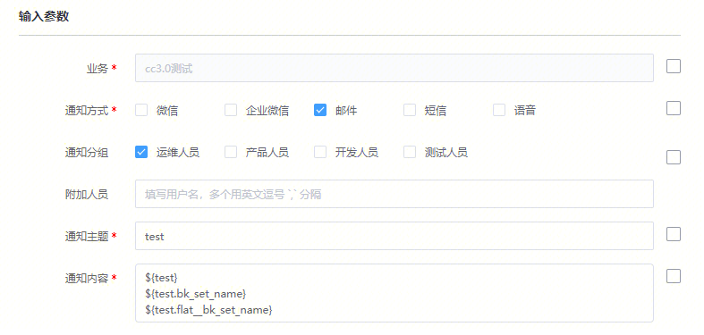


3. 实际结果

    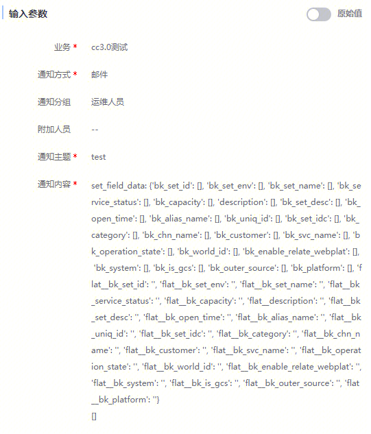


## 云石版本文件

此变量用于获取云石版本文件信息

### 创建

输入**名称**和**KEY**值

### 引用

${KEY}

- 引用${KEY}，返回结果为版本文件列表，返回类型为列表，列表值为字典（键为版本文件属性名，值为版本文件属性值）
- 引用${KEY.version_num}，返回结果为选择的版本文件版本号列表
- 引用${KEY.flat__version_num}，返回结果为选择的版本文件版本号以 "\n" 分隔的字符串
- 引用${KEY.file_name}，返回结果为选择的版本文件名列表
- 引用${KEY.flat__file_name}，返回结果为选择的版本文件名以 "\n" 分隔的字符串
- 引用${KEY.abs_path}，返回结果为选择的版本文件绝对路径列表
- 引用${KEY.flat__abs_path}，返回结果为选择的版本文件绝对路径以 "\n" 分隔的字符串
- 引用${KEY.md5}，返回结果为选择的版本文件MD5列表
- 引用${KEY.flat__md5}，返回结果为选择的版本文件MD5以 "\n" 分隔的字符串
- 引用${KEY.size}，返回结果为选择的版本文件大小列表
- 引用${KEY.flat__size}，返回结果为选择的版本文件大小以 "\n" 分隔的字符串
- 引用${KEY.files_json}，返回选择版本文件的 JSON，形如 `[{"filename": "", "md5": "", "size": ""}]`

> 假设新建了一个KEY为fworks_filelist的全局变量，以上述的返回样例进行使用说明

- 引用文件列表的第二行的file_name：${fworks_filelist.file_name[1]}
- 取文件列表中所有的版本号：${fworks_filelist.version_num}，返回是一个列表

    - 配合高级语法，例如改为逗号分隔：${",".join(fworks_filelist.version_num)}
    - 或者通过flat直接得到版本号这一列的以换行符\n分隔的字符串：${fworks_filelist.flat__version_num}
    
- 文件列表选择器的使用同Table，更多可参考[Table变量选择方法](https://github.com/TencentBlueKing/bk-sops/blob/V3.5.X/docs/features/variables_engine.md#%E8%A1%A8%E6%A0%BC)


## 集群选择器

此变量用于筛选集群并获取筛选出来的集群信息

### 创建

输入**名称**和**KEY**值

- 过滤属性：要根据哪个属性去过滤一批集群
- 属性值范围：过滤属性的值范围


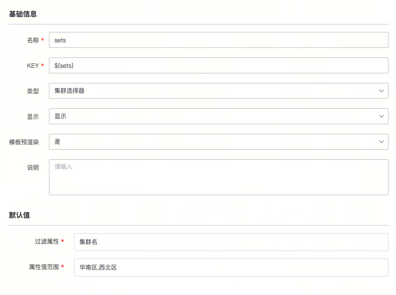

### 引用

${KEY}

- 引用${KEY.bk_set_name}，返回结果为筛选集群的集群名数组
- 引用${KEY.bk_set_id}，返回结果为筛选集群的集群 ID 数组

## JOB-分发本地文件

本地文件的变量说明。

### 创建

将本地文件转为全局变量后，创建变量${job_local_files}

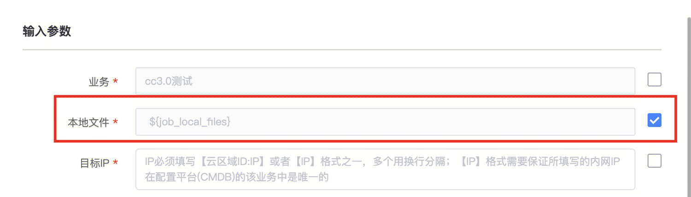

### 引用

${KEY}

- 引用${job_local_files[0]['name']}，返回结果为文件名


### 举例

该变量输出为：


```py
#该变量输出为：
job_local_files = {u'job_target_path': u'/tmp/', u'add_files': u'', u'job_local_files': [], u'job_push_multi_local_files_table': [{u'target_path': u'/tmp/', u'file_info': [{u'status': u'success', u'uid': 1658290253853, u'raw': {u'uid': 1658290253853}, u'percentage': 100, u'size': 2790, u'response': {u'tag': {u'type': u'upload_module', u'tags': {u'tag_id': 35877}}, u'result': True, u'md5': u'3a9d6da7dd9f17b224bf426220586487'}, u'name': u'lesscode.png'}], u'show_file': u'lesscode.png', u'md5': u'3a9d6da7dd9f17b224bf426220586487'}]}

#如果要取文件信息的话，其实就是取${job_local_files['job_push_multi_local_files_table'][0]['file_info']}
#可以得到：
[{'status': 'success', 'uid': 1658290253853, 'raw': {'uid': 1658290253853}, 'percentage': 100, 'size': 2790, 'response': {'tag': {'type': 'upload_module', 'tags': {'tag_id': 35877}}, 'result': True, 'md5': '3a9d6da7dd9f17b224bf426220586487'}, 'name': 'lesscode.png'}]

# 如果再往下，取文件名、md5
>>> job_local_files['job_push_multi_local_files_table'][0]['file_info'][0]['name']
'lesscode.png'
>>> job_local_files['job_push_multi_local_files_table'][0]['file_info'][0]['response']['md5']
'3a9d6da7dd9f17b224bf426220586487'
```


