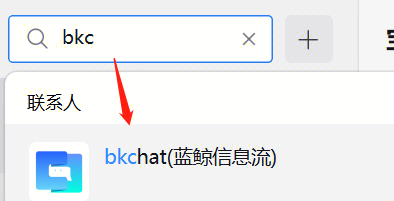
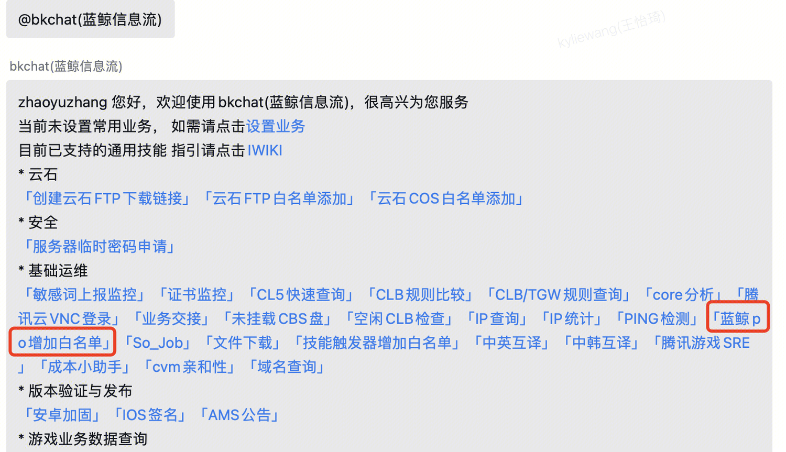
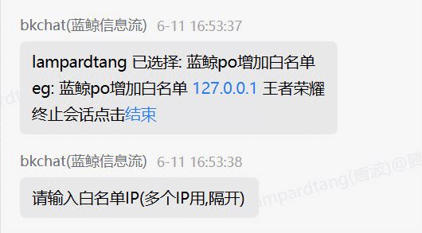
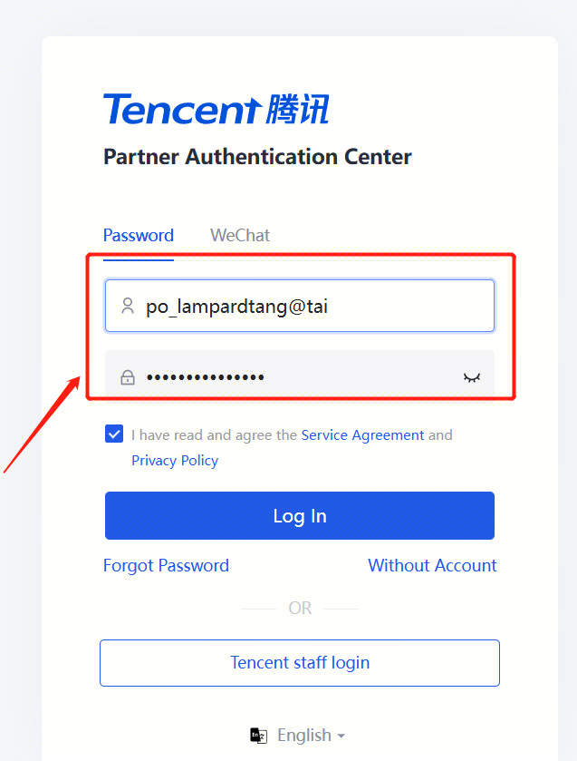
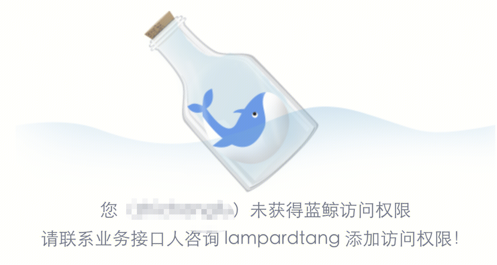
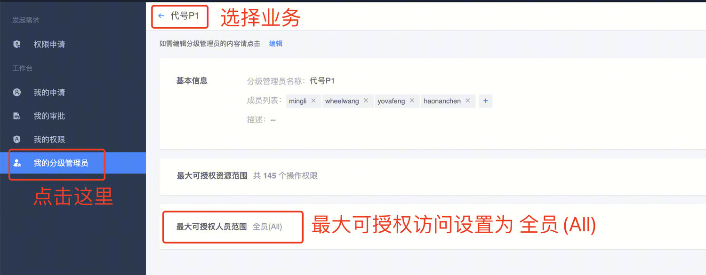
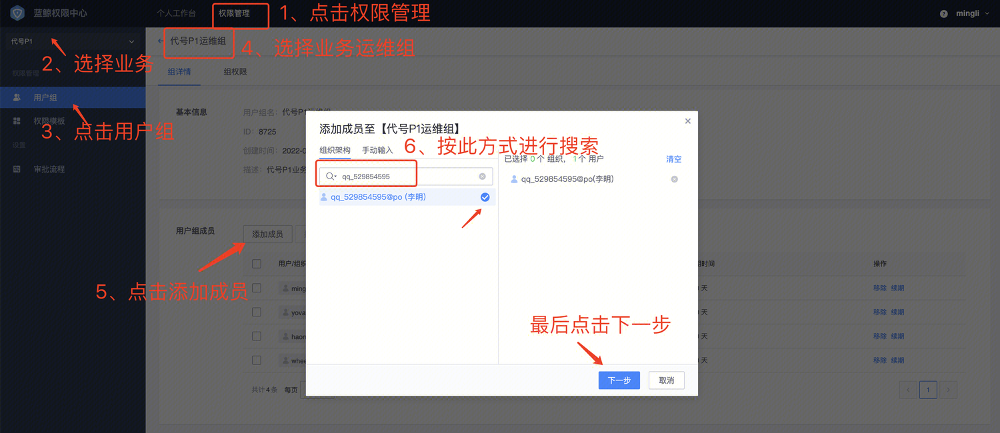
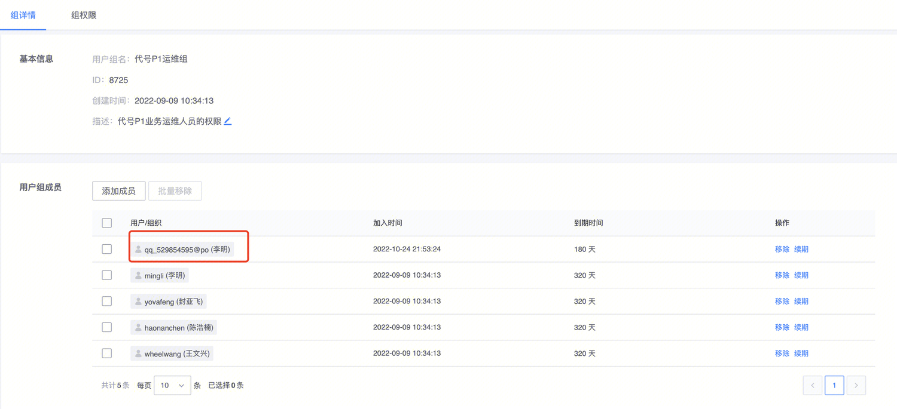
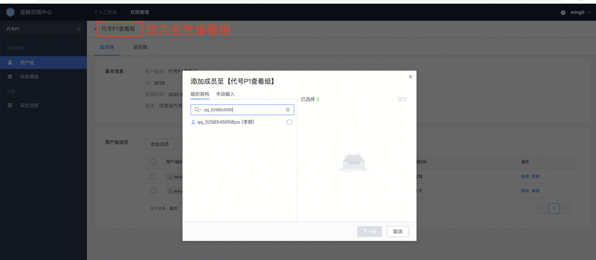
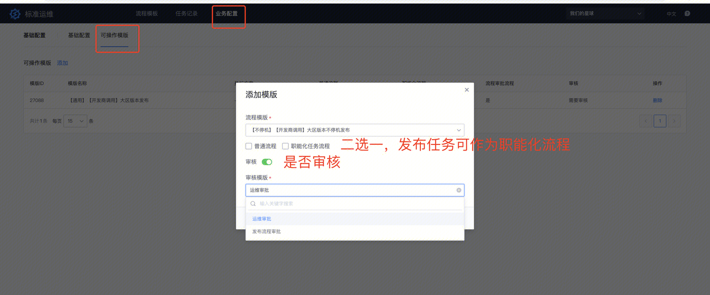

### 外部用户接入流程

#### e1.添加外部访问po环境的IP白名单（运维or业务接口人操作）

 

#### 2.外部用户使用太湖账号登录po环境（po环境2024.11.11起，停止QQ和自建账号的申请，全部切换到太湖登录），账号白名单联系seingan进行添加

 

#### 3.权限申请

> po环境的标准运维是内部上云版标准运维的一个facade，开发商权限只具备创建流程和执行流程的权限，鉴权实际通过内部上云版的权限中心iam.woa.com。

太湖账号能正常登录po环境之后，运维同学可通过内部版蓝鲸权限中心进行赋权，

登录 [https://iam.woa.com/](https://iam.woa.com/) ，点击 我的分级管理员 ，如下

 

建议直接设置为全员All， 无风险，具体的人员设置会在以下第二步进行细化 

设置完毕后，需要iam管理员进行审批，审批后生效，生效过，开始进行业务组权限赋予。

**1）运维人员赋予业务运维组的权限**

 至此，这个运维用户就加入到运维组了

**2）发行合作开发商的同学赋予业务查看组的权限**

同以上操作，将业务运维组改成**业务查看组**即可 

 

[登录 po.tencent.com](http://登录po.tencent.com) ,点击进入 标准运维facade ，确认是否有业务权限，若能选择业务，则具备了app的业务权限

1）运维权限可进行模版创建

**职能化流程**： 勾选后，开发商可创建任务，但不能执行，只能提交给职能化同学进行执行，职能化同学可在内部版标准运维进行认领执行

**运维审批**： 同 [o.tencent.com](http://o.tencent.com) ，任务执行前需运维审批通过才可执行

**发布流程审批**： 线上发布变更流程，bkchat会将产品、运维、测试拉群，进行各方的审批通过（可选），才可执行。

