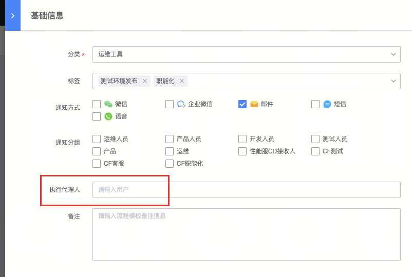
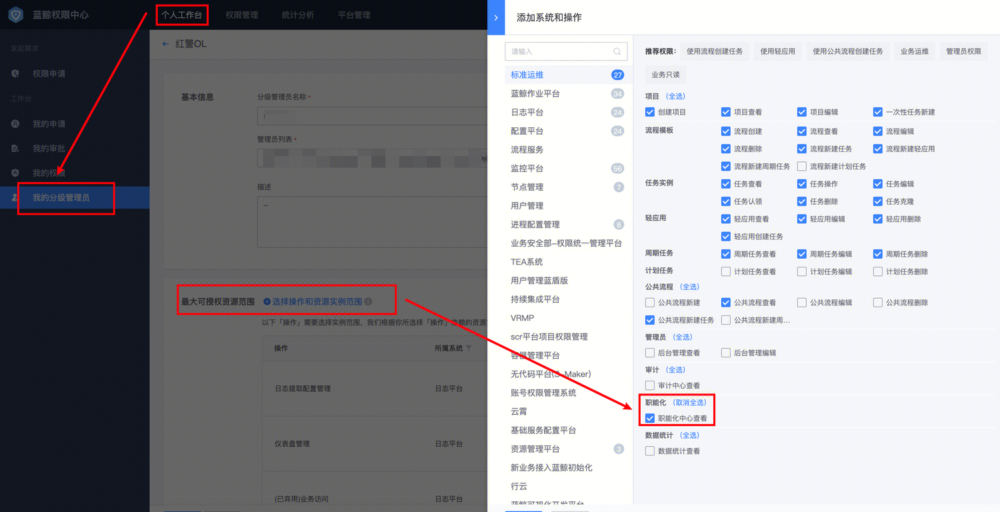
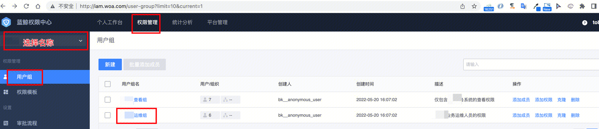

[TOC]

标准运维提供了职能化人员承接任务创建、执行的功能。

目前标准运维团队正在和职能化团队一起，进行功能和流程的试用。本文会持续更新，直到职能化工作稳定开展。

## 1、整理流程模板规则，符合如下规范：

| **项目** | **内容** |
| - | - |
| **模板名称** | 模板名称应包含：业务名、发布环境、模板功能  职能化操作的模板须包含职能化标识   样例：【职能化】【DNF】【正式服】停服维护 |
| **节点选择** | 职能化禁止直接参与节点勾选  如需选择节点的场景，建议通过判断分支来优化流程 |
| **参数填写**  **（模板变量）** | 将不需要在创建作业过程中填写或选择的变量设置隐藏  需要在创建作业过程填写的变量不建议有默认值，可添加相关变量说明  创建作业过程需要填写的变量需添加校验规则 |
| **节点名称** |  节点名称清晰描述相关节点的操作事项，  暂停节点名称明确职能化操作指引，如：通知测试，通知运维操作，等待开服等 |
| **变量** | 隐藏固定值变量，将不需要在创建作业过程中填写或选择的变量设置隐藏 |
| **定时任务** | 定时执行的任务须添加定时器，如定时停服、定时刷配置、定时上线活动等类型任务 |
| **其他事项** | 发布内容涉及其它需手动操作的需走接口，如接口无法实现的，需运维手动操作，禁止职能化人员登录第三方站点操作 |

## 2、交付件规范（开发商或产品侧）

可通过邮件（[BK_ZNH@tencent.com](mailto:BK_ZNH@tencent.com)）或企业微信会话提供，需列出本次操作涉及的模板及相关参数

|   |   |
| - | - |
| **模板名称** | 提供和标准运维上相对应的模板 |
| **时间** | 开始操作时间或即时操作，时间格式： yy-mm-dd hh:mm  |
| **参数1** | 参数项和模板参数填写框按次序一一对应 |
| **参数2** |   |
| **参数n** |   |
| **注意事项** | 其他特殊注意事项描述 |

**交付件样例：**

【发布模版 】：【印度版】不停机更新  
【发布包名 】： patch_001322943_20210623_0639.tgz  
【包 MD5 】： 0a87ba3b13a217a9acfc83e85086e53a  
【MD5文件】： patch_001322943_20210623_0639.md5  

交付邮件发送后，在业务相应的职能化沟通群通知ieodonline进行操作（因外部沟通群无法添加ieodonline业务号，需通知当天值班人员或通知群内所有成员，值班人员信息可通过ieodonline签名查看）

## 3、职能化人员权限开通：

3.1、权限由管理员进行配置和审批。所以目前请通过伟良告知tobyjia如下信息，便于给职能化人员开通相对应的权限：

（1）业务名称-ccid

（2）要移交职能化的流程名，如果有多条，请一并告知。

后台实际开通权限说明：

| **产品** | **功能模块** | **权限** | **关联实例** |
| - | - | - | - |
| **标准运维** | 项目 | 查看 | 本业务 |
| 职能化中心 | 查看 | 本业务 |   |
| 任务 | 查看 | 本业务 |   |
| 流程新建任务 | 新建人员拥有这个任务的所有权限 | 接入职能化后的流程 |   |
| 流程模板 | 查看 | 接入职能化后的流程 |   |
| 任务认领 | 认领 | 本业务 |   |
| **配置平台** | 业务 | 查询 | 本业务 |
| **作业平台** | 业务 | 查询 | 本业务 |
| 执行历史 | 查看 | 本业务 |   |
| 执行账号 | 执行账号使用 | 本业务 |   |

3.2、通过权限中心”分级管理员功能“，自行创建上述权限模板，将职能化人员加入其权限组。

建议由管理员统一配置，避免因人员变动等情况需各业务分级管理员频繁变更授权人员信息

## 4、配置“以运维身份执行”功能：

标准运维的插件，实际是调用周边系统接口，从而触发该项功能，实现功能。通常情况下，运维人员才会有周边系统的权限，职能化人员没有权限。

所以，需要将该业务配置“以某位运维的身份去执行“的功能，才能使得执行人以这位”有周边系统权限的运维人员“的身份，去正常执行。

#### 4.1 按流程配置，单一流程生效

在具体流程的基础信息配置页面配置执行代理人。

#### 4.2 全局配置，全部流程生效

配置位置：项目管理--找到相应业务--项目配置，添加下执行人信息。

配置项说明：

（1）执行人：执行人名字，只能写一个。用于职能化人员执行任务时，任务以“执行人”身份执行。

（2）排除执行人名单：排除人名单，可以写多个。名单中的用户，不以”执行人“的身份执行，而是以自己名字的身份执行。用于同业务的其他运维人员。

### 举例说明

配置项如为：

执行人： A

排除执行人名单：B

当B执行任务时，任务实际执行人是B；当C执行任务时，任务实际执行人是A。

## 5、业务方开通标准运维的“职能化中心查看”权限：

业务的分级管理员、以及运维组中，默认不包含“标准运维”的“职能化中心查看”权限。请业务运维自行申请权限。

申请步骤：

1、分级管理员的最大可授权范围，添加“标准运维”的“职能化中心查看”权限

在iam.oa.com中，个人工作台-分级管理员，进入该业务的编辑页面。

在“最大可授权资源范围”中，点击“选择操作和资源实例范围”，在标准运维中，增加“职能化中心查看”的权限。

保存后，联系tobyjia审批单据。

2、单据审批通过后，分级管理员便可以加他加入到“xxx业务运维组”中。

在权限管理页面，左上角切换到业务分级管理员角色。在“xxx业务运维组”中，添加权限，添加自定义权限，选择标准运维-职能化中心查看。保存即可

加了以后，便可以进入标准运维的“职能化中心”页面。

**职能化相关工作有任何问题，欢迎您联系tobyjia、v_ylongwu沟通。**

