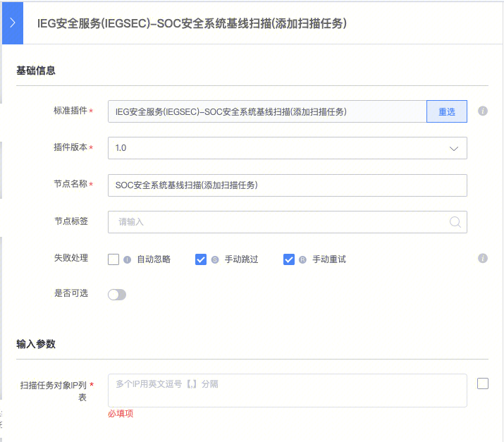

[TOC]

# 什么是基线扫描？

**基线扫描**是对服务器进行基础的安全检查，以确定当前服务器的安全风险。

主要对服务器系统进行Web文件扫描、系统服务优化、账户安全检查、系统配置安全检查、计划任务和补丁扫描（仅限Windows系统）等。

阿里云的安骑士、腾讯云的云镜都有类似的功能提供。

# 为什么要做基线扫描？

**互娱海外业务**基础环境复杂、运维模式多样化，在具备洋葱、高危扫描等基础安全能力的基础上，应用运维安全组上线了海外基线扫描，以辅助检查海外服务器上操作系统、数据库、基础安全组件、账号配置等存在的潜在安全风险。

既由海外业务的基线扫描经验，结合**国内IDC 业务上线前检查，**基线扫描成为互娱业务上线前检查中重要的一环，为多方运维系统提供了调用接口。

# 什么时候需要进行基线扫描？

线上的服务器，安全中心已经逐批次的进行了基线扫描。

针对扩容、新业务主机上线等场景，即新机器对外上线前，安全中心均要求进行基线扫描。扫描后，没有隐患和问题后，方能进行对外上线。

# 如何进行基线扫描？

蓝鲸上云版标准运维，也已经开发出**“IEG安全服务(IEGSEC)-SOC安全系统基线扫描(添加扫描任务)**”的插件，助力业务自动化进行上线前的基线扫描。

选择插件，填入扫描任务对象IP列表，即可直接使用。

# 基线扫描做了哪些检查？

互娱安全运营中心网站上，安全基线扫描的“[提单页面](http://soc.ied.com/web/scanItem/taskPartitionCreate)”列出了所有的检查项目。总体内容包括：

### 1、应用类：

对常见服务器应用进行权限检查、开源组件（配置、漏洞）、高危端口、木马检测、违规代理等检查。

### 2、系统类：

对系统层面进行windwos安全、ssh、系统进行基线检查。

### 3、基础组件类：

对洋葱健康度、基础应用（云石版本交付）、铁将军进行检查。

### 4、账号类：

对弱口令、系统配置、铁将军账号配置使用，进行检查。

### 5、安全配置类：

对Nginx、Apache、PHP的配置项进行安全检查。

### 6、数据库类：

对Redis、MongoDB、MySql的配置项进行安全检查。

# 其他协助：

对安全基线扫描系统感兴趣的小伙伴，可以查看simbazhang(张金发)的 《[基线扫描系统后台设计与实现](http://km.oa.com/group/31748/articles/show/371035)》文章，了解更多信息。或咨询iegsec_helper(运维安全助手)获取帮助。

如果在标准运维中，使用安全基线扫描插件有任何问题，请联系BK助手(蓝鲸助手)、或tobyjia。

