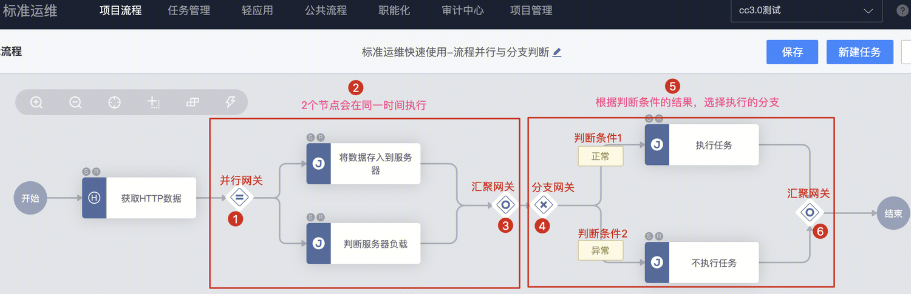
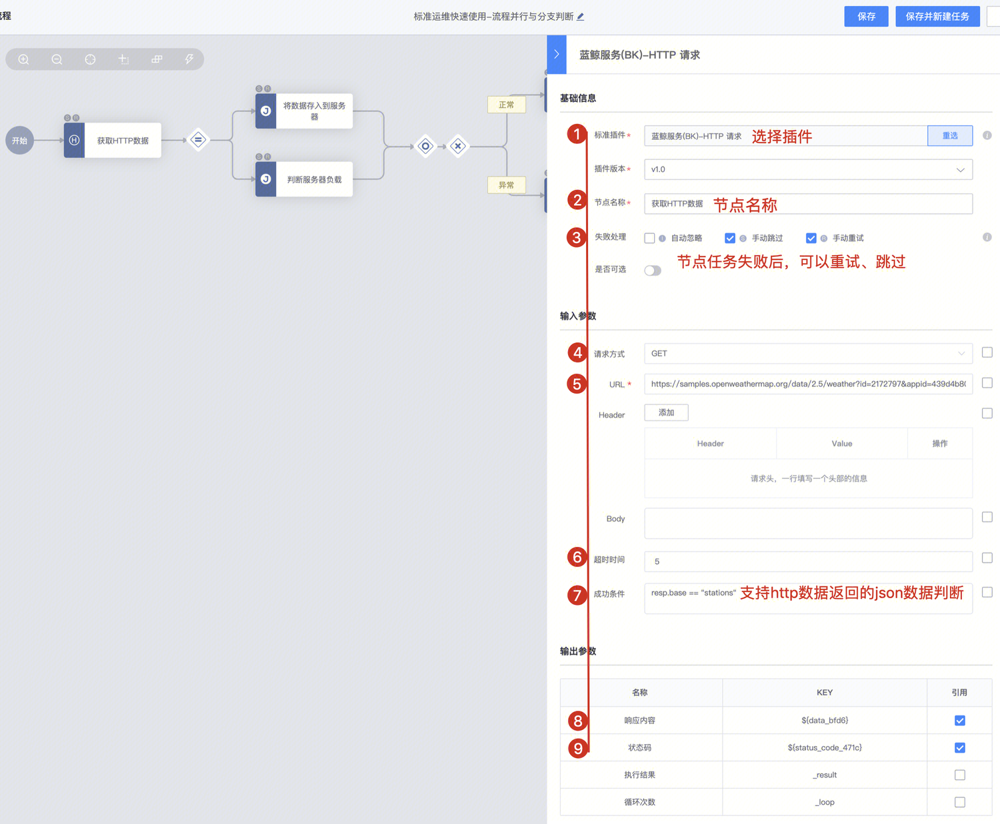
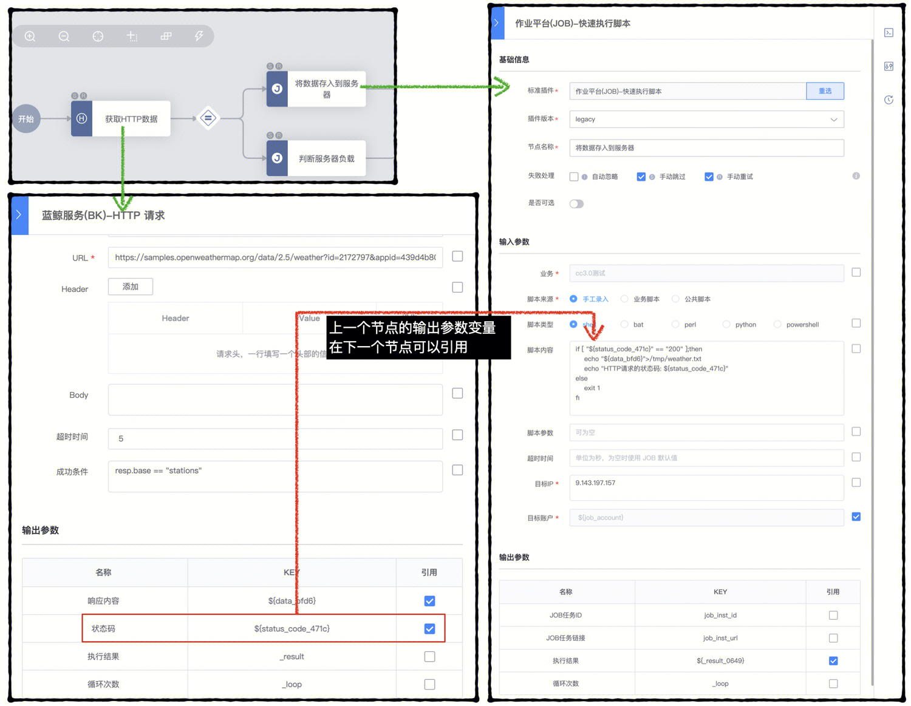
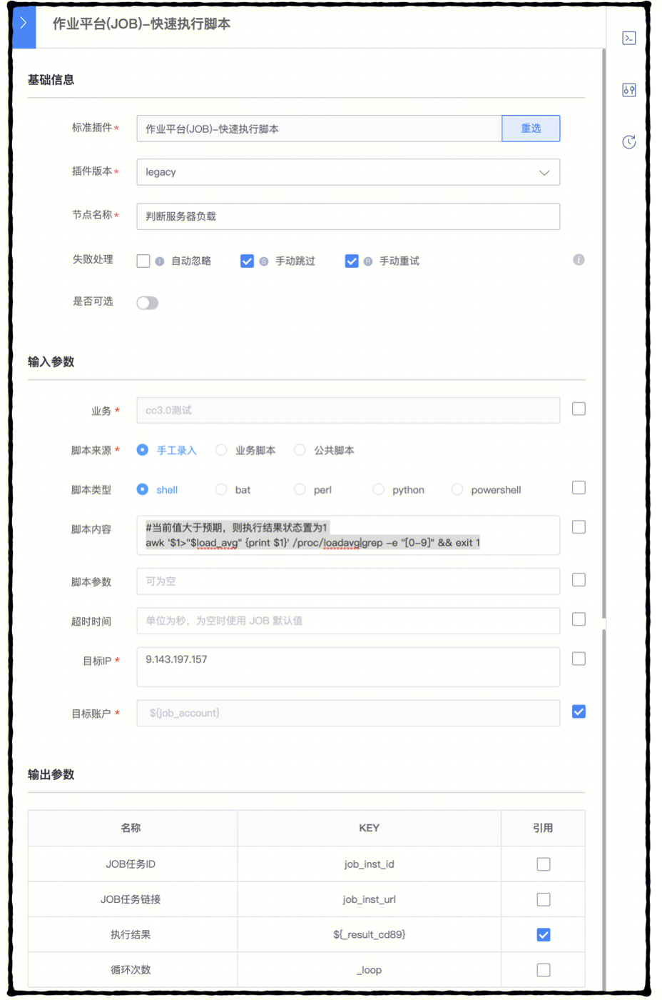
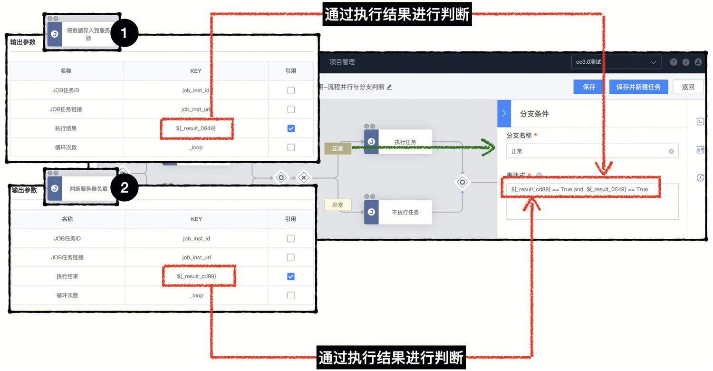
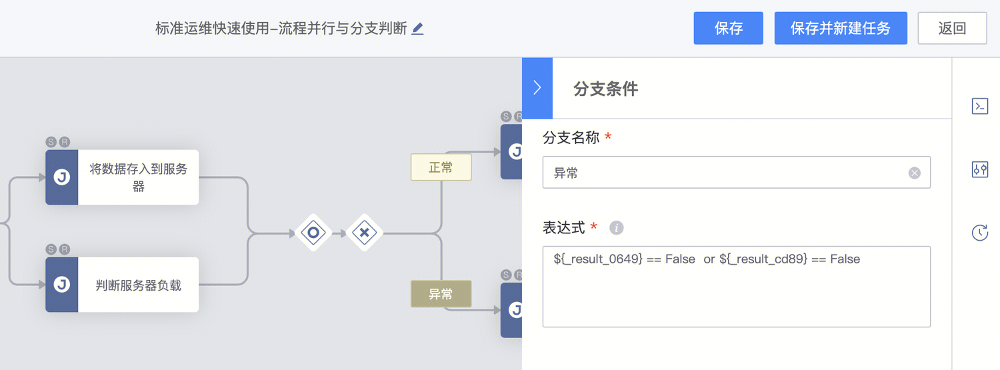
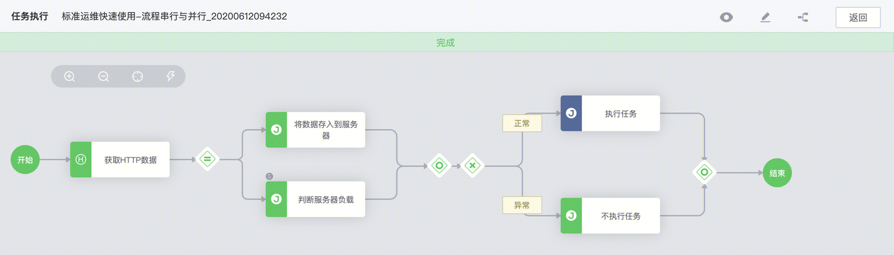
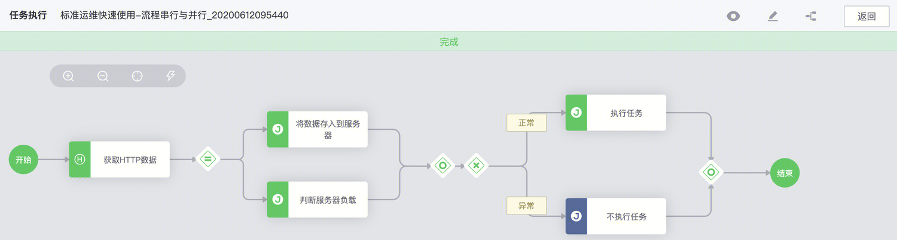

[TOC]

在标准运维中。流程支持**串行、并发、分支判断**、执行结果引用、复杂逻辑判断等多种高级用法，在本文中，将一起研究这些用法

# 新增概念

      本节将会出现的名词概念如下，可先熟悉相关名词，具体用法后文会详细解释

**并行网关**：支持多个流程节点同时执行

**汇聚网关**：多个节点汇流

**分支网关**：配置条件判断，根据条件输出结果选择执行的节点

# 流程逻辑

     在这里，我们用一个简单的场景来使用并行和分支判断：**1.获取原始数据；2.根据服务器负载；3.判断选择的执行节点**。起流程如下所示。

```Mermaid
graph LR
    A[开始]  --> B((获取HTTP数据))
    B --> C[并行网关]
    C --> D[将数据存入到服务器]
    C --> E[判断服务器负载]
    D --> F[汇聚网关]
    E --> F[汇聚网关]
    F[汇聚网关] -->  G[分支网关]
    G[分支网关] -- 条件判断1:满足 --> H[执行任务]
    G[分支网关] -- 条件判断2:满足 --> I[不执行任务]
    H[执行任务]  --> J[汇聚网关]
    I[不执行任务] -->  J[汇聚网关]
    J[汇聚网关] --> K[结束]

```

# 流程节点实例

    建好后的流程如下所示，可参数图片中的文字，以及结合文首的相关概念加以理解。



# 节点数据

## 开始-结束

每个流程从“开始节点”执行，从“结束节点”结束，为必须的节点

## 获取HTTP数据

| **标准插件** | **蓝鲸服务(BK)-HTTP 请求** |
| - | - |
| 节点名称 | 获取HTTP数据 |
| 请求方式 | GET |
| URL | [https://samples.openweathermap.org/data/2.5/weather?id=2172797&appid=439d4b804bc8187953eb36d2a8c26a02](https://samples.openweathermap.org/data/2.5/weather?id=2172797&appid=439d4b804bc8187953eb36d2a8c26a02) |
| 成功条件 | resp.base == "stations"  #从URL中获取的json数据中有base字段，其值等于stations |
| 输出参数 | - [x] 响应内容  ${data_bfd6}  <br/>- [x] 状态码  ${status_coe_471c}<br/> |

**输出参数变量**

注意：

       输出参数每勾选一次，会重新生成变量名称，可以在后续引用

如图所示，配置的相关变量如下



## 并行网关

    并行网关，表示后续的节点存在并行节点，支持2个以上的节点并行。

## 将数据存入到服务器

**变量引用**：节点“**获取HTTP数据**”的输出参数变量  ${status_code_471c} 用于节点“**将数据存入到服务器**”中的脚本内容

    在本节点中，执行作业平台的快速执行脚本，**脚本首先判断，上一步请求的HTTP状态码是否为200，如果非200，则退出状态码为1**

注意：当job的返回状态码为**1**，脚本会执行**失败**，为**0**则脚本执行**成功**，这是job执行任务判断成功失败的重要特性。

```bash
if [ "${status_code_471c}" == "200" ];then
    echo "${data_bfd6}">/tmp/weather.txt
    echo "HTTP请求的状态码: ${status_code_471c}"
else
    exit 1
fi
```



## 判断服务器负载

```bash
#当前值大于预期，则执行结果状态置为1
awk '$1>"$load_avg" {print $1}' /proc/loadavg|grep -e "[0-9]" && exit 1
```



## 条件判断-1

节点“**将数据存入到服务器**”和“**判断服务器负载**” **都**为**True**的时候，则执行分支“**执行任务**”

```bash
${_result_cd89} == True and  ${_result_0649} == True
```




## 条件判断-2

节点“**将数据存入到服务器**”或“**判断服务器负载**” 任一为**False**的时候，则执行分支“**不执行任务**”

```bash
${_result_0649} == False or ${_result_cd89} == False
```


# 流程分支

    在上文中，我们配置了分支判断，理解了分支如何执行，关于更详细的分支执行逻辑，分支的表达式，请参考[如何使用并行、分支、判断功能](/pages/viewpage.action?pageId=194050464)

# 流程任务执行

当判断条件为“异常”，则执行“不执行任务”节点




当判断条件为“正常”，则执行“不执行任务”节点




