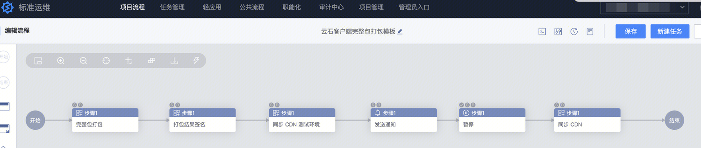
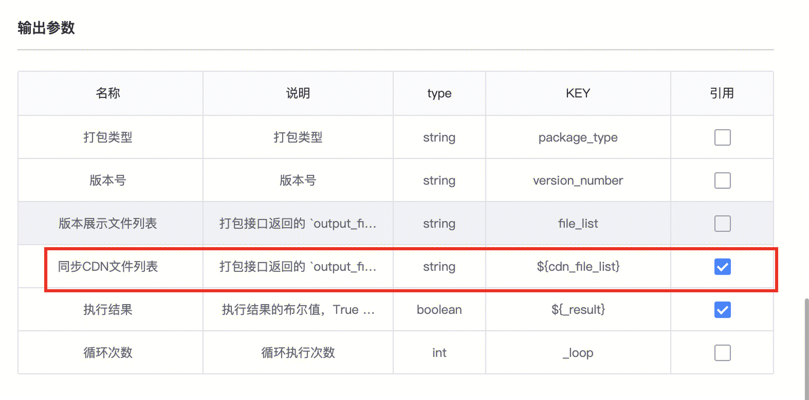
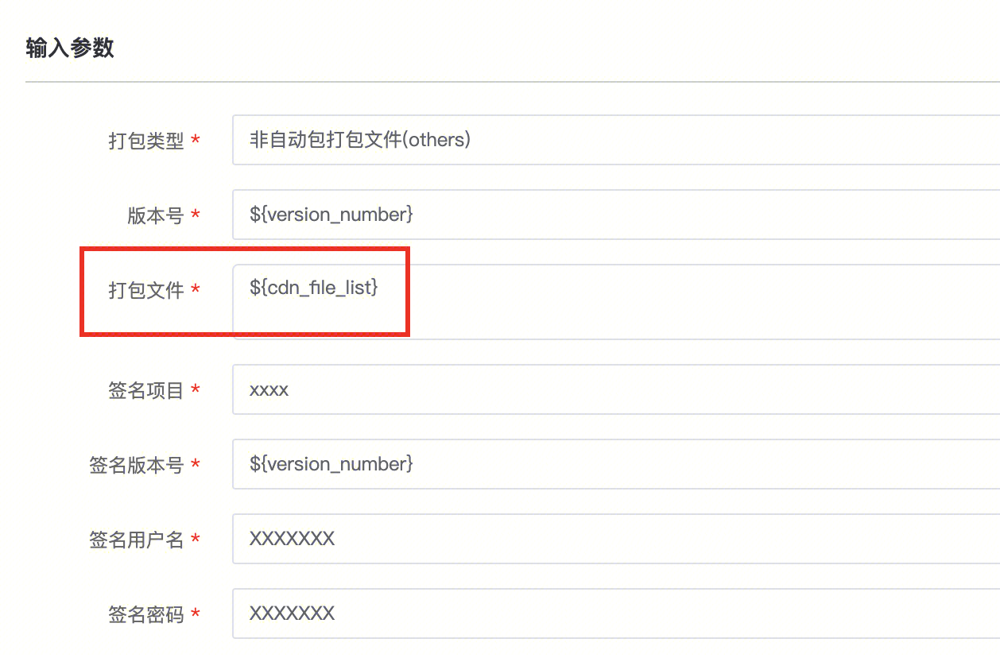
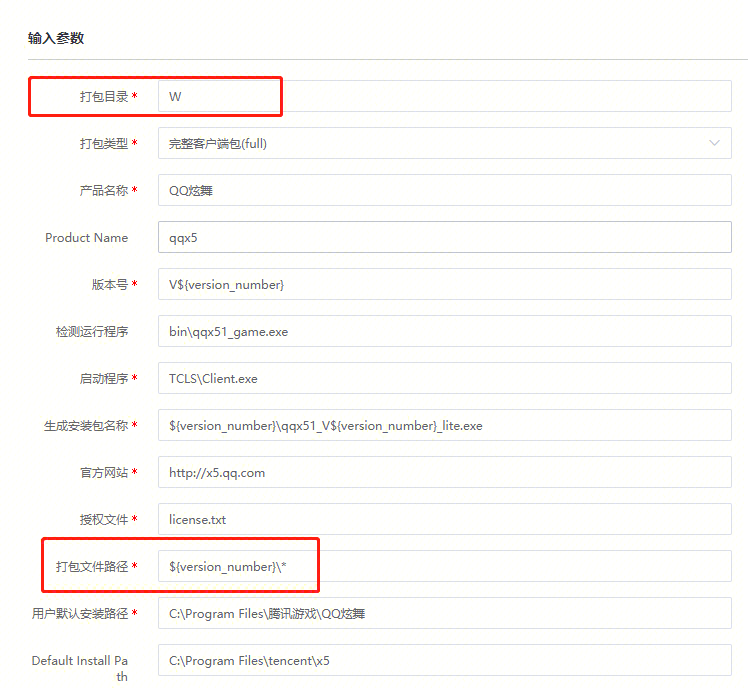
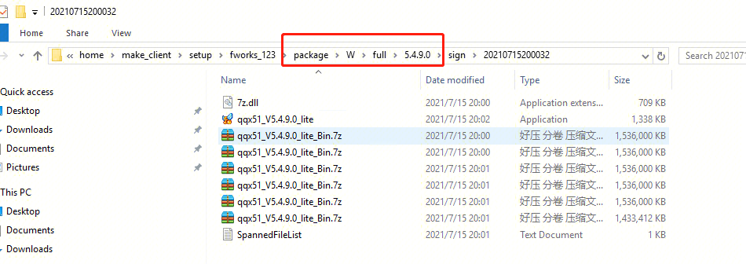

## 模板标题：

云石客户端打包

## 模板用途：

供客户端游戏进行客户端打包、签名、上传cdn测试环境、同步cdn正式环境一系列

## 模板下载地址：

!video[标准运维流程样例_云石客户端打包样例2.dat](https://iwiki.woa.com/tencent/api/attachments/s3/url?attachmentid=13429126)

[云石手动包打包模板 .yaml](https://iwiki.woa.com/tencent/api/attachments/s3/url?attachmentid=113141)

## 提供人：

beckli(李世岗)

fami

## 模板详细配置说明：

调用云石相关插件，进行客户端打包、签名、上传cdn测试环境、同步cdn正式环境。

通过该模板，可以学习到，前一个步骤的输出参数，能够被后一个步骤引用的逻辑。

例如，第一步，打包步骤的输出参数中的文件列表${cdn_file_list}，能够作为后一个签名步骤的输入参数，去使用。

（1）步骤1：完整包打包

（2）步骤2：打包结果签名

（3）步骤3：打包参数可以参考如下示例，特别是“打包目录”代表打包的环境目录，比如W（正式环境）、T（测试环境）；打包文件路径（打包后文件保存目录）一般为“新版本号”命名的文件夹下，如下图的 ${version_number}\

