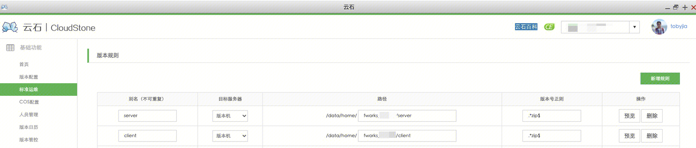
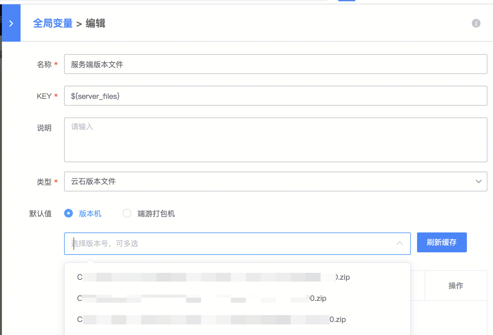
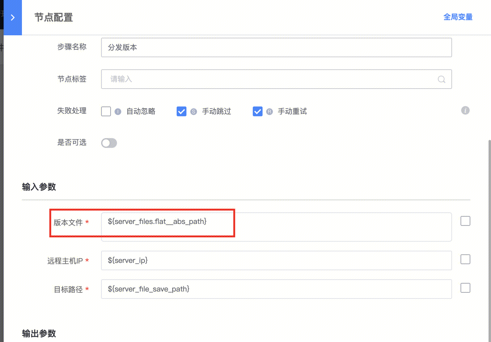

## 模板标题：

云石服务端（或客户端）文件分发

## 模板用途：

提供云石服务端（或客户端）文件分发的功能，即通过“云石版本文件”类型的全局变量，对接云石；

使用云石(Client)-分发客户端版本文件的原子，进行云石client目录下的文件→服务器的分发。

使用云石(Server)-FTP分发服务端版本文件的原子，进行云石server目录下的文件->服务器的分发。

## 模板下载地址：

[标准运维流程样例_云石服务端文件分发样例.dat](https://iwiki.woa.com/tencent/api/attachments/s3/url?attachmentid=13430071)

## 提供人：

tobyjia(贾耀光)

## 模板详细配置说明：

1、首先需要在云石app（[http://open.oa.com?app=cloud_stone](http://open.oa.com?app=cloud_stone)）中，配置标准运维的版本规则。

该规则通过目标服务器的别名，去区分是server还是client。建议配置两条，server一条，client一条：如下图

版本号正则可以按照业务需求配置，以便过滤对应规则的文件名。如需全部文件匹配，写成    .*  即可。

2、配置了以后，在标准运维的“云石版本文件”类型的全局变量中，即可拉取到对应配置路径的文件列表：

3、添加了要分发的文件后，这个变量例如${server_files}其实就对应了如下图的表，表格中包含版本号、文件名、路径、md5信息。

4、拖拽一个云石文件分发的节点：

服务端分发（server目录），使用云石(Server)-FTP分发服务端版本文件的原子。

客户端分发（client目录），使用云石(Client)-分发客户端版本文件的原子。

5、在里面的版本文件的参数，我们可以使用${server_files.flat__abs_path}，来获取版本文件绝对路径列表。

## 云石版本文件（详细全描述，请参考：标准运维各类全局变量使用说明中的“云石版本文件”章节）

### 部分用法引用

${KEY}

- 引用${KEY}，返回结果为版本文件列表，返回类型为列表，列表值为字典（键为版本文件属性名，值为版本文件属性值）
- 引用${KEY.flat__abs_path}，返回结果为选择的版本文件绝对路径以 "\n" 分隔的字符串  

通过这样的方法，我们可以灵活配置一个从云石选择文件，进行拉取。