# 一、使用场景

在业务发布的场景中，我们希望对一组服务器进行灰度更新，如果其中任何一台更新失败，则终止当前步骤

# 二、流程图

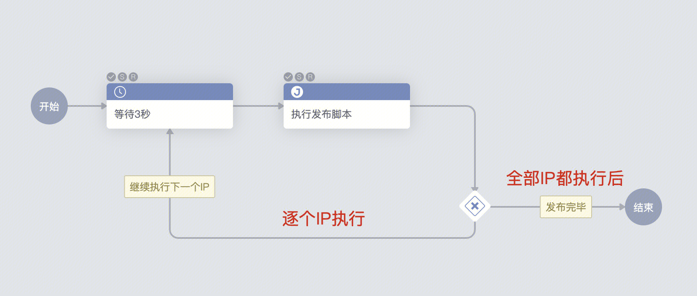

# 三、使用效果

选择3个IP，每次执行1个IP的发布，共执行3次

如其中1个IP执行任务失败，则当前流程失败终止

1.启动作业

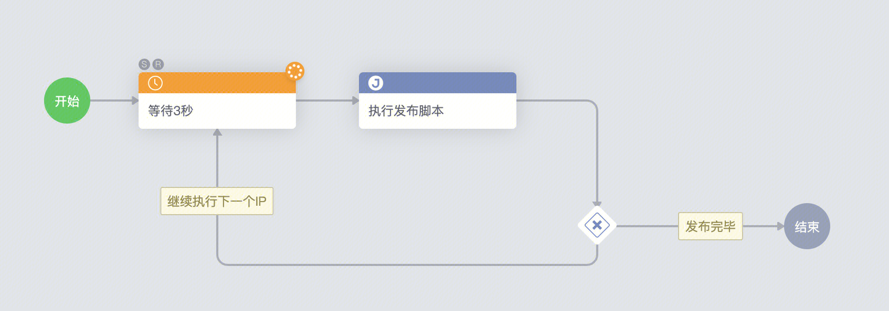

2.执行IP列表中的第一个IP

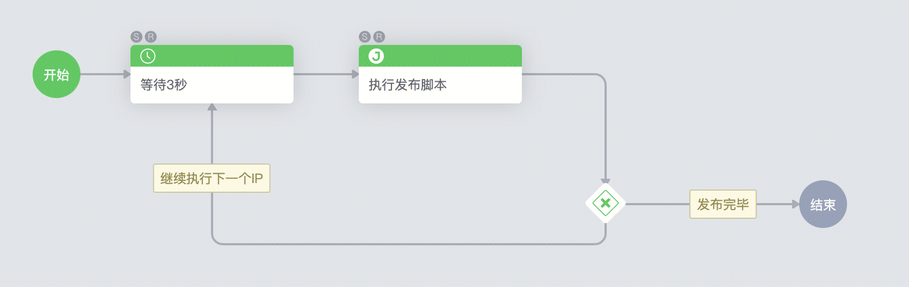

3.判断当前IP列表未执行完

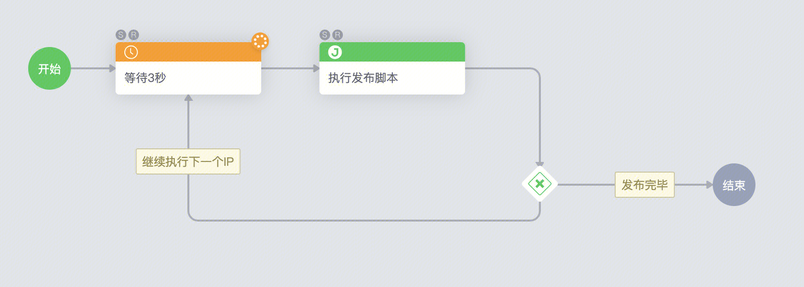

4.执行下一个IP

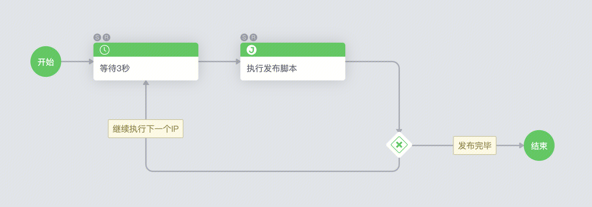

5.共计执行3次，每个IP都有执行记录

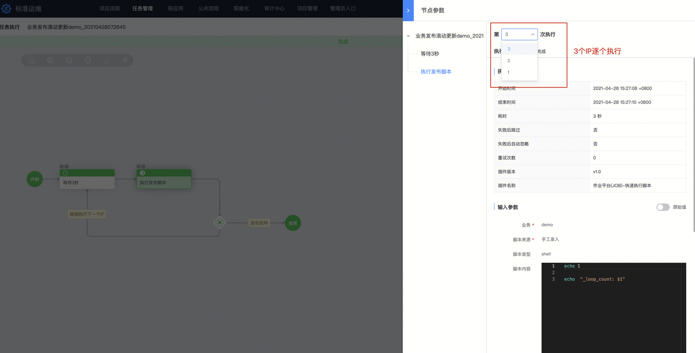

# 四、配置方法

## 1.全局变量

| **名称** | **key** | **默认值** | **含义** |
| - | - | - | - |
| iplist | ${iplist} | IP选择器 | 执行的目标IP |
| 循环计数 | ${_loop_count} |  | 循环执行的次数 |
| IP个数 | ${count} | ${len(iplist.split(','))} | 使用Python语法计数IP个数,[参考](https://github.com/Tencent/bk-sops/blob/V3.6.X/docs/features/variables_engine.md) |

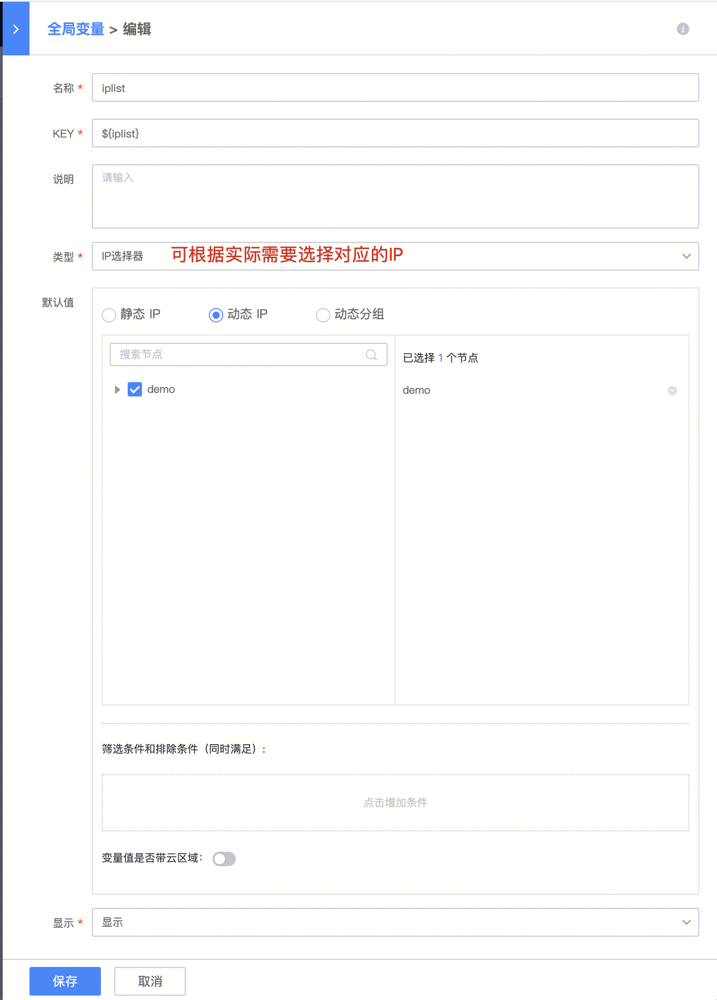

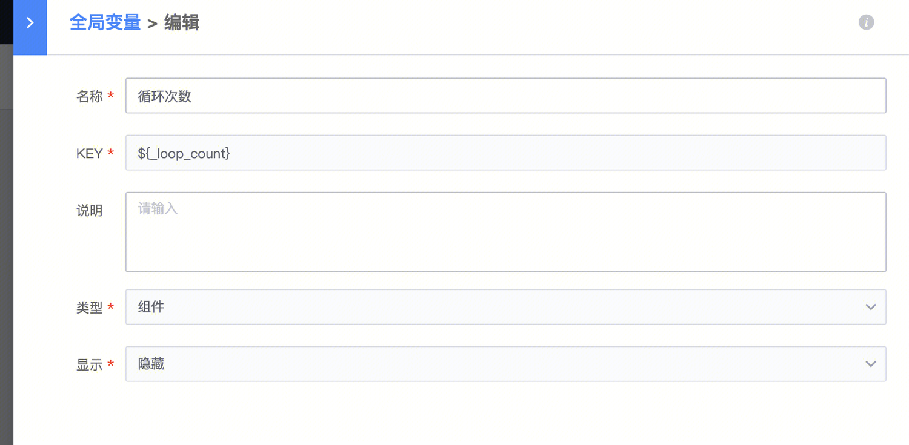

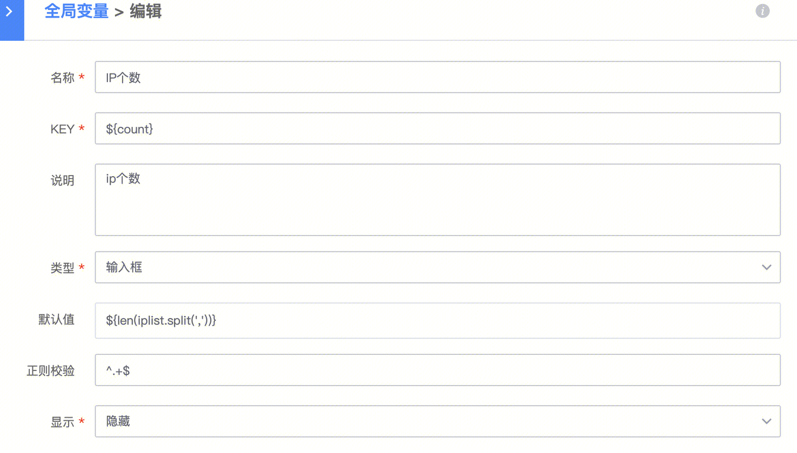

## 2.配置步骤

**配置等待执行**

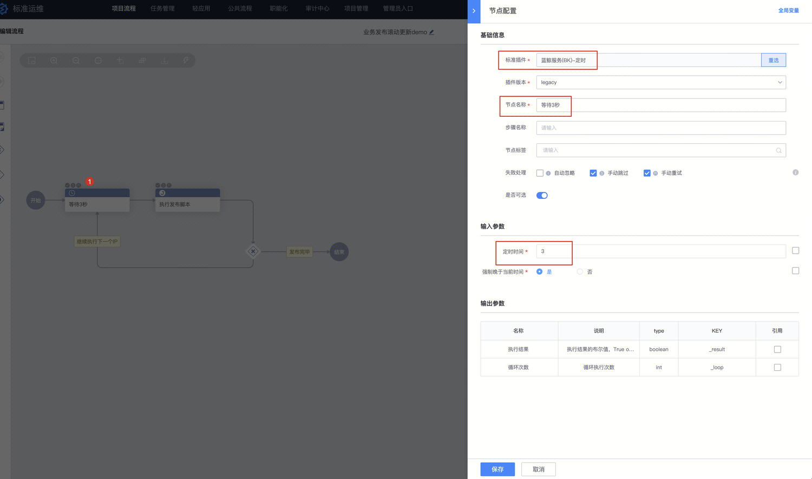

**配置发布作业、脚本**

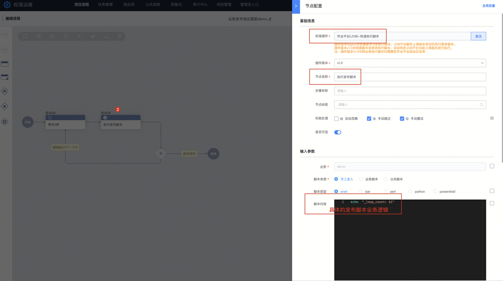

**目标IP填**

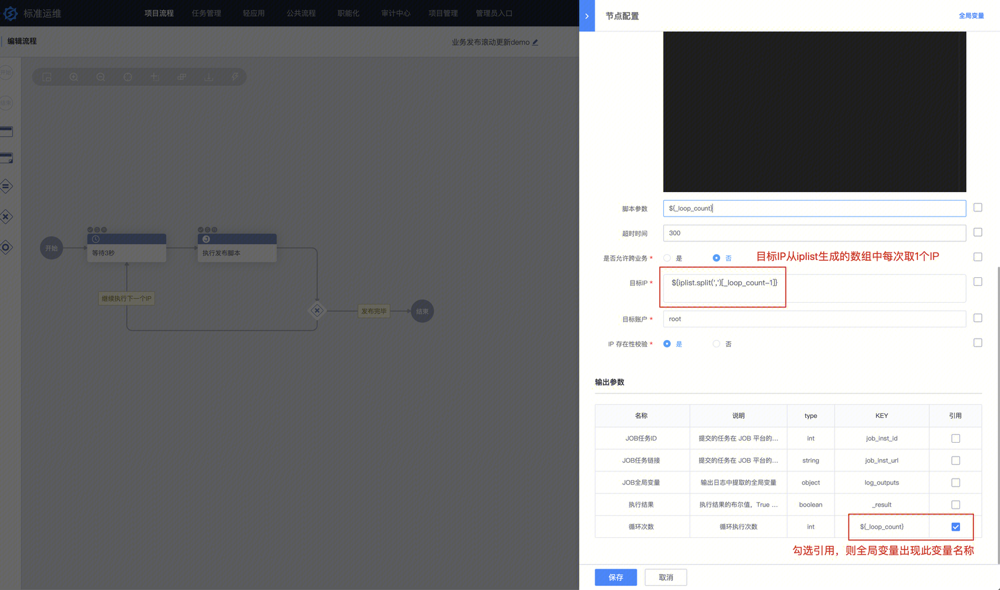

**分支网关**

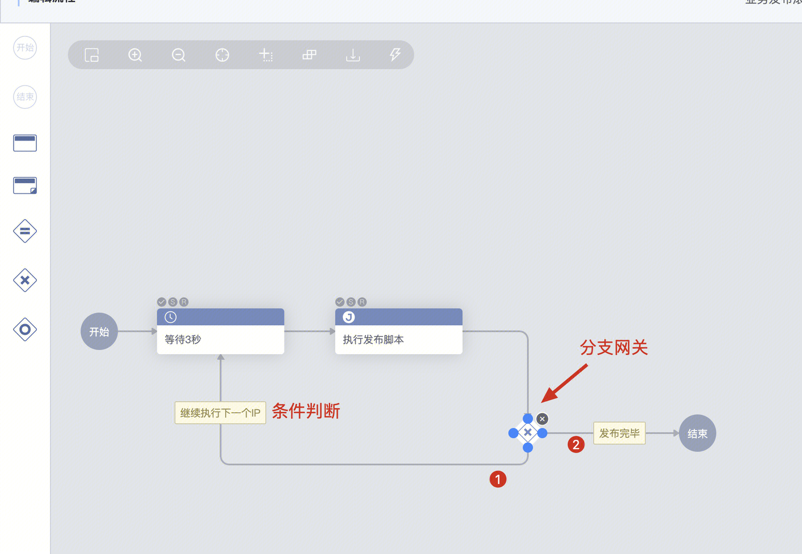

执行下一个IP判断

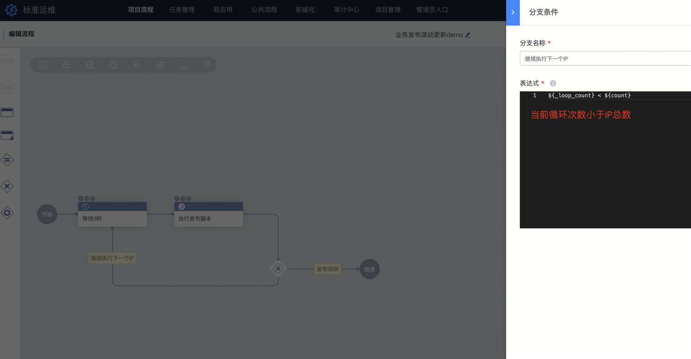

所有IP执行完毕判断

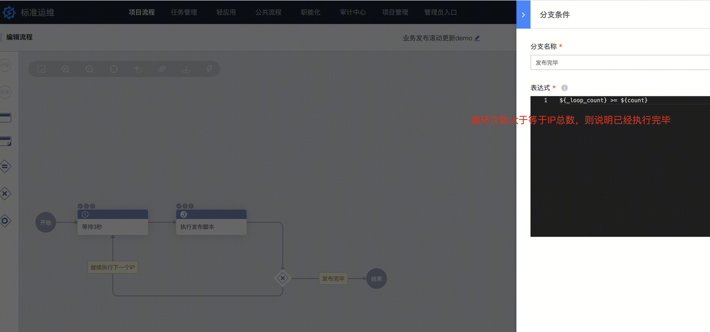

完整流程见附件，点击可下载

!video[bk_sops_5001826_20210428155322-业务发布滚动更新.dat](https://iwiki.woa.com/tencent/api/attachments/s3/url?attachmentid=13429555)

在标准运维导入使用，上云版地址为[http://bksops.bkapps.oa.com/](http://bksops.bkapps.oa.com/)

使用限制：当前版最多支持50次循环

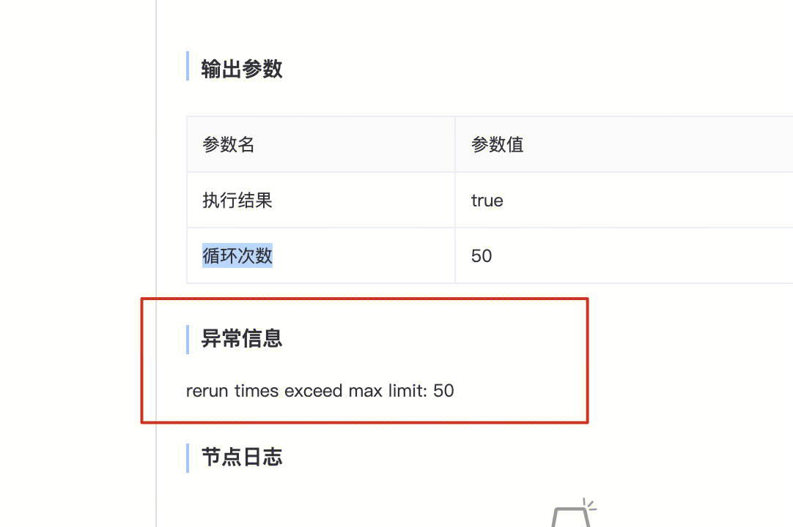

