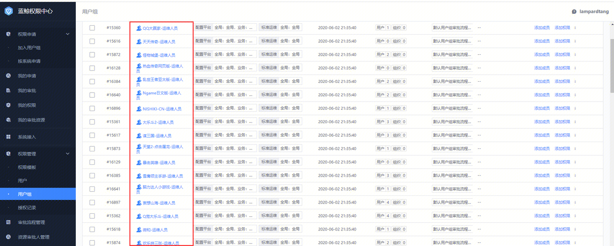

蓝鲸上云版的标准运维（[**http://bksops.bkapps.oa.com**](http://bksops.bkapps.oa.com/)），统一使用蓝鲸权限中心（[**http://bk-iam-app.bksaas.oa.com**](http://bk-iam-app.bksaas.oa.com/)）进行权限管控。

## 以加入“xxxx业务 用户组”的方式申请权限

IEG存量CC1.0的业务或者非IEG通过业务接入创建的业务，蓝鲸管理员会默认创建一个运维用户组：某某业务-运维人员，如下的业务运维组：

如果是新用户需要加入到某个用户组，直接申请加入用户组即可，权限申请-->加入用户组-->搜索业务名→勾选用户组

> 互娱的业务在还没有完全迁移到CC3.0之前，运维权限还通过[tea.oa.com](http://tea.oa.com/)申请，然后会同步到[cc.ied.com](http://cc.ied.com)，最后同步到cc.30
>
> 

提单后，可以在“我的申请中”跟催单据，企业微信找对应流程审批人进行审批。针对上云迁移的IEG业务，优先支持。

## 其他申请方式

如果“xxxx业务 用户组”的方式，在一些场景上，不能满足运维需求，需要更高级的管控权限，请参阅：[权限申请说明](https://iwiki.woa.com/p/186456579)

如果标准运维的权限管理，还有疑问和咨询，请直接联系tobyjia。