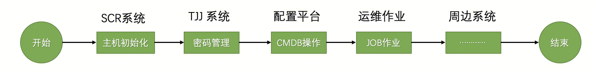
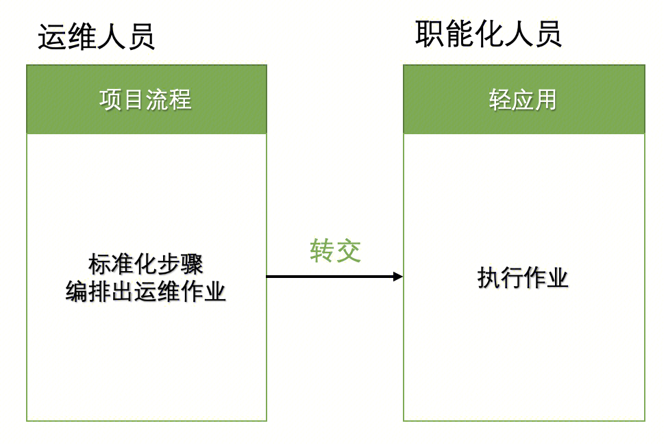
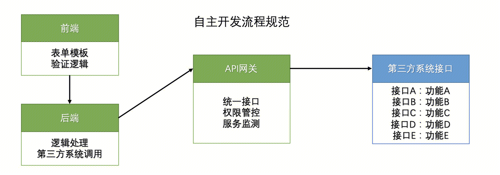
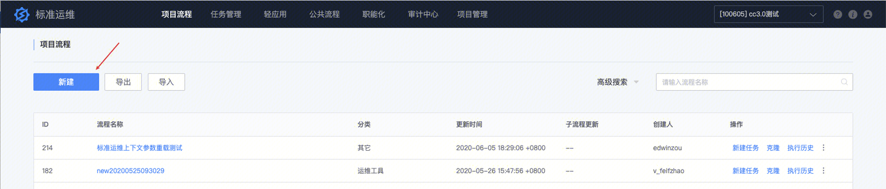
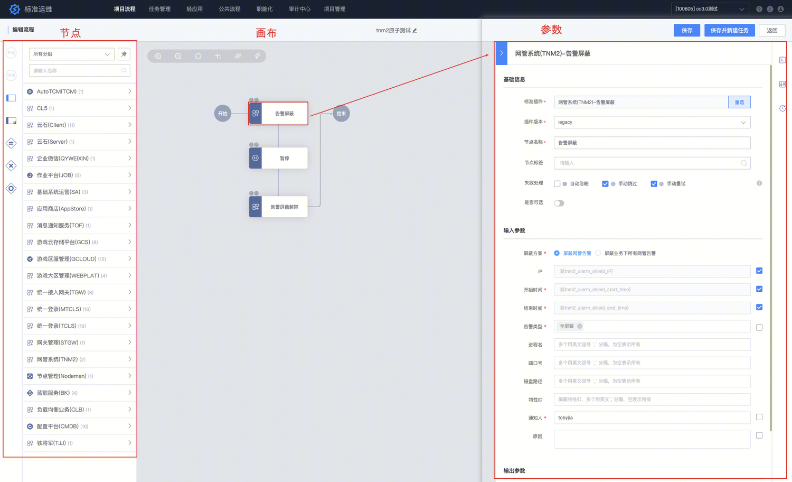
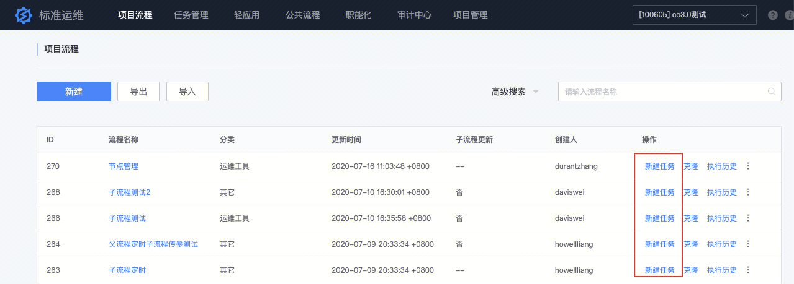
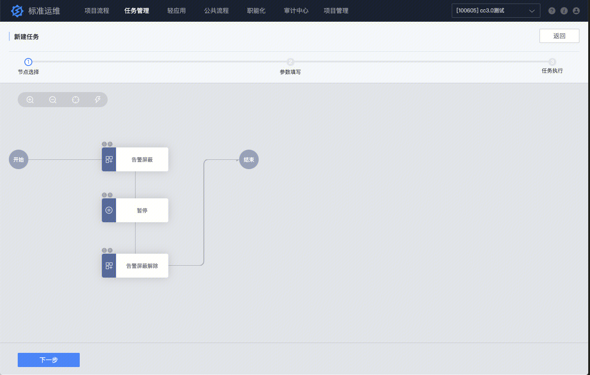
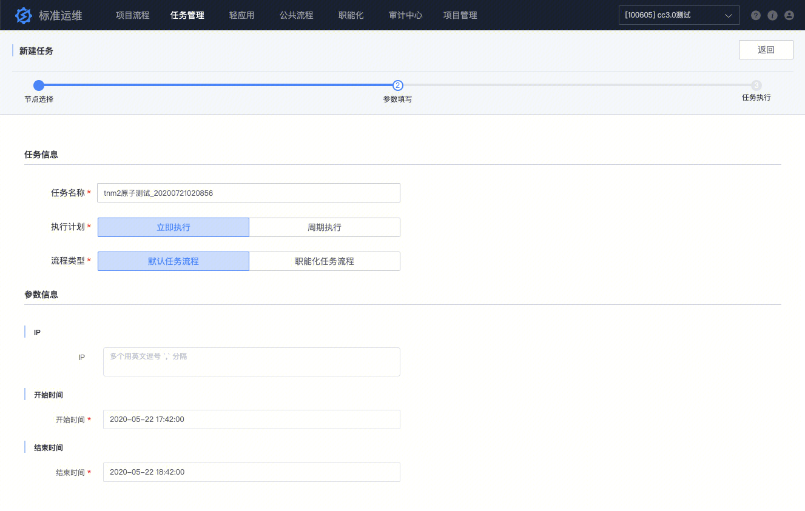
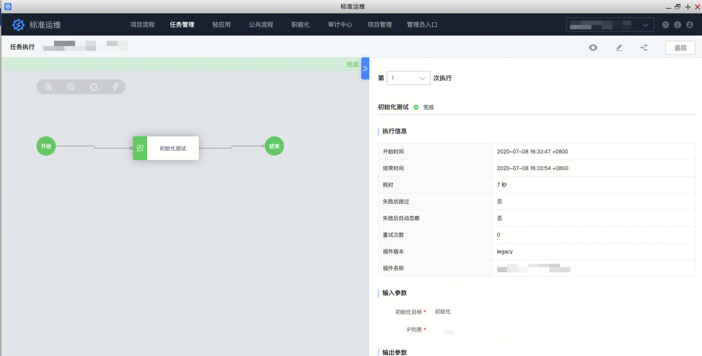

[TOC]

# 什么是标准运维

**标准运维**是通过可视化的图形界面进行任务流程编排和执行的系统，是腾讯蓝鲸产品体系中一款轻量级的调度编排类 SaaS 产品。

# 标准运维的核心功能

标准运维有三大核心服务：

## 1、调度编排服务

基于蓝鲸 PaaS 平台服务总线（ESB）对接企业内部各个系统 API 的能力，将企业内部多系统间的工作整合到一个流程模版中，实现一键自动化调度。

标准运维使用”项目流程“进行调度编排。

## 2、自助化服务

标准运维通过与蓝鲸集成平台深度整合，为用户提供了 “轻应用” 和 “职能化” 功能，让用户可以将业务日常的运维工作交给产品和职能化人员执行，实现业务的发布、变更等工作自助化。

## 3、标准插件自主开发

标准插件提供一套完整的开发流程规范，通过丰富的表单界面和验证逻辑将企业内部各个系统、各个平台的 API 组装成一个标准插件模板。使其他的系统通过标准插件的开发模板来调动不同系统间的功能。

# 标准运维的简明使用说明

## 1、创建项目流程：

在项目流程页面，可以查看已经保存的项目流程。点击左上角新建按钮，可以新建项目流程。

**左侧：插件节点。**选择已经对接的系统功能插件、和流程逻辑按钮。

**中间：画布。**将左侧原子、流程逻辑按钮，拖拽到画布上，连接，进行编排。

**右侧：参数。**设置全局参数；或者点击节点，配置该节点的参数。

编排完成后，点击右上角保存按钮。

创建项目流程的详细说明，请参阅：[如何创建项目流程](https://iwiki.woa.com/p/186456720)

## 2、执行流程任务：

在项目流程页面，可以查看已经保存的项目流程，通过点击右侧的”新建任务“链接，可以进入该项目流程的执行页面。

查看到这个项目的全部步骤，选择要执行的节点，填写参数，然后进行任务执行，

在执行页面，可以点击节点，查看该节点详细的参数、输入参数和返回的结果。

执行流程任务的详细说明，请参阅：[如何执行流程任务](https://iwiki.woa.com/p/194050542)

