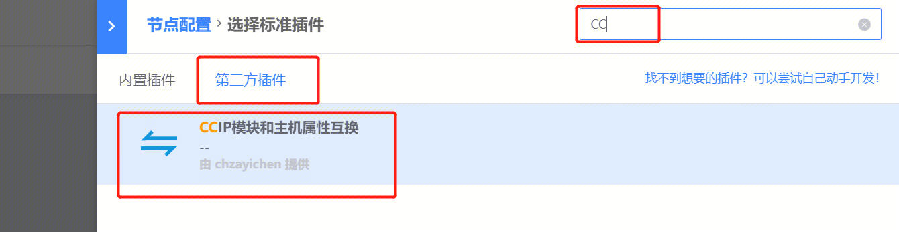
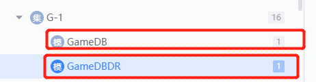
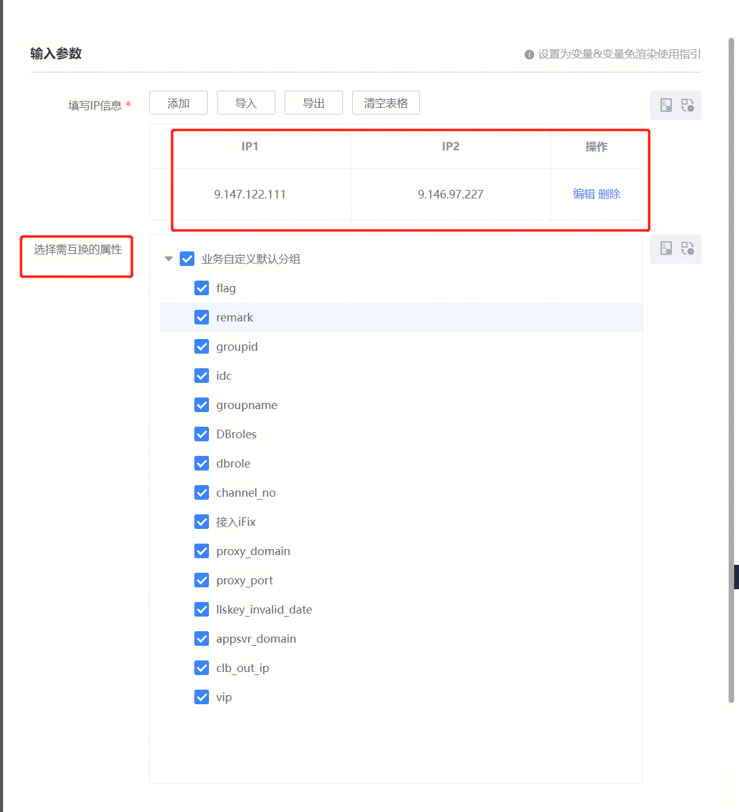
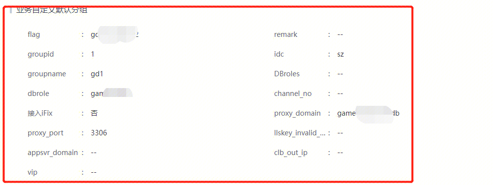

背景：业务对CC上的模块进行互换时，没有相应的组件，并且不会保留自定义属性，本插件适用场景，模块1的IP1、和模块2的IP2进行互换（模块和自定义数据也能换），典型代表场景：db模块，dr模块（db发生故障切换时，dbip和drip所属模块互换）

## 插件使用

在标准运维：[http://bksops.bkapps.woa.com/](http://bksops.bkapps.woa.com/)  流程里选择第三方插件，搜索CC即可看到：**CCIP模块和主机属性互换**

注意事项：

1、IP1<->IP2 模块互换，自定义属性则跟据所勾选的字段进行互换，不勾选则不换自定义属性；

2、IP1或IP2如果是在空闲机池，只能在【待回收】【故障机】【空闲机】模块中的一个（受CC接口的限制）；

3、一次不能超过200行（即200对，400个IP）

db、dr互换场景：

所在模块：

勾选需要互换的自定义属性：  

如果勾选了互换的自定义属性，则会进行替换：

插件执行成功则两互换成功

插件开发：chzayichen，如有疑问可随时联系