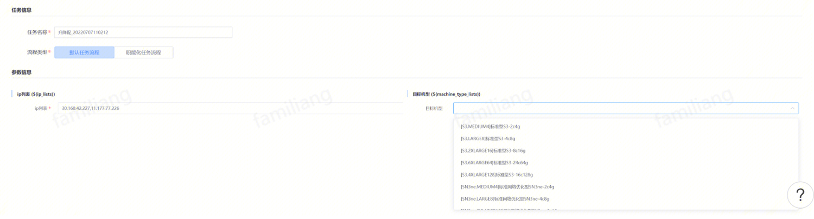
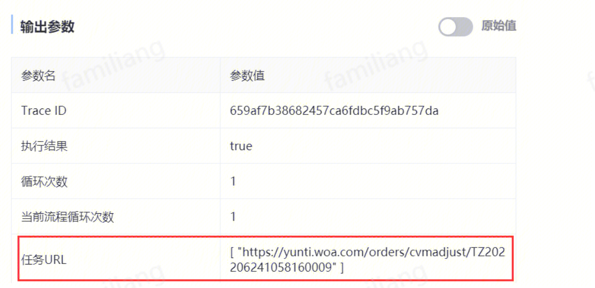
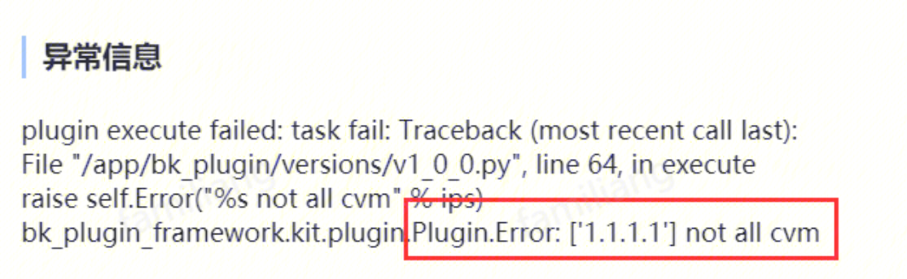
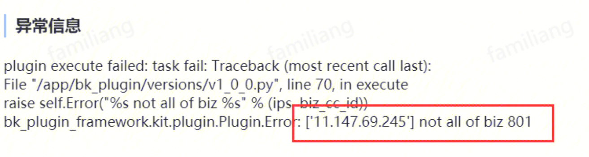

## 背景
随着IEG业务富容器全量迁移替换为自研云cvm以及持续降本增效，考虑到业务动态调整cvm配置的需求长期存在，本人在标准运维开发了cvm升降配插件，在此对插件使用及注意事项进行说明。
该插件遇到任何使用问题请联系razinli

## 插件使用
**1、在标准运维第三方插件列表可才找到该插件**

--------
**2、插件只有2个入参：待升降配!!#3d85c6 cvm的ip列表!!，以及!!#3d85c6 目标机型!!。**

**3、成功创建升降配订单后，在插件输出中有云梯订单链接。**

**4、插件支持多地域cvm同时操作，会根据地域地域拆分成多个订单**

## 注意事项：插件直接调用云梯接口创建升降配订单，无需经过人工审批，**!!#ff0000 且是立即执行（机器关机立即执行）!!**。

###使用建议
> 
1、由于!!#ff0000 **cvm升降配需要重启机器**!!，建议跟着业务停服版本一起操作。
2、由于接口是不经过审批，且立即执行的，建议在该插件步骤之前增加必要的**人工确认或者审核**步骤。
3、如果需要对批量设备进行升降配，建议提前拉sa资源以及运管同学评估当前资源情况。

## 常见问题：
**1、物理机|容器|TVM等不支持升降配**

**2、只允许调整个人业务名下cvm**

**3、升降配受限于自研云资源以及装箱策略，可能出现资源不足或者超预算**

##**最后希望该插件能帮助到大家，减少凌晨起夜**
## 开发者：razinli(李瑾)