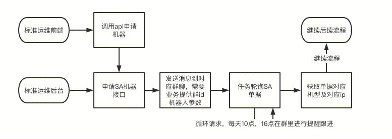
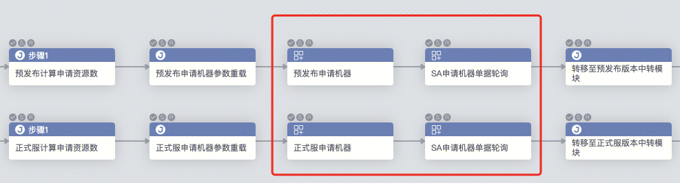
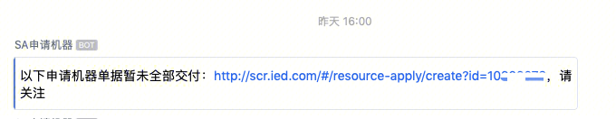
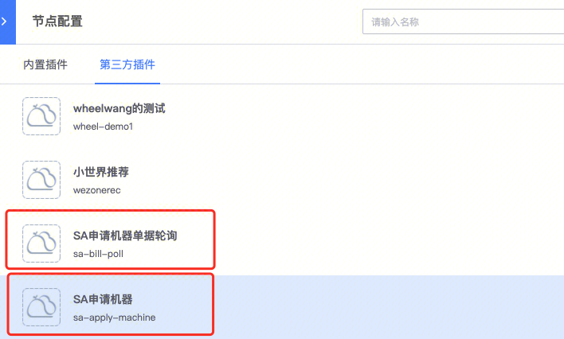

### 前言

为了帮助大家在标准运维上自动进行机器申请及交付并执行后续流程（自动化部分流程，减少运维参与），因而有了SA-申请资源插件的诞生。（tips：目前只支持IDC-Docker，IDC-物理机，自研云-CVM，自研云-Docker）

该插件遇到任何使用问题请联系lucifersu/wheelwang


###   
### 功能流程介绍

1.填写完相应的申请机器的参数后，会自动使用申请人进行SA接口调用，进行机器的申请，然后一直轮询查询接口，直到所有机器交付完成，最后输出全IP及机型与IP的关系变量。

（tips：任何异常机器申请资源的异常可联系lucifersu/huibohuang/dommyzhang/forestchen）

流程图如下：



标准运维实际使用图：




### 前置准备（如果需要使用机器人通知）

需要在群中加入'SA申请机器' 机器人


即使用机器人进行单据相关轮询通知（目前涵盖，成功申请单据，每天10，16点进行催单，机器全部申领完毕，以及机器未交付完成但显示完成的情况（交付数量不足））

成功申请单据：


催单（10点及16点会提醒）




###   
### 使用说明

 1. 在”节点配置“中找到”SA申请机器“，”SA申请机器单据轮询“




### SA申请机器使用说明

申请机器参数字段填写说明

| **参数字段** | **填写内容** |
| - | - |
| 申请参数 | 详细json信息见下 |
| 企业微信chatid | 需要将机器人”SA申请机器“加入对应的群聊中，并diss机器人获取chatid，多个群通过换行分隔 |


IDC-物理机 申请参数字段

字段说明：

| **字段** | **字段类型** | **是否是可选参数** | **说明（参数值）** |
| - | - | - | - |
| reason | string | 否 | 申请原因 |
| slave_records[].resource_type | string | 否 | 资源类型<br/><br/>IDCPM（IDC-物理机） |
| slave_records[].replicas | int | 否 | 申请数量 |
| slave_records[].selector.device_class | string | 否 | 机型（各类SA上可使用的资源）例如：<br/><br/>B70<br/><br/>M10,M10C<br/><br/>CG3-10G |
| slave_records[].selector.region | string | 否 | 申请机器地域（例如：上海，南京，深圳等） |
| slave_records[].selector.image | string | 否 | 系统镜像（其他镜像请参考SA申请资源中提供的数值）<br/><br/>Tencent tlinux release 1.2 (tkernel2)<br/><br/>Tencent tlinux release 2.2 (Final) |
| slave_records[].selector.data_disk_raid | string | 否 | RAID（具体机型查看对应的RAID）<br/><br/>RAID1（B70）<br/><br/>RAID5（M10,M10C）<br/><br/>NORAID（CG3-10G） |
| slave_records[].selector.anti_affinity_level | string | 是（默认值：ANTI_NONE） | 反亲和性策略<br/><br/>ANTI_NONE（无要求）<br/><br/>ANTI_RACK（分机架）<br/><br/>ANTI_MODULE（分模块）<br/><br/>ANTI_CAMPUS（分campus） |
| slave_records[].selector.zone | string | 是（默认值：空字符串） | 申请机器区域<br/><br/>以申请机器地域-地区的方式（如：上海-宝信） |


自研云-CVM 申请参数字段

字段说明：

| **字段** | **字段类型** | **是否是可选参数** | **说明（参数值）** |
| - | - | - | - |
| reason | string | 否 | 申请原因 |
| slave_records[].resource_type | string | 否 | 资源类型<br/><br/>QCLOUDCVM（自研云-CVM） |
| slave_records[].replicas | int | 否 | 申请数量 |
| slave_records[].selector.device_class | string | 否 | 机型（各类SA上可使用的资源）（注意有些机型和地域及园区有关）例如：<br/><br/>S5.12XLARGE128<br/><br/>SA2.12XLARGE128<br/><br/>S2ne.SMALL2 |
| slave_records[].selector.qcloud_region_id | string | 否 | 申请机器地域（例如：ap-hongkong，ap-shanghai等）<br/><br/>ap-hongkong(港澳台地区(中国香港))  <br/>ap-seoul(亚太东北(首尔))  <br/>ap-xian-ec(西北地区(西安))  <br/>na-siliconvalley(美国西部(硅谷))  <br/>ap-chongqing(西南地区(重庆))  <br/>ap-guangzhou(华南地区(广州))  <br/>ap-tokyo(亚太东北(东京))  <br/>eu-frankfurt(欧洲地区(法兰克福))  <br/>ap-tianjin(华北区域(天津))  <br/>na-toronto(北美地区(多伦多))  <br/>ap-nanjing(华东区域(南京))  <br/>ap-shanghai(华东区域(上海))  <br/>ap-shenzhen(华南地区(深圳))  <br/>ap-singapore(亚太东南(新加坡))  <br/>ap-wuhan-ec(华中地区(武汉EC))<br/><br/>填写英文内容即可括号内容为备注无需填写 |
| slave_records[].selector.qcloud_zone_id | string | 否 | 申请机器园区（例如：ap-shanghai-2等）（具体内容需要scr进行查询园区接口信息），分campus为特殊字段<br/><br/>ap-shanghai-2(上海二区(上海-宝信))  <br/>ap-shanghai-4(上海四区(上海-富特))  <br/>ap-shanghai-5(上海五区(上海-花桥))  <br/>ap-shanghai-6(上海六区(上海-奉贤))  <br/>ap-shanghai-7(上海七区(上海-青浦))<br/><br/>cvm_separate_campus（分campus）<br/><br/>填写英文内容即可括号内容为备注无需填写 |
| slave_records[].selector.image | string | 否 | 系统镜像（其他镜像请参考SA申请资源中提供的数值）<br/><br/>Windows Server 2016 For Tencent(Windows Server 2016 For Tencent)  <br/>Tencent Linux Release 2.2 (Final)(Tencent Linux Release 2.2 (Final))  <br/>Tencent Linux release 1.2 (tkernel2)(Tencent Linux release 1.2 (tkernel2))  <br/>Windows Server 2012 R2 For Tencent(Windows Server 2012 R2 For Tencent)  <br/>Windows Server 2008 for Tencent(Windows Server 2008 for Tencent) |
| slave_records[].selector.image_id | string | 否 | 系统镜像id信息（其他镜像id请参考SA申请资源中提供的数值）<br/><br/>img-7ffj221n(Windows Server 2016 For Tencent(Windows Server 2016 For Tencent))  <br/>img-bh86p0sv(Tencent Linux Release 2.2 (Final)(Tencent Linux Release 2.2 (Final)))  <br/>img-r5igp4bv(Tencent Linux release 1.2 (tkernel2)(Tencent Linux release 1.2 (tkernel2)))  <br/>img-kmzf9bvp(Windows Server 2012 R2 For Tencent(Windows Server 2012 R2 For Tencent))  <br/>img-mvbqvzfn(Windows Server 2008 for Tencent(Windows Server 2008 for Tencent))<br/><br/>填写英文内容即可括号内容为备注无需填写 |
| slave_records[].selector.data_disk[].disk_type | string | 否 | 磁盘类型（根据对应地域确认对应的硬盘资源）（注意这里的data_disk是列表，不然会导致无法正常申请）<br/><br/>CLOUD_SSD(SSD云硬盘)  <br/>CLOUD_PREMIUM(高性能云盘)<br/><br/>填写英文内容即可括号内容为备注无需填写 |
| slave_records[].selector.data_disk[].disk_size | int | 否 | 磁盘大小（注意这里的data_disk是列表，不然会导致无法正常申请） |
| slave_records[].selector.vpc | string | 否 | 默认为空，填写具体vpc id |
| slave_records[].selector.subnet | string | 否 | 默认为空，填写具体子网id<br/><br/>同上类似填写 |
| slave_records[].selector.inherit_instance_id | string | 否 | 被继承云主机实例ID（同一批次只支持一台）选择“滚服项目”必须填写。<br/><br/>内容为主机实例如：ins-xxx<br/><br/><br/><br/>  |


IDC-Docker，腾讯云-Docker ，IDC-物理机 申请参数参考样例

```json
{
	"reason": "CFMH5版本发布使用",
	"slave_records": [{
		"resource_type": "IDCDVM",
		"replicas": 1,
		"selector": {
			"device_class": "D4-8-200-10",
			"region": "上海",
			"image": "hub.oa.com/library/tlinux2.2:v1.6",
			"data_disk_mount_path": "/data1",
			"zone": "" # 不填为无限制
		}
	}, {
		"resource_type": "QCLOUDDVM",
		"replicas": 1,
		"selector": {
			"anti_affinity_level": "ANTI_NONE",
			"device_class": "D6-30-200-10",
			"image": "hub.oa.com/library/tlinux1.2:v1.17",
			"data_disk_mount_path": "/data",
			"region": "上海",
			"zone": "上海-青浦"
		}
	}, {
		"resource_type": "IDCPM",
		"replicas": 1,
		"selector": {
			"device_class": "B70",
			"image": "Tencent tlinux release 2.2 (Final)",
			"data_disk_raid": "RAID1",
			"region": "上海",
			"zone": "上海-青浦"
		}
	}, {
		"resource_type": "IDCPM",
		"replicas": 1,
		"selector": {
			"device_class": "CG3-10G",
			"image": "Tencent tlinux release 2.2 (Final)",
			"data_disk_raid": "NORAID",
			"region": "深圳"
		}
	},{
		"resource_type": "QCLOUDCVM",
		"replicas": 1,
		"selector": {
			"anti_affinity_level": "ANTI_NONE",
			"device_class": "S2ne.SMALL2",
			"image": "Tencent Linux Release 2.2 (Final)(Tencent Linux Release 2.2 (Final))",
			"image_id": "img-bh86p0sv",
			"qcloud_region_id": "ap-shanghai",
			"qcloud_zone_id": "ap-shanghai-2",
			"data_disk":[{
				"disk_type": "CLOUD_PREMIUM",
				"disk_size": 100
			}]
		}
	},{
		"resource_type": "QCLOUDCVM",
		"replicas": 1,
		"selector": {
			"anti_affinity_level": "ANTI_NONE",
			"device_class": "S2ne.SMALL2",
			"image": "Tencent Linux Release 2.2 (Final)(Tencent Linux Release 2.2 (Final))",
			"image_id": "img-bh86p0sv",
			"qcloud_region_id": "ap-shanghai",
			"qcloud_zone_id": "cvm_separate_campus",
			"data_disk":[{
				"disk_type": "CLOUD_PREMIUM",
				"disk_size": 100
			}]
		}
	}]
}
```

插件填写参数示例：（也可以通过动态生成标准运维变量的方式进行）


3.输出参数说明

| **字段** | **字段类型** | **说明** |
| - | - | - |
| sa_bill_id | int | SA申请单据id（用于轮询时使用） |
| sa_apply_url | string | SA申请单据链接 |


输出参数参考样例：

```json
{
	"sa_apply_outputs": '{"D4-4-200-10": "9.66.152.7,11.192.186.208,9.66.152.156,11.192.172.40,9.67.182.228", "V-NCP": "11.192.132.20", "D2-4-50-10": "9.79.242.109", "D4-20-100-10": "11.192.185.204" }',
	"sa_bill_id": 10086124,
	"sa_apply_url": "http://scr.ied.com/#/resource-apply/create?id=10086124",
	"sa_apply_ips": "9.66.152.7,11.192.186.208,9.66.152.156,11.192.172.40,9.67.182.228,11.192.132.20,9.79.242.109,11.192.185.204"
}
```

输出参数示例：


### SA申请机器单据轮询使用说明

轮询主要是通过用户填入的轮询次数及轮询时间在一定时间内进行单据的轮询，直到所有机器交付完成，超时会进行报错

1.申请机器参数字段填写说明

| **参数字段** | **填写内容** |
| - | - |
| 单据id | 一般为上一个申请节点的 |
| 企业微信chatid | 需要将机器人”SA申请机器“加入对应的群聊中，并diss机器人获取chatid，多个群通过换行分隔 |
| 轮询时间间隔（s） | 每次后台进行自动回调的时间，默认为30秒/次（如果觉得太长可以进行手动调整，但不推荐设置得过短） |
| 轮询次数 | 总轮询时间 = 轮询时间间隔 * 轮询次数，因此如果申请的数量大，时间长，推荐该值可以适当设置大一些，默认为120次（默认总轮询时间为1小时） |


2.输出参数说明

| **字段** | **字段类型** | **说明** |
| - | - | - |
| sa_apply_outputs | string | 所有已交付业务机型及对应IP对应关系（多个ip使用逗号分隔） |
| sa_bill_id | int | SA申请单据id |
| sa_bill_status | string | SA单据状态（终止，未提交，待审核，待匹配，自动匹配中，部分匹配/可申领部分，申领完成） |
| sa_apply_url | string | SA申请单据链接 |
| sa_apply_ips | string | 所有已交付机器IP（逗号分隔） |


输出参数参考样例：

```json
{
	"sa_apply_outputs": '{ "D4-4-200-10": "9.66.174.212,9.81.169.23,9.81.152.201", "D12-50-300-10": "9.85.153.26,9.69.21.221", "D6-30-200-10": "9.79.54.34,9.79.55.97,9.79.49.164,9.79.44.25,9.67.242.57,9.66.181.162,9.79.249.9,9.97.32.254,9.97.163.26,9.97.165.158,9.97.164.157,9.69.21.31,9.69.20.95,9.204.120.123" }',
	"sa_bill_id": 10086124,
	"sa_bill_status": "申领完成",
	"sa_apply_url": "http://scr.ied.com/#/resource-apply/create?id=10086124",
	"sa_apply_ips": "9.66.174.212,9.81.169.23,9.81.152.201,9.85.153.26,9.69.21.221,9.79.54.34,9.79.55.97,9.79.49.164,9.79.44.25,9.67.242.57,9.66.181.162,9.79.249.9,9.97.32.254,9.97.163.26,9.97.165.158,9.97.164.157,9.69.21.31,9.69.20.95,9.204.120.123"
}
```

输出参数示例：


### 后言

因为有一些老业务未升级标准运维V3，因此提供了部分接口进行协助申请

参考以下文档进行请求及实现轮询（目前只提供三个接口文档，所需参数与下方参数有略微差别，没有轮询机制，需要业务自己实现轮询机制，目前不支持CVM机型）

申请IDC-Docker，腾讯云-Docker：[申请Docker（idc和腾讯云）机器api说明](https://iwiki.woa.com/p/849157988)

申请IDC-物理机：[申请IDC物理机（例如：上海，南京，深圳等）](https://iwiki.woa.com/p/849159970)

获取单据当前状态及机器ip信息：[获取单据详情](https://iwiki.woa.com/p/849160134)