> 基于 BKVision 的可视化服务能力，生成可视化图表
## 1. 前言
标准运维的执行结果, 在某些场景下需要更直观的展现给用户, 并且期望能将关键指标结果推送到我们和甲方的群聊,一起关注对应的执行数据
如果能在标准运维发布、变更流程中增加一个将执行结果转换为各种图表类型的推送群聊的节点，从而实现轻量级的标准运维执行结果数据可视化能力。

## 2. 方案介绍
调用**BKVision**，将可视化数据渲染为不同类型的图表进行展示, 并且支持多渠道的推送能力。

### 2.1 后台实现方案
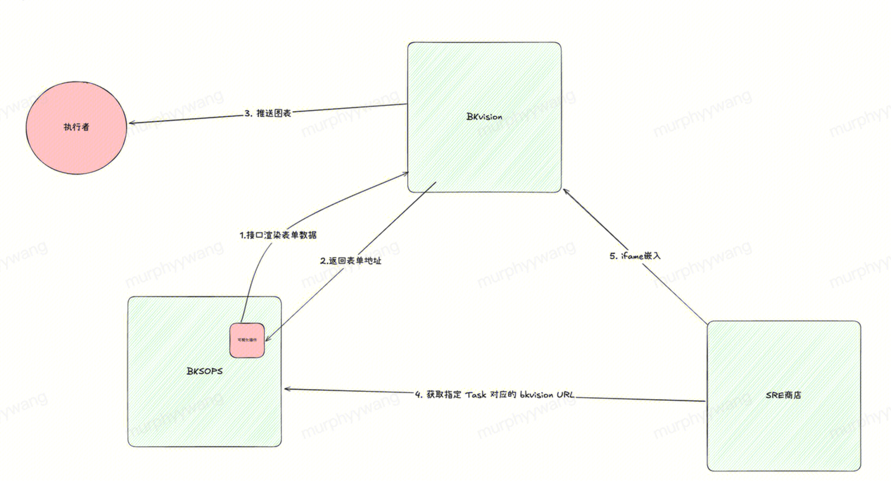

### 2.2 当前支持的图表类型
> 具体效果详见参考示例
1. 表格
2. 柱状图
3. 饼状图
4. 中国地图
5. 折线图
6. 堆叠柱状图

## 3. 使用场景
### 3.1. 标准运维执行数据可视化场景案例
#### 大版本CDN预热后，调用可视化插件，可视化 预热URL在全国各省份请求 URL 成功率
	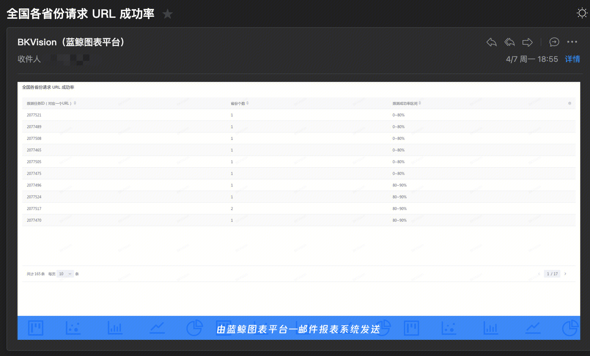
    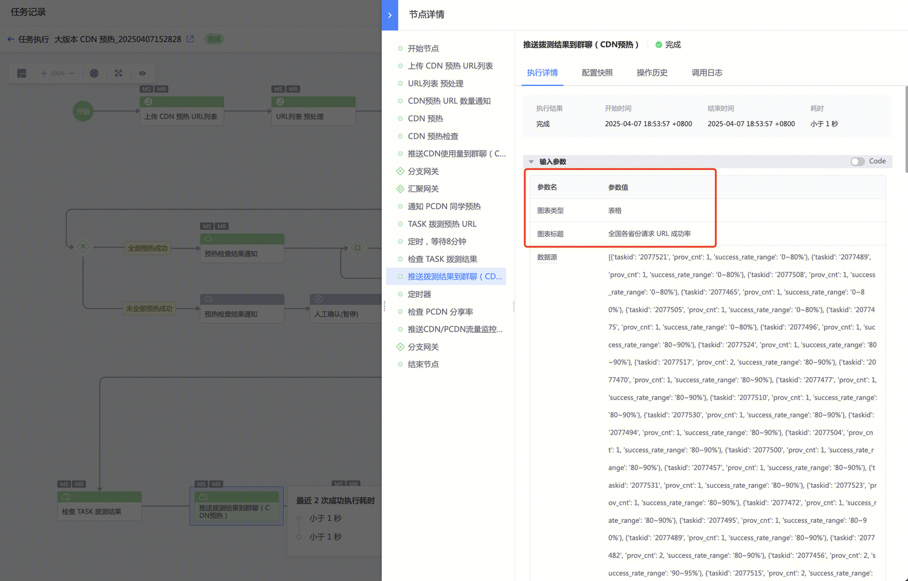
	
#### HTTP 移动端拨测结果可视化
	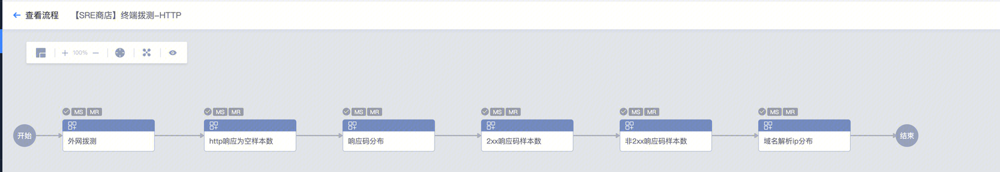
	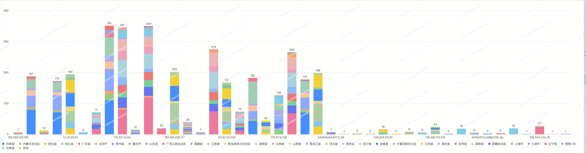

### 3.2 SaaS 嵌入
#### 安全工单处理预期达成率可视化
链接: [安全工单处理预期达成率](https://e.woa.com/tools/20)

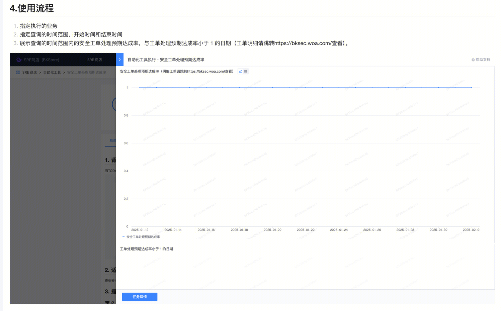


## 4. 使用方式
### 4.1 在标准运维插件中选择 可视化插件 
	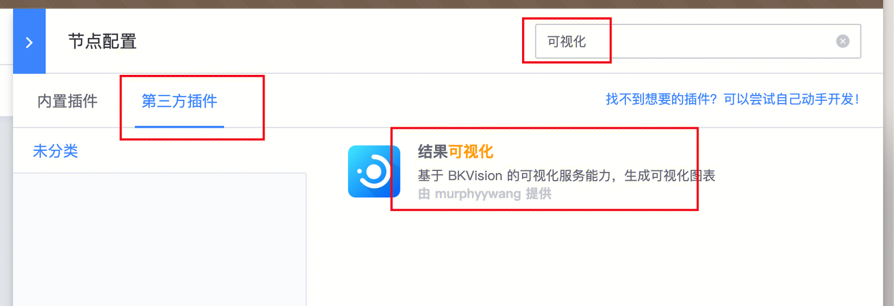
### 4.2 按照插件表单, 填充渲染的图表数据
	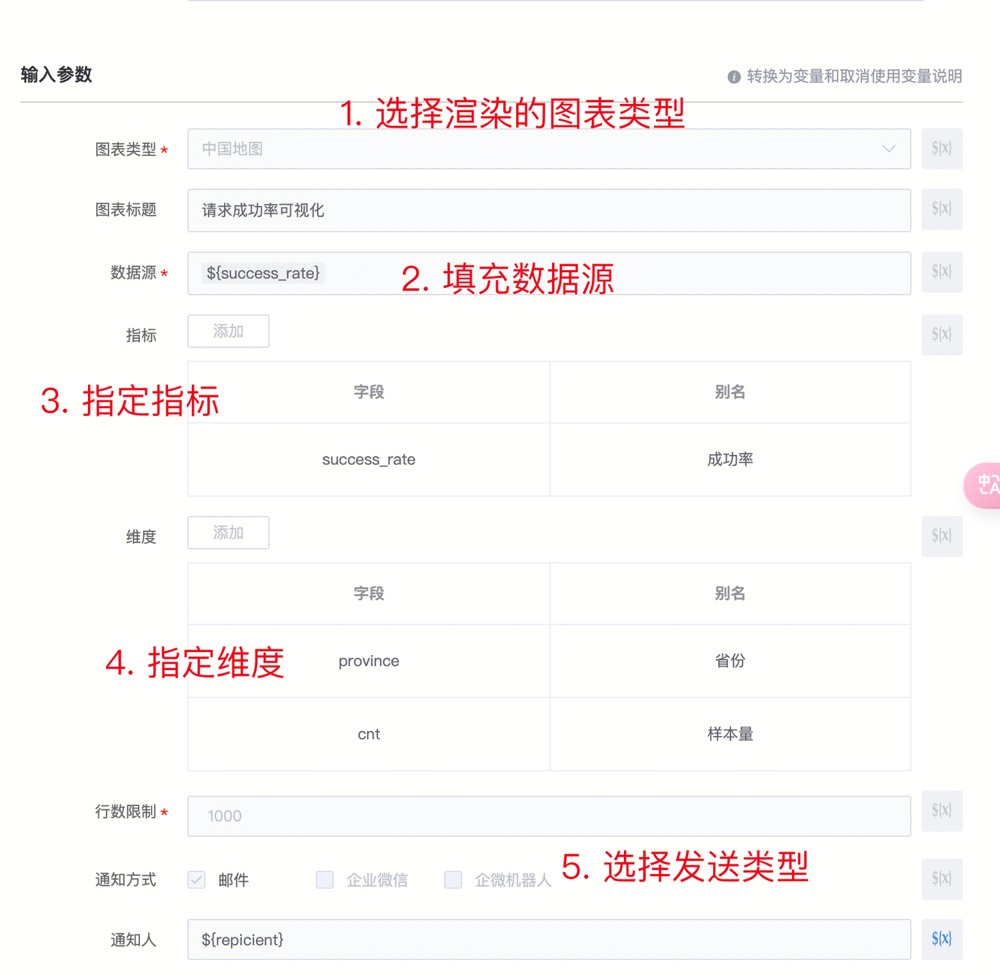
### 4.3 当前数据源支持的类型是:  json格式的字符串  , 具体的结构为 lis[dict[str, str]]
	
## 5. 参考示例
### 5.1 中国地图
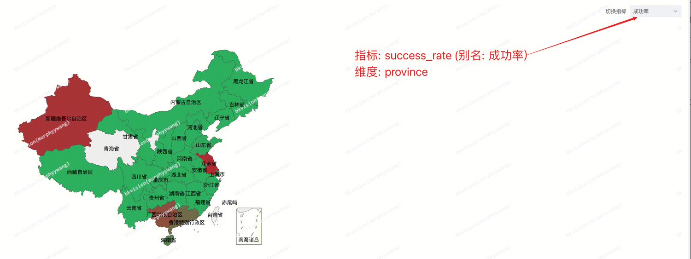
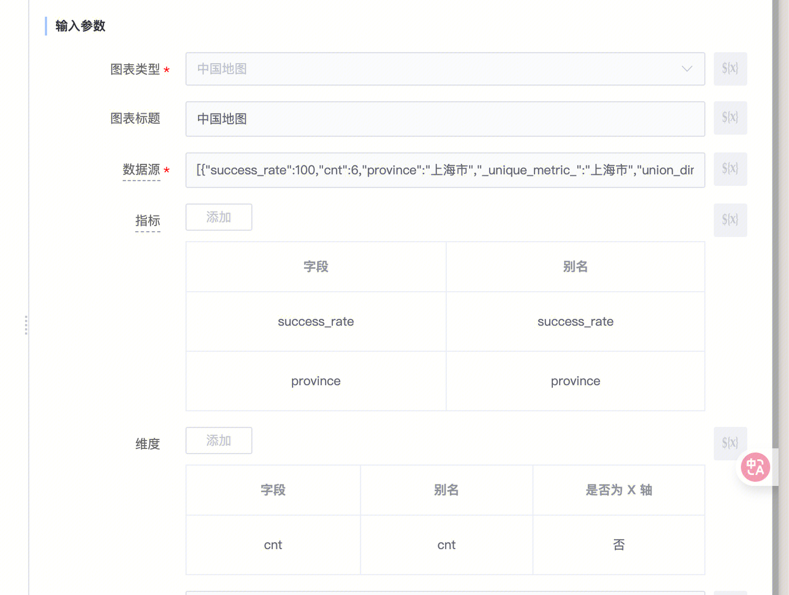
##### 数据源

```json
[{"success_rate":100,"cnt":6,"province":"上海市","_unique_metric_":"上海市","union_dim":"province"},{"success_rate":100,"cnt":12,"province":"云南省","_unique_metric_":"云南省","union_dim":"province"},{"success_rate":100,"cnt":4,"province":"内蒙古自治区","_unique_metric_":"内蒙古自治区","union_dim":"province"},{"success_rate":100,"cnt":6,"province":"北京市","_unique_metric_":"北京市","union_dim":"province"},{"success_rate":100,"cnt":6,"province":"吉林省","_unique_metric_":"吉林省","union_dim":"province"},{"success_rate":100,"cnt":14,"province":"四川省","_unique_metric_":"四川省","union_dim":"province"},{"success_rate":100,"cnt":6,"province":"天津市","_unique_metric_":"天津市","union_dim":"province"},{"success_rate":100,"cnt":18,"province":"安徽省","_unique_metric_":"安徽省","union_dim":"province"},{"success_rate":96.6667,"cnt":30,"province":"山东省","_unique_metric_":"山东省","union_dim":"province"},{"success_rate":100,"cnt":19,"province":"山西省","_unique_metric_":"山西省","union_dim":"province"},{"success_rate":50,"cnt":38,"province":"广东省","_unique_metric_":"广东省","union_dim":"province"},{"success_rate":30,"cnt":6,"province":"广西壮族自治区","_unique_metric_":"广西壮族自治区","union_dim":"province"},{"success_rate":10,"cnt":10,"province":"新疆维吾尔自治区","_unique_metric_":"新疆维吾尔自治区","union_dim":"province"},{"success_rate":5,"cnt":18,"province":"江苏省","_unique_metric_":"江苏省","union_dim":"province"},{"success_rate":100,"cnt":21,"province":"江西省","_unique_metric_":"江西省","union_dim":"province"},{"success_rate":100,"cnt":30,"province":"河北省","_unique_metric_":"河北省","union_dim":"province"},{"success_rate":100,"cnt":34,"province":"河南省","_unique_metric_":"河南省","union_dim":"province"},{"success_rate":100,"cnt":8,"province":"浙江省","_unique_metric_":"浙江省","union_dim":"province"},{"success_rate":66.6667,"cnt":3,"province":"海南省","_unique_metric_":"海南省","union_dim":"province"},{"success_rate":100,"cnt":20,"province":"湖北省","_unique_metric_":"湖北省","union_dim":"province"},{"success_rate":100,"cnt":32,"province":"湖南省","_unique_metric_":"湖南省","union_dim":"province"},{"success_rate":100,"cnt":4,"province":"甘肃省","_unique_metric_":"甘肃省","union_dim":"province"},{"success_rate":100,"cnt":15,"province":"福建省","_unique_metric_":"福建省","union_dim":"province"},{"success_rate":100,"cnt":1,"province":"西藏自治区","_unique_metric_":"西藏自治区","union_dim":"province"},{"success_rate":100,"cnt":9,"province":"贵州省","_unique_metric_":"贵州省","union_dim":"province"},{"success_rate":100,"cnt":4,"province":"辽宁省","_unique_metric_":"辽宁省","union_dim":"province"},{"success_rate":100,"cnt":11,"province":"重庆市","_unique_metric_":"重庆市","union_dim":"province"},{"success_rate":100,"cnt":13,"province":"陕西省","_unique_metric_":"陕西省","union_dim":"province"},{"success_rate":100,"cnt":3,"province":"黑龙江省","_unique_metric_":"黑龙江省","union_dim":"province"}]
```

### 5.2 表格

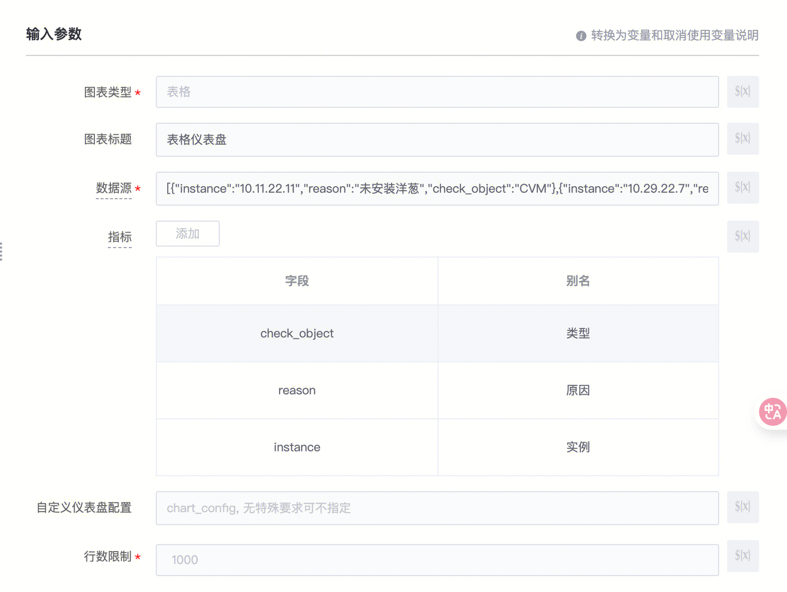
##### 数据源

```json
[{"instance":"10.11.22.11","reason":"未安装洋葱","check_object":"CVM"},{"instance":"10.29.22.7","reason":"带宽上限低于1Mbps","check_object":"CLB"},{"reson":"未绑定安全组","instance":"10.28.22.48","check_object":"CLB"},{"instance":"sg-qnaspveu","reason":"对外开放了22端口","check_object":"安全组"},{"instance":"10.11.22.11","reason":"未安装洋葱","check_object":"CVM"},{"instance":"10.29.22.7","reason":"带宽上限低于1Mbps","check_object":"CLB"},{"reson":"未绑定安全组","instance":"10.28.22.48","check_object":"CLB"},{"instance":"sg-qnaspveu","reason":"对外开放了22端口","check_object":"安全组"},{"instance":"10.11.22.11","reason":"未安装洋葱","check_object":"CVM"},{"instance":"10.29.22.7","reason":"带宽上限低于1Mbps","check_object":"CLB"},{"reson":"未绑定安全组","instance":"10.28.22.48","check_object":"CLB"},{"instance":"sg-qnaspveu","reason":"对外开放了22端口","check_object":"安全组"},{"instance":"10.11.22.11","reason":"未安装洋葱","check_object":"CVM"},{"instance":"10.29.22.7","reason":"带宽上限低于1Mbps","check_object":"CLB"},{"reson":"未绑定安全组","instance":"10.28.22.48","check_object":"CLB"},{"instance":"sg-qnaspveu","reason":"对外开放了22端口","check_object":"安全组"},{"instance":"10.11.22.11","reason":"未安装洋葱","check_object":"CVM"},{"instance":"10.29.22.7","reason":"带宽上限低于1Mbps","check_object":"CLB"},{"reson":"未绑定安全组","instance":"10.28.22.48","check_object":"CLB"},{"instance":"sg-qnaspveu","reason":"对外开放了22端口","check_object":"安全组"},{"instance":"10.11.22.11","reason":"未安装洋葱","check_object":"CVM"},{"instance":"10.29.22.7","reason":"带宽上限低于1Mbps","check_object":"CLB"},{"reson":"未绑定安全组","instance":"10.28.22.48","check_object":"CLB"},{"instance":"sg-qnaspveu","reason":"对外开放了22端口","check_object":"安全组"},{"instance":"10.11.22.11","reason":"未安装洋葱","check_object":"CVM"},{"instance":"10.29.22.7","reason":"带宽上限低于1Mbps","check_object":"CLB"},{"reson":"未绑定安全组","instance":"10.28.22.48","check_object":"CLB"},{"instance":"sg-qnaspveu","reason":"对外开放了22端口","check_object":"安全组"},{"instance":"10.11.22.11","reason":"未安装洋葱","check_object":"CVM"},{"instance":"10.29.22.7","reason":"带宽上限低于1Mbps","check_object":"CLB"},{"reson":"未绑定安全组","instance":"10.28.22.48","check_object":"CLB"},{"instance":"sg-qnaspveu","reason":"对外开放了22端口","check_object":"安全组"},{"instance":"10.11.22.11","reason":"未安装洋葱","check_object":"CVM"},{"instance":"10.29.22.7","reason":"带宽上限低于1Mbps","check_object":"CLB"},{"reson":"未绑定安全组","instance":"10.28.22.48","check_object":"CLB"},{"instance":"sg-qnaspveu","reason":"对外开放了22端口","check_object":"安全组"},{"instance":"10.11.22.11","reason":"未安装洋葱","check_object":"CVM"},{"instance":"10.29.22.7","reason":"带宽上限低于1Mbps","check_object":"CLB"},{"reson":"未绑定安全组","instance":"10.28.22.48","check_object":"CLB"},{"instance":"sg-qnaspveu","reason":"对外开放了22端口","check_object":"安全组"},{"instance":"10.11.22.11","reason":"未安装洋葱","check_object":"CVM"},{"instance":"10.29.22.7","reason":"带宽上限低于1Mbps","check_object":"CLB"},{"reson":"未绑定安全组","instance":"10.28.22.48","check_object":"CLB"},{"instance":"sg-qnaspveu","reason":"对外开放了22端口","check_object":"安全组"},{"instance":"10.11.22.11","reason":"未安装洋葱","check_object":"CVM"},{"instance":"10.29.22.7","reason":"带宽上限低于1Mbps","check_object":"CLB"},{"reson":"未绑定安全组","instance":"10.28.22.48","check_object":"CLB"},{"instance":"sg-qnaspveu","reason":"对外开放了22端口","check_object":"安全组"}]
``` 
### 5.3 饼图
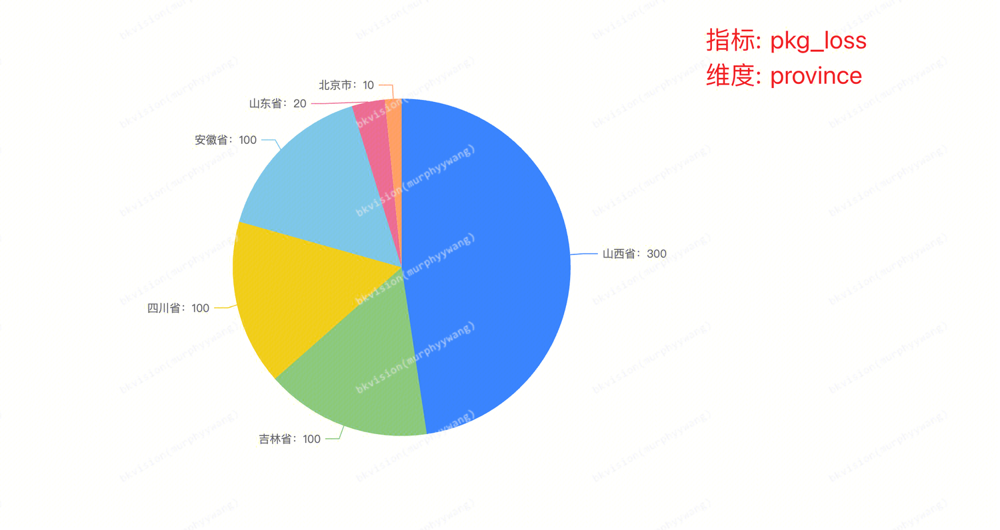
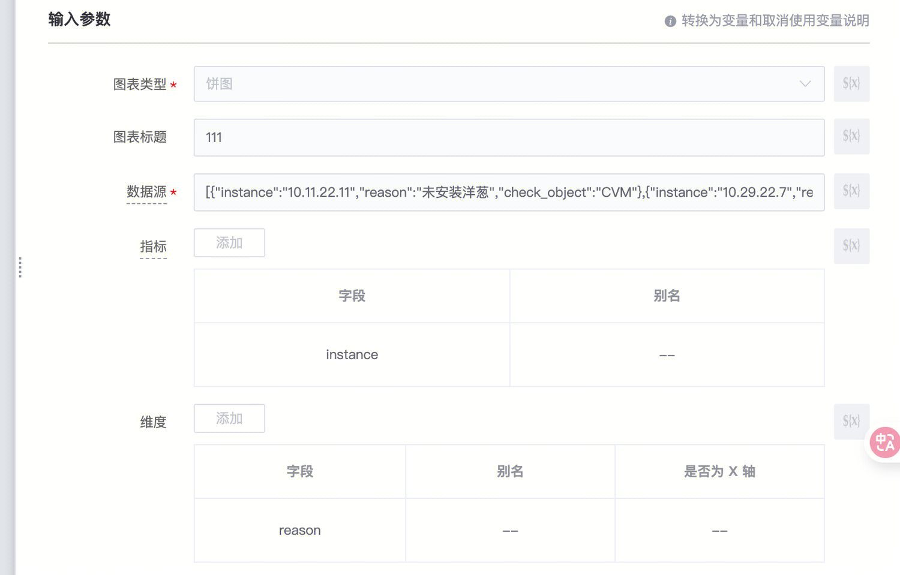
##### 数据源
```json
[{"province":"北京市","pkg_loss":10,"cnt":2,"time":"1736251129"},{"province":"吉林省","pkg_loss":100,"cnt":1,"time":"1736251130"},{"province":"四川省","pkg_loss":100,"cnt":2,"time":"1736251131"},{"province":"安徽省","pkg_loss":100,"cnt":1,"time":"1736251132"},{"province":"山东省","pkg_loss":20,"cnt":5,"time":"1736251133"},{"province":"山西省","pkg_loss":300,"cnt":4,"time":"1736251136"}]
```
### 5.4 柱状图
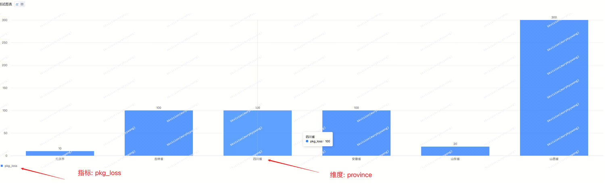
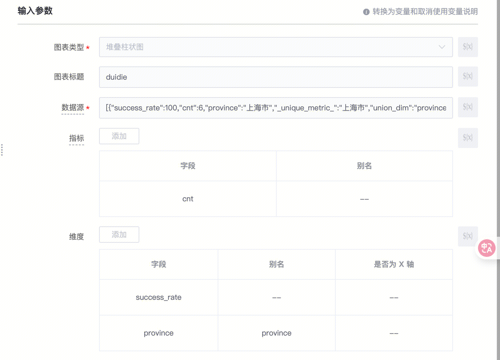
##### 数据源
```json
[{"province":"北京市","pkg_loss":10,"cnt":2,"time":"1736251129"},{"province":"吉林省","pkg_loss":100,"cnt":1,"time":"1736251130"},{"province":"四川省","pkg_loss":100,"cnt":2,"time":"1736251131"},{"province":"安徽省","pkg_loss":100,"cnt":1,"time":"1736251132"},{"province":"山东省","pkg_loss":20,"cnt":5,"time":"1736251133"},{"province":"山西省","pkg_loss":300,"cnt":4,"time":"1736251136"}]
```

## 6. 执行结果
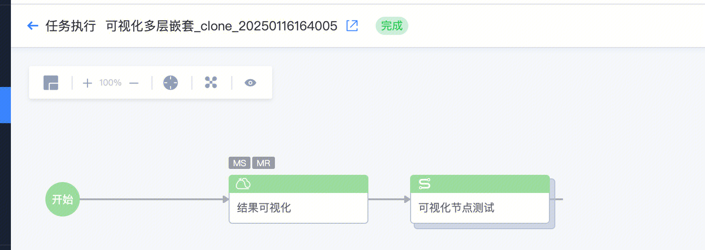
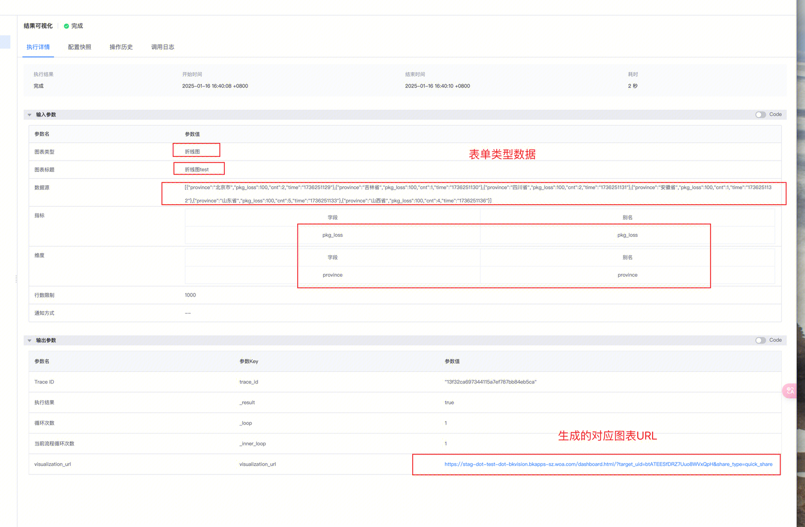

 
## 7. SRE 商店 具体可视化节点使用场景
### 7.1 自助化工具执行
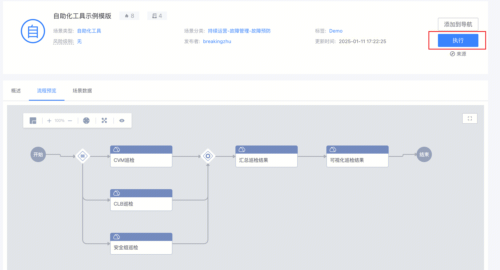

### 7.2 数据可视化展示
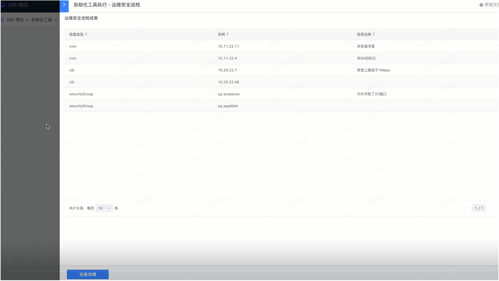


