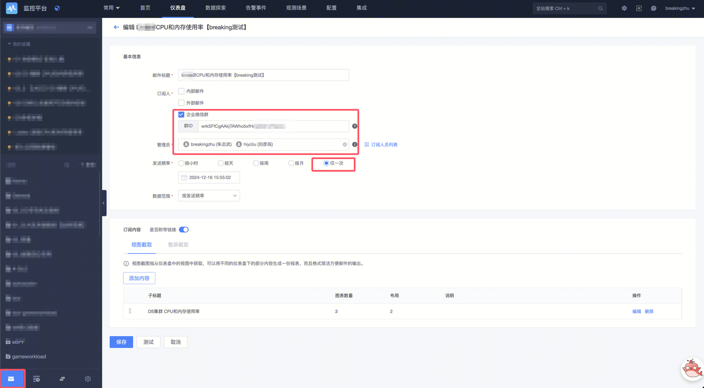
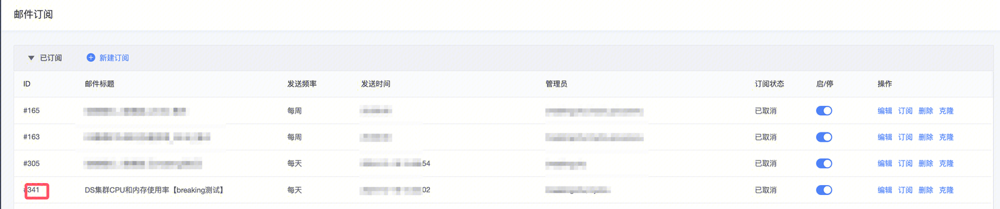
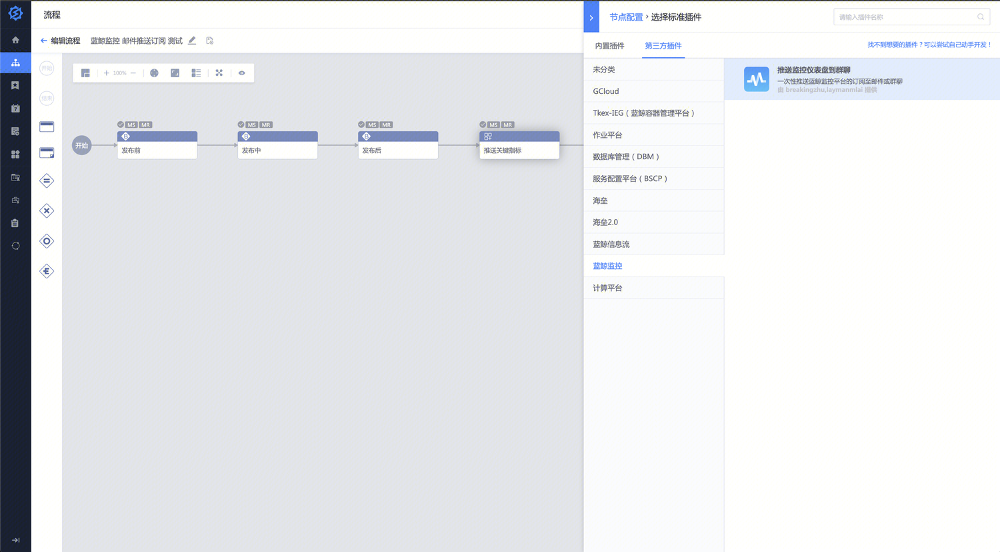
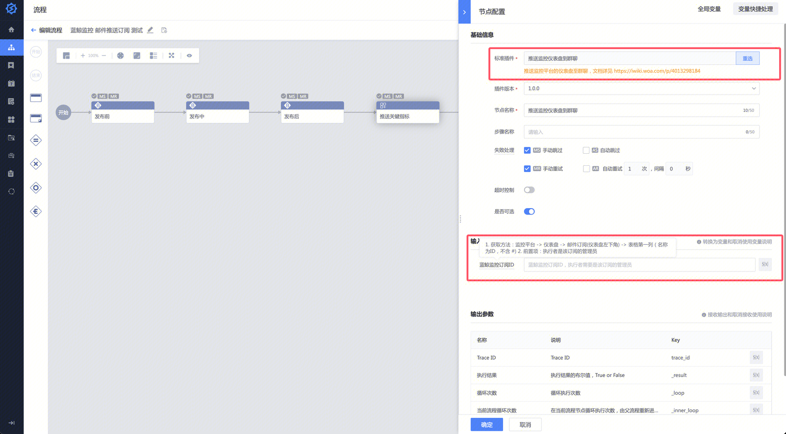
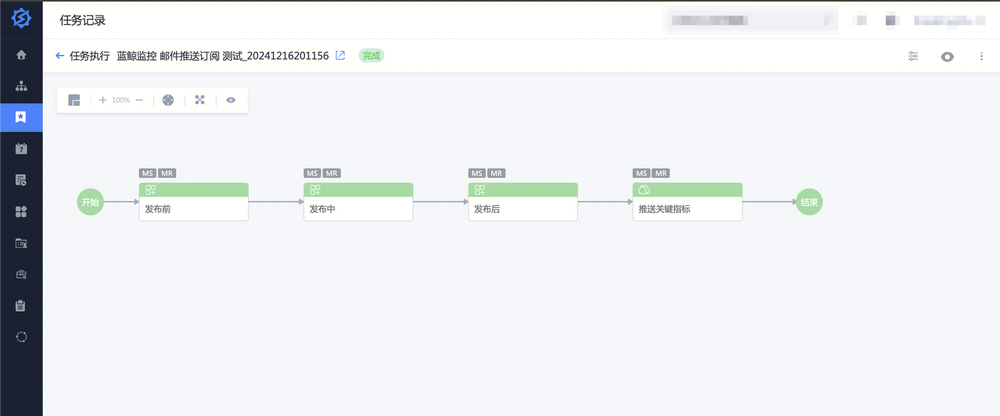
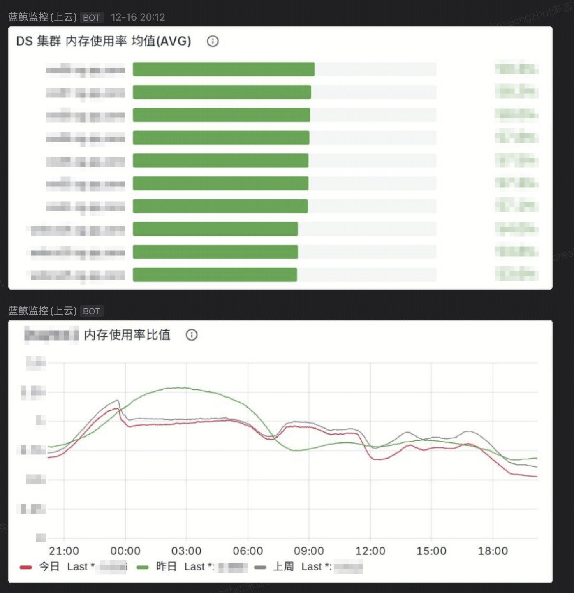
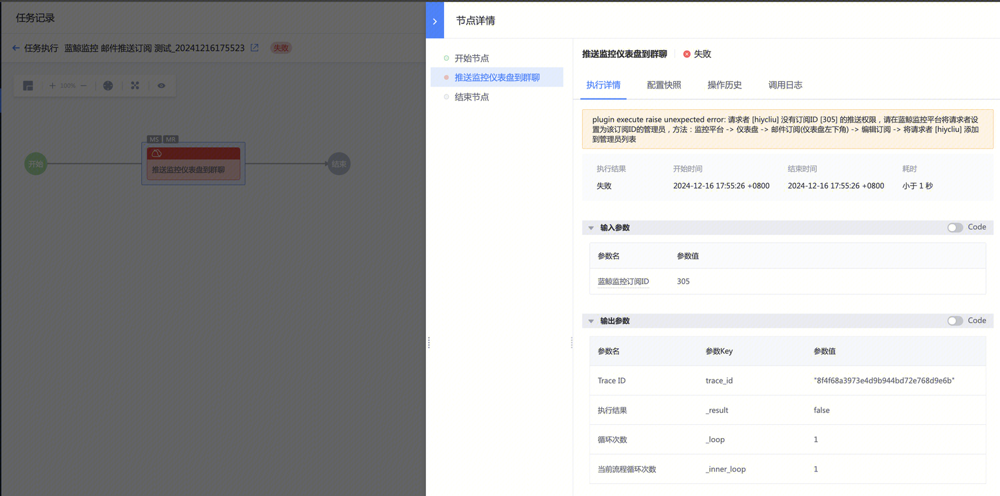

## 版本记录
| 日期 | 版本 | 修改描述 | 状态 |  作者 | 审核人 |
| ------ | ------ | ------ | ------ | ------ |------ |
| 2024-12-16 | V1.0 | 初稿 | 现行有效 |  breakingzhu | -- |

## 1. 背景
`版本发布、环境变更`时我们会检查监控指标是否符合预期，有时候期望能`跟随版本` 将关键指标推送到我们和甲方的群聊，`一起关注关键指标的数据`。

如果能在标准运维发布、变更流程中增加一个推送仪表盘到群聊的节点，那看起来可以满足需求。

## 2. 方案介绍
开发一个标准运维插件，将该插件 `编排` 到发布、变更流程中。

逻辑：调用蓝鲸监控的 [仪表盘订阅推送接口](https://bkapigw.woa.com/docs/apigw-api/bkmonitorv3/send_report_mail/doc?stage=prod)，将关键指标一次性推到群聊。

## 3. 操作步骤

### 3.1 前置项
完成仪表盘 [订阅配置](https://iwiki.woa.com/p/4012525731?from=iWiki_search)，其中把 `标准运维的执行者` 添加到 `订阅的管理员列表` 中。

拿到`订阅 ID`，例如 `341`

### 3.2 标准运维编排
在版本发布、环境变更的标准运维流程中添加节点 `推送监控仪表盘到群聊`

参数为 `蓝鲸监控订阅ID`，比如 `341`，获取方法详见上一个章节。

> 前置项：标准运维的执行者是该订阅的管理员

### 3.3. 执行测试
执行标准运维任务

跟随版本发布、环境变更，将指标推送到群聊。

## 4. FAQ
### 4.1 执行者没有订阅ID的推送权限
参照 `3.1 章节` 配置即可。

