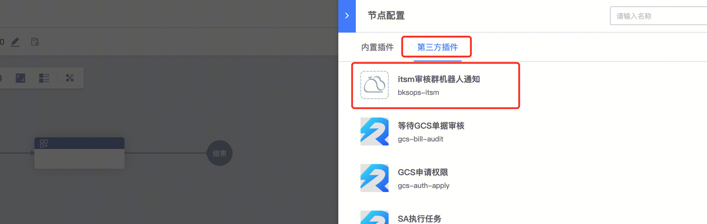
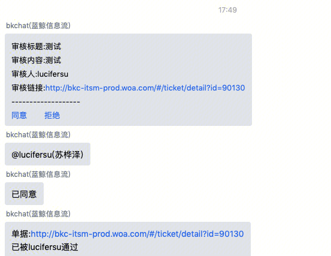

因内嵌的itsm审核节点，只会发送消息通知，但运维的某些场景可能需要在某个群中进行只会并发送对应的消息内容，并进行快速的审批，因此加入了群chatid及需要@的人和快速审批的功能

如有使用异常，请联系: lucifersu

使用方式：

在第三方插件中找到itsm审核群机器人通知（填入对应的信息即可），tips:务必将 bkchat(蓝鲸信息流) 加入群中

企业微信机器人通知的内容统一为：

审核标题:xxx

审核内容:xxx

审核人:xxx

单据链接:xxx

@的人

消息样例：

点击后同意或拒绝后，会在群里给出对应的操作人及执行结果