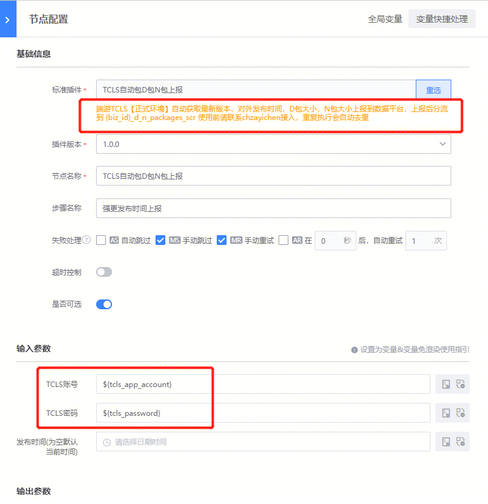
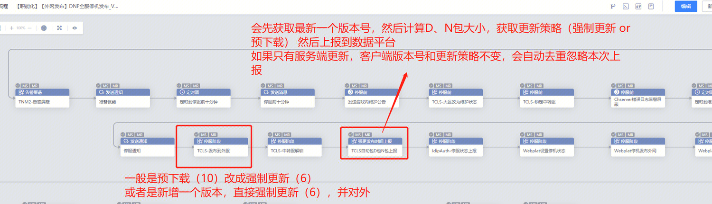
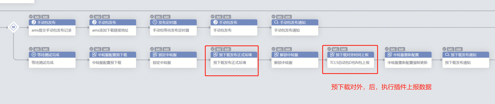
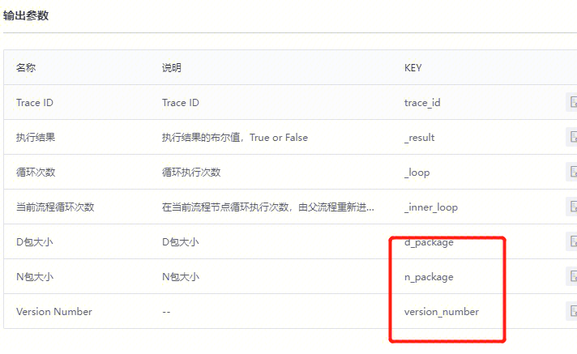
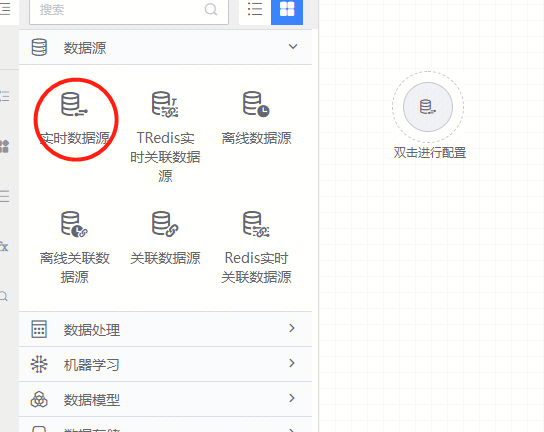
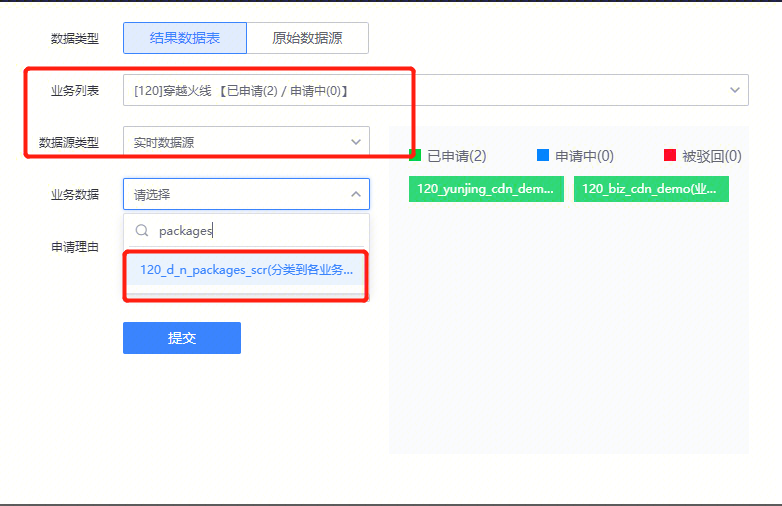

插件名称：TCLS自动包D包N包上报  

**使用场景：**

1、停机对外更新后，再选用插件上报

2、发了预下载后，上报预下载对外开发数据到数据平台

**插件返回值：D包大小，N包大小，最新版本号**

**Q&A：**

**问：**如果没有客户端版本更新，能重复执行吗？

**答：**能，会判断数据上报过，重复执行则不会重复上报

**问：**如何使用结果数据？

**答：**目前仅支持DNF、CF业务，如其他业务需要使用，请联系chzayichen把源数据分流到各个业务下即可

在数据平台上拖一个实时数据源，然后申请全选，选自己的业务，申请：{biz_id}_d_n_packages_scr  即可使用  

  
  

如有其他疑问请联系chzayichen

