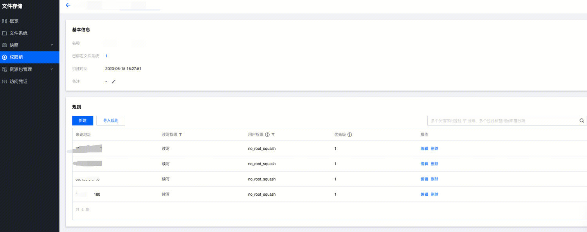
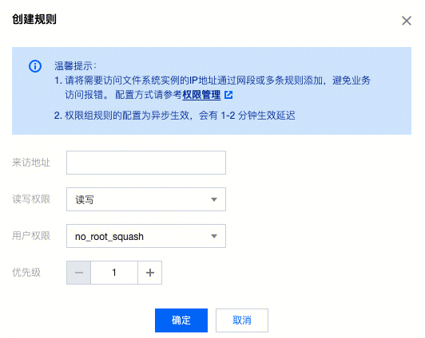
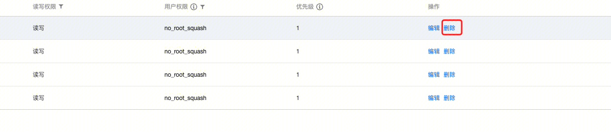
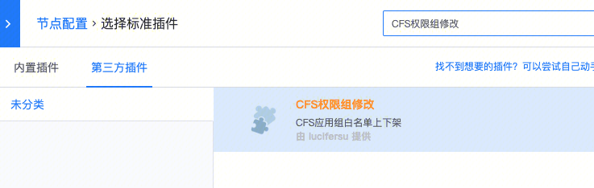
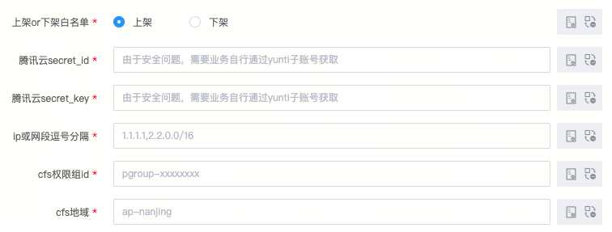
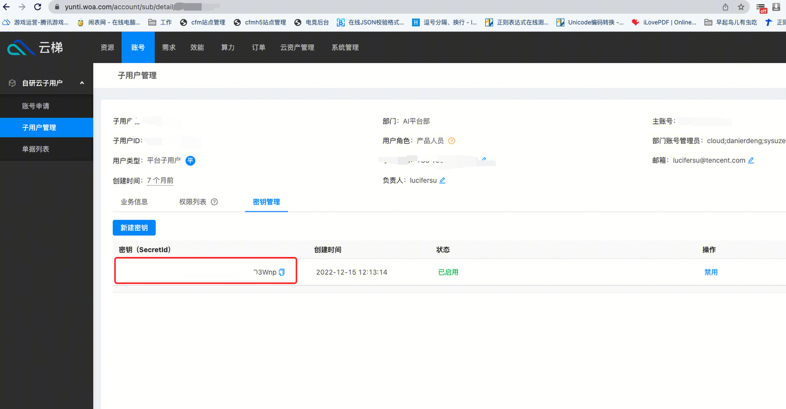
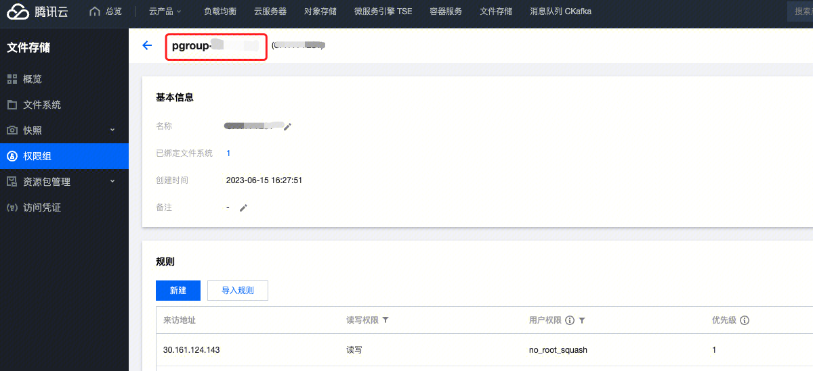

## 前言

  该功能主要是为了方便业务在初始化的过程中，能够在挂载CFS前提前加入ip/子网白名单（由于安全原因，所有的CFS必须要挂一个权限组）。

  特别在BCS平台进行弹性伸缩CA过程中，子网不确定的情况，需要手动将node主机加入对应的白名单中（只适合pod没有独立ip的情况），目前是没有相关工具处理该内容的。

  重要提示：由于腾讯云规则变更限制，不能添加/删除完一条马上继续操作，会有一个变更状态，目前没有相关接口确认状态，所以插件统一会在操作每一个ip/网段时再等待20秒，会出现多个ip很慢的情况是正常情况。

  如使用上有任何问题，请联系开发者lucifersu

## 功能介绍

  主要支持CFS（文件存储）的权限组的规则ip/子网的添加及下架。（场景界面如下）

  默认添加的权限读写权限，用户等级为 no_root_squash，优先级为1。（因为大部分业务没有特殊场景，因此相关参数没有开放，后续相关业务有需求请联系lucifersu）

###   功能一：新增规则

###   功能二：删除规则

## 使用方式

  打开标准运维，在第三方插件“未分类”中搜索“CFS权限组修改”

  

###   参数详解

  腾讯云secret_id及secret_key因为安全问题，插件不提供相关密钥信息，所以请使用方自行申请填入。

  获取密钥方式在云梯子账号里，链接：[https://yunti.woa.com/account/sub/](https://yunti.woa.com/account/sub/)

  所需子账户权限清单：

|   |   |
| - | - |
| 权限名称 | 用途 |
| cfs:CreateCfsRule | 创建权限组规则 |
| cfs:DeleteCfsRule | 删除权限组规则 |

  具体密钥所在位置：  

  

  ip及网段：如果是BCS的容器的node节点下面的pod使用，正常直接使用node ip即可，不需要pod ip添加规则，也支持网段的方式加入。（注意是逗号分隔）

  权限组id：是一串以pgroup-开头的内容，具体位置在下图所示位置

  地域：是一串ap-开头的内容，例如ap-nanjing，ap-shanghai等