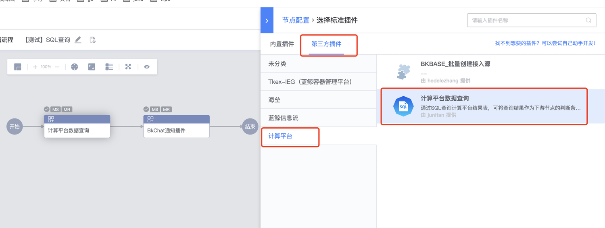
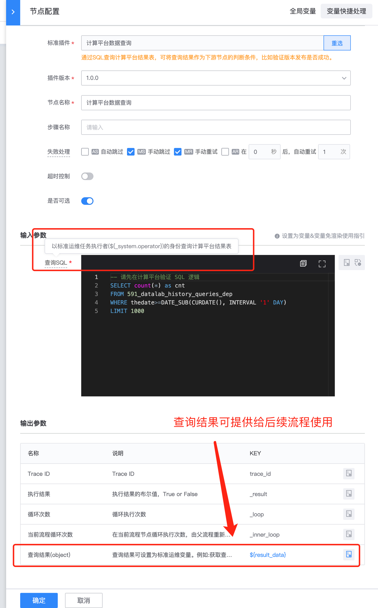
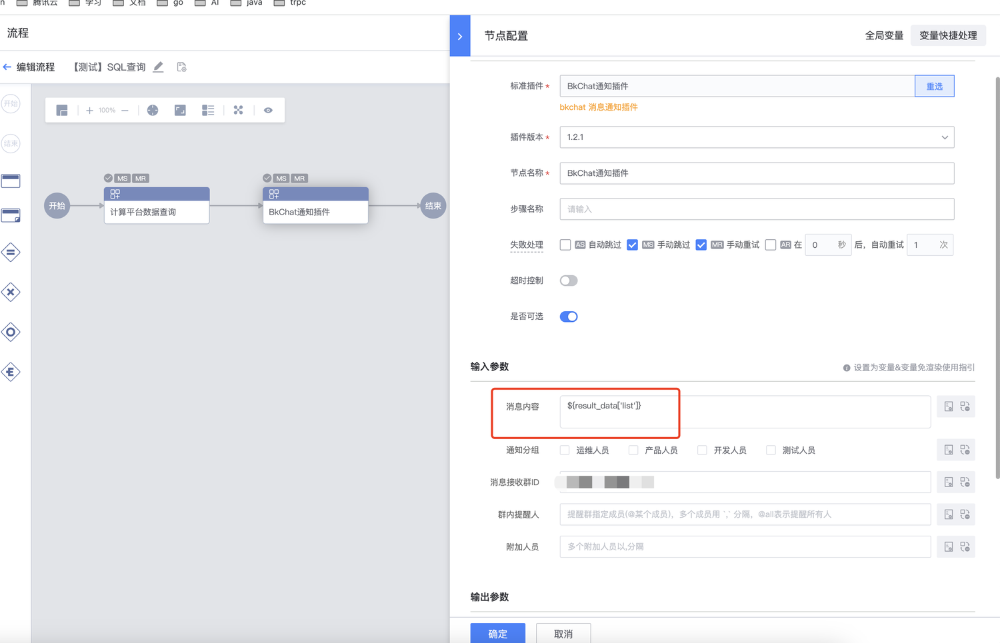
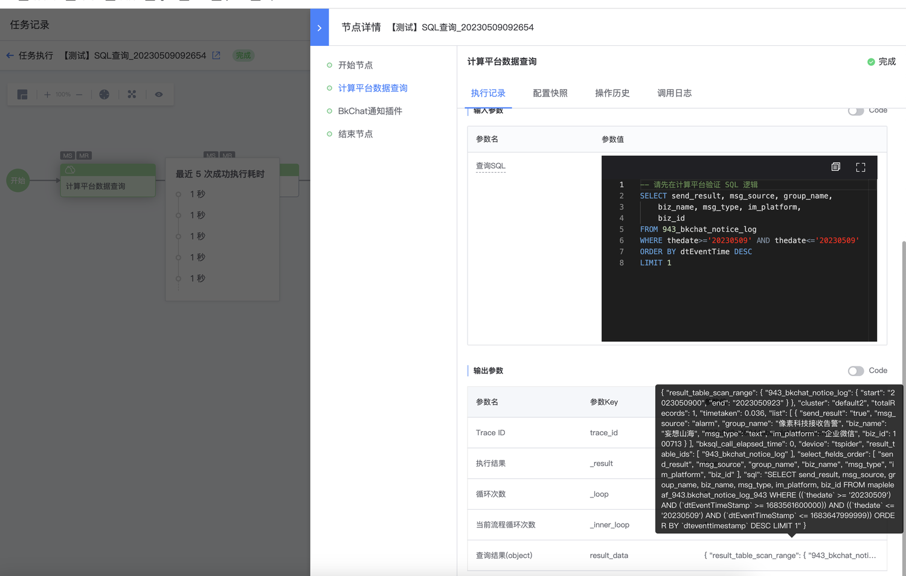
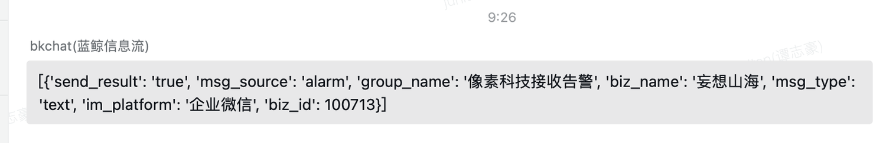

# 计算平台查询插件

[toc]

* 在标准运维流程中查询计算平台数据,提供给后续节点使用。

## 插件选择

* 选择计算平台查询节点

## 参数填写

* 选择参加后参数填写

`注意:`执行查询SQL用的`流程执行者`的权限,如果执行者没权限移步到计算平台申请<http://bkbase.woa.com/#/auth-center/permissions?objType=biz&page=1>

## 流程实践

* 查询数据并且通过bkchat服务号通知

* 执行结果

* 实际表现

