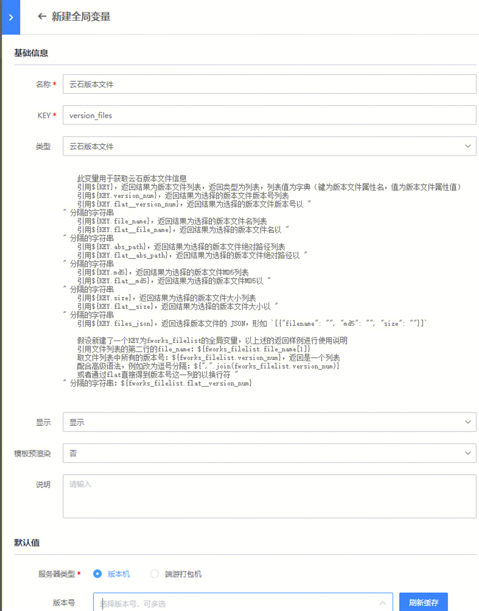
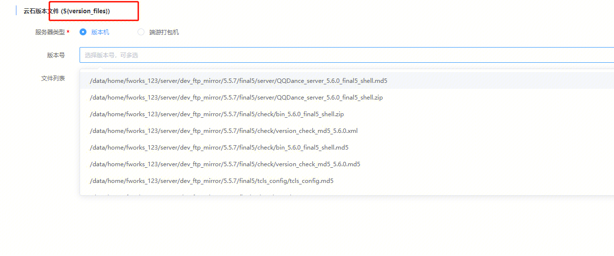

云石相应的插件较多，用法复杂。故用本文积累沉淀参数的输入输出信息说明，便于用户根据自己的情况，正确填参使用。

补充说明：

云石原子的，所有涉及ip选择的地方（例如根据set、model过滤ip），均可以使用全局变量-ip选择器-动态选择进行。

标准运维模版中，全局变量需要增加“云石版本文件”，KEY为 version_files

## 关于 V1 原打包场景的场景变量说明

- 打包起始时间{task_start_time}：在全局变量中新建一个【日期时间】类型的变量使用
- 打包结束时间{task_end_time}：在全局变量中新建一个【日期时间】类型的变量使用
- 版本号{version_number}：在全局变量中新建一个【输入框】类型的变量使用
- 旧版本号{old_version_number}：在全局变量中新建一个【输入框】类型的变量使用
- 旧版本路径{old_dir}：在全局变量中新建一个【输入框】类型的变量使用
- 新版本路径{new_dir}：在全局变量中新建一个【输入框】类型的变量使用
- 版本结果文件{version_file_name}：由云石(Client)-自动包执行打包，云石(Client)-打包结果签名的输出变量【version_file_name】提供，勾选为全局变量即可使用
- 版本结果文件大小{version_file_size}：由云石(Client)-自动包执行打包，云石(Client)-打包结果签名的输出变量【version_file_size】提供，勾选为全局变量即可使用
- 版本结果MD5{version_file_md5}：由云石(Client)-自动包执行打包，云石(Client)-打包结果签名的输出变量【version_file_md5】提供，勾选为全局变量即可使用
- 版本结果文件下载地址{version_file_url}：由云石(Client)-自动包执行打包，云石(Client)-打包结果签名的输出变量【version_file_url】提供，勾选为全局变量即可使用
- CDN测试环境下载地址{sync_apache_url}：由云石(Client)-同步 CDN 测试环境，云石(Client)-打包结果签名的输出变量【sync_apache_url】提供，勾选为全局变量即可使用
- CDN正式环境下载地址{sync_cdn_url}：由云石(Client)-同步 CDN ，云石(Client)-打包结果签名的输出变量【sync_cdn_url】提供，勾选为全局变量即可使用

## 云石(Server)-FTP分发服务端版本文件
- 【全局变量】中有【云石版本文件】version_files，则可以使用如下变量，从而在执行任务时，动态选择云石版本文件列表
- 版本文件列表：手动输入，或者引用类型为【云石版本文件】的变量，值为 `${version_files.flat__abs_path}`

## 云石(Client)-下载器信息对外

无

## 云石(Client)-分发客户端版本文件
- 【全局变量】中有【云石版本文件】version_files，则可以使用如下变量，从而在执行任务时，动态选择云石版本文件列表
- 版本文件：手动输入，或者引用类型为【云石版本文件】的变量，值为 `${version_files.flat__abs_path}`

## 云石(Client)-同步 CDN

- 文件列表：文件绝对路径对象列表的 JSON 格式：`[{"filename": "D:////file_version.list"}]`，可直接引用以下变量：
  - 云石(Client)-打包结果签名插件输出的 `签名结果文件名(output_file_list)` 变量
  - 云石(Client)-自动包执行打包插件输出的 `同步CDN文件列表(cdn_file_list)` 变量
  - 云石(Client)-完整包/手动包打包输出的 `同步CDN文件列表(cdn_file_list)` 变量

输出：
- cdn 路径：云石返回的 CDN 路径列表，e.g. `down-update.qq.com/warthunder/autopatch/tyf/tcls/0.0.6.7-0.0.6.8/`
- 同步文件列表：同步文件名的数组 JSON 字符串，e.g. `["BackWarning.txt","f4e083b6e17857b34bced3a0037acfa8_version.list","size.txt","T_V0.0.6.7-0.0.6.8_1015193015_0N.exe","ZipWarning.txt"]`

## 云石(Client)-同步 CDN 测试环境

- 文件列表：文件绝对路径对象列表的 JSON 格式：`[{"filename": "D:////file_version.list"}]`，可直接引用以下变量：
  - 云石(Client)-打包结果签名插件输出的 `签名结果文件名(output_file_list)` 变量
  - 云石(Client)-自动包执行打包插件输出的 `同步CDN文件列表(cdn_file_list)` 变量
  - 云石(Client)-完整包/手动包打包输出的 `同步CDN文件列表(cdn_file_list)` 变量

输出：
- CDN正式环境下载地址，文件同步到 cdn 后的下载地址，多个由 `;` 分隔

## 云石(Client)-安全加壳

- 版本文件：文件的绝对路径，手动输入，或者引用类型为【云石版本文件】的变量，值为 `${version_files.flat__abs_path}`

## 云石(Client)-完整包/手动包打包

输出：
- 打包类型：选择的打包类型，full，patch，media，hand_back
- 版本号：输入的版本号
- 版本展示文件列表：打包接口返回的 `output_filelist` 文件对象列表 JSON，形如 `[{"filename": "", "md5": "", "size": ""}]`，其中 `filename` 为文件名，e.g. `[{"filename":"DJ2_4.3.0.900-4.3.0.920_V3.exe","md5":"5c8dffdd103d894b1069811ac4380be4","size":1201441}]`
- 同步CDN文件列表：打包接口返回的 `output_filelist` 文件对象列表 JSON，形如 `[{"filename": "", "md5": "", "size": ""}]`，其中 `filename` 为文件绝对路径，e.g. `[{"filename":"D:\\home\\make_client\\setup\\dj2_op_ftp\\package\\T\\patch\\4.3.0.900-4.3.0.920\\DJ2_4.3.0.900-4.3.0.920_V3.exe","md5":"5c8dffdd103d894b1069811ac4380be4","size":1201441}]`

## 云石(Client)-完整性校验

输出：
- 完整性校验输出文件列表：完整性校验接口返回的文件列表 JSON，形如 `["file1", "file2"]`

## 云石(Client)-打包准备

无

## 云石(Client)-打包结果签名

- 打包文件：文件对象列表 JSON，形如 `[{"filename": "", "md5": "", "size": ""}]`，其中 `filename` 为文件绝对路，可以使用版本文件变量 `${client_list.files_json}`

输出：
- 打包类型：选择的打包类型
- 版本号：输入的版本号
- 签名版本号：输入的签名版本号
- 签名结果文件：打包接口返回的 `output_filelist` 文件对象列表 JSON，形如 `[{"filename": "", "md5": "", "size": ""}]`，其中 `filename` 为文件绝对路径，e.g. `[{"filename":"D:\\home\\make_client\\setup\\dj2_op_ftp\\package\\T\\patch\\4.3.0.900-4.3.0.920\\sign\\20201013161532\\DJ2_4.3.0.900-4.3.0.920_V3.exe","md5":"1b1162906fcb6b8f00e1b0e82a496cea","size":1216376}]`

## 云石(Client)-检测可执行文件是否加壳

无

## 云石(Client)-自动包执行打包

输出：
- 打包类型：选择的打包类型
- 版本号：输入的版本号
- 版本展示文件列表：打包接口返回的 `output_filelist` 文件对象列表 JSON，形如 `[{"filename": "", "md5": "", "size": ""}]`，其中 `filename` 为文件名，e.g. `[{"filename":"245450912d11a703081dc3183ecd7af2_version.list","md5":"245450912d11a703081dc3183ecd7af2","size":424},{"filename":"BackWarning.txt","md5":"f2110968ba7325ca0c248472e7bde026","size":59},{"filename":"size.txt","md5":"dd10377de755db8b1fdad16989e90e01","size":25},{"filename":"T_V0.0.6.7-0.0.6.8_1015193015_0N.exe","md5":"4492e5318daee6d3598db630638884f8","size":1242774},{"filename":"ZipWarning.txt","md5":"d41d8cd98f00b204e9800998ecf8427e","size":0}]`
- 同步CDN文件列表：打包接口返回的 `output_filelist` 文件对象列表 JSON，形如 `[{"filename": "", "md5": "", "size": ""}]`，其中 `filename` 为文件绝对路径，e.g. `[{"filename":"E:\\home\\make_client\\setup\\WT\\package\\T\\auto\\0.0.6.7-0.0.6.8\\245450912d11a703081dc3183ecd7af2_version.list","md5":"245450912d11a703081dc3183ecd7af2","size":424},{"filename":"E:\\home\\make_client\\setup\\WT\\package\\T\\auto\\0.0.6.7-0.0.6.8\\BackWarning.txt","md5":"f2110968ba7325ca0c248472e7bde026","size":59},{"filename":"E:\\home\\make_client\\setup\\WT\\package\\T\\auto\\0.0.6.7-0.0.6.8\\size.txt","md5":"dd10377de755db8b1fdad16989e90e01","size":25},{"filename":"E:\\home\\make_client\\setup\\WT\\package\\T\\auto\\0.0.6.7-0.0.6.8\\T_V0.0.6.7-0.0.6.8_1015193015_0N.exe","md5":"4492e5318daee6d3598db630638884f8","size":1242774},{"filename":"E:\\home\\make_client\\setup\\WT\\package\\T\\auto\\0.0.6.7-0.0.6.8\\ZipWarning.txt","md5":"d41d8cd98f00b204e9800998ecf8427e","size":0}]`  
  
