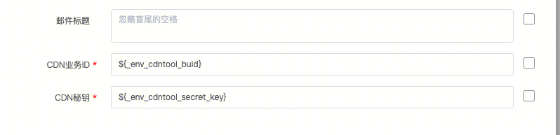
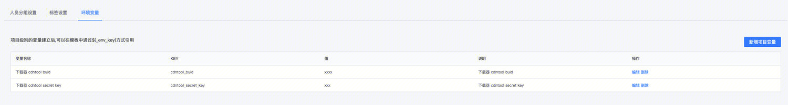
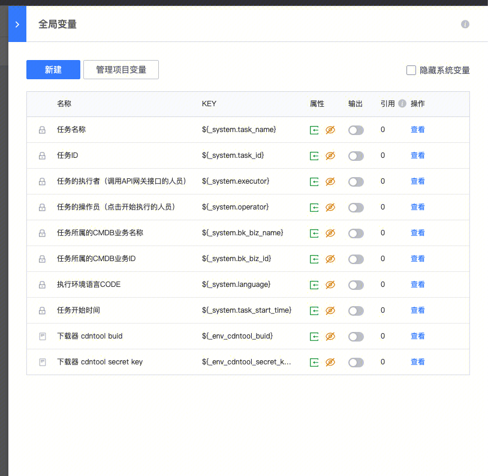
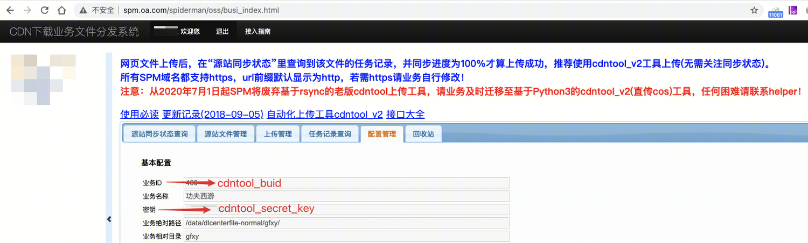

通过“IEG特权下载器制作(IEDVIP)-下载器制作”插件，可以调用下载管理app的制作下载器接口，进行端游下载器的制作。并且提供了将下载器exe程序，上传业务cdn源站的功能。

因为涉及cdn源站上传工具cdntools的变更，相应功能需要进行调整。

### 变动背景

标准运维-下载器制作插件的“下载器上传CDN”的功能，使用了[spm.oa.com](http://spm.oa.com)提供的cdntool功能，使用了当年“IEG-天天爱打包”的spm的公共账号密码，将制作好的下载器exe文件，rsync到cdn源站机器上。  
如今收到spm要求：  
1、需要将cdntool升级到cdntool_v2,老版本上传工具不兼容cdn的cos源站的上传方式，cdntools 近期将会下线。  
2、不允许在使用“IEG-天天爱打包”的spm的公共账号密码，各个业务要使用自己的cdn账号密码，进行cdntools的调用。

### 标准运维变更内容

针对spm的要求，标准运维进行了如下的变更。

1、在后台服务器上，升级了cdntool到cdntool_v2版本，并且测试成功，能够将文件上传至业务cdn上，可以再spm.oa.com上查看到新上传文件

2、IEG特权下载器制作(IEDVIP)-下载器制作插件上，新增配置字段（cdn业务ID、和CDN密钥），供业务进行独立账号和密码的配置。如下图所示。并且标准运维已配置了默认值。

3、该默认值意味着从业务的全局变量中，获取cdntool_buid和cdntool_secret_key的值进行填充。

（1）对于当前已经存在的现有流程来说，cdn账号buid和密码，标准运维已经单独跟spm同事获取，会自动在系统后台进行更新。正常情况下，对应流程无需再配置账号密码，系统后台也可以自动填充，运维无须变动。

（2）针对新创建的流程、新业务、或者修改了“cdn账号buid和密码”的情况来说，需要自行进行这两个值的设置。

所以，建议所有需要使用该插件的业务均进行配置，以便后续正常使用该功能。

设置方法：进入项目管理-xx业务-项目编辑权限，添加这两个全局变量，如下图：

添加后，全局变量框中，便能够获取到这两个值。

### spm.oa.com上获取“cdn账号buid和密码”的方法

登录spm.oa.com，进入配置管理的页面，业务ID和密钥即对应着cdntool_buid和cdntool_secret_key

### cdn支持

下载器只支持稳定池（down.qq.com）和发布池（update-down.qq.com）的cdn池。其他域名下载器不支持。

