# 流程分析数据依赖关系图

## 一、概述

本文档使用Mermaid图表展示流程分析的数据流向、数据表关系和分析维度依赖关系，帮助理解整个分析系统的架构和数据流转过程。

---

## 二、数据表关系图

### 2.1 核心数据表关系

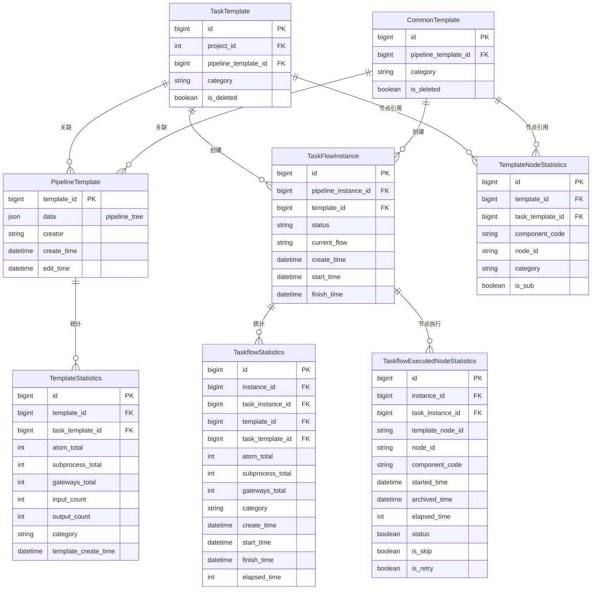

---

## 三、数据流向图

### 3.1 流程结构分析数据流

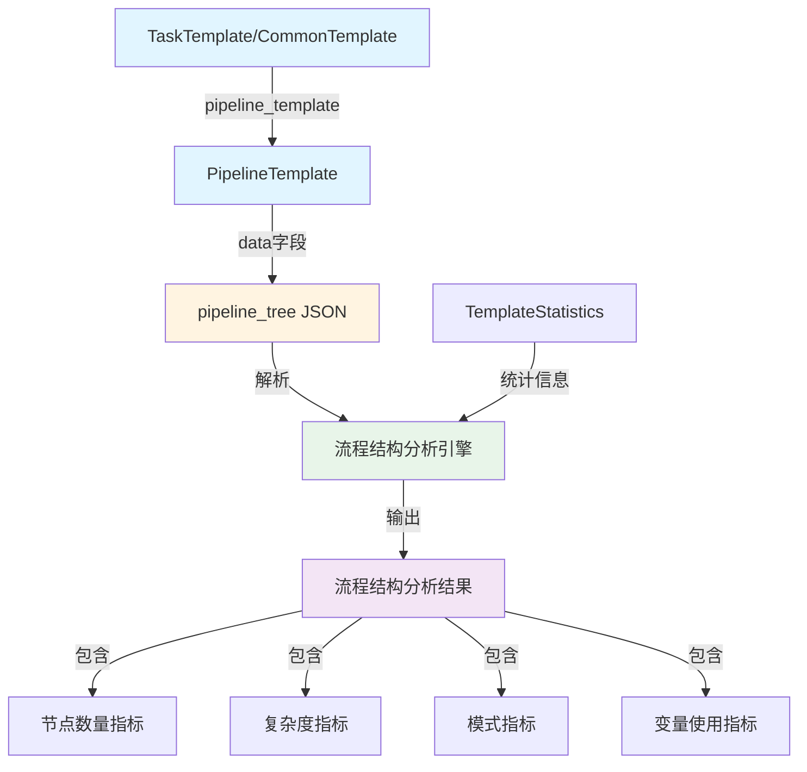

### 3.2 流程执行分析数据流

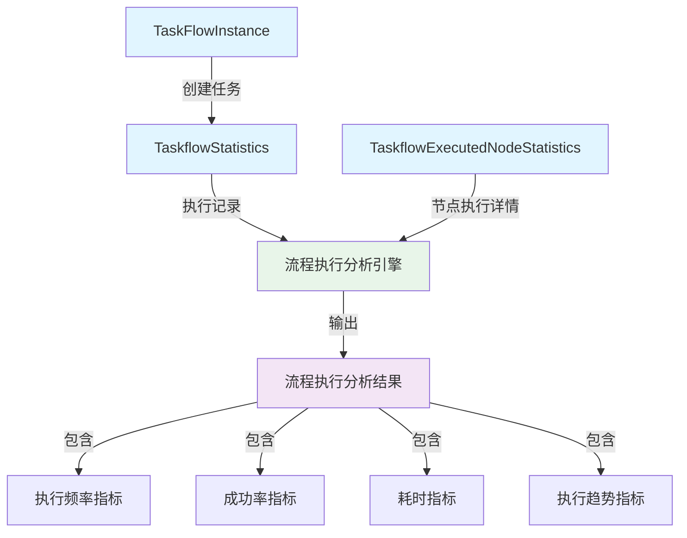

### 3.3 节点使用分析数据流

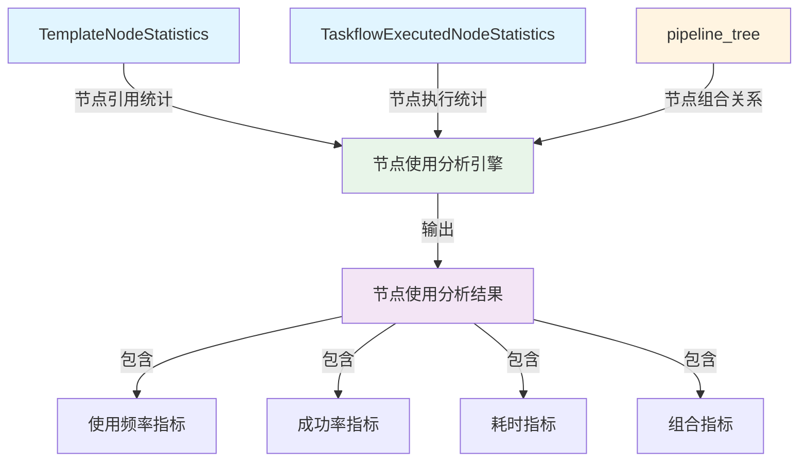

### 3.4 业务场景分析数据流

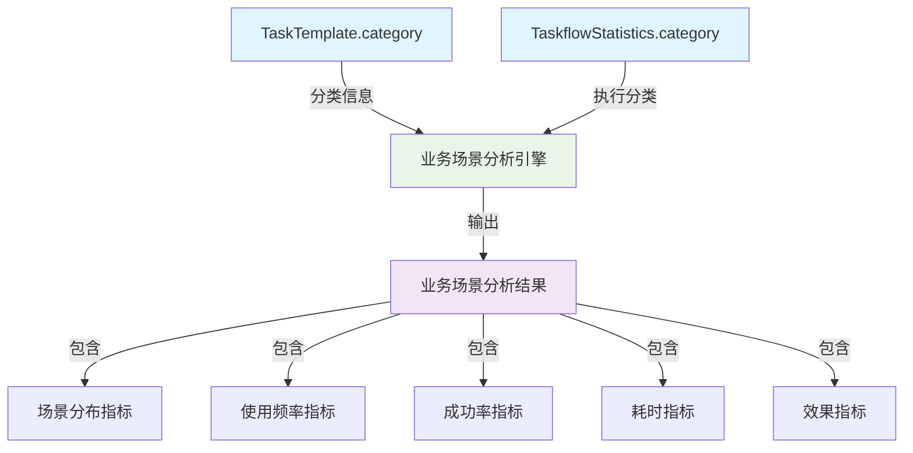

### 3.5 质量分析数据流

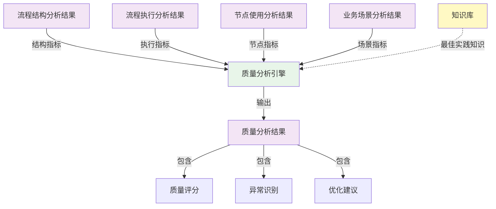

---

## 四、分析维度依赖关系图

### 4.1 基础分析依赖关系

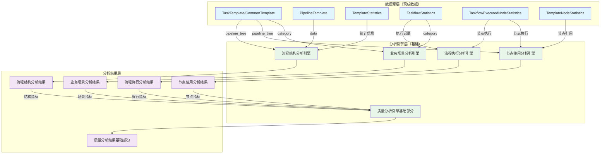

### 4.2 高级分析依赖关系

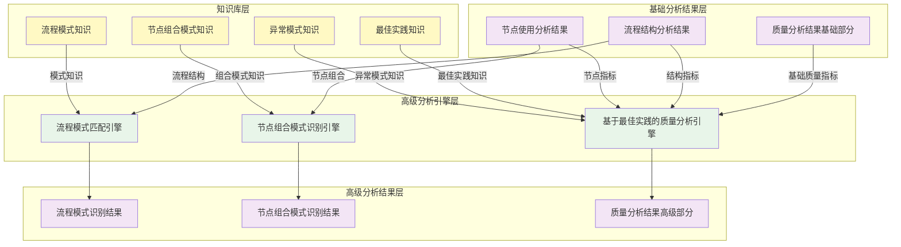

---

## 五、完整数据流架构图

### 5.1 整体架构

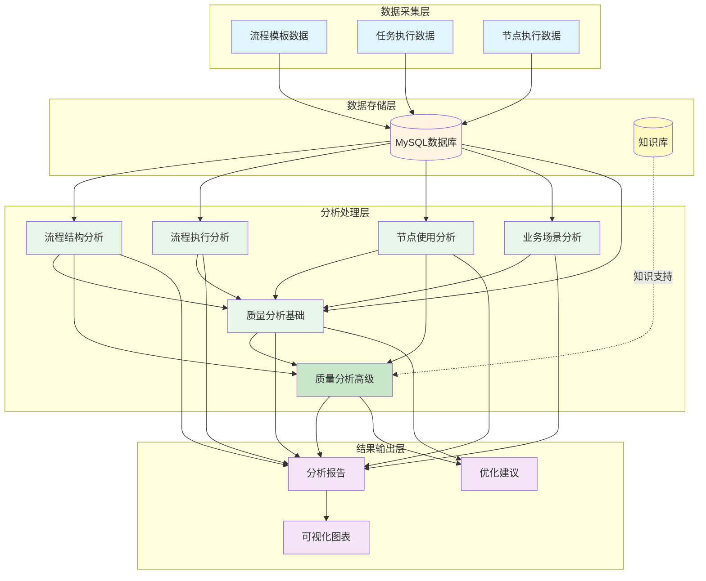

---

## 六、实施阶段依赖关系图

### 6.1 分阶段实施依赖

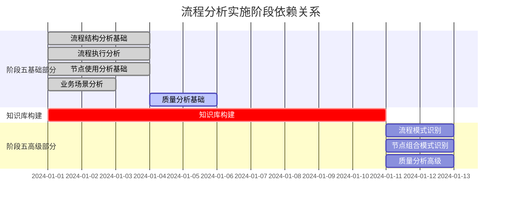

### 6.2 依赖关系说明

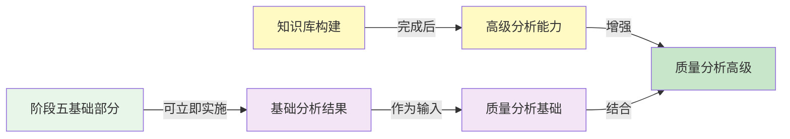

---

## 七、数据表字段映射关系

### 7.1 流程结构分析字段映射

| 分析指标 | 数据表 | 字段 | 说明 |
|---------|--------|------|------|
| 总节点数 | TemplateStatistics | atom_total + subprocess_total | 直接计算 |
| 流程深度 | pipeline_tree | flows | 通过图算法计算 |
| 分支数 | pipeline_tree | gateways | 统计排他网关数 |
| 并行分支数 | pipeline_tree | gateways | 统计并行网关分支数 |
| 输入变量数 | TemplateStatistics | input_count | 直接获取 |
| 输出变量数 | TemplateStatistics | output_count | 直接获取 |

### 7.2 流程执行分析字段映射

| 分析指标 | 数据表 | 字段 | 说明 |
|---------|--------|------|------|
| 总执行次数 | TaskflowStatistics | COUNT(*) | 按template_id分组统计 |
| 成功率 | TaskFlowInstance | status | 统计FINISHED状态占比 |
| 平均耗时 | TaskflowStatistics | elapsed_time | AVG函数计算 |
| P90耗时 | TaskflowStatistics | elapsed_time | PERCENTILE函数计算 |
| 执行趋势 | TaskflowStatistics | create_time | 按时间维度分组统计 |

### 7.3 节点使用分析字段映射

| 分析指标 | 数据表 | 字段 | 说明 |
|---------|--------|------|------|
| 节点使用次数 | TemplateNodeStatistics | COUNT(*) | 按component_code分组统计 |
| 节点使用率 | TemplateNodeStatistics | COUNT(DISTINCT template_id) | 计算模板占比 |
| 节点成功率 | TaskflowExecutedNodeStatistics | status | 统计True占比 |
| 节点平均耗时 | TaskflowExecutedNodeStatistics | elapsed_time | AVG函数计算 |
| 节点组合 | pipeline_tree | flows | 分析source和target关系 |

---

## 八、关键依赖关系总结

### 8.1 数据依赖关系

1. **流程结构分析**：
   - 主要依赖：`pipeline_tree`（从PipelineTemplate.data获取）
   - 辅助依赖：`TemplateStatistics`（获取统计信息）

2. **流程执行分析**：
   - 主要依赖：`TaskflowStatistics`（执行记录）
   - 辅助依赖：`TaskFlowInstance`（任务状态）、`TaskflowExecutedNodeStatistics`（节点执行详情）

3. **节点使用分析**：
   - 主要依赖：`TemplateNodeStatistics`（节点引用）、`TaskflowExecutedNodeStatistics`（节点执行）
   - 辅助依赖：`pipeline_tree`（节点组合关系）

4. **业务场景分析**：
   - 主要依赖：`category`字段（从TaskTemplate和TaskflowStatistics）

5. **质量分析**：
   - 依赖：综合上述所有分析结果
   - 高级部分：还需要知识库支持

### 8.2 实施依赖关系

1. **基础分析**（阶段五基础部分）：
   - ✅ 可立即实施，无需等待知识库
   - 依赖：现有数据库表

2. **高级分析**（阶段五高级部分）：
   - ⚠️ 需要知识库构建完成后实施
   - 依赖：知识库中的模式知识和最佳实践知识

### 8.3 算法依赖关系

1. **独立算法**：
   - 流程结构分析算法
   - 流程执行分析算法
   - 业务场景分析算法

2. **依赖其他算法的算法**：
   - 质量分析算法（依赖上述所有算法的结果）

3. **依赖知识库的算法**：
   - 流程模式匹配算法
   - 节点组合模式识别算法
   - 基于最佳实践的质量分析算法

---

## 九、总结

本文档通过Mermaid图表清晰展示了：

1. **数据表关系**：核心数据表之间的关联关系
2. **数据流向**：从数据源到分析结果的完整数据流
3. **分析维度依赖**：各分析维度之间的依赖关系
4. **实施阶段依赖**：基础分析和高级分析的依赖关系
5. **字段映射关系**：分析指标与数据表字段的对应关系

这些图表为理解和实施流程分析系统提供了清晰的指导。

---

**文档版本**：v1.0
**创建时间**：2024-01-XX
**最后更新**：2024-01-XX
**文档状态**：已完成
