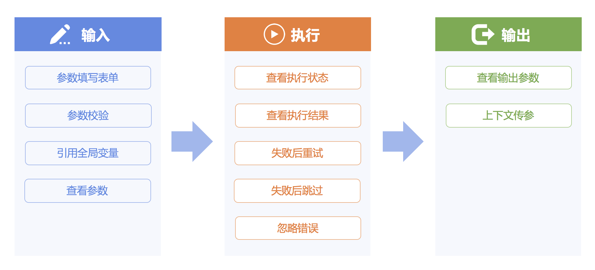
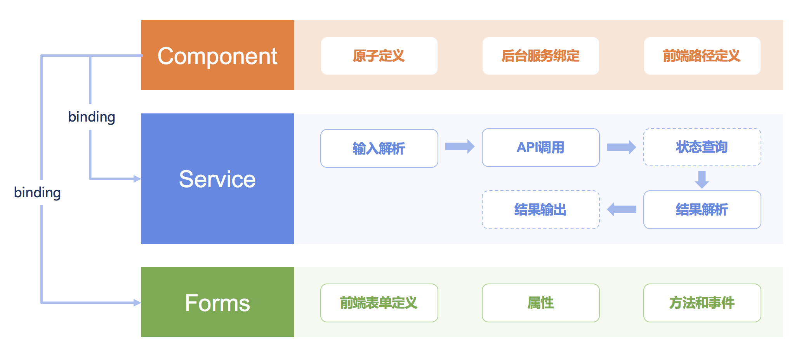
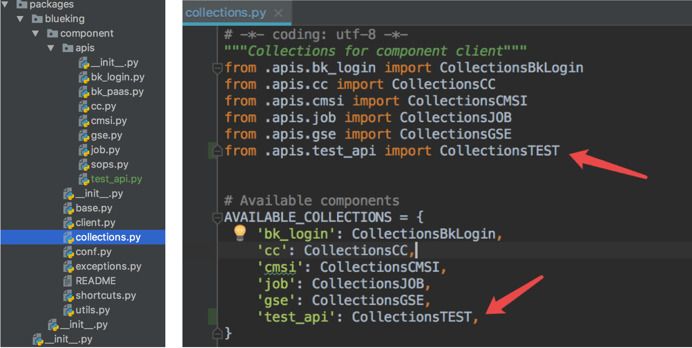

# 标准插件开发
标准插件是标准运维任务执行的最小单元，对应于内部某项服务（如定时）或者第三方系统API的调用（如JOB-快速执行脚本），通过将API参数前端表单
化，加上参数校验、逻辑封装等功能，以图形化的方式提供给用户使用。

标准插件功能主要包括输入、执行、输出三部分。


标准插件架构包含插件定义Component、后台执行逻辑Service、以及前端表单配置Forms。



## 标准插件开发步骤

### 1. 初始化插件模块
在项目根目录下执行 `python manage.py create_atoms_app {CUSTOM PLUGINS NAME}`，其中{CUSTOM PLUGINS NAME}为你定制开发的标准插件
集合包名，注意不要和项目中已有的模块和插件集合名字重复，名字最好能体现插件包的作用。执行命令后会生成如下目录结构：
```
- {CUSTOM PLUGINS NAME}
  - components
    - collections
      - __init__.py
      - plugin.py
    - __init__.py
  - static
    - {CUSTOM PLUGINS NAME}
      - plugin.js
  - __init__.py
  - apps.py
```
其中，components放置标准插件集合后台代码文件，static放置标准插件集合前端静态代码文件，plugin.py 和 plugin.js 可以改为你开发的标准
插件对应的系统名简称，如job、cmdb等。


### 2. 修改项目settings配置
打开 `config/default.py` 文件，找到INSTALLED_APPS变量，加入步骤1中创建的{CUSTOM PLUGINS NAME}。


### 3. 加入新的 API 网关
如果你开发的标准插件依赖自定义接入的API网关，那么在你将接口接入蓝鲸API网关后，需要手动添加client到项目中。
在 `packages/blueking/component/apis` 目录下添加自定义接入的 API 文件后，打开 `packages/blueking/collections.py`，导入自定义
API并修改AVAILABLE_COLLECTIONS变量。



### 4. 标准插件后台开发
在 plugin.py 文件中编写插件后台逻辑，主要包括标准插件定义和后台执行逻辑，下面是示例代码
```python
# -*- coding: utf-8 -*-

import logging

from django.utils.translation import ugettext_lazy as _

from pipeline.core.flow.activity import Service
from pipeline.component_framework.component import Component
from gcloud.conf import settings

logger = logging.getLogger('celery')
get_client_by_user = settings.ESB_GET_CLIENT_BY_USER

__group_name__ = _(u"自定义插件(CUSTOM)")


class TestCustomService(Service):
    __need_schedule__ = False

    def execute(self, data, parent_data):
        executor = parent_data.inputs.executor
        biz_cc_id = parent_data.inputs.biz_cc_id
        client = get_client_by_user(executor)

        test_input = data.inputs.test_input
        test_textarea = data.inputs.test_textarea
        test_radio = data.inputs.test_radio

        api_kwargs = {
            'biz_biz_id': biz_cc_id,
            'executor': executor,
            'test_input': test_input,
            'test_textarea': test_textarea,
            'test_radio': test_radio,
        }

        api_result = client.test_api.test1(api_kwargs)
        logger.info('test_api result: {result}, api_kwargs: {kwargs}'.format(result=api_result, kwargs=api_kwargs))
        if api_result['result']:
            data.set_outputs('data1', api_result['data']['data1'])
            return True
        else:
            data.set_outputs('ex_data', api_result['message'])
            return False

    def outputs_format(self):
        return [
            self.OutputItem(name=_(u'结果数据1'), key='data1', type='string')
        ]


class TestCustomComponent(Component):
    name = _(u"自定义插件测试")
    code = 'test_custom'
    bound_service = TestCustomService
    form = '%scustom_plugins/plugin.js' % settings.STATIC_URL

```

其中各属性和类含义为：

- `__group_name__`： 标准插件所属分类（一般是对应 API 的系统简称，如配置平台(CMDB)。
- class TestCustomService(Service)：标准插件后台执行逻辑。
- class TestCustomComponent(Component)：标准插件定义，前后端服务绑定。

TestCustomService 类详解：

- `__need_schedule__`：是否是异步标准插件（包括异步轮询和异步回调），默认为 False。
- interval：异步标准插件的轮询策略。
- def execute：标准插件执行逻辑，包含前端参数获取、API 参数组装、结果解析、结果输出。
- def schedule：异步标准插件的轮询或者回调逻辑，同步标准插件不需要定义该方法。
- def outputs_format：输出参数定义。

execute 函数详解：

- 可以是任何 python 代码，如果需要调用蓝鲸API网关接口，一般分为参数组装、API 调用、结果解析。
- data 是标准插件输入输出参数数据对象，输入参数对应于前端的表单，可以用 data.inputs.xxx 或者 data.get_one_of_inputs('xxx') 获取
某一个参数；执行完成可以使用 data.set_outputs 写入输出参数，异常信息请赋值给 ex_data。
- parent_data 是任务的公共参数，包括 executor（执行者），operator（操作员），biz_cc_id（所属业务 ID）等。详细信息请查看
`gcloud/taskflow3/utils.py`。
- 返回 False 表示执行失败，同步标准插件返回 True 表示标准插件执行成功，异步标准插件返回 True 会进入休眠，等待第一次异步轮询或者外部
回调，执行 schedule 函数。

outputs_format 函数详解：

- 返回输出参数的列表。
- 列表格式的每一项定义一个返回字段，是 execute 函数中的 set_outputs 输出的字段的子集；key表示输出字段标识，name表示输出字段含义，
type表示输出字段类型（str、int等python 数据结构）。

schedule 函数详解：

- 由 TestCustomService 类的 interval 属性控制调度策略，如 pipeline.core.flow.activity.StaticIntervalGenerator（每隔多少秒
轮询一次）、SquareIntervalGenerator（每次轮询间隔时间是当前已调度次数的平方）。
- 使用 self.finish_schedule 结束轮询，返回 True 表示标准插件执行成功，False 表示执行失败。


TestCustomComponent 类详解：
- name：标准插件名称。
- code：标准插件唯一编码，请保持全局唯一。
- bound_service：绑定后台服务 TestCustomService。
- form：前端表单文件路径，请加上 settings.STATIC_URL 前缀。


### 5. 标准插件前端开发
在 plugin.js 文件中编写前端逻辑，利用标准运维的前端插件框架，只需要配置就能生成前端表单，下面是示例代码
```js
(function(){
    $.atoms.test_custom = [
        {
            tag_code: "test_input",
            type: "input",
            attrs: {
                name: gettext("参数1"),
                placeholder: gettext("请输入字符串"),
                hookable: true,
                validation: [
                    {
                        type: "required"
                    }
                ]
            }
        },
        {
            tag_code: "test_textarea",
            type: "textarea",
            attrs: {
                name: gettext("参数2"),
                placeholder: gettext("多个使用换行分隔"),
                hookable: true,
                validation: [
                    {
                        type: "required"
                    }
                ]
            }
        },
        {
            tag_code: "test_radio",
            type: "radio",
            attrs: {
                name: gettext("参数3"),
                items: [
                    {value: "1", name: gettext("选项1")},
                    {value: "2", name: gettext("选项2")},
                    {value: "3", name: gettext("选项3")}
                ],
                default: "1",
                hookable: true,
                validation: [
                    {
                        type: "required"
                    }
                ]
            }
        }
    ]
})();

```

通过 $.atoms 注册标准插件前端配置，其中各项含义是：

- test_custom：标准插件后台定义的 code。
- tag_code：参数 code，请保持全局唯一，命名规范为"系统名_参数名"。
- type：前端表单类型，可选 input、textarea、radio、checkbox、select、datetime、datatable、upload、combine等。
- attrs：对应type的属性设置，如 name、validation等。


### 6. 标准插件功能测试
开发完成后，先在根目录下执行 `python manage.py collectstatic –noinput` 收集静态资源。
然后新建流程模板，并添加标准插件节点，标准插件类型选择新开发的标准插件，确保展示的输入参数和前端配置项一致，输出参数和后台
outputs_format一致，其中执行结果是系统默认，值是True或False，表示节点执行结果是成功还是失败。

然后使用新建的流程创建任务，填写参数并执行，执行后查看结果是否符合预期，可以结合日志更准确的评估执行结果。


## 标准插件开发规范

- 分组命名规则是“系统名(系统英文缩写)”，如“作业平台(JOB)”。
- 标准插件编码(code)使用下划线方式，规则是“系统名_接口名”，如 job_execute_task。
- 后台类名使用驼峰式，规则是“标准插件编码+继承类名”，如 JobExecuteTaskService。
- 前端 JS 文件目录保持和系统名缩写一致，JS 文件名保持和标准插件编码一致。
- 参数 tag_code 命名规则是“系统名_参数名”，这样可以保证全局唯一；长度不要超过 20 个字符。
- 后台和前端中的中文都要使用翻译函数，以便可以国际化。


## 官方标准插件库


### 蓝鲸服务系列

- 蓝鲸服务(BK)-定时
- 蓝鲸服务(BK)-暂停
- 蓝鲸服务(BK)-HTTP 请求
- 蓝鲸服务(BK)-发送通知

### 配置平台系列

- 配置平台(CMDB)-创建集群
- 配置平台(CMDB)-更新集群属性
- 配置平台(CMDB)-修改集群服务状态
- 配置平台(CMDB)-清空集群中主机
- 配置平台(CMDB)-删除集群
- 配置平台(CMDB)-更新模块属性
- 配置平台(CMDB)-转移主机模块
- 配置平台(CMDB)-更新主机属性
- 配置平台(CMDB)-转移主机至空闲机
- 配置平台(CMDB)-转移主机到业务的故障机模块
- 配置平台(CMDB)-转移主机至资源池
- 配置平台(CMDB)-故障机替换


### 作业平台系列

- 作业平台(JOB)-执行作业
- 作业平台(JOB)-快速分发文件
- 作业平台(JOB)-快速执行脚本
- 作业平台(JOB)-新建定时作业
