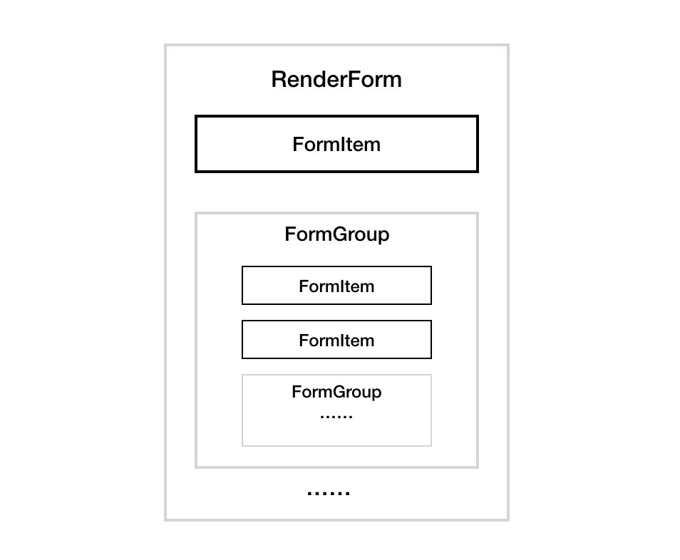
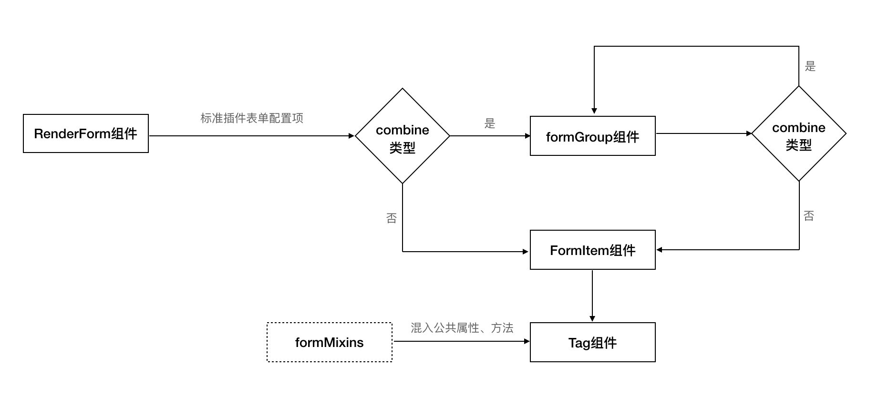

# Tag 使用和开发说明

标准插件的表单项渲染和事件交互，基于事先定义好的 Tag 组件。一个 Tag 组件可以理解为一种类型的表单封装(如 input、textarea、table、upload 等），通过在原生表单元素或者特定业务组件上扩展属性和方法，为标准插件的开发和使用提供了便利。标准插件一般包含一个或者多个 Tag 组件，前端页面加载标准插件配置文件，读取每个表单项的 type 字段，渲染生成对应类型的表单。

# 标准插件渲染逻辑

标准插件表单项的渲染由 RenderForm 组件分发。RenderForm 组件基于 Vue 封装，利用 Vue 数据双向绑定的特性，实现了组件表单项取值 value 的 v-model 指令，调用组件时只需传入对应的配置项 props，就可以实现父组件与 RenderForm 内部组件的数据自动同步。

配置文件里每一个表单项配置在前端组件渲染底层对应一个 FormItem 组件，一般情况下(非勾选状态)，FormItem 组件下都包含一个 Tag* 子组件， Tag 的类型由配置项的 type 字段定义，目前支持的类型包括: input、textarea、checkbox、radio、select、table、upload、tree、password等，所有 Tag 组件都定义了一些公共的属性或者方法，若某种 Tag 类型需要支持的特定事件或者功能，则在对应的 Tag 子组件里定义。如果官方 Tag 不满足自定义开发的插件需要，也可以按照规范自定义开发新的 Tag。

RenderForm 组件的结构：



标准插件表单的渲染流程：



formMixins 函数定义了一些 Tag 组件公共的属性和方法，在添加 Tag 组件调用该方法来混入，可以避免编写重复的声明。

公共属性分为继承属性和非继承属性，继承属性在 Tag 组件里会被定义为 props 属性，目前只有 value 属性，非继承属性会被转换为 data 属性，它的值不会动态更新。属性的值，优先取标准插件配置文件里定义的值，若配置项没有对应属性的默认值。

Tag 组件的私有属性在添加组件时定义，属性的取值和公共属性一致，优先取标准插件配置文件里的值，若配置项没有对应属性则取默认值。

# Tag 使用说明

Tag 组件的使用非常简单，只需要在标准插件配置项中定义好 `type` 字段，传入该类 Tag 支持的属性和方法即可在前端页面渲染出对应的表单项，通过 Tag 组件之间的组合，也可以构造出复杂的表单交互。

目前标准运维系统内置的 Tag 组件包含：

- button
- cascader
- checkbox
- datatable
- datetime
- input
- int
- ipSelector
- password
- radio
- select
- text
- textarea
- tree
- upload
- memberSelector
# Tag 组件属性、方法

标准插件中定义的配置项在页面渲染时，会作为属性传入到 Tag 组件中。Tag 组件根据不同的属性值，可以灵活的扩展多种表单配置，例如 `TagSelect` 组件可以通过 `multiple` 属性来区分下拉框为单选还是多选，`TagUpload` 组件可以通过 `remote_data_init` 属性来自定义加载数据后的处理逻辑。

不同的标准插件在前端页面渲染时，存在一些公共的交互逻辑，包括表单项名称、是否隐藏、是否可勾选、是否校验等，这部分属性称为公共属性，所有的 Tag 组件都支持标准插件自定义配置。由于不同 Tag 的都有自己的应用场景，Tag 组件内部封装的原生表单或者特定业务场景的类型差异，不同 Tag 组件之间所支持的属性也会存在差异，只在某种 Tag 组件里支持标准插件自定义配置，这类属性称为私有属性， 比如 `TagUpload` 组件的 `remote_data_init` 属性。

为了增加标准插件的能力，Tag 组件也封装了部分公共方法，支持开发者在标准插件配置项的事件回调里进行调用，例如隐藏表单、获取上级表单组件、获取当前表单值等。

**配置文件里定义的表单项属性和方法，只有在 Tag 组件里声明过，才能够被组件正确的拿到。**

## 公共属性

- `name`：表单项名称，在页面上控制 label 的显示
- `hookable`：是否可勾选为全局变量
- `validation`：表单项的校验规则
- `default`：表单项的默认值，不同的 Tag 组件支持的数据类型存在差异
- `hidden`：是否默认隐藏
- `value`：表单组件的值，需要在 Tag 里手动定义，并作为调用 `getFormMixins` 函数的参数传入

## 公共方法

- `updateForm`：触发 `change` 事件更新表单值，并调用校验函数，参数为 `value`
- `validate`：校验函数
- `show`：表单隐藏
- `hide`：表单显示
- `get_form_instance`：获取表单实例，FormItem
- `get_parent`：获取 combine 实例或根元素实例
- `get_child`：获取表单实例，参数为子表单的 tag_code，支持 RenderForm 或 RenderGroup 组件调用
- `_get_value`：获取表单值
- `_set_value`：设置表单值

## 官方 Tag 组件说明

### 1. TagButton

按钮，一般由其他 Tag 组件监听按钮的 `click` 事件, 用来实现 Tag 组件间的交互。

**属性**

  - `title`：按钮文字
  - `type`：按钮类型
  - `icon`：icon 类名, 取值参考 [element-ui icon](https://element.eleme.cn/#/zh-CN/component/icon)
  - `size`：尺寸
  - `plain`：是否为朴素按钮
  - `round`：是否为圆角按钮
  - `circle`： 是否为圆形按钮

**方法**

*none*

### 2. TagCascader

级联组件，一般用于逐级查看和选择多层级结构的数据。

**属性**

  - `items`：：提供选择的级联选项，eg: [{label: '', value: '', children: [...]}, {label: '', value: '', children: [...]}]
  - `value`：级联选择器的选中值
  - `disabled`：设置是否禁用组件
  - `multiple`：设置是否可多选
  - `filterable`：设置是否可搜索
  - `placeholder`：占位文本
  - `lazy`：是否开启远程加载
  - `lazyLoad`：远程加载方法, 文档参考element-ui cascader组件lazyload说明

**方法**

*none*

### 3. TagCheckbox

多选框，通过配置项传入可选项，提供给使用者选择。

**属性**

  - `item`：提供选择的多选项，eg: [{name: '微信', value: 'weixin'}, {name: '邮件', value: 'mail}]
  - `disabled`：设置是否禁用组件
  - `value`：选中项的 value

**方法**

*none*

### 4. TagDatatable*

表格，用来展示多条并列数据，支持远程加载数据、单独添加数据、数据编辑。

**属性**

  - `columns`：表格列的配置项，eg: 
  [
    {
      tag_code: "name",
      type: "text",
      attrs: {
        name: gettext("参数名称"),
      }
    },
    {
      tag_code: "type",
      type: "text",
      attrs: {
        name: gettext("参数类型"),
        hidden: true,
      }
    },
    {
      tag_code: "value",
      type: "textarea",
      attrs: {
        name: gettext("参数值"),
        editable: true
      }
    }
  ]
  - `editable`：是否显示表格操作列，包含编辑、删除、保存、取消按钮
  - `deleteable`：是否显示删除按钮，用来单独控制表格操作列的删除按钮
  - `add_btn`： 是否显示添加按钮
  - `table_buttons`: 自定义配置表格按钮，eg: [{text: '点击', callback: function(){console.log(1)}, type: 'xxx or import'}, ...]，其中 type 为非必需字段，值为 import 时，点击回调使用内置的上传函数
  - `empty_text`：无数据提示
  - `remote_url`：表格数据远程加载，支持 url 和方法
  - `remote_data_init`：加载数据后的处理函数
  - `value`：表格的值

**方法**

  - `validateSubCom`：校验表格内的数据是否符合规则（规则由对应的列的标准插件配置项指定）
  - `set_loading`：传入布尔类型参数来设置表格是否为 loading 状态
  - `remoteMethod`：远程加载数据
  - `export2Excel`：将表格数据导出到 excel 文件

### 5. TagDatetime

日期时间选择器。

**属性**

  - `placeholder`：占位文本
  - `disabled`：设置是否禁用组件
  - `value`：时间值

**方法**

*none*

### 6. TagInput

文本框，一般用来输入单行文本。

**属性**
  - `placeholder`：占位文本
  - `min`：最小值，默认为 -Infinity
  - `max`：最大值，默认为 Infinity
  - `disabled`：设置是否禁用组件
  - `value`：文本框值

**方法**

*none*

### 7. TagInt

整数输入框，用来输入正整数。

**属性**

  - `placeholder`：占位文本
  - `disabled`：设置是否禁用组件
  - `value`：整数输入框值

**方法**

*none*

### 8. TagIpSelector

ip 选择器，支持静态 ip 或动态 ip 的单选和多选。

**属性**

  - `isMultiple`：ip 选择器是否为多选（单选为选择静态或者动态 ip，多选为同时选择静态、动态 ip）
  - `disabled`：设置是否禁用组件
  - `value`：选择的 ip 值

**方法**

*none*


### 9. TagPassword

密码输入框。

**属性**

  - `disabled`：设置是否禁用组件
  - `value`：加密后的密码值

**方法**

*none*

### 10. TagRadio

单选框，通过配置项传入可选项，提供给使用者选择。

**属性**

  - `items`：提供选择的单选项，eg: [{name: '微信', value: 'weixin'}, {name: '邮件', value: 'mail}]
  - `disabled`：设置是否禁用组件
  - `value`：选中项的 value

**方法**

*none*

### 11. TagSelect

下拉框，通过配置项传入可选项，提供给使用者选择，选项支持远程加载。

**属性**

  - `items`：提供选择的下拉框选项， eg:[{text: '微信', value: 'weixin'}, {text: '邮件', value: 'mail'}]
  - `multiple`：是否为多选
  - `remote`：是否开远程加载
  - `remote_data_init`：远程加载后的数据处理函数
  - `placeholder`：占位文本
  - `empty_text`：无数据提示
  - `disabled`：设置是否禁用组件
  - `value`：选中项的 value，多选框的值以 , 分隔

**方法**

  - `set_loading`：传入布尔类型参数来设置下拉框是否为 loading 状态
  - `remoteMethod`：远程加载数据

### 12. TagText

文本组件，不可编辑，一般用来展示文本信息。

**属性**

  - `value`：文本的值

**方法**

*none*

### 13. TagTextarea

多行文本框。

**属性**

  - `placeholder`：占位文本
  - `disabled`：设置是否禁用组件
  - `value`：文本框的值

**方法**

*none*

### 14. TagTree

树形选择组件，一般用来多个分组层级数据的选择。通过配置项传入可选项，提供给使用者选择，选项支持远程加载。

**属性**

  - `items`：提供选择的可选项，eg:
  ```js
  [
    {
      label: '通知方式',
      children: [
        {
          label: '信息',
          children: [
            { label: '短信' },
            { label: '企业微信' },
            { label: '微信' }
          ]
        },
        { label: '语音' }
      ]
    },
    {
      label: '通知分组',
      children: [
        { label: '运维人员' },
        { label: '产品人员' },
        { label: '开发人员' },
        { label: '测试人员' }
      ]
    }
  ]
  ```
  - `expanded_keys`：默认展开的节点的 key 的数组
  - `show_checkbox`：节点是否可被选择
  - `default_expand_all`： 是否默认全部展开
  - `remote`： 是否开启远程加载
  - `remote_url`： 远程加载 url
  - `remote_data_init`：远程加载后的数据处理函数
  - `value`：选中的值

**方法**
  - `remoteMethod`：远程加载数据


### 15. TagUpload

上传组件。

**属性**

  - `url`： 服务器 url
  - `multiple`：是否支持多个上传
  - `headers`：http 请求头
  - `auto_upload`：是否开启自动上传，默认值为 true，自动上传(选择文件后自动触发上传)，手动上传(选择文件后需要点击上传按钮，调用自定义的 submit 方法回调)
  - `submit`：自定义上传方法
  - `limit`：上传文件个数
  - `placeholder`：占位文本
  - `text`：上传按钮的文字
  - `disabled`：设置是否禁用组件
  - `value`：上传的文件

**方法**
  - `onSubmit`：手动上传按钮点击时间回调，默认开始执行上传，若配置项传入 `submit` 属性，则执行该方法
  - `beforeUpload`: 上传之前钩子函数，若返回 false 或者返回 Promise 且被 reject，则取消上传，参数 file
  - `beforeRemove`: 删除文件之前的钩子函数，若返回 false 或者返回 Promise 且被 reject，则取消删除，参数 file， fileList
  - `onSuccess`: 文件上传成功时的钩子函数，参数 file， fileList
  - `onRemove`: 文件列表移除文件时的钩子函数，参数 file， fileList
  - `fileChange`: 上传文件变更时的钩子函数，添加文件、上传成功和上传失败时都会被调用，参数 file， fileList
  - `onError`: 文件上传失败时的钩子函数，参数 err, file， fileList

### 16. TagMemberSelector

人员选择组件

**属性**

  - `placeholder`：占位文本
  - `disabled`：设置是否禁用组件
  - `value`：选择人员名字，名字间以 ',' 隔开。eg:"xiaoming,xiaozhang,xiaoli"

**方法**

*none*


# 标准插件中定义的方法

Tag 组件在初始化渲染时，会将标准插件对应配置项 methods 属性中的方法注册到 Tag 组件中，标准插件可根据需求添加方法。

若标准插件需要在 Tag 组件初次渲染时，执行一些初始化的逻辑，可在 `methods` 属性中定义 `_tag_init` 方法，该方法在组件挂在到页面上会默认执行。


# Tag 组件间的事件交互

Tag 组件在通过发布/订阅的方式，实现了组件间的事件交互, 例如在 TagSelect 组件里，选择某项数据后，将值更新到与它同级的 TagInput 中。前端渲染组件时，会根据标准插件里 events 属性配置的 source + type 规则来注册定义的事件监听，其他组件可以通过调用 `this.$emit(${tagcode}_${event_type})`来触发对应表单的事件监听回调。

Tag 组件间的事件交互使用方式比较简单，只需要在标准插件表单项中定义好 events 规则，即可监听对应表单派发的事件，例如：

```js
  tag_code: 'biz_input',
  type: 'input',
  attrs: {
    name: 'some label'
  },
  events: [
    {
      source: "biz_info",
      type: "change",
      action: function () {
          const bizInfo = this.get_parent().get_child('biz_info')
          const value = bizInfo._get_value()
          this.updateForm(value)
      }
    }
  ]
```

`biz_input` 表单项会监听 `biz_info` 表单项值的变更事件，将它的选中值更新到 input 中。

**Tag 组件在前端初始化渲染时，会默认抛出 init 事件（标准插件 methods 配置项里的定义 `_tag_init` 方法，在 init 事件抛出之前执行）**

**Tips**

- 每个 Tag 组件在渲染到前端页面时，会默认触发 `init` 事件，标准插件表单项可根据需求是否监听该事件
- 每个 Tag 组件在表单值发生变更时，会默认触发 `change` 事件，标准插件表单项可根据需求是否监听该事件
- Tag 组件间只支持同级组件（相同父组件）的事件交互，对应到标准插件配置项中一级表单项或者 combine 里的一级表单项


# Tag 开发说明

## 自定义开发 Tag 步骤

添加 Tag 组件只需要在前端项目的`src/components/tags/`目录里增加一个单文件的 vue 组件，文件名称格式为`Tagxxx`，`xxx`为 Tag 组件的名称，命名遵循驼峰规则且保证在项目所有`Tag`里是唯一的。webpack 在打包时会查找该目录下的文件，自动引入并注册到 `FormItem` 组件里。模版最外层元素建议增加一个 `tag-xxx`的 `class` 名称，`xxx` 表示 Tag 的名称。

组件的编写需要注意一下几点：

- 是否展示模式、是否为编辑态
  
  RenderForm 组件为通用组件，标准运维所有页面的标准插件表单渲染都通过使用该组件来实现，页面不同地方可能会区分编辑态、禁用态，表单模式、查看模式，所以在编写组件模版是需要针对不同的场景写不同的模版，编辑、禁用通过`formEdit`属性区分、是否表单模式通过`formMode`属性区分。

- 定义私有属性，混入公共属性、方法

  编写组件时必须引入公共属性和方法，并且定义好私有属性后调用公共 mixins 函数的参数传入，其中私有属性必须包含 value 属性，属性申明遵循 props 校验规则格式。mixins 函数由前端项目目录`src/components/common/RenderForm/formMixins.js`文件定义。 

- 表单值绑定

  Tag 组件的值必须实现双向绑定，创建一个计算属性来处理绑定逻辑，计算属性的 `get` 由 props 里的 `value` 的值(需要注意引用类型值的深拷贝)，`set`需要调用`updateForm`方法传入修改后的value到组件，触发change事件和校验逻辑。
