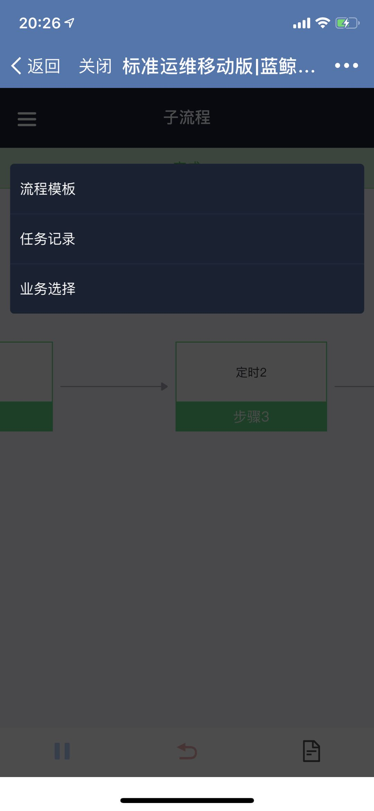

# 移动端使用说明

## 移动端用户绑定企业微信
已授权的移动端用户首次使用标准运维前，需要在蓝鲸 PaaS 平台绑定企业微信。在蓝鲸 PaaS 平台的"个人中心"中点击头像（企业版点击"绑定微信"），
通过企业微信扫描二维码绑定。在完成企业微信绑定后，请再次访问标准运维 SaaS 以便同步企业微信账号信息，
然后就可以在企业微信的"工作台"访问标准运维移动版了。

如果未找到"绑定微信"入口，请务必联系你使用的蓝鲸环境部署负责人按照[移动端部署](../install/mobile_deploy.md)文档进行操作。

## 移动端功能介绍

### 业务选择
首次进入移动端标准运维，是业务选择列表页面，展示你有权限的业务，和 PC 端的业务选择下拉框一致。点击任一业务进入该业务的流程模板列表页。

### 流程模板
流程模板页面展示了当前业务下已创建的流程模板列表，并将你收藏的流程置顶展示，注意移动端的收藏和 PC 端的流程收藏共用数据，
也就是在 PC 收藏的流程也会展示在移动端收藏列表中。你可以在搜索框输入流程名称快速查找流程。

你可以在移动端点击任一流程进入"新建任务"页面，然后点击"收藏"图标收藏流程。

### 新建和执行任务
在流程模板页面点击任一流程后，进入"新建任务"页面，你需要填写流程的全局变量参数，可以修改任务名称。注意，目前移动端只支持部分参数类型，
复杂交互参数如表格、IP 选择器在移动端不支持，如果流程模板需要在移动端执行，请在 PC 端编辑流程时检查全局变量，不要包含任何复杂参数类型。

新建任务时你还可以选择该流程的执行方案，方案默认是"执行所有节点"，执行方案的增加和删除请在 PC 端操作。

填写完任务参数和执行方案后，点击"新建任务"即生成一条新建任务记录，并进入了"任务详情"页面。你需要点击"开始"按钮启动任务，
和 PC 端一样，在任务执行过程中，你可以点击"撤销"按钮随时终止任务，也可以点击"查看参数"按钮回顾填写的任务参数。

在标准插件节点执行完成后，你可以点击节点，然后点击"查看详情"查看标准插件节点的输入输出参数和失败时的异常信息。

和 PC 端一样，遇到"蓝鲸服务(BK)-暂停"插件时，你可以点击节点，然后点击"继续"让暂停插件完成，并继续执行后续任务节点。
遇到"蓝鲸服务(BK)-定时"插件时，你可以点击节点，然后点击"修改定时"重置定时节点时间。

任务执行完成后，你可以点击导航菜单，回到"流程模板"或者进入"任务记录"。

### 任务记录
任务记录页面只展示了当前业务下移动端创建的任务，可以查看任务执行起始时间和执行状态，也可以在搜索框输入任务名称快速查找任务。

