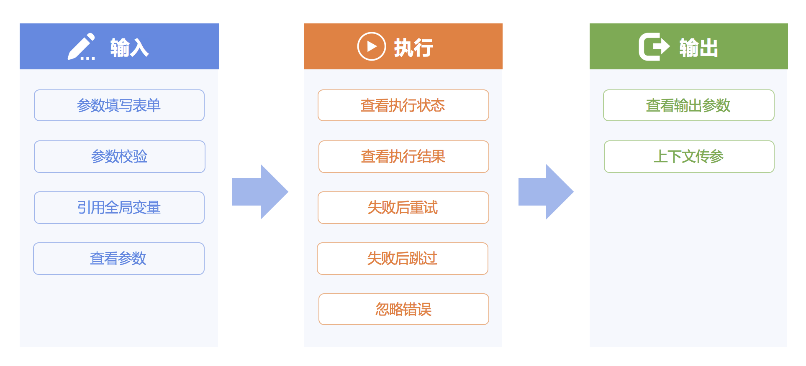
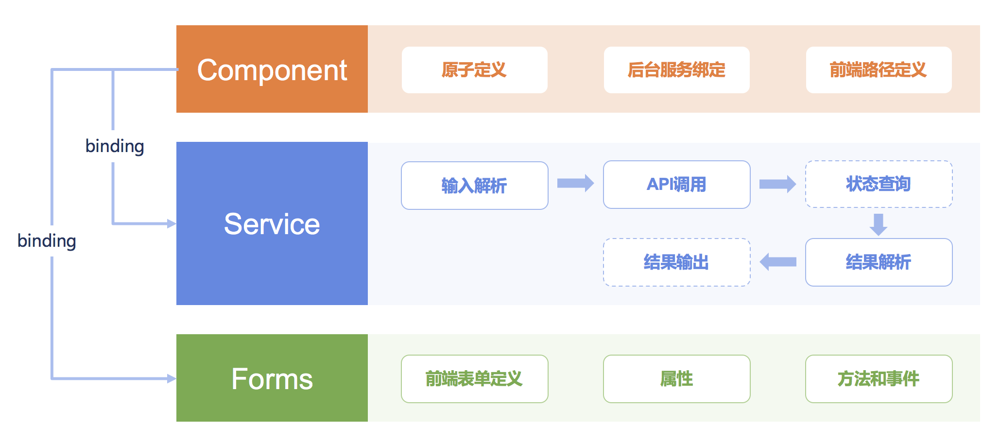

# 标准插件说明

## 标准插件定义
标准插件是标准运维任务执行的最小单元，对应于内部某项服务（如定时）或者第三方系统API的调用（如JOB-快速执行脚本），通过将API参数前端表单
化，加上参数校验、逻辑封装等功能，以图形化的方式提供给用户使用。

标准插件功能主要包括输入、执行、输出三部分。


标准插件架构包含插件定义Component、后台执行逻辑Service、以及前端表单配置Forms。


## 标准插件自动发现
标准运维通过插件自动发现机制，在启动 SaaS 服务时扫描每个已经注册到 Django 中的 APP （INSTALLED_APPS）下特定的目录（包括子目录），自动发现并注册合法的标准插件，这些待扫描的目录能够通过 Django settings 下的 `COMPONENT_PATH` 进行配置：

```python
COMPONENT_PATH = [
    'custom.components.path',
]
```

标准运维默认会扫描已注册 APP 的 `components.collections` 目录，尝试从该目录下（包括子目录）所有的 Python 模块中发现并注册合法的标准插件。

标准运维插件自动发现机制的实现代码可以参考 `pipeline.component_framework.apps` 和 `pipeline.utils.register` 模块。

## 官方插件列表

### 蓝鲸服务系列

#### 蓝鲸服务(BK)-定时
#### 蓝鲸服务(BK)-暂停
#### 蓝鲸服务(BK)-HTTP 请求
#### 蓝鲸服务(BK)-发送通知

### 配置平台系列

#### 配置平台(CMDB)-创建集群
#### 配置平台(CMDB)-更新集群属性
#### 配置平台(CMDB)-修改集群服务状态
#### 配置平台(CMDB)-清空集群中主机
#### 配置平台(CMDB)-删除集群
#### 配置平台(CMDB)-更新模块属性
#### 配置平台(CMDB)-转移主机模块
#### 配置平台(CMDB)-更新主机属性
#### 配置平台(CMDB)-转移主机至空闲机模块
#### 配置平台(CMDB)-转移主机至故障机模块
#### 配置平台(CMDB)-上交主机至资源池
#### 配置平台(CMDB)-故障机替换


### 作业平台系列

#### 作业平台(JOB)-执行作业
#### 作业平台(JOB)-快速分发文件
#### 作业平台(JOB)-快速执行脚本
#### 作业平台(JOB)-新建定时作业
#### 作业平台(JOB)-分发本地文件

请确保组件版本版本：

- install_ee >= v1.9.5
- job >= v2.5.18

> 若组件版本不符合要求，升级版本后，需要重新部署标准运维


确保`开发者中心 #### S-mart应用 #### 标准运维 #### 环境变量`中包含有以下变量：


- BKAPP_ENABLE_SHARED_FS：允许挂载 NFS，应为 `True`
- BKAPP_FILE_MANAGER_TYPE：文件管理类型，应为 `host_nfs`
- BKAPP_NFS_CONTAINER_ROOT：NFS 挂载路径，应为 `/data/app/code/USERRES`
- BKAPP_NFS_HOST_ROOT：NFS 宿主机路径，应为 `/data/bkee/paas_agent/apps/projects/bk_sops/code/bk_sops/USERRES`


### 节点管理系列

#### 节点管理(Nodeman)-安装
