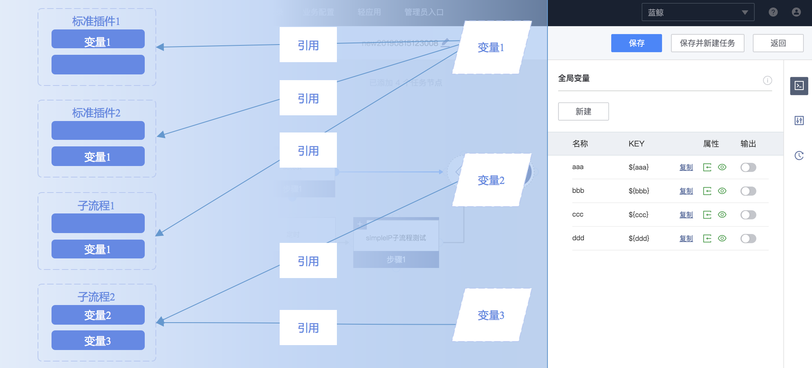

# 变量引擎

## 变量概述

全局变量是流程模板的公共参数，通过 KEY 来做唯一性约束。用户可以在任务节点的输入参数和分支网关表达式中引用，
标准运维的变量引擎会在任务执行中自动把全局变量的引用替换为全局变量的值。通过全局变量，用户可以简化任务参数，并且通过引用标准插件输出参数，
实现上下文传参等功能。


全局变量的来源有三种：
一是通过任务节点的输入参数勾选生成，这类全局变量的类型是“组件”，并且不能更改；默认值和来源标准插件的输入参数的表单类型一致，
如标准插件节点的参数是单选框，勾选生成的全局变量也是单选框。

二是通过任务节点的输出参数勾选生成，这类全局变量类型也是“组件”，并且不能更改；无默认值属性，因为这类全局变量的值是由生成该变量的标准插件节点、
子流程节点的输出结果自动生成的，用户无法手动设置；此外，这类全局变量的显示属性是“隐藏”，并且不能更改，表示执行任务时不需要用户手动填写这类参数。

三是用户在全局变量区点击“新增变量”生成，手动添加的全局变量类型可以选择输入框、文本框、日期时间、整数、IP选择器等，并且可以编辑修改。

## 自定义全局变量

### 输入框
可以输入单行字符串，并且支持自定义校验规则，这样在填写参数值时，可以避免填写不合法的参数值（目前只支持前端页面填参校验，API参数未作校验）。
默认校验规则为"^.+$"，表示不能为空。建议用户大部分情况下，手动添加全局变量时使用输入框类型。

### 文本框
可以输入多行字符串，如果直接引用该变量，会得到包含"\n"分隔符的字符串。

### 日期时间
可以选择日期时间，变量的值是形如"%Y-%m-%d %H:%M:%S"的字符串。建议需要填写时间格式的参数通过新建该类型的全局变量后引用来实现，
如蓝鲸服务(BK)-定时插件的定时时间参数。

### 整数
可以填写或选择整数，变量的值是整数。可以在变量引用语法中直接用于数学运算。

### 密码
通过非对称加密算法RSA实现的密码输入表单，可以填写任意字符，在保存后会加密传给后台。后台使用密码字段时，必须通过解密函数处理：
```python
from pipeline.conf import settings
from pipeline.utils.crypt import rsa_decrypt_password

class AgentInstallService(Service):

    def execute(self, data, parent_data):
        value = data.inputs.pwd_tag_code
        password = rsa_decrypt_password(value, settings.RSA_PRIV_KEY)
```

注意，密码变量必须配合自定义开发的插件后台解密才能使用，否则得到的都是加密后的字符串，直接使用无任何意义。当需要让用户输入密码，
插件开发者开发的标准插件本身不包含加密功能，只有通过输入提示用户引用密码类型变量，但是是否引用密码变量是由用户决定的，
所以如果开发者希望兼容用户输入明文密码的场景，可以进一步将上述插件代码改为：
```python
from pipeline.conf import settings
from pipeline.utils.crypt import rsa_decrypt_password

class AgentInstallService(Service):

    def execute(self, data, parent_data):
        value = data.inputs.pwd_tag_code
        try:
            password = rsa_decrypt_password(value, settings.RSA_PRIV_KEY)
        except Exception:
            password = value
```

### IP选择器(简单版)
已升级为"IP选择器"，在后续版本可能会下线，请切换到新版本。

### IP选择器
可以选择业务下的静态IP列表，也可以选择业务拓扑或者输入业务拓扑某些层级的动态生成IP，变量的值是当前业务下合法的主机内网IP，多个以','分隔，
不合法的IP（包括非IP字符和非当前业务下的IP）都会被自动过滤掉。

### 下拉框
下拉框是"元变量"，和"普通变量"的区别在于是否可以自定义元数据。在新建下拉框变量时，需要填写数据源等配置项，
数据源信息可以通过"自定义"填写形如 `[{"text": "", "value": ""}...]` 的字符串，其中每项数据的 `text` 表示用户在前端选择框看到的文本，
`value` 表示传给后台的值，若是远程数据源则填写返回该格式数据的 URL，注意远程数据源不要有登录鉴权等限制。在定义了数据源后，
还需要确定是"单选"还是"多选"，单选框的值是单个 `value` 的字符串，多选框的值是 `value1,value2...` 格式的字符串。最后，"默认值"是可选配置，
如果配置了默认值，务必和"单选"/"多选"要求的值的格式一致。

## 使用说明

### 基础语法
全局变量可以通过 `${KEY}` 的语法引用，并且全局变量的默认值中也可以引用其他的全局变量，只要保证无循环引用即可。
多个任务节点的输入参数引用同一个全局变量，可以实现参数共享，减少新建任务时需要填写的参数；任务节点输入参数通过形如 `xxx${KEY}` 方式部分引用全局变量，
可以实现简化输入参数的目的；任务节点输入参数或者分支条件表达式通过引用之前的任务节点的输出参数生成的全局变量，
可以实现根据任务节点输出控制后面节点输入参数和分支流程走向。

### 高级语法
除了通过 `${KEY}` 的语法直接引用全局变量，标准运维还支持一些 python 的高级语法。

- 字符串拼接
语法：${"prefix" + KEY}、${"prefix%s" % KEY}、${"prefix{}".format(KEY)}、${"%s%s" % (KEY1, KEY2)}
使用场景：简化用户输入，或者限制用户输入的影响。例如某个流程需要操作主机目录，不能让用户随意填写绝对路径，
那么你可以在路径参数输入形如 `${"/data/usr/safe/%s" % SUB_PATH}` 的值，并新建KEY是 `${SUB_PATH}` 的环境变量，暴露给用户在新建任务时填写。

- 字符串变换
语法：${KEY.upper()}、${KEY.replace("\n", ",")}、${KEY[0:2]}、${KEY.strip()}
使用场景：插件参数对输入的字符串有严格的限制，但是希望用户输入参数只要满足部分条件即可。

- 数字运算
语法：${int(KEY) + 1}、${int(KEY)/10}
使用场景：用在某些需要计算的场景。例如某个流程需要批量开区，每个大区需要申请5台服务器，那么只需要让用户填写 `${SET_COUNT}` 大区数量变量，
在申请服务器的节点参数中，固定填写为 `${SET_COUNT * 5}` 即可。

- 类型转换
语法：${KEY.split("\n")}、${KEY.count()}、${list(KEY)}、${[item.strip() for item in KEY.split("\n")]}
使用场景：插件前端表单参数都是以字符串形式传参的，类型转换一般不会单独使用，可以配合其他高级语法一起使用。


### 内置变量
除了用户在流程中通过各种方式新建的全局变量外，还可以直接引用标准运维内置的全局变量。内置变量主要包含一些任务信息，
并且这些信息不能由任务创建人随意改动，如任务ID、任务执行者等。内置全局变量详情请在流程编辑的全局变量页面查看。

内置变量和用户自定义变量的用法没有区别，都可以通过变量引擎支持的语法引用，如 `${"executor is %s" % _system.executor}`。
