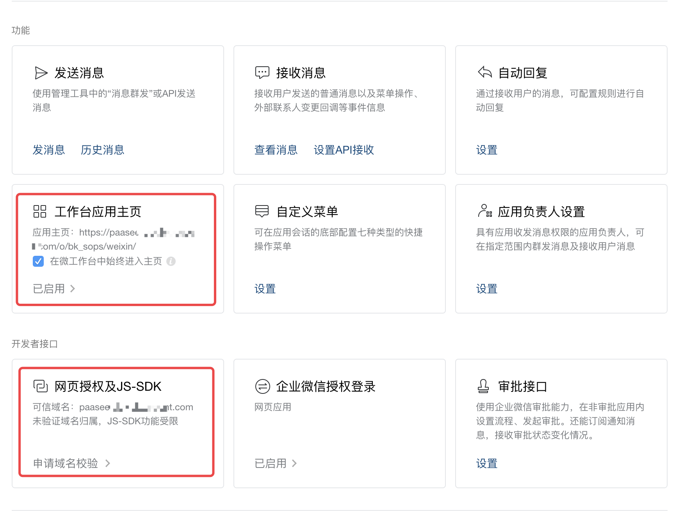
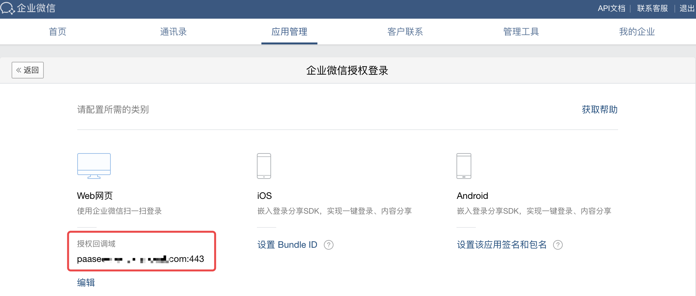
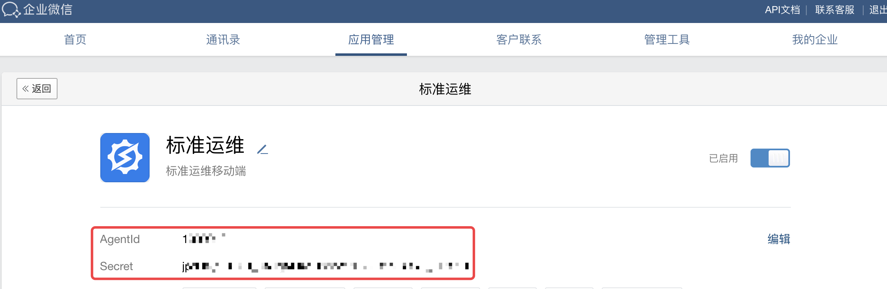
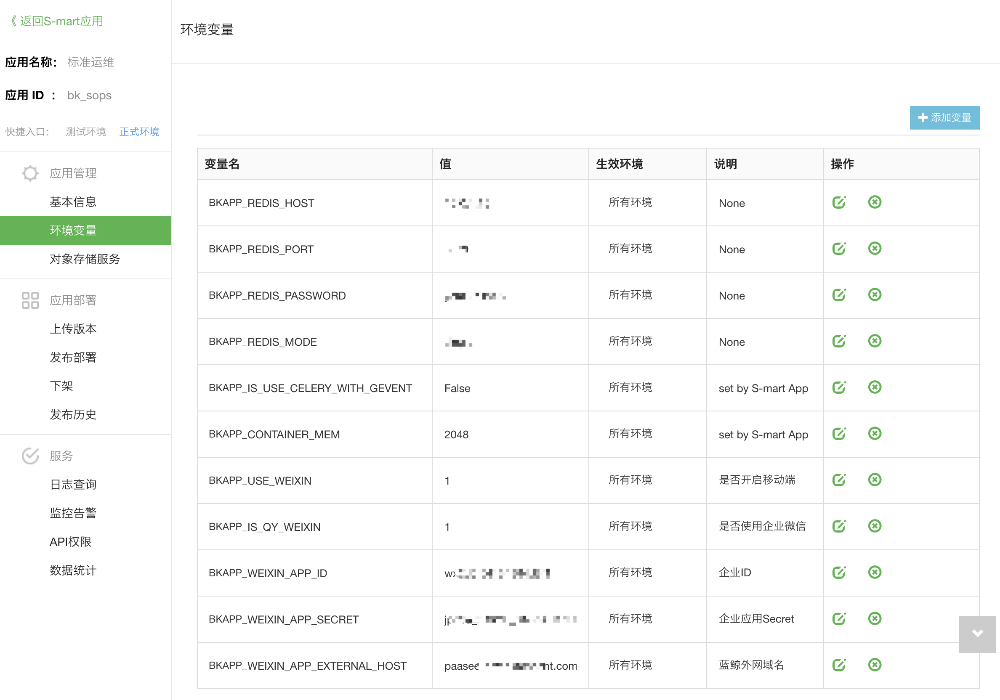
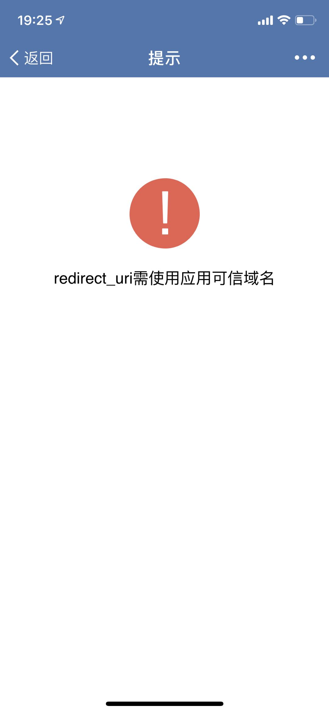
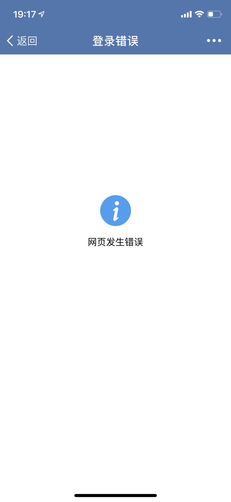

# 移动端部署

## 企业微信管理端配置
标准运维移动端需要通过企业微信进行访问，所以需要绑定企业微信的应用访问链接到你部署的蓝鲸社区版平台。

### 登录企业微信管理后台
打开浏览器访问链接 `https://work.weixin.qq.com/`，使用企业微信扫码登录，注意需要使用有管理员权限的用户。

### 企业微信新建应用
点击导航中"应用管理"，在自建应用中点击"新建应用"，应用logo请上传标准运维SaaS的logo，应用名称填写"标准运维"，应用介绍可以选填，
可见范围根据企业内需求配置，如果希望企业内所有人都可以访问，请选择组织架构中的根节点。

### 企业微信应用管理
- 点击上一步新建的标准运维应用，在"功能"中找到"工作台应用主页"，应用主页配置为 `http[https]://{BK_PAAS_HOST}/o/bk_sops/weixin/`，
并勾选"在微工作台中始终进入主页"。

- 在"开发者接口"中找到"网页授权及JS-SDK"，并设置可信域名为 {BK_PAAS_OUTER_HOST}。


- 在"开发者接口"中找到"企业微信授权登录"，并设置授权回调域为 {BK_PAAS_OUTER_HOST}。
其中，{BK_PAAS_OUTER_HOST} 为你部署的蓝鲸外网域名，如果是 HTTPS 协议，"企业微信授权登录"中授权回调域请添加端口号 443，
即 `{BK_PAAS_HOST}:443`。



## 蓝鲸消息通知渠道配置
以蓝鲸管理员身份访问蓝鲸开发者中心，进入"API网关"的"通道管理"，选择"[CMSI]蓝鲸消息管理"，编辑"[CMSI]发送微信消息"，
在"组件配置"中修改配置，具体方法参考"API网关"的"使用指南"中"微信消息组件"章节，注意：

- wx_type 选择"企业微信"
- wx_qy_corpid 填写企业微信后台管理中"我的企业"页面的"企业ID"
- wx_qy_agentid 填写企业微信后台的应用管理中标准运维应用的 AgentId，该应用会作为默认微信消息通知渠道
- wx_qy_corpsecret 填写企业微信后台的应用管理中标准运维应用的 Secret




## 标准运维部署

### 打包并收集前端静态资源

#### 1. 安装依赖包  
进入 frontend/mobile/，执行以下命令安装 NPM 包
```bash
npm install
```

#### 2. 打包前端资源
在 frontend/mobile/ 目录下，继续执行以下命令打包前端静态资源
```bash
npm run build -- --SITE_URL="/o/bk_sops" --STATIC_ENV="open/prod"
```

#### 3. 收集静态资源
回到项目根目录，执行以下命令收集前端静态资源到 static/weixin/ 目录下
```bash
rm -rf static/weixin/open
mv frontend/mobile//dist/open static/weixin/

rm -rf static/weixin/components
cp -r static/components static/weixin/
rm -rf static/weixin/variables
cp -r static/variables static/weixin/
```

### 应用打包
在 CentOS 机器上，通过 git 拉取你的标准运维定制版仓库代码后，在项目根目录下运行以下命令执行打包操作。
```bash
bash scripts/publish/build.sh
```
注意，该脚本会把项目依赖的 python 包都下载到生成的版本包中，请务必保证把项目依赖的 python 包都加入到 requirements.txt 文件中。
打包完成后会在当前目录下生成一个名为 "bk_sops-当前时间串.tar.gz" 格式的文件，即版本包。


### 环境变量配置
标准运维首次部署默认不开启移动端，如果需要开启移动端，需要在蓝鲸"开发者中心"或者PaaS Admin配置标准运维应用的环境变量，如下图所示：

- BKAPP_USE_WEIXIN(是否开启移动端)值设置为 1
- BKAPP_IS_QY_WEIXIN(是否使用企业微信)值设置为 1
- BKAPP_WEIXIN_APP_ID(企业ID) 的值设置为企业微信后台管理中"我的企业"页面的"企业ID"
- BKAPP_WEIXIN_APP_SECRET(企业应用Secret) 的值设置为企业微信后台的应用管理中标准运维应用的 Secret
- BKAPP_WEIXIN_APP_EXTERNAL_HOST(蓝鲸外网域名) 的值设置为你部署的蓝鲸外网域名 {BK_PAAS_OUTER_HOST}



### 重新部署
设置标准运维应用运行时的环境变量后，需要重新部署才能生效.

## 移动端用户绑定企业微信
已授权的移动端用户首次使用标准运维前，需要在蓝鲸 PaaS 平台绑定企业微信。在蓝鲸 PaaS 平台的"个人中心"中点击头像（企业版点击"绑定微信"），
通过企业微信扫描二维码绑定。在完成企业微信绑定后，请再次访问标准运维 SaaS 以便同步企业微信账号信息，
然后就可以在企业微信的"工作台"访问标准运维移动版了。

## FAQ

### 蓝鲸个人中心找不到绑定企业微信入口
可能是蓝鲸消息通知渠道配置错误，请确认按照上述教程配置并保证变量值正确。

### 移动端打开后报错"redirect_uri需使用可信域名"

可能是企业微信后台管理中"网页授权及JS-SDK"配置错误，请设置可信域名为你部署的蓝鲸外网域名。

### 移动端打开后报错"网页发生错误"

可能是标准运维SaaS的环境变量配置错误，请检查BKAPP_WEIXIN_APP_ID(企业ID)、BKAPP_WEIXIN_APP_SECRET(企业应用Secret)、
BKAPP_WEIXIN_APP_EXTERNAL_HOST(蓝鲸外网域名)配置是否正确。

### 移动端打开后业务列表为空
请在蓝鲸"个人中心"绑定企业微信后，先访问一次 PC 端标准运维SaaS，并确保能访问业务数据，然后再访问移动端。
