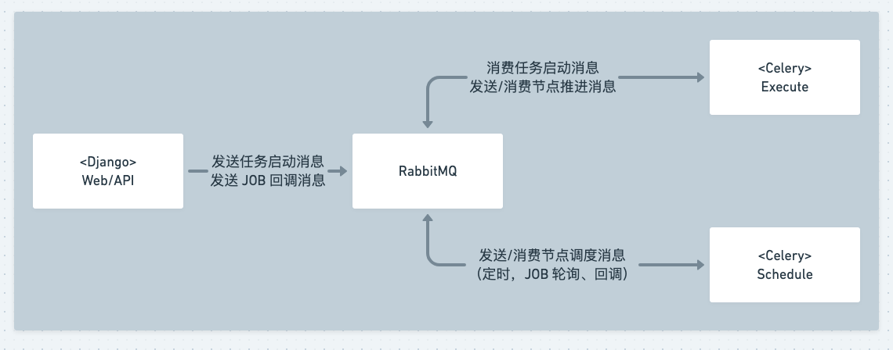

# 故障排查手册

## 基础性能指标确认

- 确认容器/POD的 CPU，内存占用是否正常

## 日志查询

- 如果是 SaaS 页面上触发的错误，可以通过错误响应中的 Sops-Trace-Id 响应头从后台日志中检索该请求的所有相关日志
- 如果是流程执行阶段产生的异常（如流程僵死），可从 Celery 日志中检索 ERROR 关键字查找相关信息

如果经过上述操作后仍无法定位问题，请尝试从标准运维部署架构并结合实际实施部署方式来进行问题的排查和定位

## 部署架构

结合上图，再根据实际问题进行定位和排查，例如：

- JOB 作业已执行完成，标准运维 JOB 节点未往下执行
  - 参考附录检查 Web/API 模块是否已经成功收到 JOB 回调
  - 检查 Web/API 模块到 Rabbitmq 的联通性
  - 检查 Schedule 模块到 Rabbitmq 的联通性
  - 检查 Schedule 进程是否健康

## 附录

### 查询 JOB 回调记录

1. 从 JOB 执行节点日志中查找 `bk_callback_url` 关键字，获取回调 URL
2. 从后台日志中检索回调 URL `xxx/callback/` 后的 ID 段，查询回调日志
3. 如果检索不到日志，说明未收到回调
