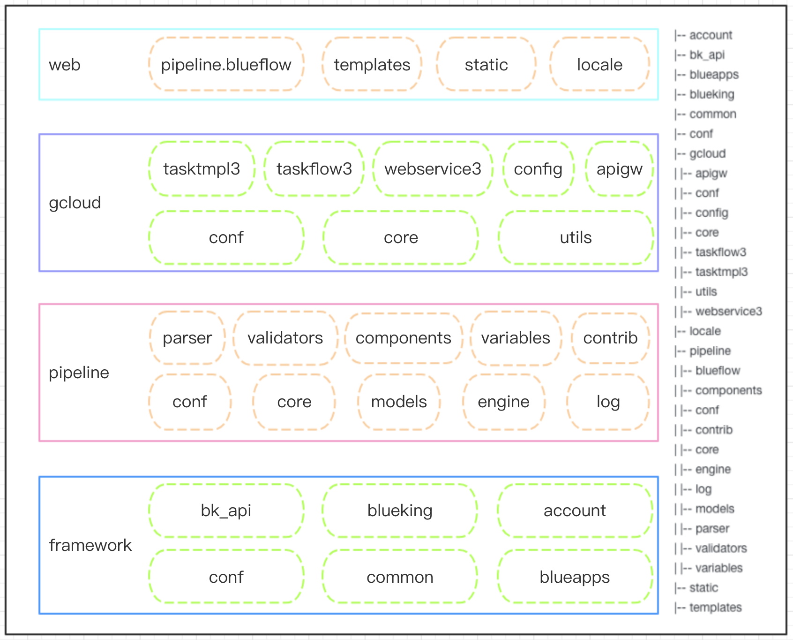

# 代码目录

代码主要可以分为蓝鲸开发框架层 framework、流程引擎服务层 pipeline、标准运维业务层 gcloud 以及前端展示层 web。

- framework

  蓝鲸基于 django 框架的二次封装架构，主要提供 SaaS 运营在蓝鲸 PaaS 上的基础配置和服务。

  config：工程各部署环境配置，如本地环境、测试环境、正式环境，以及路由配置。

  blueapps：新版开发框架核心模块，包括蓝鲸统一登录、鉴权、中间件和公共函数。

  packages：蓝鲸 API Gateway SDK，包括配置平台、作业平台等提供的API。

- pipeline、pipeline_web、pipeline_plugins

  自研的流程引擎框架，主要包含任务流程编排页面和任务流程执行服务。

  conf：默认配置。

  core：参考 BPMN2.0 规范，定义了一些核心元素如 Activity、网关、事件和数据对象 Data，以及 pipeline 的整体结构。

  models：存储结构定义和相关的方法。

  engine：runtime 执行逻辑和任务状态管理。

  log：日志持久化存储和管理。

  parser：前端数据结构解析。

  validators：数据校验，如环状结构检测和数据合法性校验。

  component_framework：插件框架和插件定义。

  variables：全局变量定义。

  contrib：扩展功能，如数据统计和前端 API。
  
  pipeline_web：前端数据适配层，支持前端画布生成的流程数据。
  
  pipeline_plugins：标准运维官方插件库和全局自定义变量。

- gcloud

  基于流程引擎框架封装的业务适配层，包含业务权限控制、流程模板管理、任务管理、业务配置、API 等功能。

  conf：配置动态适配层。

  core：业务核心逻辑，权限控制，业务首页。

  utils：公共函数和模块。

  tasktmpl3：流程模板管理。

  taskflow3：任务管理。

  webservice3：数据资源 API 管理。

  config：业务配置。

  apigw：对外 API 模块。

- web

  前端资源，包括 webpack 配置和静态资源。

  frontend：主要包括流程编排 desktop 模块，该模块是基于 vue 实现的。

  static：插件 components 和变量 variables 的前端定义文件，都放在各自模块的 static 目录下。

  templates：包含首页和 django admin 需要的页面。

  locale：国际化翻译文件。
