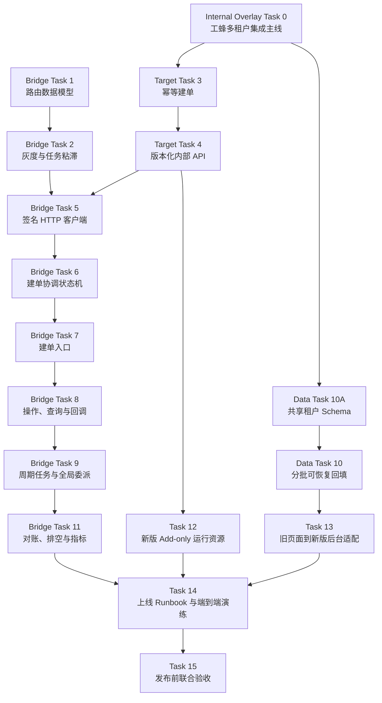

# 标准运维多租户灰度迁移 Implementation Plan

> **For agentic workers:** REQUIRED SUB-SKILL: Use superpowers:subagent-driven-development (recommended) or superpowers:executing-plans to implement this plan task-by-task. Steps use checkbox (`- [ ]`) syntax for tracking.

**Goal:** 在不迁移旧版运行资源、不打断存量任务的前提下，以业务为单位将标准运维从工蜂旧运行时灰度迁移到完成内部代码升级的工蜂多租户目标版本。

**Architecture:** 工蜂 `V3.6.X` 发布 Bridge Release，继续使用现有 `/bk_sops` 和 Redis，并承担 `bk_biz_id` 灰度、任务固定路由和内部 HTTP 转发。开源 `dev_multi_tenant` 先进入工蜂多租户集成主线，移植并升级长期内部代码后，才生成使用 `/bk_sops_mt` 和独立 Redis 的目标制品；共享 MySQL 采用 Expand、分批回填、Verify、Contract。

**Tech Stack:** Python 3.6/3.11、Django 3.2/4.2、Celery 4/5、bamboo-engine 2.6/3.0、MySQL、RabbitMQ、Redis、pytest

**Spec:** `docs/specs/2026-09-04-multi-tenant-gray-migration-design.md`

**Internal Overlay Subplan:** `docs/plans/2026-09-04-bk-sops-internal-overlay-py311-migration.md`

**TAPD:** [标准运维内部环境多租户版本平滑迁移](https://tapd.woa.com/10131351/prong/stories/view/1010131351137932246)

## Global Constraints

- 灰度维度固定为 `bk_biz_id`，不得按 `tenant_id`、用户或逐请求随机比例灰度。
- 迁移前任务无路由记录时默认为旧版；`pending/creating/unknown` 不得默认为旧版。
- 旧版继续使用现有 `/bk_sops`、队列、RabbitMQ 账号、Redis 和进程配置，禁止改名或迁移。
- 新版使用新增 `/bk_sops_mt`、专用 RabbitMQ 账号和独立 Redis 空间。
- Bridge 与新版只能通过版本化内部 HTTP API 交互，禁止跨版本发布 Celery 消息。
- 新版任务在 Bridge 路由记录进入 `ready` 前不得启动。
- 灰度期间共享 MySQL，不实施新旧业务数据双写。
- legacy 活跃任务归零是停止旧 Worker 和切换后台权威入口的硬门禁。
- 新版只保留长期接口兼容；不得引入旧表、旧引擎状态机和旧 Celery 签名兼容。
- Bridge 必须以工蜂 `V3.6.X` 为发布基线，禁止对旧运行面原地升级 Python、Django 或 Celery。
- Target 必须从工蜂多租户集成主线发布；开源 `dev_multi_tenant` 只能作为代码基线，禁止直接部署。
- 禁止将工蜂 `V3.6.X` 整体合入 Target；内部代码必须按清单逐项移植并完成 Python 3.11 验证。
- 业务进入灰度前，其流程引用的内部插件、API、周期任务和回调必须全部通过 Target 能力准入。
- 实施前必须取得用户确认的 TAPD Story ID，并设置 `BK_SOPS_MIGRATION_TAPD_STORY`；每个 commit 都要附带 `--story=${BK_SOPS_MIGRATION_TAPD_STORY}`。
- Bridge 和目标版本必须在独立 worktree、独立分支实现；执行前使用 `superpowers:using-git-worktrees`。

---

## Worktree 与文件边界

### Bridge worktree

- 基线：执行时重新获取并确认 `woa/V3.6.X`，记录精确 SHA 及其最近一次 GitHub `master` 同步点。
- 分支：`feat/sops-multi-tenant-migration-bridge`。
- 新包：`gcloud/migration_bridge/`，只放临时迁移能力。
- 现有任务接口只调用 `migration_bridge` 的服务，不散落版本判断。

### Target worktree

- 代码基线：执行时重新获取并确认 `upstream/dev_multi_tenant` 的精确 SHA。
- 发布基线：先按内部代码迁移子计划建立并验收工蜂多租户集成主线；后续 Target 功能分支从该主线创建。
- 分支：`feat/sops-multi-tenant-internal-api`。
- 新包：`gcloud/taskflow3/internal_api/`，只放长期可保留的内部接口适配。
- 幂等记录使用业务中性的 `TaskCreateRequest`，不依赖 Bridge 路由表。

### 共享与运维文件

- Spec：`docs/specs/2026-09-04-multi-tenant-gray-migration-design.md`。
- Runbook：`docs/zh_hans/ops/multi_tenant_gray_migration.md`。
- 部署检查脚本：`scripts/migration/verify_runtime_isolation.py`。
- 数据检查脚本：使用 Django management command，避免维护脱离模型的 SQL。

---

### Task 0: 建立并验收工蜂多租户集成主线

**Files:**
- Create in Gongfeng target branch: `scripts/migration/internal_overlay_manifest.yaml`
- Create in Gongfeng target branch: `scripts/migration/validate_internal_overlay_manifest.py`
- Create in Gongfeng target branch: `scripts/migration/check_business_target_capabilities.py`
- Create in Gongfeng target branch: `gcloud/tests/migration/test_internal_overlay_manifest.py`
- Follow: `docs/plans/2026-09-04-bk-sops-internal-overlay-py311-migration.md`

**Interfaces:**
- Produces: 工蜂多租户集成主线的受保护分支和精确基线 SHA。
- Produces: `internal_overlay_manifest.yaml`，记录内部差异的移植、删除或 legacy-only 决策。
- Produces: `check_business_target_capabilities --bk-biz-id BK_BIZ_ID`，返回业务是否具备 Target 灰度资格。
- Blocks: Target Tasks 3、4、10A、10、12、13 以及任何业务灰度。

- [ ] **Step 1: 执行内部代码迁移子计划**

按 `docs/plans/2026-09-04-bk-sops-internal-overlay-py311-migration.md` 完成内部差异盘点、
Python 3.11 改造、工蜂多租户集成主线建立和全部模块影子部署。

- [ ] **Step 2: 验证清单没有未决项**

Run in the Gongfeng Target worktree:
`python scripts/migration/validate_internal_overlay_manifest.py --fail-on pending,unknown`

Expected: exit code 0；每个内部差异均明确为 `ported`、`reimplemented`、`dropped` 或
`legacy_only`，且 `ported/reimplemented` 项具有 Python 3.11 测试证据。

- [ ] **Step 3: 验证目标运行时和关键依赖**

Run: `python --version`

Run: `python -c "import django, celery; print(django.get_version(), celery.__version__)"`

Expected: Python `3.11.10`、Django `4.2.30`、Celery `5.2.7`。

- [ ] **Step 4: 验证全部目标模块制品来源一致**

对 Web、API Server、Pipeline Worker、Callback、Cleaner、API Inner 和 Open Plugin
逐一读取构建元数据，确认均来自同一个已验收的工蜂多租户集成 SHA；任何模块使用
GitHub 原始分支、工蜂 `V3.6.X` 或其他 SHA 时失败。

- [ ] **Step 5: 验证首批业务能力准入**

Run:
`python scripts/migration/check_business_target_capabilities.py --bk-biz-id "${BK_SOPS_GRAY_BIZ_ID}" --strict`

Expected: exit code 0；业务引用的每个插件、API、周期任务和回调能力均为 `ready`。

---

### Task 1: 建立旧版 Bridge 路由数据模型

**Files:**
- Create: `gcloud/migration_bridge/__init__.py`
- Create: `gcloud/migration_bridge/apps.py`
- Create: `gcloud/migration_bridge/constants.py`
- Create: `gcloud/migration_bridge/exceptions.py`
- Create: `gcloud/migration_bridge/models.py`
- Create: `gcloud/migration_bridge/migrations/0001_initial.py`
- Create: `gcloud/tests/migration_bridge/test_models.py`
- Modify: `config/default.py`

**Interfaces:**
- Produces: `RuntimeLane`, `RouteState`, `MigrationGrayBusiness`, `MigrationTaskRoute`。
- Produces: `MigrationTaskRoute.objects.resolve_task_lane(task_id: int) -> str`。
- Produces: `MigrationTaskRoute.objects.resolve_request_lane(migration_request_id: str) -> str`。
- Produces: `MigrationTaskRoute.objects.reserve(migration_request_id: str, bk_biz_id: int, runtime_lane: str, client_request_id: str | None) -> MigrationTaskRoute`。

- [ ] **Step 1: 写路由模型失败测试**

```python
def test_missing_route_defaults_to_legacy():
    assert MigrationTaskRoute.objects.resolve_task_lane(task_id=10001) == RuntimeLane.LEGACY


def test_pending_route_never_defaults_to_legacy():
    MigrationTaskRoute.objects.create(
        migration_request_id="req-1",
        bk_biz_id=2,
        runtime_lane=RuntimeLane.MT,
        route_state=RouteState.PENDING,
    )
    with pytest.raises(RouteNotReadyError):
        MigrationTaskRoute.objects.resolve_request_lane("req-1")
```

- [ ] **Step 2: 运行测试并确认失败**

Run: `pytest gcloud/tests/migration_bridge/test_models.py -q`

Expected: FAIL，提示 `gcloud.migration_bridge` 或模型尚不存在。

- [ ] **Step 3: 实现最小模型和状态枚举**

```python
class RuntimeLane:
    LEGACY = "legacy"
    MT = "mt"


class RouteState:
    PENDING = "pending"
    CREATING = "creating"
    READY = "ready"
    FAILED = "failed"
    UNKNOWN = "unknown"


class MigrationGrayBusiness(models.Model):
    bk_biz_id = models.IntegerField(unique=True)
    enabled = models.BooleanField(default=False)
    operator = models.CharField(max_length=64)
    updated_at = models.DateTimeField(auto_now=True)


class MigrationTaskRoute(models.Model):
    migration_request_id = models.CharField(max_length=64, unique=True)
    client_request_id = models.CharField(max_length=128, null=True, blank=True)
    bk_biz_id = models.IntegerField(db_index=True)
    runtime_lane = models.CharField(max_length=16)
    task_id = models.BigIntegerField(null=True, blank=True, unique=True)
    callback_route_token_hash = models.CharField(max_length=64, null=True, blank=True, unique=True)
    route_state = models.CharField(max_length=16, default=RouteState.PENDING, db_index=True)
    error_code = models.CharField(max_length=64, blank=True)
    error_message = models.TextField(blank=True)
    created_at = models.DateTimeField(auto_now_add=True)
    updated_at = models.DateTimeField(auto_now=True)
```

- [ ] **Step 4: 生成并检查 migration**

Run: `python manage.py makemigrations migration_bridge`

Expected: 只创建灰度业务表和任务路由表，不修改现有业务表。

- [ ] **Step 5: 运行模型测试**

Run: `pytest gcloud/tests/migration_bridge/test_models.py -q`

Expected: PASS。

- [ ] **Step 6: 提交**

```bash
git add config/default.py gcloud/migration_bridge/__init__.py gcloud/migration_bridge/apps.py gcloud/migration_bridge/constants.py gcloud/migration_bridge/exceptions.py gcloud/migration_bridge/models.py gcloud/migration_bridge/migrations/0001_initial.py gcloud/tests/migration_bridge/test_models.py
git commit -m "feat: 增加多租户迁移路由模型 --story=${BK_SOPS_MIGRATION_TAPD_STORY}"
```

### Task 2: 实现业务灰度与任务粘滞决策服务

**Files:**
- Create: `gcloud/migration_bridge/services/__init__.py`
- Create: `gcloud/migration_bridge/services/routing.py`
- Create: `gcloud/migration_bridge/management/commands/set_migration_gray_business.py`
- Create: `gcloud/tests/migration_bridge/test_routing.py`
- Create: `gcloud/tests/migration_bridge/test_set_gray_business_command.py`

**Interfaces:**
- Consumes: Task 1 的 `MigrationGrayBusiness`、`MigrationTaskRoute`。
- Produces: `MigrationRoutingService.route_new_task(bk_biz_id: int) -> str`。
- Produces: `MigrationRoutingService.route_existing_task(task_id: int) -> str`。

- [ ] **Step 1: 写稳定业务灰度测试**

```python
def test_new_task_uses_biz_allowlist(db):
    MigrationGrayBusiness.objects.create(bk_biz_id=2, enabled=True, operator="tester")
    service = MigrationRoutingService()
    assert service.route_new_task(2) == RuntimeLane.MT
    assert service.route_new_task(3) == RuntimeLane.LEGACY


def test_existing_task_route_wins_over_current_biz_setting(db):
    MigrationGrayBusiness.objects.create(bk_biz_id=2, enabled=False, operator="tester")
    MigrationTaskRoute.objects.create(
        migration_request_id="req-2",
        bk_biz_id=2,
        runtime_lane=RuntimeLane.MT,
        task_id=20001,
        route_state=RouteState.READY,
    )
    assert MigrationRoutingService().route_existing_task(20001) == RuntimeLane.MT
```

- [ ] **Step 2: 运行测试并确认失败**

Run: `pytest gcloud/tests/migration_bridge/test_routing.py -q`

Expected: FAIL，提示 `MigrationRoutingService` 不存在。

- [ ] **Step 3: 实现决策服务和显式灰度命令**

```python
class MigrationRoutingService:
    def route_new_task(self, bk_biz_id):
        enabled = MigrationGrayBusiness.objects.filter(bk_biz_id=bk_biz_id, enabled=True).exists()
        return RuntimeLane.MT if enabled else RuntimeLane.LEGACY

    def route_existing_task(self, task_id):
        return MigrationTaskRoute.objects.resolve_task_lane(task_id)
```

命令接口固定为：

```bash
python manage.py set_migration_gray_business --bk-biz-id 2 --enable --operator dannydeng
python manage.py set_migration_gray_business --bk-biz-id 2 --disable --operator dannydeng
```

- [ ] **Step 4: 运行测试**

Run: `pytest gcloud/tests/migration_bridge/test_routing.py gcloud/tests/migration_bridge/test_set_gray_business_command.py -q`

Expected: PASS。

- [ ] **Step 5: 提交**

```bash
git add gcloud/migration_bridge/services/__init__.py gcloud/migration_bridge/services/routing.py gcloud/migration_bridge/management/commands/set_migration_gray_business.py gcloud/tests/migration_bridge/test_routing.py gcloud/tests/migration_bridge/test_set_gray_business_command.py
git commit -m "feat: 增加按业务灰度的任务路由服务 --story=${BK_SOPS_MIGRATION_TAPD_STORY}"
```

### Task 3: 在目标版本实现通用幂等建单记录

**Files:**
- Modify: `gcloud/taskflow3/models.py`
- Create: `gcloud/taskflow3/migrations/0026_task_create_request.py`
- Create: `gcloud/taskflow3/services/idempotent_task_create.py`
- Create: `gcloud/tests/taskflow3/services/test_idempotent_task_create.py`

**Interfaces:**
- Produces: `TaskCreateRequest(idempotency_key, request_hash, state, task_id, error_code, created_at, updated_at)`。
- Produces: `IdempotentTaskCreateService.prepare(idempotency_key: str, request_payload: dict, create: Callable[[], TaskFlowInstance]) -> TaskCreateResult`。
- Produces: `IdempotentTaskCreateService.get(idempotency_key: str) -> TaskCreateResult`。

- [ ] **Step 1: 写同键同请求复用、同键异请求冲突测试**

```python
def test_same_key_and_payload_returns_same_task(db):
    first = service.prepare("idem-1", payload, create_task)
    second = service.prepare("idem-1", payload, create_task)
    assert second.task_id == first.task_id
    assert create_task.call_count == 1


def test_same_key_with_different_payload_is_rejected(db):
    service.prepare("idem-1", {"name": "a"}, create_task)
    with pytest.raises(IdempotencyConflict):
        service.prepare("idem-1", {"name": "b"}, create_task)
```

- [ ] **Step 2: 运行测试并确认失败**

Run: `pytest gcloud/tests/taskflow3/services/test_idempotent_task_create.py -q`

Expected: FAIL，提示幂等服务不存在。

- [ ] **Step 3: 实现请求规范化、SHA-256 摘要和数据库唯一约束**

```python
def canonical_request_hash(payload):
    body = json.dumps(payload, sort_keys=True, separators=(",", ":"), ensure_ascii=False)
    return hashlib.sha256(body.encode("utf-8")).hexdigest()
```

使用 `transaction.atomic()` 和唯一键处理并发首请求；发现已存在记录时比较
`request_hash`，禁止同一 key 复用不同请求。

- [ ] **Step 4: 生成 migration 并运行测试**

Run: `python manage.py makemigrations taskflow3`

Expected: 创建 `0026_task_create_request.py`；若执行时目标分支已有新的 `0026`，使用当时的下一个连续编号并更新依赖。

Run: `pytest gcloud/tests/taskflow3/services/test_idempotent_task_create.py -q`

Expected: PASS，包括两个并发请求只创建一个任务。

- [ ] **Step 5: 提交**

```bash
git add gcloud/taskflow3/models.py gcloud/taskflow3/migrations/0026_task_create_request.py gcloud/taskflow3/services/idempotent_task_create.py gcloud/tests/taskflow3/services/test_idempotent_task_create.py
git commit -m "feat: 增加幂等任务创建能力 --story=${BK_SOPS_MIGRATION_TAPD_STORY}"
```

### Task 4: 在目标版本实现版本化内部任务 API

**Files:**
- Create: `gcloud/taskflow3/internal_api/__init__.py`
- Create: `gcloud/taskflow3/internal_api/authentication.py`
- Create: `gcloud/taskflow3/internal_api/urls.py`
- Create: `gcloud/taskflow3/internal_api/views.py`
- Create: `gcloud/taskflow3/internal_api/serializers.py`
- Create: `gcloud/tests/taskflow3/internal_api/test_authentication.py`
- Create: `gcloud/tests/taskflow3/internal_api/test_tasks.py`
- Modify: `config/urls_custom.py`
- Modify: `config/default.py`

**Interfaces:**
- Consumes: Task 3 的 `IdempotentTaskCreateService`。
- Produces: `POST /internal/v1/tasks/prepare/`。
- Produces: `GET /internal/v1/task-requests/<idempotency_key>/`。
- Produces: `POST /internal/v1/tasks/<task_id>/start/`。
- Produces: `POST /internal/v1/tasks/<task_id>/operations/`。
- Produces: `POST /internal/v1/tasks/<task_id>/callbacks/`。

- [ ] **Step 1: 写鉴权和建单不启动测试**

```python
def test_unsigned_internal_request_is_rejected(client):
    response = client.post("/internal/v1/tasks/prepare/", data={}, content_type="application/json")
    assert response.status_code == 401


def test_prepare_creates_task_without_publishing_celery(client, signed_headers, mocker):
    publish = mocker.patch("gcloud.taskflow3.celery.tasks.prepare_and_start_task.apply_async")
    response = client.post(PREPARE_URL, data=payload, content_type="application/json", **signed_headers)
    assert response.status_code == 201
    assert response.json()["data"]["state"] == "prepared"
    publish.assert_not_called()
```

- [ ] **Step 2: 运行测试并确认失败**

Run: `pytest gcloud/tests/taskflow3/internal_api -q`

Expected: FAIL，接口返回 404。

- [ ] **Step 3: 实现 HMAC 服务鉴权**

签名内容固定为：

```text
HTTP_METHOD + "\n" + PATH + "\n" + UNIX_TIMESTAMP + "\n" + NONCE + "\n" + SHA256(BODY)
```

校验时间偏差不超过 60 秒，Nonce 在 Redis 中使用 `SET NX EX 120` 防重放。密钥通过
`BKAPP_MIGRATION_INTERNAL_API_SECRET` 注入，不写入日志。

- [ ] **Step 4: 实现 prepare、lookup、start 和 operation API**

`prepare` 复用目标版本现有创建逻辑，但不执行
`prepare_and_start_task.apply_async()`。`start` 使用数据库行锁保证只发布一次，并向新版
自身配置的 broker 发布。

- [ ] **Step 5: 运行接口测试**

Run: `pytest gcloud/tests/taskflow3/internal_api gcloud/tests/taskflow3/services/test_idempotent_task_create.py -q`

Expected: PASS，重复 prepare/start 不产生重复 TaskFlowInstance 或 Celery 消息。

- [ ] **Step 6: 提交**

```bash
git add config/default.py config/urls_custom.py gcloud/taskflow3/internal_api/__init__.py gcloud/taskflow3/internal_api/authentication.py gcloud/taskflow3/internal_api/urls.py gcloud/taskflow3/internal_api/views.py gcloud/taskflow3/internal_api/serializers.py gcloud/tests/taskflow3/internal_api/test_authentication.py gcloud/tests/taskflow3/internal_api/test_tasks.py
git commit -m "feat: 增加版本化内部任务接口 --story=${BK_SOPS_MIGRATION_TAPD_STORY}"
```

### Task 5: 在 Bridge 实现签名 HTTP 客户端

**Files:**
- Create: `gcloud/migration_bridge/client.py`
- Create: `gcloud/migration_bridge/types.py`
- Create: `gcloud/tests/migration_bridge/test_client.py`
- Modify: `config/default.py`

**Interfaces:**
- Consumes: Task 4 的内部 API。
- Produces: `MigrationTargetClient.prepare_task(idempotency_key: str, payload: dict) -> PreparedTask`。
- Produces: `MigrationTargetClient.get_task_request(idempotency_key: str) -> TaskRequestStatus`。
- Produces: `MigrationTargetClient.start_task(task_id: int, idempotency_key: str) -> StartResult`。
- Produces: `MigrationTargetClient.operate_task(task_id: int, operation: str, payload: dict) -> dict`。

- [ ] **Step 1: 写签名、超时和脱敏测试**

```python
def test_prepare_timeout_raises_unknown_result(responses):
    responses.post(PREPARE_URL, body=requests.Timeout())
    with pytest.raises(TargetResultUnknown):
        client.prepare_task("idem-1", payload)


def test_secret_is_not_in_exception_message():
    with pytest.raises(TargetRequestError) as exc:
        client.prepare_task("idem-1", payload)
    assert settings.MIGRATION_INTERNAL_API_SECRET not in str(exc.value)
```

- [ ] **Step 2: 运行测试并确认失败**

Run: `pytest gcloud/tests/migration_bridge/test_client.py -q`

Expected: FAIL，客户端不存在。

- [ ] **Step 3: 实现客户端**

连接超时和读取超时分别配置，默认 `connect=2s/read=10s`。只对明确幂等的 GET 或带
固定 idempotency key 的请求重试；记录状态码、耗时、目标模块和 trace_id，不记录密钥
和敏感请求体。

- [ ] **Step 4: 运行测试**

Run: `pytest gcloud/tests/migration_bridge/test_client.py -q`

Expected: PASS。

- [ ] **Step 5: 提交**

```bash
git add config/default.py gcloud/migration_bridge/client.py gcloud/migration_bridge/types.py gcloud/tests/migration_bridge/test_client.py
git commit -m "feat: 增加新版内部接口客户端 --story=${BK_SOPS_MIGRATION_TAPD_STORY}"
```

### Task 6: 实现 Bridge 建单协调状态机

**Files:**
- Create: `gcloud/migration_bridge/services/task_handoff.py`
- Create: `gcloud/tests/migration_bridge/test_task_handoff.py`

**Interfaces:**
- Consumes: Task 1 路由模型、Task 2 路由服务、Task 5 HTTP 客户端。
- Produces: `TaskHandoffService.create_and_start(bk_biz_id: int, payload: dict, client_request_id: str | None) -> HandoffResult`。

- [ ] **Step 1: 写正常、prepare 超时、start 超时测试**

```python
def test_route_is_ready_before_target_start(db, client):
    client.start_task.side_effect = lambda *args, **kwargs: assert_route_state(RouteState.READY)
    result = service.create_and_start(2, payload, "client-1")
    assert result.task_id


def test_prepare_timeout_queries_same_idempotency_key(db, client):
    client.prepare_task.side_effect = TargetResultUnknown()
    client.get_task_request.return_value = TaskRequestStatus.prepared(task_id=30001)
    result = service.create_and_start(2, payload, "client-1")
    assert result.task_id == 30001


def test_unknown_result_never_falls_back_to_legacy(db, client):
    client.prepare_task.side_effect = TargetResultUnknown()
    client.get_task_request.side_effect = TargetResultUnknown()
    with pytest.raises(HandoffResultUnknown):
        service.create_and_start(2, payload, "client-1")
    assert MigrationTaskRoute.objects.get().route_state == RouteState.UNKNOWN
```

- [ ] **Step 2: 运行测试并确认失败**

Run: `pytest gcloud/tests/migration_bridge/test_task_handoff.py -q`

Expected: FAIL，协调服务不存在。

- [ ] **Step 3: 实现状态机和事务边界**

Bridge 先生成 UUID4 `migration_request_id` 并保存 `pending`，再进入 `creating`。收到
task_id 后在独立事务中写入 `task_id + ready`，事务提交后才调用 `start_task`。

- [ ] **Step 4: 运行故障路径测试**

Run: `pytest gcloud/tests/migration_bridge/test_task_handoff.py -q`

Expected: PASS；任何超时都不会调用旧版建单函数。

- [ ] **Step 5: 提交**

```bash
git add gcloud/migration_bridge/services/task_handoff.py gcloud/tests/migration_bridge/test_task_handoff.py
git commit -m "feat: 增加跨版本幂等建单协调 --story=${BK_SOPS_MIGRATION_TAPD_STORY}"
```

### Task 7: 接入页面和 APIGW 建单入口

**Files:**
- Create: `gcloud/migration_bridge/integrations/task_create.py`
- Create: `gcloud/tests/migration_bridge/integrations/test_task_create.py`
- Modify: `gcloud/apigw/views/create_task.py`
- Modify: `gcloud/apigw/views/create_and_start_task.py`
- Modify: `gcloud/apigw/views/fast_create_task.py`
- Modify: `gcloud/apigw/views/start_task.py`
- Modify: `gcloud/core/apis/drf/viewsets/taskflow.py`
- Create: `gcloud/tests/apigw/views/test_fast_create_task.py`
- Modify: `gcloud/tests/apigw/views/test_create_task.py`
- Modify: `gcloud/tests/apigw/views/test_create_and_start_task.py`
- Modify: `gcloud/tests/apigw/views/test_start_task.py`
- Modify: `gcloud/tests/core/apis/drf/views_set/test_task_instance_view.py`

**Interfaces:**
- Consumes: Task 2、Task 6。
- Produces: `dispatch_task_create(bk_biz_id, payload, legacy_callable, client_request_id=None)`。

- [ ] **Step 1: 写“开关关闭保持原路径”回归测试**

```python
def test_non_gray_business_calls_original_create(legacy_create, target_client):
    result = dispatch_task_create(3, payload, legacy_create)
    legacy_create.assert_called_once_with()
    target_client.prepare_task.assert_not_called()
```

- [ ] **Step 2: 写“灰度业务只调用新版 HTTP”测试**

```python
def test_gray_business_calls_target_without_legacy_celery(gray_biz, legacy_create, target_client):
    dispatch_task_create(gray_biz, payload, legacy_create, client_request_id="ui-1")
    legacy_create.assert_not_called()
    target_client.prepare_task.assert_called_once()
```

- [ ] **Step 3: 运行定向测试并确认失败**

Run: `pytest gcloud/tests/migration_bridge/integrations/test_task_create.py -q`

Expected: FAIL，入口适配不存在。

- [ ] **Step 4: 实现统一入口适配并接入五类建单路径**

只在现有参数校验、IAM 鉴权和项目解析完成后进行路由；非灰度业务调用原函数，确保
返回结构、日志和 Celery 投递完全不变。灰度业务构造稳定的内部请求 DTO 并调用 Task 6。

- [ ] **Step 5: 运行建单回归测试**

Run: `pytest gcloud/tests/apigw/views/test_create_task.py gcloud/tests/apigw/views/test_create_and_start_task.py gcloud/tests/apigw/views/test_start_task.py gcloud/tests/core/apis/drf/views_set/test_task_instance_view.py -q`

Expected: PASS；现有用例不改语义，新增用例覆盖灰度路径。

- [ ] **Step 6: 提交**

```bash
git add gcloud/migration_bridge/integrations/task_create.py gcloud/tests/migration_bridge/integrations/test_task_create.py gcloud/apigw/views/create_task.py gcloud/apigw/views/create_and_start_task.py gcloud/apigw/views/fast_create_task.py gcloud/apigw/views/start_task.py gcloud/core/apis/drf/viewsets/taskflow.py gcloud/tests/apigw/views/test_create_task.py gcloud/tests/apigw/views/test_create_and_start_task.py gcloud/tests/apigw/views/test_fast_create_task.py gcloud/tests/apigw/views/test_start_task.py gcloud/tests/core/apis/drf/views_set/test_task_instance_view.py
git commit -m "feat: 接入按业务灰度的建单入口 --story=${BK_SOPS_MIGRATION_TAPD_STORY}"
```

### Task 8: 接入已有任务操作、查询与回调路由

**Files:**
- Create: `gcloud/migration_bridge/integrations/task_operation.py`
- Create: `gcloud/migration_bridge/integrations/callback.py`
- Create: `gcloud/tests/migration_bridge/integrations/test_task_operation.py`
- Create: `gcloud/tests/migration_bridge/integrations/test_callback.py`
- Modify: `gcloud/apigw/views/operate_task.py`
- Modify: `gcloud/apigw/views/operate_node.py`
- Modify: `gcloud/apigw/views/get_task_detail.py`
- Modify: `gcloud/apigw/views/get_task_status.py`
- Modify: `gcloud/apigw/views/get_task_node_detail.py`
- Modify: `gcloud/apigw/views/node_callback.py`
- Modify: `gcloud/taskflow3/apis/django/v4/node_callback.py`
- Modify: `gcloud/core/apis/drf/viewsets/taskflow.py`

**Interfaces:**
- Consumes: `MigrationRoutingService.route_existing_task()`、`MigrationTargetClient.operate_task()`。
- Produces: `dispatch_existing_task(task_id, legacy_callable, target_callable)`。
- Produces: `dispatch_callback(route_key, payload)`。

- [ ] **Step 1: 写任务归属优先于当前业务灰度状态的测试**

```python
def test_mt_task_stays_on_target_after_biz_gray_disabled(mt_route, disable_gray_biz):
    dispatch_existing_task(mt_route.task_id, legacy, target)
    target.assert_called_once()
    legacy.assert_not_called()
```

- [ ] **Step 2: 写历史任务无记录默认旧版和 pending 拒绝测试**

```python
def test_historical_task_without_route_calls_legacy():
    dispatch_existing_task(99, legacy, target)
    legacy.assert_called_once()


def test_pending_route_returns_retryable_error(pending_route):
    with pytest.raises(RouteNotReadyError):
        dispatch_existing_task(pending_route.task_id, legacy, target)
```

- [ ] **Step 3: 实现查询、操作与回调分发**

回调请求没有 task_id 时，Bridge 使用生成任务时保存的 `callback_route_token`；令牌使用
至少 128 bit 随机值，只记录摘要，不在日志中打印原值。

- [ ] **Step 4: 运行任务操作和回调测试**

Run: `pytest gcloud/tests/migration_bridge/integrations gcloud/tests/apigw/views/test_operate_task.py gcloud/tests/apigw/views/test_node_callback.py gcloud/tests/taskflow3/test_node_callback_v4.py -q`

Expected: PASS。

- [ ] **Step 5: 提交**

```bash
git add gcloud/migration_bridge/integrations/task_operation.py gcloud/migration_bridge/integrations/callback.py gcloud/tests/migration_bridge/integrations/test_task_operation.py gcloud/tests/migration_bridge/integrations/test_callback.py gcloud/apigw/views/operate_task.py gcloud/apigw/views/operate_node.py gcloud/apigw/views/get_task_detail.py gcloud/apigw/views/get_task_status.py gcloud/apigw/views/get_task_node_detail.py gcloud/apigw/views/node_callback.py gcloud/taskflow3/apis/django/v4/node_callback.py gcloud/core/apis/drf/viewsets/taskflow.py gcloud/tests/apigw/views/test_operate_task.py gcloud/tests/apigw/views/test_operate_node.py gcloud/tests/apigw/views/test_get_task_detail.py gcloud/tests/apigw/views/test_get_task_status.py gcloud/tests/apigw/views/test_get_task_node_detail.py gcloud/tests/apigw/views/test_node_callback.py gcloud/tests/taskflow3/test_node_callback_v4.py gcloud/tests/core/apis/drf/views_set/test_task_instance_view.py
git commit -m "feat: 接入任务操作和回调固定路由 --story=${BK_SOPS_MIGRATION_TAPD_STORY}"
```

### Task 9: 接入周期任务、Cleaner 与全局任务委派

**Files:**
- Create: `gcloud/migration_bridge/services/background_jobs.py`
- Create: `gcloud/tests/migration_bridge/test_background_jobs.py`
- Modify: `gcloud/periodictask/models.py`
- Modify: `gcloud/clocked_task/tasks.py`
- Modify: `gcloud/contrib/cleaner/tasks.py`
- Modify: `gcloud/contrib/cleaner/pipeline/bamboo_engine_tasks.py`
- Modify: `gcloud/core/tasks.py`
- Modify: `gcloud/tests/periodictask/models/test_periodic_task.py`
- Modify: `gcloud/tests/clocked_task/test_tasks.py`
- Create: `gcloud/tests/contrib/cleaner/test_migration_partition.py`

**Interfaces:**
- Consumes: Task 2、Task 5、Task 8。
- Produces: `dispatch_scheduled_create(bk_biz_id, schedule_id, scheduled_at, payload)`。
- Produces: `partition_maintenance_task_ids(task_ids: list[int]) -> tuple[list[int], list[int]]`。

- [ ] **Step 1: 写周期任务稳定幂等键测试**

```python
def test_periodic_run_uses_stable_idempotency_key():
    key = build_periodic_idempotency_key(periodic_task_id=7, scheduled_at="2026-09-04T01:00:00Z")
    assert key == build_periodic_idempotency_key(7, "2026-09-04T01:00:00Z")
```

- [ ] **Step 2: 写 Cleaner 不处理 mt 任务测试**

```python
def test_cleaner_partitions_target_tasks(mt_route):
    legacy_ids, mt_ids = partition_maintenance_task_ids([1, mt_route.task_id])
    assert legacy_ids == [1]
    assert mt_ids == [mt_route.task_id]
```

- [ ] **Step 3: 实现周期建单和维护任务分区**

旧 Beat 的启动命令、broker 和 schedule 表保持不变。灰度周期任务通过 HTTP 交给新版；
Cleaner 对旧任务执行原逻辑，对 mt task_id 调用新版维护 API。

- [ ] **Step 4: 运行后台任务测试**

Run: `pytest gcloud/tests/periodictask gcloud/tests/clocked_task gcloud/tests/contrib/cleaner gcloud/tests/migration_bridge/test_background_jobs.py -q`

Expected: PASS；同一周期触发不会在两边重复建单。

- [ ] **Step 5: 提交**

```bash
git add gcloud/migration_bridge/services/background_jobs.py gcloud/tests/migration_bridge/test_background_jobs.py gcloud/periodictask/models.py gcloud/clocked_task/tasks.py gcloud/contrib/cleaner/tasks.py gcloud/contrib/cleaner/pipeline/bamboo_engine_tasks.py gcloud/core/tasks.py gcloud/tests/periodictask/models/test_periodic_task.py gcloud/tests/clocked_task/test_tasks.py gcloud/tests/contrib/cleaner/test_migration_partition.py
git commit -m "feat: 接入周期和维护任务灰度委派 --story=${BK_SOPS_MIGRATION_TAPD_STORY}"
```

### Task 10A: 对齐共享租户 Schema 并让 Bridge 写入目标字段

**Files:**
- Modify in both worktrees: `config/default.py`
- Modify in both worktrees: `gcloud/core/models.py`
- Modify in both worktrees: `gcloud/common_template/models.py`
- Modify in both worktrees: `gcloud/external_plugins/models/cache.py`
- Modify in both worktrees: `gcloud/external_plugins/models/origin.py`
- Modify in both worktrees: `gcloud/external_plugins/models/sync.py`
- Synchronize in both worktrees: `gcloud/core/migrations/0026_business_tenant_id_project_tenant_id.py`
- Synchronize in both worktrees: `gcloud/common_template/migrations/0009_commontemplate_tenant_id.py`
- Synchronize in both worktrees: `gcloud/external_plugins/migrations/0007_cachepackagesource_tenant_id_and_more.py`
- Create: `gcloud/tests/core/test_tenant_bridge_schema.py`
- Create: `gcloud/tests/common_template/test_tenant_bridge_schema.py`
- Create: `gcloud/tests/external_plugins/test_tenant_bridge_schema.py`

**Interfaces:**
- Produces: 旧 Bridge 和目标版本完全一致的过渡期 tenant 字段定义。
- Produces: 旧写入缺少 tenant 参数时仍由数据库填充 `default` 的安全网。
- Consumes: 环境配置中的 `DEFAULT_TENANT_ID`，内部单租户环境固定为 `default`。

- [ ] **Step 1: 核对线上 migration 前置状态**

Run in the current production artifact:

```bash
python manage.py showmigrations core common_template external_plugins
```

Expected: `core.0026_business_tenant_id_project_tenant_id`、
`common_template.0009_commontemplate_tenant_id`、
`external_plugins.0007_cachepackagesource_tenant_id_and_more` 均未执行。任一已执行时停止该
任务，禁止 `--fake` 或修改已执行 migration，改为基于实际叶子节点新增 reconciliation migration。

- [ ] **Step 2: 写过渡 Schema 失败测试**

```python
def test_old_style_project_insert_gets_database_default_tenant(db, django_db_connection):
    with django_db_connection.cursor() as cursor:
        cursor.execute(
            "INSERT INTO core_project "
            "(name, time_zone, creator, `desc`, create_at, bk_biz_id, from_cmdb, is_disable) "
            "VALUES (%s, %s, %s, %s, CURRENT_TIMESTAMP, %s, %s, %s)",
            ["bridge-project", "Asia/Shanghai", "tester", "", 2, False, False],
        )
        project_id = cursor.lastrowid
    assert Project.objects.get(pk=project_id).tenant_id == "default"


def test_bridge_manager_writes_default_tenant(db):
    project = Project.objects.create(name="bridge", bk_biz_id=2)
    assert project.tenant_id == "default"
```

- [ ] **Step 3: 运行测试并确认失败**

Run: `pytest gcloud/tests/core/test_tenant_bridge_schema.py gcloud/tests/common_template/test_tenant_bridge_schema.py gcloud/tests/external_plugins/test_tenant_bridge_schema.py -q`

Expected: FAIL，旧基线缺少 tenant 字段或数据库默认值。

- [ ] **Step 4: 将三组 Expand migration 同步到两个分支**

三个 migration 先增加可空字段，并使用 `RunSQL` 在 MySQL 上保留
`DEFAULT 'default'`；不要在本阶段增加 `NOT NULL`。Bridge 和 Target 分支中的 migration
文件内容及校验和必须完全一致，避免共享数据库出现两套 migration 历史。

示例字段状态：

```python
tenant_id = models.CharField(
    "租户ID",
    max_length=64,
    default="default",
    null=True,
    db_index=True,
)
```

每个 AddField 后增加对应的数据库默认值操作：

```sql
ALTER TABLE core_business ALTER COLUMN tenant_id SET DEFAULT 'default';
ALTER TABLE core_project ALTER COLUMN tenant_id SET DEFAULT 'default';
ALTER TABLE template_commontemplate ALTER COLUMN tenant_id SET DEFAULT 'default';
ALTER TABLE external_plugins_cachepackagesource ALTER COLUMN tenant_id SET DEFAULT 'default';
ALTER TABLE external_plugins_filesystemoriginalsource ALTER COLUMN tenant_id SET DEFAULT 'default';
ALTER TABLE external_plugins_gitrepooriginalsource ALTER COLUMN tenant_id SET DEFAULT 'default';
ALTER TABLE external_plugins_s3originalsource ALTER COLUMN tenant_id SET DEFAULT 'default';
ALTER TABLE external_plugins_synctask ALTER COLUMN tenant_id SET DEFAULT 'default';
```

在 migration 中为每条 SQL 提供 `DROP DEFAULT` 的 `reverse_sql`，但生产回退流程不执行
逆向 DDL。

- [ ] **Step 5: 在 Bridge 写入路径显式设置默认租户**

更新 Business、Project、CommonTemplate 和外部插件来源的 manager/create/import 路径，
统一调用：

```python
def bridge_default_tenant_id():
    return getattr(settings, "DEFAULT_TENANT_ID", "default")
```

业务代码显式写入 tenant；数据库默认值只保护尚未覆盖到的旧 SQL 或第三方写入。

- [ ] **Step 6: 运行 Schema 和 migration 检查**

Run in both worktrees:

```bash
pytest gcloud/tests/core/test_tenant_bridge_schema.py gcloud/tests/common_template/test_tenant_bridge_schema.py gcloud/tests/external_plugins/test_tenant_bridge_schema.py -q
python manage.py makemigrations --check --dry-run
python manage.py showmigrations core common_template external_plugins
```

Expected: 测试 PASS；无未生成 migration；两边三个 migration 的依赖和名称一致。

- [ ] **Step 7: 分别提交两个分支**

Bridge worktree:

```bash
git add config/default.py gcloud/core/models.py gcloud/common_template/models.py gcloud/external_plugins/models/cache.py gcloud/external_plugins/models/origin.py gcloud/external_plugins/models/sync.py gcloud/core/migrations/0026_business_tenant_id_project_tenant_id.py gcloud/common_template/migrations/0009_commontemplate_tenant_id.py gcloud/external_plugins/migrations/0007_cachepackagesource_tenant_id_and_more.py gcloud/tests/core/test_tenant_bridge_schema.py gcloud/tests/common_template/test_tenant_bridge_schema.py gcloud/tests/external_plugins/test_tenant_bridge_schema.py
git commit -m "feat: 兼容多租户过渡数据结构 --story=${BK_SOPS_MIGRATION_TAPD_STORY}"
```

Target worktree:

```bash
git add config/default.py gcloud/core/models.py gcloud/common_template/models.py gcloud/external_plugins/models/cache.py gcloud/external_plugins/models/origin.py gcloud/external_plugins/models/sync.py gcloud/core/migrations/0026_business_tenant_id_project_tenant_id.py gcloud/common_template/migrations/0009_commontemplate_tenant_id.py gcloud/external_plugins/migrations/0007_cachepackagesource_tenant_id_and_more.py gcloud/tests/core/test_tenant_bridge_schema.py gcloud/tests/common_template/test_tenant_bridge_schema.py gcloud/tests/external_plugins/test_tenant_bridge_schema.py
git commit -m "feat: 对齐多租户过渡数据结构 --story=${BK_SOPS_MIGRATION_TAPD_STORY}"
```

### Task 10: 将租户回填改为分批、可恢复执行

**Files:**
- Modify: `gcloud/core/management/commands/sync_tenant_data.py`
- Modify: `gcloud/core/management/commands/verify_tenant_sync.py`
- Create: `gcloud/tests/core/commands/test_sync_tenant_data.py`
- Create: `gcloud/tests/core/commands/test_verify_tenant_sync.py`
- Review: `gcloud/core/migrations/0026_business_tenant_id_project_tenant_id.py`
- Review: `gcloud/common_template/migrations/0009_commontemplate_tenant_id.py`
- Review: `gcloud/external_plugins/migrations/0007_cachepackagesource_tenant_id_and_more.py`

**Interfaces:**
- Produces: `sync_tenant_data --batch-size N --resume-from MODEL:PK --dry-run`。
- Produces: 非零退出码的 `verify_tenant_sync`。

- [ ] **Step 1: 写批次提交、续跑和失败退出测试**

```python
def test_sync_updates_only_one_batch_per_transaction(call_command, users):
    call_command("sync_tenant_data", batch_size=2)
    assert User.objects.exclude(tenant_id="default").count() == 0


def test_verify_returns_failure_for_incorrect_tenant(call_command, user):
    user.tenant_id = ""
    user.save(update_fields=["tenant_id"])
    with pytest.raises(CommandError):
        call_command("verify_tenant_sync")
```

- [ ] **Step 2: 运行测试并确认当前实现失败**

Run: `pytest gcloud/tests/core/commands/test_sync_tenant_data.py gcloud/tests/core/commands/test_verify_tenant_sync.py -q`

Expected: FAIL；当前命令使用单一大事务且校验异常不返回失败状态。

- [ ] **Step 3: 改为稳定主键游标和每批独立事务**

```python
while True:
    ids = list(model.objects.filter(pk__gt=last_pk).order_by("pk").values_list("pk", flat=True)[:batch_size])
    if not ids:
        break
    with transaction.atomic():
        model.objects.filter(pk__in=ids).exclude(tenant_id=tenant_id).update(tenant_id=tenant_id)
    last_pk = ids[-1]
```

每个模型输出扫描、更新、跳过、失败和最后主键；异常立即以非零状态退出，不吞掉错误
继续声称完成。

- [ ] **Step 4: 增加 migration 图和数据库默认值检查**

Run: `python manage.py showmigrations core common_template external_plugins taskflow3`

Expected: 新增 migration 节点只有一条可执行叶子链；线上已执行 migration 不被修改。

- [ ] **Step 5: 运行命令测试和 migration 检查**

Run: `pytest gcloud/tests/core/commands/test_sync_tenant_data.py gcloud/tests/core/commands/test_verify_tenant_sync.py -q`

Run: `python manage.py makemigrations --check --dry-run`

Expected: PASS；第二条输出 `No changes detected`。

- [ ] **Step 6: 提交**

```bash
git add gcloud/core/management/commands/sync_tenant_data.py gcloud/core/management/commands/verify_tenant_sync.py gcloud/tests/core/commands/test_sync_tenant_data.py gcloud/tests/core/commands/test_verify_tenant_sync.py
git commit -m "fix: 支持租户数据分批回填和严格校验 --story=${BK_SOPS_MIGRATION_TAPD_STORY}"
```

### Task 11: 增加路由对账、排空检查和迁移指标

**Files:**
- Create: `gcloud/migration_bridge/metrics.py`
- Create: `gcloud/migration_bridge/management/commands/reconcile_migration_routes.py`
- Create: `gcloud/migration_bridge/management/commands/check_legacy_drain.py`
- Create: `gcloud/tests/migration_bridge/test_metrics.py`
- Create: `gcloud/tests/migration_bridge/test_reconcile_command.py`
- Create: `gcloud/tests/migration_bridge/test_legacy_drain_command.py`

**Interfaces:**
- Produces: `reconcile_migration_routes --older-than-seconds 60 --repair-ready`。
- Produces: `check_legacy_drain --json --fail-if-active`。
- Produces: 以 `bk_biz_id/runtime_lane/module/release_version` 为标签的低基数指标。

- [ ] **Step 1: 写 unknown 对账和排空失败测试**

```python
def test_reconcile_unknown_queries_target_by_same_key(unknown_route, target_client):
    target_client.get_task_request.return_value = TaskRequestStatus.prepared(40001)
    call_command("reconcile_migration_routes", older_than_seconds=0, repair_ready=True)
    unknown_route.refresh_from_db()
    assert unknown_route.task_id == 40001
    assert unknown_route.route_state == RouteState.READY


def test_drain_check_fails_when_legacy_task_active(active_legacy_task):
    with pytest.raises(CommandError):
        call_command("check_legacy_drain", fail_if_active=True)
```

- [ ] **Step 2: 实现对账命令**

只允许自动执行可证明安全的 `unknown -> ready` 或 `creating -> ready` 修复；目标明确返回
不存在时才能改为 `failed`。命令不得自动重新建单。

- [ ] **Step 3: 实现排空检查**

检查任务状态、engine Process/State、Celery ETA/retry、回调、补偿、Redis 节点池、锁、
周期计划和 Cleaner 待处理记录。输出机器可读 JSON；任一项非零时退出码为 1。

- [ ] **Step 4: 运行测试**

Run: `pytest gcloud/tests/migration_bridge/test_metrics.py gcloud/tests/migration_bridge/test_reconcile_command.py gcloud/tests/migration_bridge/test_legacy_drain_command.py -q`

Expected: PASS。

- [ ] **Step 5: 提交**

```bash
git add gcloud/migration_bridge/metrics.py gcloud/migration_bridge/management/commands/reconcile_migration_routes.py gcloud/migration_bridge/management/commands/check_legacy_drain.py gcloud/tests/migration_bridge/test_metrics.py gcloud/tests/migration_bridge/test_reconcile_command.py gcloud/tests/migration_bridge/test_legacy_drain_command.py
git commit -m "feat: 增加迁移对账和旧任务排空检查 --story=${BK_SOPS_MIGRATION_TAPD_STORY}"
```

### Task 12: 配置新版 Add-only 运行资源

**Files:**
- Modify: `app_desc.yaml` on target branch only
- Modify: `config/prod.py`
- Modify: `config/default.py`
- Create: `scripts/migration/verify_runtime_isolation.py`
- Create: `scripts/migration/tests/fixtures/legacy.env.example`
- Create: `scripts/migration/tests/fixtures/target.env.example`
- Create: `gcloud/tests/test_migration_runtime_config.py`

**Interfaces:**
- Produces: 新版 broker 配置 `BKAPP_SOPS_BROKER_URL` 指向 `/bk_sops_mt`。
- Produces: 新版 Redis 独立连接和 `EXECUTING_NODE_POOL`。
- Produces: `verify_runtime_isolation.py --legacy-env PATH --target-env PATH`。

- [ ] **Step 1: 写配置隔离测试**

```python
def test_target_broker_is_not_legacy_vhost(settings):
    assert urlparse(settings.BROKER_URL).path == "/bk_sops_mt"


def test_target_timeout_pool_is_namespaced(settings):
    assert settings.EXECUTING_NODE_POOL.startswith("sops_mt_")
```

- [ ] **Step 2: 运行测试并确认失败**

Run: `pytest gcloud/tests/test_migration_runtime_config.py -q`

Expected: FAIL，新版隔离配置尚未绑定。

- [ ] **Step 3: 只新增新版模块和变量**

只新增 `default-mt`、`api-server-mt`、`pipeline-worker-mt`、`callback-server-mt`、
`api-inner-mt`、`open-plugin-mt` 和 `celery-exporter-mt` 模块。`default-mt` 的全局 Beat
进程默认不启动；旧模块、`/bk_sops`、原队列和原凭证不做任何修改。

- [ ] **Step 4: 实现静态隔离检查脚本**

脚本检查：

```text
legacy broker path == /bk_sops
target broker path == /bk_sops_mt
legacy and target broker usernames differ
legacy and target Redis logical locations differ
target app_desc does not bind global beat by default
```

任何不满足项退出码为 1，输出中对密码和完整 URL 脱敏。

- [ ] **Step 5: 运行配置测试**

Run: `pytest gcloud/tests/test_migration_runtime_config.py -q`

Run: `python scripts/migration/verify_runtime_isolation.py --legacy-env scripts/migration/tests/fixtures/legacy.env.example --target-env scripts/migration/tests/fixtures/target.env.example`

Expected: 测试 PASS；检查脚本输出五项 PASS。执行时使用运维提供的本地安全文件，不提交环境文件。

- [ ] **Step 6: 提交**

```bash
git add app_desc.yaml config/default.py config/prod.py scripts/migration/verify_runtime_isolation.py scripts/migration/tests/fixtures/legacy.env.example scripts/migration/tests/fixtures/target.env.example gcloud/tests/test_migration_runtime_config.py
git commit -m "feat: 增加多租户运行资源隔离配置 --story=${BK_SOPS_MIGRATION_TAPD_STORY}"
```

### Task 13: 实现旧页面到新版后台的隔离适配层

**Files:**
- Create: `gcloud/core/apis/legacy_ui/__init__.py`
- Create: `gcloud/core/apis/legacy_ui/urls.py`
- Create: `gcloud/core/apis/legacy_ui/views.py`
- Create: `gcloud/core/apis/legacy_ui/serializers.py`
- Create: `gcloud/tests/core/apis/legacy_ui/test_contract.py`
- Modify: `gcloud/core/urls.py`

**Interfaces:**
- Produces: `/api/legacy-ui/v1/` 下旧页面观察期所需接口。
- Consumes: 新版正式 application service；不得调用旧模型或旧 Celery task。

- [ ] **Step 1: 从旧页面网络请求生成固定契约夹具**

将脱敏后的请求和响应保存到：

```text
gcloud/tests/core/apis/legacy_ui/fixtures/task_list.json
gcloud/tests/core/apis/legacy_ui/fixtures/task_detail.json
gcloud/tests/core/apis/legacy_ui/fixtures/task_operations.json
```

夹具只包含字段结构和非敏感示例，不包含线上 token、用户名或业务数据。

- [ ] **Step 2: 写旧页面契约测试**

```python
def test_legacy_task_detail_shape(client, target_task):
    response = client.get("/api/legacy-ui/v1/tasks/{}/".format(target_task.id))
    assert response.status_code == 200
    assert_contract(response.json(), load_fixture("task_detail.json"))
```

- [ ] **Step 3: 实现薄适配层**

适配器只负责字段名、默认值和响应 envelope 转换；所有写操作调用新版现有 service。
增加导入约束测试，禁止 `legacy_ui` 引用 `gcloud.migration_bridge`、旧 Celery task 或
bamboo-engine 2.x 类型。

- [ ] **Step 4: 运行契约和依赖边界测试**

Run: `pytest gcloud/tests/core/apis/legacy_ui -q`

Expected: PASS，旧页面夹具全部兼容，依赖边界检查无违规导入。

- [ ] **Step 5: 提交**

```bash
git add gcloud/core/apis/legacy_ui/__init__.py gcloud/core/apis/legacy_ui/urls.py gcloud/core/apis/legacy_ui/views.py gcloud/core/apis/legacy_ui/serializers.py gcloud/core/urls.py gcloud/tests/core/apis/legacy_ui/test_contract.py gcloud/tests/core/apis/legacy_ui/fixtures/task_list.json gcloud/tests/core/apis/legacy_ui/fixtures/task_detail.json gcloud/tests/core/apis/legacy_ui/fixtures/task_operations.json
git commit -m "feat: 增加旧页面新版接口适配层 --story=${BK_SOPS_MIGRATION_TAPD_STORY}"
```

### Task 14: 编写上线 Runbook 和端到端演练

**Files:**
- Create: `docs/zh_hans/ops/multi_tenant_gray_migration.md`
- Create: `gcloud/tests/integration/test_multi_tenant_migration_handoff.py`
- Modify: `docs/specs/2026-09-04-multi-tenant-gray-migration-design.md` only if implementation evidence changes an approved assumption

**Interfaces:**
- Consumes: Tasks 1-13 的命令、指标和 API。
- Produces: 可由值班人员逐项执行的部署、放量、停止放量、排空和切换手册。

- [ ] **Step 1: 写端到端迁移测试**

```python
def test_business_gray_then_disable_keeps_existing_task_on_target(migration_env):
    migration_env.enable_biz(2)
    mt_task = migration_env.create_and_start_task(bk_biz_id=2)
    migration_env.disable_biz(2)
    new_legacy_task = migration_env.create_and_start_task(bk_biz_id=2)
    assert migration_env.route(mt_task.id) == "mt"
    assert migration_env.route(new_legacy_task.id) == "legacy"
    assert migration_env.wait_finished(mt_task.id)
    assert migration_env.wait_finished(new_legacy_task.id)
```

- [ ] **Step 2: 增加故障注入用例**

覆盖 prepare 响应丢失、start 响应丢失、新版 MQ 不可用、Redis 不可用、重复回调、
Bridge 重启和业务退出灰度；断言不重复建单、不跨版本执行。

- [ ] **Step 3: 编写 Runbook**

Runbook 固定包含以下可勾选章节：

```text
部署前版本与 migration 核对
Bridge 默认关闭上线
Schema Expand 与分批回填
新版新增资源和权限验证
内部测试业务灰度
逐批业务扩量
全量新版建单
legacy 排空检查
后台权威入口切换
旧页面观察与下线
Schema Contract 和临时代码删除
```

每个阶段写明进入条件、执行命令、观察指标、停止条件和恢复操作。回退不得包含将 mt
任务转交旧引擎或对 Expand DDL 做逆向删除。

- [ ] **Step 4: 运行端到端测试和完整回归**

Run: `pytest gcloud/tests/integration/test_multi_tenant_migration_handoff.py -q`

Run: `pytest gcloud/tests/migration_bridge gcloud/tests/taskflow3/internal_api gcloud/tests/core/commands gcloud/tests/core/apis/legacy_ui -q`

Expected: 全部 PASS，无重复任务、跨版本投递或未知路由残留。

- [ ] **Step 5: 文档校验**

Run: `rg -n "bk_sops_legacy|直接.*Celery|自动.*旧版" docs/zh_hans/ops/multi_tenant_gray_migration.md`

Expected: 无将旧 vhost 改名、Bridge 直投新版 Celery 或 unknown 自动回退旧版的指令。

- [ ] **Step 6: 提交**

```bash
git add docs/zh_hans/ops/multi_tenant_gray_migration.md gcloud/tests/integration/test_multi_tenant_migration_handoff.py
git commit -m "docs: 增加多租户灰度迁移运行手册 --story=${BK_SOPS_MIGRATION_TAPD_STORY}"
```

### Task 15: 发布前联合验收

**Files:**
- Review: `docs/specs/2026-09-04-multi-tenant-gray-migration-design.md`
- Review: `docs/zh_hans/ops/multi_tenant_gray_migration.md`
- Review: both worktree diffs against their refreshed base branches

**Interfaces:**
- Consumes: Task 0 和 Tasks 1-14 全部交付物。
- Produces: Bridge、新版和运维三个独立 Review 结论及可执行发布门禁。

- [ ] **Step 1: 验证 Bridge 对非灰度业务零行为变化**

Run: `pytest gcloud/tests/apigw gcloud/tests/core/apis gcloud/tests/periodictask gcloud/tests/clocked_task gcloud/tests/contrib/cleaner -q`

Expected: PASS；灰度表为空时不发起任何新版 HTTP 请求。

- [ ] **Step 2: 验证目标版本完整测试**

Run: `pytest gcloud/tests/taskflow3 gcloud/tests/core gcloud/tests/apigw -q`

Expected: PASS。

- [ ] **Step 2A: 验证工蜂内部能力和制品来源**

Run in the Gongfeng Target worktree:
`python scripts/migration/validate_internal_overlay_manifest.py --fail-on pending,unknown`

Run:
`python scripts/migration/check_business_target_capabilities.py --bk-biz-id "${BK_SOPS_GRAY_BIZ_ID}" --strict`

Expected: PASS；内部代码迁移清单无未决项，灰度业务没有引用未完成 Python 3.11
改造的插件或对接能力，所有目标模块制品来自同一工蜂多租户集成 SHA。

- [ ] **Step 3: 验证 migration 和依赖版本**

Run: `python manage.py makemigrations --check --dry-run`

Run in the Bridge worktree: `python manage.py showmigrations core common_template external_plugins taskflow3 migration_bridge`

Run in the Target worktree: `python manage.py showmigrations core common_template external_plugins taskflow3`

Expected: 两边均无未生成 migration；各自 migration 图无冲突叶子，共享 tenant migration
的名称、依赖和文件校验和一致。

- [ ] **Step 4: 验证代码边界**

Run in the Target worktree: `rg -n "gcloud\.migration_bridge|bamboo_engine.*2|legacy.*celery" gcloud --glob '!tests/**'`

Expected: 无匹配；目标版本实现不依赖旧 Bridge、旧引擎或旧 Celery 适配。

Run in the Bridge worktree: `rg -n "apply_async|send_task|BROKER_URL" gcloud/migration_bridge`

Expected: Bridge 包没有向新版 broker 直接发布消息的代码；仅旧版原路径可以调用现有 Celery。

- [ ] **Step 5: 执行预发布演练**

按 Runbook 完成：Bridge 默认关闭、单个测试业务灰度、故障注入、停止放量、mt 任务完成、
legacy 排空检查演练。保存每个门禁的指标截图和命令输出，不包含敏感配置。

- [ ] **Step 6: 请求代码审查**

使用 `superpowers:requesting-code-review` 分别审查 Bridge 分支和 Target 分支。任何 P0/P1
问题修复并重新验证前不得进入生产灰度。

---

## 依赖顺序



Bridge Task 1-2 可以与 Internal Overlay Task 0 并行；Target Task 3-4 必须从已验收的
工蜂多租户集成主线开始。Task 6 开始前，双方必须冻结内部 API 契约；Task 7-9 必须以
该契约为唯一跨版本边界。任何业务灰度都依赖 Task 0 的能力准入结果。
