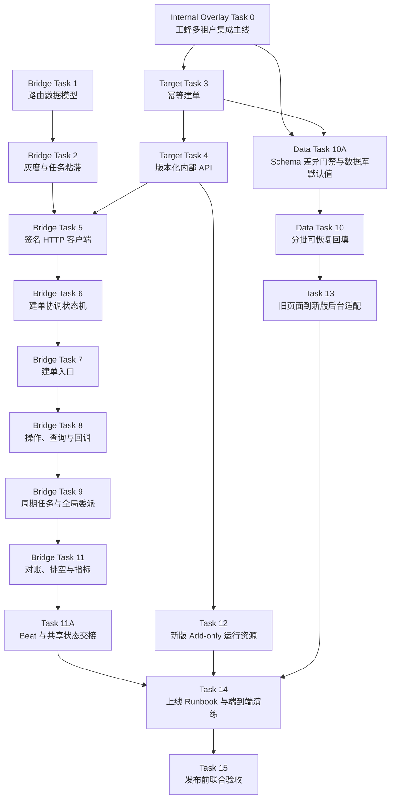

# 标准运维多租户灰度迁移 Implementation Plan

> **For agentic workers:** REQUIRED SUB-SKILL: Use superpowers:subagent-driven-development (recommended) or superpowers:executing-plans to implement this plan task-by-task. Steps use checkbox (`- [ ]`) syntax for tracking.

**Goal:** 在不迁移旧版运行资源、不打断存量任务的前提下，以业务为单位将标准运维从工蜂旧运行时灰度迁移到完成内部代码升级的工蜂多租户目标版本。

**Architecture:** 工蜂 `V3.6.X` 发布 Bridge Release，继续使用现有 `/bk_sops` 和 Redis，并承担 `bk_biz_id` 灰度、任务固定路由和内部 HTTP 转发。开源 `dev_multi_tenant` 先进入工蜂多租户集成主线，移植并升级长期内部代码后，才生成使用 `/bk_sops_mt` 和独立 Redis 的目标制品；共享 MySQL 采用 Expand、分批回填、Verify、Contract。

**Tech Stack:** Python 3.6/3.11、Django 3.2/4.2、Celery 4/5、bamboo-engine 2.6/3.0、MySQL、RabbitMQ、Redis、pytest

**Spec:** `docs/specs/2026-09-04-multi-tenant-gray-migration-design.md`

**Internal Overlay Subplan:** `docs/plans/2026-09-04-bk-sops-internal-overlay-py311-migration.md`

**TAPD:** 标准运维内部环境多租户版本平滑迁移（Story `137932246`）

## 实施进度（2026-09-29）

| 范围 | 状态 | 说明 |
|---|---|---|
| Internal Overlay Task 1-2（清单、目标分支） | 已提交，待合并 | 工蜂 MR !1992 |
| Bridge Task 1-2 | 本地已提交，未推送 | `feat/sops-multi-tenant-migration-bridge`；模型仍含 `callback_route_token_hash`，需按本次修订删除后再推送 |
| Target Task 3 | 未提交的开发中改动 | `TaskCreateRequest` 目前放在 `taskflow3`，需按本次修订迁到独立应用 |
| Internal Overlay Task 4（内部认证与 ESB 适配） | 部分完成，未提交 | ieod 环境配置、内部 ESB 客户端和身份中间件 |
| Target Task 4 及之后、Bridge Task 5-15、Internal Overlay Task 3、5-9 | 未开始 | |

## Global Constraints

- 灰度维度固定为 `bk_biz_id`，不得按 `tenant_id`、用户或逐请求随机比例灰度。
- 已有任务按路由记录、子任务根任务、默认旧版的顺序解析通道；`pending/creating/unknown`
  不得默认为旧版。
- 灰度期共享状态只有一个写入方（Spec §4.6）：新版模块发布钩子不执行 `migrate`、
  `update_component_models`、`update_variable_models`、`sync_saas_apigw`、
  `register_bksops_notice`、`sync_webhook_events`，`BKAPP_AUTO_UPDATE_*` 保持 `0`，
  Django 数据库缓存使用独立表名。
- 旧版现有应用不改模型、不增加 migration；Bridge 只在独立的 `migration_bridge` 应用中建表。
- 共享 MySQL 的 `sql_mode` 不是 strict，缺少数据库默认值的字段会被旧版静默写成空串；
  所有租户与 Schema 校验都要同时检查空值和空串。
- `api-inner` 已基本废弃，不纳入 Bridge 路由和目标模块。
- 新版模块的独立访问地址不作为用户入口；新版内部 API 只接受 Bridge 服务签名。
- 旧版继续使用现有 `/bk_sops`、队列、RabbitMQ 账号、Redis 和进程配置，禁止改名或迁移。
- 新版使用新增 `/bk_sops_mt`、专用 RabbitMQ 账号和独立 Redis 空间。
- Bridge 与新版只能通过版本化内部 HTTP API 交互，禁止跨版本发布 Celery 消息。
- 新版任务在 Bridge 路由记录进入 `ready` 前不得启动。
- 灰度期间共享 MySQL，不实施新旧业务数据双写。
- legacy 活跃任务归零是停止旧 Worker 和切换后台权威入口的硬门禁。
- 新版只保留长期接口兼容；不得引入旧表、旧引擎状态机和旧 Celery 签名兼容。
- Bridge 必须以工蜂 `V3.6.X` 为发布基线，禁止对旧运行面原地升级 Python、Django 或 Celery。
- Target 必须从工蜂多租户集成主线发布；开源 `dev_multi_tenant` 只能作为代码基线，禁止直接部署。
- 禁止将工蜂 `V3.6.X` 整体合入 Target；内部代码必须按清单逐项移植并完成 Python 3.11 验证。
- 业务进入灰度前，其流程引用的内部插件、API、周期任务和回调必须全部通过 Target 能力准入。
- TAPD Story ID 为 `137932246`，执行时设置 `BK_SOPS_MIGRATION_TAPD_STORY=137932246`；每个 commit 都要附带 `--story=${BK_SOPS_MIGRATION_TAPD_STORY}`。
- Bridge 和目标版本必须在独立 worktree、独立分支实现；执行前使用 `superpowers:using-git-worktrees`。

---

## Worktree 与文件边界

### Bridge worktree

- 基线：执行时重新获取并确认 `woa/V3.6.X`，记录精确 SHA 及其最近一次 GitHub `master` 同步点。
- 分支：`feat/sops-multi-tenant-migration-bridge`。
- 新包：`gcloud/migration_bridge/`，只放临时迁移能力。
- 现有任务接口只调用 `migration_bridge` 的服务，不散落版本判断。

### Target worktree

- 代码基线：执行时重新获取并确认 `upstream/dev_multi_tenant` 的精确 SHA。
- 发布基线：先按内部代码迁移子计划建立并验收工蜂多租户集成主线；后续 Target 功能分支从该主线创建。
- 分支：`feat/sops-multi-tenant-internal-api`。
- 新应用：`gcloud/internal_api/`（独立 Django app），放内部任务接口、`TaskCreateRequest`、
  只属于目标版本的 migration 和迁移检查命令。不在 `taskflow3`、`core` 等上游应用中增加
  migration，避免与开源多租户分支后续 migration 编号冲突。
- 幂等记录使用业务中性的 `TaskCreateRequest`，不依赖 Bridge 路由表。

### 共享与运维文件

- Spec：`docs/specs/2026-09-04-multi-tenant-gray-migration-design.md`。
- Runbook：`docs/zh_hans/ops/multi_tenant_gray_migration.md`。
- 部署检查脚本：`scripts/migration/verify_runtime_isolation.py`。
- 数据检查脚本：使用 Django management command，避免维护脱离模型的 SQL。

---

### Task 0: 建立并验收工蜂多租户集成主线

**Files:**
- Create in Gongfeng target branch: `scripts/migration/internal_overlay_manifest.yaml`
- Create in Gongfeng target branch: `scripts/migration/validate_internal_overlay_manifest.py`
- Create in Gongfeng target branch: `scripts/migration/check_business_target_capabilities.py`
- Create in Gongfeng target branch: `gcloud/tests/migration/test_internal_overlay_manifest.py`
- Follow: `docs/plans/2026-09-04-bk-sops-internal-overlay-py311-migration.md`

**Interfaces:**
- Produces: 工蜂多租户集成主线的受保护分支和精确基线 SHA。
- Produces: `internal_overlay_manifest.yaml`，记录内部差异的移植、删除或 legacy-only 决策。
- Produces: `check_business_target_capabilities --bk-biz-id BK_BIZ_ID`，返回业务是否具备 Target 灰度资格。
- Blocks: Target Tasks 3、4、10A、10、12、13 以及任何业务灰度。

- [ ] **Step 1: 执行内部代码迁移子计划**

按 `docs/plans/2026-09-04-bk-sops-internal-overlay-py311-migration.md` 完成内部差异盘点、
Python 3.11 改造、工蜂多租户集成主线建立和全部模块影子部署。

- [ ] **Step 2: 验证清单没有未决项**

Run in the Gongfeng Target worktree:
`python scripts/migration/validate_internal_overlay_manifest.py --fail-on pending,unknown`

Expected: exit code 0；每个内部差异均明确为 `ported`、`reimplemented`、`dropped` 或
`legacy_only`，且 `ported/reimplemented` 项具有 Python 3.11 测试证据。

- [ ] **Step 3: 验证目标运行时和关键依赖**

Run: `python --version`

Run: `python -c "import django, celery; print(django.get_version(), celery.__version__)"`

Expected: Python `3.11.10`、Django `4.2.30`、Celery `5.2.7`。

- [ ] **Step 4: 验证全部目标模块制品来源一致**

对 Web、API Server、Pipeline Worker、Callback、Cleaner 和 Open Plugin
逐一读取构建元数据，确认均来自同一个已验收的工蜂多租户集成 SHA；任何模块使用
GitHub 原始分支、工蜂 `V3.6.X` 或其他 SHA 时失败。`api-inner` 已废弃，不建设目标模块。

- [ ] **Step 5: 验证开源功能对齐和依赖版本**

Run in the Gongfeng Target worktree:
`git log --oneline --no-merges --cherry-pick --right-only "${TARGET_BASE_SHA}...${LEGACY_MASTER_SYNC_SHA}" -- . ':!docs'`

`LEGACY_MASTER_SYNC_SHA` 为 `V3.6.X` 最近一次同步的 GitHub `master` 提交。

Expected: 每个提交都在清单中记录为已等价实现、已移植或明确不需要；
`requirements.txt` 不含预发布版本（例如 `blueapps` 的 rc 版本）。

- [ ] **Step 6: 验证首批业务能力准入**

Run:
`python scripts/migration/check_business_target_capabilities.py --bk-biz-id "${BK_SOPS_GRAY_BIZ_ID}" --strict`

Expected: exit code 0；业务引用的每个插件、API、周期任务和回调能力均为 `ready`。

---

### Task 1: 建立旧版 Bridge 路由数据模型

**Files:**
- Create: `gcloud/migration_bridge/__init__.py`
- Create: `gcloud/migration_bridge/apps.py`
- Create: `gcloud/migration_bridge/constants.py`
- Create: `gcloud/migration_bridge/exceptions.py`
- Create: `gcloud/migration_bridge/models.py`
- Create: `gcloud/migration_bridge/migrations/0001_initial.py`
- Create: `gcloud/tests/migration_bridge/test_models.py`
- Modify: `config/default.py`

**Interfaces:**
- Produces: `RuntimeLane`, `RouteState`, `MigrationGrayBusiness`, `MigrationTaskRoute`。
- Produces: `MigrationTaskRoute.objects.resolve_task_lane(task_id: int) -> str`。
- Produces: `MigrationTaskRoute.objects.resolve_request_lane(migration_request_id: str) -> str`。
- Produces: `MigrationTaskRoute.objects.reserve(migration_request_id: str, bk_biz_id: int, runtime_lane: str, client_request_id: str | None) -> MigrationTaskRoute`。

- [ ] **Step 1: 写路由模型失败测试**

```python
def test_missing_route_defaults_to_legacy():
    assert MigrationTaskRoute.objects.resolve_task_lane(task_id=10001) == RuntimeLane.LEGACY


def test_pending_route_never_defaults_to_legacy():
    MigrationTaskRoute.objects.create(
        migration_request_id="req-1",
        bk_biz_id=2,
        runtime_lane=RuntimeLane.MT,
        route_state=RouteState.PENDING,
    )
    with pytest.raises(RouteNotReadyError):
        MigrationTaskRoute.objects.resolve_request_lane("req-1")
```

- [ ] **Step 2: 运行测试并确认失败**

Run: `pytest gcloud/tests/migration_bridge/test_models.py -q`

Expected: FAIL，提示 `gcloud.migration_bridge` 或模型尚不存在。

- [ ] **Step 3: 实现最小模型和状态枚举**

```python
class RuntimeLane:
    LEGACY = "legacy"
    MT = "mt"


class RouteState:
    PENDING = "pending"
    CREATING = "creating"
    READY = "ready"
    FAILED = "failed"
    UNKNOWN = "unknown"


class MigrationGrayBusiness(models.Model):
    bk_biz_id = models.IntegerField(unique=True)
    enabled = models.BooleanField(default=False)
    operator = models.CharField(max_length=64)
    updated_at = models.DateTimeField(auto_now=True)


class MigrationTaskRoute(models.Model):
    migration_request_id = models.CharField(max_length=64, unique=True)
    client_request_id = models.CharField(max_length=128, null=True, blank=True)
    bk_biz_id = models.IntegerField(db_index=True)
    runtime_lane = models.CharField(max_length=16)
    task_id = models.BigIntegerField(null=True, blank=True, unique=True)
    route_state = models.CharField(max_length=16, default=RouteState.PENDING, db_index=True)
    error_code = models.CharField(max_length=64, blank=True)
    error_message = models.TextField(blank=True)
    created_at = models.DateTimeField(auto_now_add=True)
    updated_at = models.DateTimeField(auto_now=True)
```

- [ ] **Step 4: 生成并检查 migration**

Run: `python manage.py makemigrations migration_bridge`

Expected: 只创建灰度业务表和任务路由表，不修改现有业务表。路由表不包含回调令牌字段；
本地已提交版本如果仍含 `callback_route_token_hash`，在推送前修改 `0001_initial.py`，
不要追加删除字段的 migration。

- [ ] **Step 5: 运行模型测试**

Run: `pytest gcloud/tests/migration_bridge/test_models.py -q`

Expected: PASS。

- [ ] **Step 6: 提交**

```bash
git add config/default.py gcloud/migration_bridge/__init__.py gcloud/migration_bridge/apps.py gcloud/migration_bridge/constants.py gcloud/migration_bridge/exceptions.py gcloud/migration_bridge/models.py gcloud/migration_bridge/migrations/0001_initial.py gcloud/tests/migration_bridge/test_models.py
git commit -m "feat: 增加多租户迁移路由模型 --story=${BK_SOPS_MIGRATION_TAPD_STORY}"
```

### Task 2: 实现业务灰度与任务粘滞决策服务

**Files:**
- Create: `gcloud/migration_bridge/services/__init__.py`
- Create: `gcloud/migration_bridge/services/routing.py`
- Create: `gcloud/migration_bridge/management/commands/set_migration_gray_business.py`
- Create: `gcloud/tests/migration_bridge/test_routing.py`
- Create: `gcloud/tests/migration_bridge/test_set_gray_business_command.py`

**Interfaces:**
- Consumes: Task 1 的 `MigrationGrayBusiness`、`MigrationTaskRoute`。
- Produces: `MigrationRoutingService.route_new_task(bk_biz_id: int) -> str`。
- Produces: `MigrationRoutingService.route_existing_task(task_id: int) -> str`。

- [ ] **Step 1: 写稳定业务灰度测试**

```python
def test_new_task_uses_biz_allowlist(db):
    MigrationGrayBusiness.objects.create(bk_biz_id=2, enabled=True, operator="tester")
    service = MigrationRoutingService()
    assert service.route_new_task(2) == RuntimeLane.MT
    assert service.route_new_task(3) == RuntimeLane.LEGACY


def test_existing_task_route_wins_over_current_biz_setting(db):
    MigrationGrayBusiness.objects.create(bk_biz_id=2, enabled=False, operator="tester")
    MigrationTaskRoute.objects.create(
        migration_request_id="req-2",
        bk_biz_id=2,
        runtime_lane=RuntimeLane.MT,
        task_id=20001,
        route_state=RouteState.READY,
    )
    assert MigrationRoutingService().route_existing_task(20001) == RuntimeLane.MT


def test_independent_subprocess_child_follows_root_route(db, mt_route):
    TaskFlowRelation.objects.create(task_id=20002, parent_task_id=mt_route.task_id, root_task_id=mt_route.task_id)
    assert MigrationRoutingService().route_existing_task(20002) == RuntimeLane.MT
```

- [ ] **Step 2: 运行测试并确认失败**

Run: `pytest gcloud/tests/migration_bridge/test_routing.py -q`

Expected: FAIL，提示 `MigrationRoutingService` 不存在。

- [ ] **Step 3: 实现决策服务和显式灰度命令**

```python
class MigrationRoutingService:
    def route_new_task(self, bk_biz_id):
        enabled = MigrationGrayBusiness.objects.filter(bk_biz_id=bk_biz_id, enabled=True).exists()
        return RuntimeLane.MT if enabled else RuntimeLane.LEGACY

    def route_existing_task(self, task_id):
        if not MigrationTaskRoute.objects.filter(task_id=task_id).exists():
            relation = TaskFlowRelation.objects.filter(task_id=task_id).only("root_task_id").first()
            if relation is not None and relation.root_task_id != task_id:
                task_id = relation.root_task_id
        return MigrationTaskRoute.objects.resolve_task_lane(task_id)
```

命令接口固定为：

```bash
python manage.py set_migration_gray_business --bk-biz-id 2 --enable --operator "${OPERATOR}"
python manage.py set_migration_gray_business --bk-biz-id 2 --disable --operator "${OPERATOR}"
```

- [ ] **Step 4: 运行测试**

Run: `pytest gcloud/tests/migration_bridge/test_routing.py gcloud/tests/migration_bridge/test_set_gray_business_command.py -q`

Expected: PASS。

- [ ] **Step 5: 提交**

```bash
git add gcloud/migration_bridge/services/__init__.py gcloud/migration_bridge/services/routing.py gcloud/migration_bridge/management/commands/set_migration_gray_business.py gcloud/tests/migration_bridge/test_routing.py gcloud/tests/migration_bridge/test_set_gray_business_command.py
git commit -m "feat: 增加按业务灰度的任务路由服务 --story=${BK_SOPS_MIGRATION_TAPD_STORY}"
```

### Task 3: 在目标版本实现通用幂等建单记录

**Files:**
- Create: `gcloud/internal_api/__init__.py`
- Create: `gcloud/internal_api/apps.py`
- Create: `gcloud/internal_api/models.py`
- Create: `gcloud/internal_api/migrations/0001_initial.py`
- Create: `gcloud/internal_api/services/idempotent_task_create.py`
- Create: `gcloud/tests/internal_api/services/test_idempotent_task_create.py`
- Modify: `config/default.py`

已有开发中改动把 `TaskCreateRequest` 放在 `gcloud/taskflow3/models.py` 并新增
`taskflow3/0026` migration，提交前迁到上述独立应用。

**Interfaces:**
- Produces: `TaskCreateRequest(idempotency_key, request_hash, state, task_id, error_code, created_at, updated_at)`。
- Produces: `IdempotentTaskCreateService.prepare(idempotency_key: str, request_payload: dict, create: Callable[[], TaskFlowInstance]) -> TaskCreateResult`。
- Produces: `IdempotentTaskCreateService.get(idempotency_key: str) -> TaskCreateResult`。

- [ ] **Step 1: 写同键同请求复用、同键异请求冲突测试**

```python
def test_same_key_and_payload_returns_same_task(db):
    first = service.prepare("idem-1", payload, create_task)
    second = service.prepare("idem-1", payload, create_task)
    assert second.task_id == first.task_id
    assert create_task.call_count == 1


def test_same_key_with_different_payload_is_rejected(db):
    service.prepare("idem-1", {"name": "a"}, create_task)
    with pytest.raises(IdempotencyConflict):
        service.prepare("idem-1", {"name": "b"}, create_task)
```

- [ ] **Step 2: 运行测试并确认失败**

Run: `pytest gcloud/tests/internal_api/services/test_idempotent_task_create.py -q`

Expected: FAIL，提示幂等服务不存在。

- [ ] **Step 3: 实现请求规范化、SHA-256 摘要和数据库唯一约束**

```python
def canonical_request_hash(payload):
    body = json.dumps(payload, sort_keys=True, separators=(",", ":"), ensure_ascii=False)
    return hashlib.sha256(body.encode("utf-8")).hexdigest()
```

使用 `transaction.atomic()` 和唯一键处理并发首请求；发现已存在记录时比较
`request_hash`，禁止同一 key 复用不同请求。

- [ ] **Step 4: 生成 migration 并运行测试**

Run: `python manage.py makemigrations internal_api`

Expected: 只创建 `internal_api/0001_initial.py`；`python manage.py makemigrations --check --dry-run`
对 `taskflow3`、`core` 等上游应用输出 `No changes detected`。

Run: `pytest gcloud/tests/internal_api/services/test_idempotent_task_create.py -q`

Expected: PASS，包括两个并发请求只创建一个任务。并发用例必须在 MySQL 上执行，
SQLite 结果不作为通过证据。

- [ ] **Step 5: 提交**

```bash
git add config/default.py gcloud/internal_api/__init__.py gcloud/internal_api/apps.py gcloud/internal_api/models.py gcloud/internal_api/migrations/0001_initial.py gcloud/internal_api/services/idempotent_task_create.py gcloud/tests/internal_api/services/test_idempotent_task_create.py
git commit -m "feat: 增加幂等任务创建能力 --story=${BK_SOPS_MIGRATION_TAPD_STORY}"
```

### Task 4: 在目标版本实现版本化内部任务 API

**Files:**
- Create: `gcloud/internal_api/authentication.py`
- Create: `gcloud/internal_api/urls.py`
- Create: `gcloud/internal_api/views.py`
- Create: `gcloud/internal_api/serializers.py`
- Create: `gcloud/tests/internal_api/test_authentication.py`
- Create: `gcloud/tests/internal_api/test_tasks.py`
- Modify: `config/urls_custom.py`
- Modify: `config/default.py`

**Interfaces:**
- Consumes: Task 3 的 `IdempotentTaskCreateService`。
- Produces: `POST /internal/v1/tasks/prepare/`。
- Produces: `GET /internal/v1/task-requests/<idempotency_key>/`。
- Produces: `POST /internal/v1/tasks/<task_id>/start/`。
- Produces: `POST /internal/v1/tasks/<task_id>/operations/`。
- Produces: `POST /internal/v1/tasks/<task_id>/callbacks/`。
- Produces: `GET /internal/v1/tasks/?created_after=ISO8601&created_before=ISO8601`，返回新版创建的任务 ID，供 Bridge 对账。

- [ ] **Step 1: 写鉴权和建单不启动测试**

```python
def test_unsigned_internal_request_is_rejected(client):
    response = client.post("/internal/v1/tasks/prepare/", data={}, content_type="application/json")
    assert response.status_code == 401


def test_browser_session_without_signature_is_rejected(logged_in_client):
    response = logged_in_client.post("/internal/v1/tasks/prepare/", data={}, content_type="application/json")
    assert response.status_code == 401


def test_prepare_creates_task_without_publishing_celery(client, signed_headers, mocker):
    publish = mocker.patch("gcloud.taskflow3.celery.tasks.prepare_and_start_task.apply_async")
    response = client.post(PREPARE_URL, data=payload, content_type="application/json", **signed_headers)
    assert response.status_code == 201
    assert response.json()["data"]["state"] == "prepared"
    publish.assert_not_called()
```

- [ ] **Step 2: 运行测试并确认失败**

Run: `pytest gcloud/tests/internal_api -q`

Expected: FAIL，接口返回 404。

- [ ] **Step 3: 实现 HMAC 服务鉴权**

签名内容固定为：

```text
HTTP_METHOD + "\n" + PATH + "\n" + UNIX_TIMESTAMP + "\n" + NONCE + "\n" + SHA256(BODY)
```

校验时间偏差不超过 60 秒，Nonce 在 Redis 中使用 `SET NX EX 120` 防重放。密钥通过
`BKAPP_MIGRATION_INTERNAL_API_SECRET` 注入，不写入日志。

- [ ] **Step 4: 实现 prepare、lookup、start 和 operation API**

`prepare` 复用目标版本现有创建逻辑，但不执行
`prepare_and_start_task.apply_async()`。`TaskFlowInstance` 保存时投递的统计类消息允许
保留，但只能投递到新版 broker。`start` 使用数据库行锁保证只发布一次：发布前先把请求
记录置为 `starting` 并提交，发布成功后置为 `started`；进程在两步之间中断时，由重复
start 请求按任务真实状态修复，不重复发布。

- [ ] **Step 5: 运行接口测试**

Run: `pytest gcloud/tests/internal_api -q`

Expected: PASS，重复 prepare/start 不产生重复 TaskFlowInstance 或 Celery 消息。

- [ ] **Step 6: 提交**

```bash
git add config/default.py config/urls_custom.py gcloud/internal_api/authentication.py gcloud/internal_api/urls.py gcloud/internal_api/views.py gcloud/internal_api/serializers.py gcloud/tests/internal_api/test_authentication.py gcloud/tests/internal_api/test_tasks.py
git commit -m "feat: 增加版本化内部任务接口 --story=${BK_SOPS_MIGRATION_TAPD_STORY}"
```

### Task 5: 在 Bridge 实现签名 HTTP 客户端

**Files:**
- Create: `gcloud/migration_bridge/client.py`
- Create: `gcloud/migration_bridge/types.py`
- Create: `gcloud/tests/migration_bridge/test_client.py`
- Modify: `config/default.py`

**Interfaces:**
- Consumes: Task 4 的内部 API。
- Produces: `MigrationTargetClient.prepare_task(idempotency_key: str, payload: dict) -> PreparedTask`。
- Produces: `MigrationTargetClient.get_task_request(idempotency_key: str) -> TaskRequestStatus`。
- Produces: `MigrationTargetClient.start_task(task_id: int, idempotency_key: str) -> StartResult`。
- Produces: `MigrationTargetClient.operate_task(task_id: int, operation: str, payload: dict) -> dict`。
- Produces: `MigrationTargetClient.list_created_task_ids(created_after: datetime, created_before: datetime) -> list[int]`。

- [ ] **Step 1: 写签名、超时和脱敏测试**

```python
def test_prepare_timeout_raises_unknown_result(responses):
    responses.post(PREPARE_URL, body=requests.Timeout())
    with pytest.raises(TargetResultUnknown):
        client.prepare_task("idem-1", payload)


def test_secret_is_not_in_exception_message():
    with pytest.raises(TargetRequestError) as exc:
        client.prepare_task("idem-1", payload)
    assert settings.MIGRATION_INTERNAL_API_SECRET not in str(exc.value)
```

- [ ] **Step 2: 运行测试并确认失败**

Run: `pytest gcloud/tests/migration_bridge/test_client.py -q`

Expected: FAIL，客户端不存在。

- [ ] **Step 3: 实现客户端**

连接超时和读取超时分别配置，默认 `connect=2s/read=10s`。只对明确幂等的 GET 或带
固定 idempotency key 的请求重试；记录状态码、耗时、目标模块和 trace_id，不记录密钥
和敏感请求体。

- [ ] **Step 4: 运行测试**

Run: `pytest gcloud/tests/migration_bridge/test_client.py -q`

Expected: PASS。

- [ ] **Step 5: 提交**

```bash
git add config/default.py gcloud/migration_bridge/client.py gcloud/migration_bridge/types.py gcloud/tests/migration_bridge/test_client.py
git commit -m "feat: 增加新版内部接口客户端 --story=${BK_SOPS_MIGRATION_TAPD_STORY}"
```

### Task 6: 实现 Bridge 建单协调状态机

**Files:**
- Create: `gcloud/migration_bridge/services/task_handoff.py`
- Create: `gcloud/tests/migration_bridge/test_task_handoff.py`

**Interfaces:**
- Consumes: Task 1 路由模型、Task 2 路由服务、Task 5 HTTP 客户端。
- Produces: `TaskHandoffService.create_and_start(bk_biz_id: int, payload: dict, client_request_id: str | None) -> HandoffResult`。

- [ ] **Step 1: 写正常、prepare 超时、start 超时测试**

```python
def test_route_is_ready_before_target_start(db, client):
    client.start_task.side_effect = lambda *args, **kwargs: assert_route_state(RouteState.READY)
    result = service.create_and_start(2, payload, "client-1")
    assert result.task_id


def test_prepare_timeout_queries_same_idempotency_key(db, client):
    client.prepare_task.side_effect = TargetResultUnknown()
    client.get_task_request.return_value = TaskRequestStatus.prepared(task_id=30001)
    result = service.create_and_start(2, payload, "client-1")
    assert result.task_id == 30001


def test_unknown_result_never_falls_back_to_legacy(db, client):
    client.prepare_task.side_effect = TargetResultUnknown()
    client.get_task_request.side_effect = TargetResultUnknown()
    with pytest.raises(HandoffResultUnknown):
        service.create_and_start(2, payload, "client-1")
    assert MigrationTaskRoute.objects.get().route_state == RouteState.UNKNOWN
```

- [ ] **Step 2: 运行测试并确认失败**

Run: `pytest gcloud/tests/migration_bridge/test_task_handoff.py -q`

Expected: FAIL，协调服务不存在。

- [ ] **Step 3: 实现状态机和事务边界**

Bridge 先生成 UUID4 `migration_request_id` 并保存 `pending`，再进入 `creating`。收到
task_id 后在独立事务中写入 `task_id + ready`，事务提交后才调用 `start_task`。

- [ ] **Step 4: 运行故障路径测试**

Run: `pytest gcloud/tests/migration_bridge/test_task_handoff.py -q`

Expected: PASS；任何超时都不会调用旧版建单函数。

- [ ] **Step 5: 提交**

```bash
git add gcloud/migration_bridge/services/task_handoff.py gcloud/tests/migration_bridge/test_task_handoff.py
git commit -m "feat: 增加跨版本幂等建单协调 --story=${BK_SOPS_MIGRATION_TAPD_STORY}"
```

### Task 7: 接入页面和 APIGW 建单入口

**Files:**
- Create: `gcloud/migration_bridge/integrations/task_create.py`
- Create: `gcloud/tests/migration_bridge/integrations/test_task_create.py`
- Modify: `gcloud/apigw/views/create_task.py`
- Modify: `gcloud/apigw/views/create_and_start_task.py`
- Modify: `gcloud/apigw/views/fast_create_task.py`
- Modify: `gcloud/core/apis/drf/viewsets/taskflow.py`
- Modify: `gcloud/taskflow3/apis/django/api.py`（`task_clone`）
- Create: `gcloud/tests/apigw/views/test_fast_create_task.py`
- Modify: `gcloud/tests/apigw/views/test_create_task.py`
- Modify: `gcloud/tests/apigw/views/test_create_and_start_task.py`
- Modify: `gcloud/tests/core/apis/drf/views_set/test_task_instance_view.py`

`start_task` 操作的是已有任务，按 `task_id` 路由，放在 Task 8。

**Interfaces:**
- Consumes: Task 2、Task 6。
- Produces: `dispatch_task_create(bk_biz_id, payload, legacy_callable, client_request_id=None)`。

- [ ] **Step 1: 写“开关关闭保持原路径”回归测试**

```python
def test_non_gray_business_calls_original_create(legacy_create, target_client):
    result = dispatch_task_create(3, payload, legacy_create)
    legacy_create.assert_called_once_with()
    target_client.prepare_task.assert_not_called()
```

- [ ] **Step 2: 写“灰度业务只调用新版 HTTP”测试**

```python
def test_gray_business_calls_target_without_legacy_celery(gray_biz, legacy_create, target_client):
    dispatch_task_create(gray_biz, payload, legacy_create, client_request_id="ui-1")
    legacy_create.assert_not_called()
    target_client.prepare_task.assert_called_once()
```

- [ ] **Step 3: 运行定向测试并确认失败**

Run: `pytest gcloud/tests/migration_bridge/integrations/test_task_create.py -q`

Expected: FAIL，入口适配不存在。

- [ ] **Step 4: 实现统一入口适配并接入五类建单路径**

五类为 APIGW `create_task`、`create_and_start_task`、`fast_create_task`，页面 DRF 建单和
页面克隆任务。Task 8 的 URL 清单如果发现其他建单入口，回到本任务补齐。

只在现有参数校验、IAM 鉴权和项目解析完成后进行路由；非灰度业务调用原函数，确保
返回结构、日志和 Celery 投递完全不变。灰度业务构造稳定的内部请求 DTO 并调用 Task 6。

- [ ] **Step 5: 运行建单回归测试**

Run: `pytest gcloud/tests/apigw/views/test_create_task.py gcloud/tests/apigw/views/test_create_and_start_task.py gcloud/tests/apigw/views/test_fast_create_task.py gcloud/tests/core/apis/drf/views_set/test_task_instance_view.py -q`

Expected: PASS；现有用例不改语义，新增用例覆盖灰度路径。

- [ ] **Step 6: 提交**

```bash
git add gcloud/migration_bridge/integrations/task_create.py gcloud/tests/migration_bridge/integrations/test_task_create.py gcloud/apigw/views/create_task.py gcloud/apigw/views/create_and_start_task.py gcloud/apigw/views/fast_create_task.py gcloud/core/apis/drf/viewsets/taskflow.py gcloud/taskflow3/apis/django/api.py gcloud/tests/apigw/views/test_create_task.py gcloud/tests/apigw/views/test_create_and_start_task.py gcloud/tests/apigw/views/test_fast_create_task.py gcloud/tests/core/apis/drf/views_set/test_task_instance_view.py
git commit -m "feat: 接入按业务灰度的建单入口 --story=${BK_SOPS_MIGRATION_TAPD_STORY}"
```

### Task 8: 接入已有任务操作、查询与回调路由

**Files:**
- Create: `gcloud/migration_bridge/route_inventory.yaml`
- Create: `gcloud/migration_bridge/integrations/task_operation.py`
- Create: `gcloud/migration_bridge/integrations/callback.py`
- Create: `gcloud/migration_bridge/integrations/page_proxy.py`
- Create: `gcloud/tests/migration_bridge/test_route_inventory.py`
- Create: `gcloud/tests/migration_bridge/integrations/test_page_proxy.py`
- Create: `gcloud/tests/migration_bridge/integrations/test_task_operation.py`
- Create: `gcloud/tests/migration_bridge/integrations/test_callback.py`
- Modify: `gcloud/apigw/views/start_task.py`
- Modify: `gcloud/apigw/views/operate_task.py`
- Modify: `gcloud/apigw/views/operate_node.py`
- Modify: `gcloud/apigw/views/get_task_detail.py`
- Modify: `gcloud/apigw/views/get_task_status.py`
- Modify: `gcloud/apigw/views/get_tasks_status.py`
- Modify: `gcloud/apigw/views/get_task_node_detail.py`
- Modify: `gcloud/apigw/views/node_callback.py`
- Modify: `gcloud/taskflow3/apis/django/api.py`
- Modify: `gcloud/taskflow3/apis/django/v4/node_callback.py`
- Modify: `gcloud/core/apis/drf/viewsets/taskflow.py`
- Modify: 清单中标记为“已路由”的其余 APIGW 任务类视图

**Interfaces:**
- Consumes: `MigrationRoutingService.route_existing_task()`、`MigrationTargetClient.operate_task()`。
- Produces: `dispatch_existing_task(task_id, legacy_callable, target_callable)`。
- Produces: `dispatch_batch(task_ids, legacy_callable, target_callable) -> list`，按通道拆分后按原顺序合并。
- Produces: `dispatch_callback(task_id, payload)`。

- [ ] **Step 0: 生成并固定任务入口清单**

遍历 `django.urls.get_resolver()` 导出全部 URL，写入 `route_inventory.yaml`。每项记录视图
路径、任务标识来源（URL 参数、查询参数、请求体或无）和处理方式（`routed`、
`shared_read`、`not_applicable`）。页面接口 `taskflow/api/status/`、`batch_status/`、
`action/`、`nodes/action/`、`nodes/data/`、`nodes/detail/`、`nodes/log/`、`flow/claim/`、
`nodes/spec/timer/reset/`、`render_current_constants/`、`update_task_constants/` 和
`api/v4/` 下的接口都必须出现在清单中。

```python
def test_route_inventory_matches_urlconf():
    assert set(load_inventory()) == set(iter_url_views(get_resolver()))


def test_routed_views_call_dispatch(routed_view):
    assert view_uses_dispatch(routed_view)
```

```python
def test_mt_task_stays_on_target_after_biz_gray_disabled(mt_route, disable_gray_biz):
    dispatch_existing_task(mt_route.task_id, legacy, target)
    target.assert_called_once()
    legacy.assert_not_called()
```

- [ ] **Step 2: 写历史任务无记录默认旧版和 pending 拒绝测试**

```python
def test_historical_task_without_route_calls_legacy():
    dispatch_existing_task(99, legacy, target)
    legacy.assert_called_once()


def test_pending_route_returns_retryable_error(pending_route):
    with pytest.raises(RouteNotReadyError):
        dispatch_existing_task(pending_route.task_id, legacy, target)


def test_batch_status_splits_by_lane_and_keeps_order(mt_route):
    result = dispatch_batch([1, mt_route.task_id, 2], legacy_batch, target_batch)
    assert [item["task_id"] for item in result] == [1, mt_route.task_id, 2]


def test_misrouted_v4_callback_decrypts_root_pipeline_and_routes_to_target(mt_task_token):
    dispatch_v4_callback(mt_task_token, payload)
    target.callback.assert_called_once()
```

- [ ] **Step 3: 实现查询、操作与回调分发**

新版任务的节点回调地址由新版生成并直达新版 callback 模块，Bridge 不生成回调令牌。
Bridge 只处理两类回调：APIGW `node_callback` 按 `task_id` 路由；误投到旧版
`nodes/callback/<token>` 或 `v4` 回调地址的请求，用 `CALLBACK_KEY` 解密得到
`root_pipeline_id`，查到对应 `TaskFlowInstance` 后按其路由转发。令牌不含
`root_pipeline_id` 时，用 `node_id` 查询 `eri` 的 `State.root_id`。解密失败或查不到任务时
按旧版原逻辑处理。

`page_proxy` 按 Spec §12 实现阶段 A 的新版页面代理：灰度业务的页面入口和新版静态资源
前缀转发到新版页面模块；切换到不同版本的业务时返回整页跳转；页面 API 复用本任务的
`dispatch_existing_task` 和 Task 7 的建单协调，不另开直连新版的通道。

```python
def test_switching_to_non_gray_project_redirects_to_legacy_page(gray_biz, non_gray_project):
    response = page_proxy(request_for(project=non_gray_project, from_version="mt"))
    assert response.status_code == 302
```

- [ ] **Step 4: 运行任务操作和回调测试**

Run: `pytest gcloud/tests/migration_bridge gcloud/tests/apigw/views/test_start_task.py gcloud/tests/apigw/views/test_operate_task.py gcloud/tests/apigw/views/test_get_tasks_status.py gcloud/tests/apigw/views/test_node_callback.py gcloud/tests/taskflow3/test_node_callback_v4.py -q`

Expected: PASS。

- [ ] **Step 5: 提交**

```bash
git add gcloud/migration_bridge/route_inventory.yaml gcloud/migration_bridge/integrations/task_operation.py gcloud/migration_bridge/integrations/callback.py gcloud/migration_bridge/integrations/page_proxy.py gcloud/tests/migration_bridge/integrations/test_page_proxy.py gcloud/tests/migration_bridge/test_route_inventory.py gcloud/tests/migration_bridge/integrations/test_task_operation.py gcloud/tests/migration_bridge/integrations/test_callback.py gcloud/apigw/views/start_task.py gcloud/apigw/views/operate_task.py gcloud/apigw/views/operate_node.py gcloud/apigw/views/get_task_detail.py gcloud/apigw/views/get_task_status.py gcloud/apigw/views/get_tasks_status.py gcloud/apigw/views/get_task_node_detail.py gcloud/apigw/views/node_callback.py gcloud/taskflow3/apis/django/api.py gcloud/taskflow3/apis/django/v4/node_callback.py gcloud/core/apis/drf/viewsets/taskflow.py gcloud/tests/apigw/views/test_start_task.py gcloud/tests/apigw/views/test_get_tasks_status.py gcloud/tests/apigw/views/test_operate_task.py gcloud/tests/apigw/views/test_operate_node.py gcloud/tests/apigw/views/test_get_task_detail.py gcloud/tests/apigw/views/test_get_task_status.py gcloud/tests/apigw/views/test_get_task_node_detail.py gcloud/tests/apigw/views/test_node_callback.py gcloud/tests/taskflow3/test_node_callback_v4.py gcloud/tests/core/apis/drf/views_set/test_task_instance_view.py
git commit -m "feat: 接入任务操作和回调固定路由 --story=${BK_SOPS_MIGRATION_TAPD_STORY}"
```

### Task 9: 接入周期任务、Cleaner 与全局任务委派

**Files:**
- Create: `gcloud/migration_bridge/services/background_jobs.py`
- Create: `gcloud/migration_bridge/periodic_entry.py`
- Create: `gcloud/tests/migration_bridge/test_background_jobs.py`
- Create: `gcloud/tests/migration_bridge/test_periodic_entry.py`
- Modify: `gcloud/migration_bridge/apps.py`
- Modify: `gcloud/clocked_task/tasks.py`
- Modify: `gcloud/contrib/cleaner/tasks.py`
- Modify: `gcloud/contrib/cleaner/pipeline/bamboo_engine_tasks.py`
- Modify: `gcloud/core/tasks.py`
- Modify: `gcloud/tests/periodictask/models/test_periodic_task.py`
- Modify: `gcloud/tests/clocked_task/test_tasks.py`
- Create: `gcloud/tests/contrib/cleaner/test_migration_partition.py`

**Interfaces:**
- Consumes: Task 2、Task 5、Task 8。
- Produces: `dispatch_scheduled_create(bk_biz_id, schedule_kind, schedule_id, celery_task_id, payload)`。
- Produces: `install_periodic_entry_wrappers()`，在 `MigrationBridgeConfig.ready()` 中调用。
- Produces: `partition_maintenance_task_ids(task_ids: list[int]) -> tuple[list[int], list[int]]`。

- [ ] **Step 1: 写周期任务入口拦截和幂等键测试**

```python
def test_gray_periodic_run_does_not_create_legacy_instance(gray_periodic_task, target_client):
    bamboo_engine_periodic_task_start.apply(kwargs={"period_task_id": gray_periodic_task.task.id}, task_id="msg-1")
    assert not PipelineInstance.objects.filter(template=gray_periodic_task.task.template).exists()
    target_client.prepare_task.assert_called_once()


def test_redelivered_message_reuses_idempotency_key():
    key = build_scheduled_idempotency_key("periodic", schedule_id=7, celery_task_id="msg-1")
    assert key == build_scheduled_idempotency_key("periodic", 7, "msg-1")
```

- [ ] **Step 2: 写 Cleaner 不处理 mt 任务测试**

```python
def test_cleaner_partitions_target_tasks(mt_route):
    legacy_ids, mt_ids = partition_maintenance_task_ids([1, mt_route.task_id])
    assert legacy_ids == [1]
    assert mt_ids == [mt_route.task_id]
```

- [ ] **Step 3: 实现周期建单和维护任务分区**

旧 Beat 的启动命令、broker 和 schedule 表保持不变，Beat 条目中的任务名也不修改。

周期任务的 Celery 任务 `pipeline.contrib.periodic_task.tasks.periodic_task_start` 和
`bamboo_engine_periodic_task_start` 定义在第三方包中，任务体先创建 `PipelineInstance`、
再发 `pre_periodic_task_start` 信号、随后直接启动旧引擎，因此不能用信号拦截。
`install_periodic_entry_wrappers()` 在应用初始化时包装这两个已注册任务的执行函数：
按 `period_task_id` 找到 gcloud 周期任务和项目的 `bk_biz_id`，非灰度业务调用原函数，
灰度业务调用 `dispatch_scheduled_create()`，并保持周期任务运行次数和历史记录语义。
计划任务在 `gcloud.clocked_task.tasks.clocked_task_start` 中直接接入。

幂等键为 `schedule_kind + schedule_id + Celery 消息 ID`，消息重投时复用同一个键。
该方案依赖灰度期只有一个 Beat 进程。

Cleaner 对旧任务执行原逻辑，对 mt task_id 调用新版维护 API。

- [ ] **Step 4: 运行后台任务测试**

Run: `pytest gcloud/tests/periodictask gcloud/tests/clocked_task gcloud/tests/contrib/cleaner gcloud/tests/migration_bridge/test_background_jobs.py -q`

Expected: PASS；同一周期触发不会在两边重复建单。

- [ ] **Step 5: 提交**

```bash
git add gcloud/migration_bridge/services/background_jobs.py gcloud/migration_bridge/periodic_entry.py gcloud/migration_bridge/apps.py gcloud/tests/migration_bridge/test_background_jobs.py gcloud/tests/migration_bridge/test_periodic_entry.py gcloud/clocked_task/tasks.py gcloud/contrib/cleaner/tasks.py gcloud/contrib/cleaner/pipeline/bamboo_engine_tasks.py gcloud/core/tasks.py gcloud/tests/periodictask/models/test_periodic_task.py gcloud/tests/clocked_task/test_tasks.py gcloud/tests/contrib/cleaner/test_migration_partition.py
git commit -m "feat: 接入周期和维护任务灰度委派 --story=${BK_SOPS_MIGRATION_TAPD_STORY}"
```

### Task 10A: 共享 Schema 差异门禁与租户字段数据库默认值

**Files:**
- Create in Target: `gcloud/internal_api/management/commands/check_shared_schema_plan.py`
- Create in Target: `gcloud/internal_api/migrations/0002_tenant_column_defaults.py`
- Create in Target: `gcloud/tests/internal_api/test_check_shared_schema_plan.py`
- Create in Target: `gcloud/tests/internal_api/test_tenant_column_defaults.py`

Bridge 和旧版现有应用不修改模型，也不同步开源多租户分支的 migration。

**Interfaces:**
- Produces: `check_shared_schema_plan --applied-file PATH --json`，列出线上未执行的目标 migration 及风险标记。
- Produces: 旧版插入缺少租户字段时由数据库填充 `default` 的兜底。
- Consumes: 环境配置中的 `DEFAULT_TENANT_ID`，内部单租户环境固定为 `default`。

- [ ] **Step 0: 导出线上已执行 migration 并生成差异报告**

在线上旧版制品中导出 `django_migrations` 的 `(app, name)` 列表到本地安全文件，然后在
Target worktree 运行：

```bash
python manage.py check_shared_schema_plan --applied-file /secure/path/applied_migrations.txt --json
```

命令基于 Django migration loader 计算待执行 migration，并对以下操作打风险标记：
非空 `AddField`（执行后数据库默认值会被删除）、`RemoveField`、`RenameField`、
`AlterField`、唯一约束变更、`DeleteModel` 和 `RunPython`/`RunSQL`。

Expected: 报告至少包含三组租户字段 migration、`clocked_task` 的 `timezone` 字段、
`plugin_gateway` 删除调度条目的数据迁移、`django_celery_results` 0009–0011 和
`django_celery_beat` 0016–0019。每一项在 Runbook 中记录审阅结论和执行窗口，任一项
无结论时停止灰度。

- [ ] **Step 1: 核对线上 migration 前置状态**

Run in the current production artifact:

```bash
python manage.py showmigrations core common_template external_plugins
```

Expected: `core.0026_business_tenant_id_project_tenant_id`、
`common_template.0009_commontemplate_tenant_id`、
`external_plugins.0007_cachepackagesource_tenant_id_and_more` 均未执行。任一已执行时停止该
任务，禁止 `--fake` 或修改已执行 migration，改为基于实际叶子节点新增 reconciliation migration。

- [ ] **Step 2: 写数据库默认值失败测试**

```python
def test_old_style_project_insert_gets_database_default_tenant(db, django_db_connection):
    with django_db_connection.cursor() as cursor:
        cursor.execute(
            "INSERT INTO core_project "
            "(name, time_zone, creator, `desc`, create_at, bk_biz_id, from_cmdb, is_disable) "
            "VALUES (%s, %s, %s, %s, CURRENT_TIMESTAMP, %s, %s, %s)",
            ["legacy-project", "Asia/Shanghai", "tester", "", 2, False, False],
        )
        project_id = cursor.lastrowid
    assert Project.objects.get(pk=project_id).tenant_id == "default"
```

该插入语句模拟旧版模型的列集合，不包含 `tenant_id`。测试必须在 MySQL 上执行。

- [ ] **Step 3: 运行测试并确认失败**

Run: `pytest gcloud/tests/internal_api/test_tenant_column_defaults.py -q`

Expected: FAIL，上游 migration 执行后 `tenant_id` 没有数据库默认值。

- [ ] **Step 4: 增加只属于目标版本的默认值 migration**

`internal_api/0002_tenant_column_defaults.py` 依赖三组上游租户 migration，用 `RunPython`
遍历 Business、Project、CommonTemplate 以及外部插件的四类包源和同步任务模型，从
`_meta.db_table` 取表名，
经 `schema_editor.quote_name()` 执行：

```sql
ALTER TABLE <table> ALTER COLUMN tenant_id SET DEFAULT 'default';
```

反向操作为 `DROP DEFAULT`，但生产回退流程不执行逆向 DDL。上游 migration 本身不修改。

- [ ] **Step 5: 确定生产执行窗口**

上游租户 migration 执行后到本 migration 执行前，旧版插入的行会写入空串。Schema 变更在
低峰期由人工步骤执行，两者在同一次 `migrate` 中连续完成，之后立即运行 Task 10 的回填
和校验。

- [ ] **Step 6: 运行 Schema 和 migration 检查**

Run in the Target worktree:

```bash
pytest gcloud/tests/internal_api/test_tenant_column_defaults.py gcloud/tests/internal_api/test_check_shared_schema_plan.py -q
python manage.py makemigrations --check --dry-run
python manage.py sqlmigrate internal_api 0002
```

Run in the Bridge worktree: `python manage.py makemigrations --check --dry-run`

Expected: 测试 PASS；两边均无未生成 migration；Bridge 只有 `migration_bridge` 应用的 migration。

- [ ] **Step 7: 提交 Target 分支**

```bash
git add gcloud/internal_api/management/commands/check_shared_schema_plan.py gcloud/internal_api/migrations/0002_tenant_column_defaults.py gcloud/tests/internal_api/test_check_shared_schema_plan.py gcloud/tests/internal_api/test_tenant_column_defaults.py
git commit -m "feat: 增加共享数据库兼容检查和租户字段默认值 --story=${BK_SOPS_MIGRATION_TAPD_STORY}"
```

### Task 10: 将租户回填改为分批、可恢复执行

**Files:**
- Modify: `gcloud/core/management/commands/sync_tenant_data.py`
- Modify: `gcloud/core/management/commands/verify_tenant_sync.py`
- Create: `gcloud/tests/core/commands/test_sync_tenant_data.py`
- Create: `gcloud/tests/core/commands/test_verify_tenant_sync.py`
- Review: `gcloud/core/migrations/0026_business_tenant_id_project_tenant_id.py`
- Review: `gcloud/common_template/migrations/0009_commontemplate_tenant_id.py`
- Review: `gcloud/external_plugins/migrations/0007_cachepackagesource_tenant_id_and_more.py`

**Interfaces:**
- Produces: `sync_tenant_data --batch-size N --resume-from MODEL:PK --dry-run`。
- Produces: 非零退出码的 `verify_tenant_sync`。

- [ ] **Step 1: 写批次提交、续跑和失败退出测试**

```python
def test_sync_updates_only_one_batch_per_transaction(call_command, users):
    call_command("sync_tenant_data", batch_size=2)
    assert User.objects.exclude(tenant_id="default").count() == 0


def test_verify_returns_failure_for_incorrect_tenant(call_command, user):
    user.tenant_id = ""
    user.save(update_fields=["tenant_id"])
    with pytest.raises(CommandError):
        call_command("verify_tenant_sync")
```

- [ ] **Step 2: 运行测试并确认当前实现失败**

Run: `pytest gcloud/tests/core/commands/test_sync_tenant_data.py gcloud/tests/core/commands/test_verify_tenant_sync.py -q`

Expected: FAIL；当前命令使用单一大事务且校验异常不返回失败状态。

- [ ] **Step 3: 改为稳定主键游标和每批独立事务**

```python
while True:
    ids = list(model.objects.filter(pk__gt=last_pk).order_by("pk").values_list("pk", flat=True)[:batch_size])
    if not ids:
        break
    with transaction.atomic():
        model.objects.filter(pk__in=ids).exclude(tenant_id=tenant_id).update(tenant_id=tenant_id)
    last_pk = ids[-1]
```

每个模型输出扫描、更新、跳过、失败和最后主键；异常立即以非零状态退出，不吞掉错误
继续声称完成。

回填把空值和空串都改为 `DEFAULT_TENANT_ID`。`verify_tenant_sync` 同时检查空值、空串，
以及 `information_schema.COLUMNS` 中租户列的默认值是否为 `default`。非 strict
`sql_mode` 下该校验在灰度期定时执行，而不是只在放量前执行一次。

- [ ] **Step 4: 增加 migration 图和数据库默认值检查**

Run: `python manage.py showmigrations core common_template external_plugins internal_api`

Expected: 新增 migration 节点只有一条可执行叶子链；线上已执行 migration 不被修改。

- [ ] **Step 5: 运行命令测试和 migration 检查**

Run: `pytest gcloud/tests/core/commands/test_sync_tenant_data.py gcloud/tests/core/commands/test_verify_tenant_sync.py -q`

Run: `python manage.py makemigrations --check --dry-run`

Expected: PASS；第二条输出 `No changes detected`。

- [ ] **Step 6: 提交**

```bash
git add gcloud/core/management/commands/sync_tenant_data.py gcloud/core/management/commands/verify_tenant_sync.py gcloud/tests/core/commands/test_sync_tenant_data.py gcloud/tests/core/commands/test_verify_tenant_sync.py
git commit -m "fix: 支持租户数据分批回填和严格校验 --story=${BK_SOPS_MIGRATION_TAPD_STORY}"
```

### Task 11: 增加路由对账、排空检查和迁移指标

**Files:**
- Create: `gcloud/migration_bridge/metrics.py`
- Create: `gcloud/migration_bridge/management/commands/reconcile_migration_routes.py`
- Create: `gcloud/migration_bridge/management/commands/check_legacy_drain.py`
- Create: `gcloud/tests/migration_bridge/test_metrics.py`
- Create: `gcloud/tests/migration_bridge/test_reconcile_command.py`
- Create: `gcloud/tests/migration_bridge/test_legacy_drain_command.py`

**Interfaces:**
- Produces: `reconcile_migration_routes --older-than-seconds 60 --repair-ready`。
- Produces: `reconcile_migration_routes --check-target-tasks --since ISO8601`，比对新版新建任务与路由表。
- Produces: `check_legacy_drain --json --fail-if-active`。
- Produces: `check_legacy_drain --long-tail-report`，按 Spec §14 的类别输出长尾任务。
- Produces: 以 `bk_biz_id/runtime_lane/module/release_version` 为标签的低基数指标。

- [ ] **Step 1: 写 unknown 对账和排空失败测试**

```python
def test_reconcile_unknown_queries_target_by_same_key(unknown_route, target_client):
    target_client.get_task_request.return_value = TaskRequestStatus.prepared(40001)
    call_command("reconcile_migration_routes", older_than_seconds=0, repair_ready=True)
    unknown_route.refresh_from_db()
    assert unknown_route.task_id == 40001
    assert unknown_route.route_state == RouteState.READY


def test_drain_check_fails_when_legacy_task_active(active_legacy_task):
    with pytest.raises(CommandError):
        call_command("check_legacy_drain", fail_if_active=True)
```

- [ ] **Step 2: 实现对账命令**

只允许自动执行可证明安全的 `unknown -> ready` 或 `creating -> ready` 修复；目标明确返回
不存在时才能改为 `failed`。命令不得自动重新建单。

`--check-target-tasks` 通过 `list_created_task_ids()` 拉取新版新建任务，既无路由记录、
又不能通过 `TaskFlowRelation` 归属到 mt 根任务的任务 ID 输出为异常并以非零退出，
用于发现绕过 Bridge 的建单。

- [ ] **Step 3: 实现排空检查**

检查任务状态、engine Process/State、Celery ETA/retry、回调、补偿、Redis 节点池、锁、
周期计划和 Cleaner 待处理记录。输出机器可读 JSON；任一项非零时退出码为 1。

`--long-tail-report` 把 legacy 活跃任务分为运行中、暂停或等待人工、节点失败无人处理、
僵尸状态四类，输出任务 ID、业务、执行人和停留时长，供 Runbook 的长尾处理步骤使用。
命令只读，不自动撤销任务。

- [ ] **Step 4: 运行测试**

Run: `pytest gcloud/tests/migration_bridge/test_metrics.py gcloud/tests/migration_bridge/test_reconcile_command.py gcloud/tests/migration_bridge/test_legacy_drain_command.py -q`

Expected: PASS。

- [ ] **Step 5: 提交**

```bash
git add gcloud/migration_bridge/metrics.py gcloud/migration_bridge/management/commands/reconcile_migration_routes.py gcloud/migration_bridge/management/commands/check_legacy_drain.py gcloud/tests/migration_bridge/test_metrics.py gcloud/tests/migration_bridge/test_reconcile_command.py gcloud/tests/migration_bridge/test_legacy_drain_command.py
git commit -m "feat: 增加迁移对账和旧任务排空检查 --story=${BK_SOPS_MIGRATION_TAPD_STORY}"
```

### Task 11A: 后台切换时的 Beat 与共享状态交接

**Files:**
- Create in Target: `gcloud/internal_api/management/commands/check_beat_entries.py`
- Create in Target: `gcloud/tests/internal_api/test_check_beat_entries.py`

**Interfaces:**
- Produces: `check_beat_entries --json`，列出 `django_celery_beat` 中新版未注册的任务名。
- Consumes: Task 11 的 `check_legacy_drain`。

- [ ] **Step 1: 写调度条目检查测试**

```python
def test_unregistered_task_name_is_reported(db):
    PeriodicTask.objects.create(name="legacy-only", task="gcloud.legacy_only.tasks.job", interval=interval)
    report = call_command("check_beat_entries", json=True)
    assert "gcloud.legacy_only.tasks.job" in report
```

- [ ] **Step 2: 实现检查命令并运行测试**

Run: `pytest gcloud/tests/internal_api/test_check_beat_entries.py -q`

Expected: PASS；业务周期计划使用的任务名均在新版注册，旧版独有条目被列出。

- [ ] **Step 3: 提交 Target 分支**

```bash
git add gcloud/internal_api/management/commands/check_beat_entries.py gcloud/tests/internal_api/test_check_beat_entries.py
git commit -m "feat: 增加周期调度条目交接检查 --story=${BK_SOPS_MIGRATION_TAPD_STORY}"
```

Task 14 的 Runbook 按 Spec §12 阶段 C 写入交接步骤：停止旧 Beat 并记录 `last_run_at`
水位；按 `check_beat_entries` 报告清理旧版独有条目；启用新版 Beat 并观察一个最短调度
周期；新版接管插件与变量注册表刷新、APIGW 同步、通知和 Webhook 注册，删除
`bin/pre_release_mt` 中的灰度期限制。

### Task 12: 配置新版 Add-only 运行资源

**Files:**
- Modify: `app_desc.yaml` on target branch only
- Create: `bin/pre_release_mt`
- Modify: `config/prod.py`
- Modify: `config/default.py`
- Create: `scripts/migration/verify_runtime_isolation.py`
- Create: `scripts/migration/tests/fixtures/legacy.env.example`
- Create: `scripts/migration/tests/fixtures/target.env.example`
- Create: `gcloud/tests/test_migration_runtime_config.py`

**Interfaces:**
- Produces: 新版 broker 配置 `BKAPP_SOPS_BROKER_URL` 指向 `/bk_sops_mt`。
- Produces: 新版 Redis 独立连接和 `EXECUTING_NODE_POOL`。
- Produces: 新版 Django 数据库缓存表 `django_cache_mt`、`account_cache_mt`。
- Produces: `verify_runtime_isolation.py --legacy-env PATH --target-env PATH --target-app-desc PATH`。

- [ ] **Step 1: 写配置隔离测试**

```python
def test_target_broker_is_not_legacy_vhost(settings):
    assert urlparse(settings.BROKER_URL).path == "/bk_sops_mt"


def test_target_timeout_pool_is_namespaced(settings):
    assert settings.EXECUTING_NODE_POOL.startswith("sops_mt_")


def test_target_database_cache_tables_are_isolated(settings):
    tables = {cache["LOCATION"] for cache in settings.CACHES.values() if cache["BACKEND"].endswith("DatabaseCache")}
    assert tables.isdisjoint({"django_cache", "account_cache"})


def test_target_pre_release_does_not_touch_shared_state():
    script = Path("bin/pre_release_mt").read_text()
    for command in FORBIDDEN_GRAY_COMMANDS:
        assert command not in script
```

`FORBIDDEN_GRAY_COMMANDS` 为 `migrate`、`update_component_models`、`update_variable_models`、
`sync_saas_apigw`、`register_bksops_notice` 和 `sync_webhook_events`。

- [ ] **Step 2: 运行测试并确认失败**

Run: `pytest gcloud/tests/test_migration_runtime_config.py -q`

Expected: FAIL，新版隔离配置尚未绑定。

- [ ] **Step 3: 只新增新版模块和变量**

只新增 `default-mt`、`api-server-mt`、`pipeline-worker-mt`、`callback-server-mt`、
`open-plugin-mt` 和 `celery-exporter-mt` 模块，不新增 `api-inner-mt`。`default-mt` 的
全局 Beat 进程默认不启动；旧模块、`/bk_sops`、原队列和原凭证不做任何修改。

每个 mt 模块：

- `pre_release_hook` 指向 `bin/pre_release_mt`，灰度期只执行
  `createcachetable django_cache_mt account_cache_mt`；
- `BKAPP_AUTO_UPDATE_COMPONENT_MODELS`、`BKAPP_AUTO_UPDATE_VARIABLE_MODELS` 设为 `0`；
- `BKAPP_INNER_CALLBACK_ENTRY` 指向 `callback-server-mt` 的内部地址；
- 与旧版使用相同的 `CALLBACK_KEY`，以保留 Bridge 的误投回调兜底。

`bin/post_compile` 只对名为 `default` 的模块执行，mt 模块名不同，不会触发；仍需在测试中
断言这一点，防止模块改名后误触发。

`V3.6.X` 的 `app_desc.yaml` 没有 `pre_release_hook`，也没有设置 `BKAPP_AUTO_UPDATE_*`
（代码默认值为 `1`），说明内部环境的部署前置命令和部分环境变量配置在开发者中心。
mt 模块上线前要同时核对开发者中心配置，不能只检查 `app_desc.yaml`。

- [ ] **Step 4: 实现静态隔离检查脚本**

脚本检查：

```text
legacy broker path == /bk_sops
target broker path == /bk_sops_mt
legacy and target broker usernames differ
legacy and target Redis logical locations differ
target app_desc does not bind global beat by default
target modules use bin/pre_release_mt without forbidden commands
target BKAPP_AUTO_UPDATE_* == 0
target database cache tables differ from legacy
target BKAPP_INNER_CALLBACK_ENTRY points to callback-server-mt
```

任何不满足项退出码为 1，输出中对密码和完整 URL 脱敏。

- [ ] **Step 5: 运行配置测试**

Run: `pytest gcloud/tests/test_migration_runtime_config.py -q`

Run: `python scripts/migration/verify_runtime_isolation.py --legacy-env scripts/migration/tests/fixtures/legacy.env.example --target-env scripts/migration/tests/fixtures/target.env.example --target-app-desc app_desc.yaml`

Expected: 测试 PASS；检查脚本输出九项 PASS。执行时使用运维提供的本地安全文件，不提交环境文件。

- [ ] **Step 6: 提交**

```bash
git add app_desc.yaml bin/pre_release_mt config/default.py config/prod.py scripts/migration/verify_runtime_isolation.py scripts/migration/tests/fixtures/legacy.env.example scripts/migration/tests/fixtures/target.env.example gcloud/tests/test_migration_runtime_config.py
git commit -m "feat: 增加多租户运行资源隔离配置 --story=${BK_SOPS_MIGRATION_TAPD_STORY}"
```

### Task 13: 实现旧页面到新版后台的隔离适配层

**Files:**
- Create: `gcloud/core/apis/legacy_ui/__init__.py`
- Create: `gcloud/core/apis/legacy_ui/urls.py`
- Create: `gcloud/core/apis/legacy_ui/views.py`
- Create: `gcloud/core/apis/legacy_ui/serializers.py`
- Create: `gcloud/tests/core/apis/legacy_ui/test_contract.py`
- Modify: `gcloud/core/urls.py`

**Interfaces:**
- Produces: `/api/legacy-ui/v1/` 下旧页面观察期所需接口。
- Consumes: 新版正式 application service；不得调用旧模型或旧 Celery task。

阶段 A 新页面经 Bridge 代理访问（Spec §12），本任务只服务阶段 C 之后的旧页面观察期。
阶段 A 的页面代理（静态资源前缀转发、跨版本项目切换跳转）在 Bridge Task 8 中按 URL
清单一并实现。

- [ ] **Step 1: 从旧页面网络请求生成固定契约夹具**

将脱敏后的请求和响应保存到：

```text
gcloud/tests/core/apis/legacy_ui/fixtures/task_list.json
gcloud/tests/core/apis/legacy_ui/fixtures/task_detail.json
gcloud/tests/core/apis/legacy_ui/fixtures/task_operations.json
```

夹具只包含字段结构和非敏感示例，不包含线上 token、用户名或业务数据。

- [ ] **Step 2: 写旧页面契约测试**

```python
def test_legacy_task_detail_shape(client, target_task):
    response = client.get("/api/legacy-ui/v1/tasks/{}/".format(target_task.id))
    assert response.status_code == 200
    assert_contract(response.json(), load_fixture("task_detail.json"))
```

- [ ] **Step 3: 实现薄适配层**

适配器只负责字段名、默认值和响应 envelope 转换；所有写操作调用新版现有 service。
增加导入约束测试，禁止 `legacy_ui` 引用 `gcloud.migration_bridge`、旧 Celery task 或
bamboo-engine 2.x 类型。

- [ ] **Step 4: 运行契约和依赖边界测试**

Run: `pytest gcloud/tests/core/apis/legacy_ui -q`

Expected: PASS，旧页面夹具全部兼容，依赖边界检查无违规导入。

- [ ] **Step 5: 提交**

```bash
git add gcloud/core/apis/legacy_ui/__init__.py gcloud/core/apis/legacy_ui/urls.py gcloud/core/apis/legacy_ui/views.py gcloud/core/apis/legacy_ui/serializers.py gcloud/core/urls.py gcloud/tests/core/apis/legacy_ui/test_contract.py gcloud/tests/core/apis/legacy_ui/fixtures/task_list.json gcloud/tests/core/apis/legacy_ui/fixtures/task_detail.json gcloud/tests/core/apis/legacy_ui/fixtures/task_operations.json
git commit -m "feat: 增加旧页面新版接口适配层 --story=${BK_SOPS_MIGRATION_TAPD_STORY}"
```

### Task 14: 编写上线 Runbook 和端到端演练

**Files:**
- Create: `docs/zh_hans/ops/multi_tenant_gray_migration.md`
- Create: `gcloud/tests/integration/test_multi_tenant_migration_handoff.py`
- Modify: `docs/specs/2026-09-04-multi-tenant-gray-migration-design.md` only if implementation evidence changes an approved assumption

**Interfaces:**
- Consumes: Tasks 1-13 的命令、指标和 API。
- Produces: 可由值班人员逐项执行的部署、放量、停止放量、排空和切换手册。

- [ ] **Step 1: 写端到端迁移测试**

```python
def test_business_gray_then_disable_keeps_existing_task_on_target(migration_env):
    migration_env.enable_biz(2)
    mt_task = migration_env.create_and_start_task(bk_biz_id=2)
    migration_env.disable_biz(2)
    new_legacy_task = migration_env.create_and_start_task(bk_biz_id=2)
    assert migration_env.route(mt_task.id) == "mt"
    assert migration_env.route(new_legacy_task.id) == "legacy"
    assert migration_env.wait_finished(mt_task.id)
    assert migration_env.wait_finished(new_legacy_task.id)
```

- [ ] **Step 2: 增加故障注入用例**

覆盖 prepare 响应丢失、start 响应丢失、新版 MQ 不可用、Redis 不可用、重复回调、
Bridge 重启和业务退出灰度；断言不重复建单、不跨版本执行。

- [ ] **Step 3: 编写 Runbook**

Runbook 固定包含以下可勾选章节：

```text
部署前版本与 migration 核对
api-inner 残余调用确认
共享 Schema 差异报告审阅
Bridge 默认关闭上线
Schema Expand、数据库默认值与分批回填
新版新增资源和权限验证
新版部署后共享状态无变化检查
内部测试业务灰度
逐批业务扩量
全量新版建单
legacy 排空检查与长尾处理
Beat 与共享状态写入方交接
后台权威入口切换
旧页面观察与下线
Schema Contract 和临时代码删除
```

“新版部署后共享状态无变化检查”比对部署前后的 `django_migrations`、插件与变量注册表
启用状态、旧版缓存表行数、APIGW 资源版本和 Beat 条目，任一变化即停止放量。

每个阶段写明进入条件、执行命令、观察指标、停止条件和恢复操作。回退不得包含将 mt
任务转交旧引擎或对 Expand DDL 做逆向删除。

- [ ] **Step 4: 运行端到端测试和完整回归**

Run: `pytest gcloud/tests/integration/test_multi_tenant_migration_handoff.py -q`

Run in the Bridge worktree: `pytest gcloud/tests/migration_bridge -q`

Run in the Target worktree: `pytest gcloud/tests/internal_api gcloud/tests/core/commands gcloud/tests/core/apis/legacy_ui -q`

Expected: 全部 PASS，无重复任务、跨版本投递或未知路由残留。

- [ ] **Step 5: 文档校验**

Run: `rg -n "bk_sops_legacy|直接.*Celery|自动.*旧版" docs/zh_hans/ops/multi_tenant_gray_migration.md`

Expected: 无将旧 vhost 改名、Bridge 直投新版 Celery 或 unknown 自动回退旧版的指令。

- [ ] **Step 6: 提交**

```bash
git add docs/zh_hans/ops/multi_tenant_gray_migration.md gcloud/tests/integration/test_multi_tenant_migration_handoff.py
git commit -m "docs: 增加多租户灰度迁移运行手册 --story=${BK_SOPS_MIGRATION_TAPD_STORY}"
```

### Task 15: 发布前联合验收

**Files:**
- Review: `docs/specs/2026-09-04-multi-tenant-gray-migration-design.md`
- Review: `docs/zh_hans/ops/multi_tenant_gray_migration.md`
- Review: both worktree diffs against their refreshed base branches

**Interfaces:**
- Consumes: Task 0 和 Tasks 1-14 全部交付物。
- Produces: Bridge、新版和运维三个独立 Review 结论及可执行发布门禁。

- [ ] **Step 1: 验证 Bridge 对非灰度业务零行为变化**

Run: `pytest gcloud/tests/apigw gcloud/tests/core/apis gcloud/tests/periodictask gcloud/tests/clocked_task gcloud/tests/contrib/cleaner -q`

Expected: PASS；灰度表为空时不发起任何新版 HTTP 请求。

- [ ] **Step 2: 验证目标版本完整测试**

Run: `pytest gcloud/tests/taskflow3 gcloud/tests/core gcloud/tests/apigw -q`

Expected: PASS。

- [ ] **Step 2A: 验证工蜂内部能力和制品来源**

Run in the Gongfeng Target worktree:
`python scripts/migration/validate_internal_overlay_manifest.py --fail-on pending,unknown`

Run:
`python scripts/migration/check_business_target_capabilities.py --bk-biz-id "${BK_SOPS_GRAY_BIZ_ID}" --strict`

Expected: PASS；内部代码迁移清单无未决项，灰度业务没有引用未完成 Python 3.11
改造的插件或对接能力，所有目标模块制品来自同一工蜂多租户集成 SHA。

- [ ] **Step 3: 验证 migration 和依赖版本**

Run: `python manage.py makemigrations --check --dry-run`

Run in the Bridge worktree: `git diff --name-only "${BRIDGE_BASE_SHA}..HEAD" -- '*/migrations/*.py'`

Run in the Target worktree: `python manage.py check_shared_schema_plan --applied-file /secure/path/applied_migrations.txt --json`

Expected: 两边均无未生成 migration；Bridge 新增的 migration 只在 `migration_bridge` 应用中；
Target 差异报告中每一项都有审阅结论。

- [ ] **Step 4: 验证代码边界**

Run in the Target worktree: `rg -n "gcloud\.migration_bridge|bamboo_engine.*2|legacy.*celery" gcloud --glob '!tests/**'`

Expected: 无匹配；目标版本实现不依赖旧 Bridge、旧引擎或旧 Celery 适配。

Run in the Bridge worktree: `rg -n "apply_async|send_task|BROKER_URL" gcloud/migration_bridge`

Expected: Bridge 包没有向新版 broker 直接发布消息的代码；仅旧版原路径可以调用现有 Celery。

- [ ] **Step 5: 执行预发布演练**

按 Runbook 完成：Bridge 默认关闭、单个测试业务灰度、故障注入、停止放量、mt 任务完成、
legacy 排空检查演练。保存每个门禁的指标截图和命令输出，不包含敏感配置。

预发布环境的 MySQL 版本必须与线上一致。演练同时覆盖：部署一次全部 mt 模块后共享状态
无变化；抽样历史任务（旧引擎任务、子流程、周期任务）能在新版读取和展示；Beat 交接。

- [ ] **Step 6: 请求代码审查**

使用 `superpowers:requesting-code-review` 分别审查 Bridge 分支和 Target 分支。任何 P0/P1
问题修复并重新验证前不得进入生产灰度。

---

## 依赖顺序


```mermaid
flowchart TD
    T0["Internal Overlay Task 0<br/>工蜂多租户集成主线"]
    T3["Target Task 3<br/>幂等建单"]
    T4["Target Task 4<br/>版本化内部 API"]
    T12["Task 12<br/>新版 Add-only 运行资源"]

    T10A["Data Task 10A<br/>Schema 差异门禁与数据库默认值"]
    T10["Data Task 10<br/>分批可恢复回填"]
    T13["Task 13<br/>旧页面到新版后台适配"]

    T1["Bridge Task 1<br/>路由数据模型"]
    T2["Bridge Task 2<br/>灰度与任务粘滞"]
    T5["Bridge Task 5<br/>签名 HTTP 客户端"]
    T6["Bridge Task 6<br/>建单协调状态机"]
    T7["Bridge Task 7<br/>建单入口"]
    T8["Bridge Task 8<br/>操作、查询与回调"]
    T9["Bridge Task 9<br/>周期任务与全局委派"]
    T11["Bridge Task 11<br/>对账、排空与指标"]
    T11A["Task 11A<br/>Beat 与共享状态交接"]

    T14["Task 14<br/>上线 Runbook 与端到端演练"]
    T15["Task 15<br/>发布前联合验收"]

    T0 --> T3 --> T4 --> T12
    T0 --> T10A --> T10 --> T13
    T3 --> T10A
    T1 --> T2 --> T5 --> T6 --> T7 --> T8 --> T9 --> T11 --> T11A
    T4 --> T5
    T11A --> T14
    T12 --> T14
    T13 --> T14
    T14 --> T15
```

Bridge Task 1-2 可以与 Internal Overlay Task 0 并行；Target Task 3-4 必须从已验收的
工蜂多租户集成主线开始。Task 6 开始前，双方必须冻结内部 API 契约；Task 7-9 必须以
该契约为唯一跨版本边界。任何业务灰度都依赖 Task 0 的能力准入结果。
