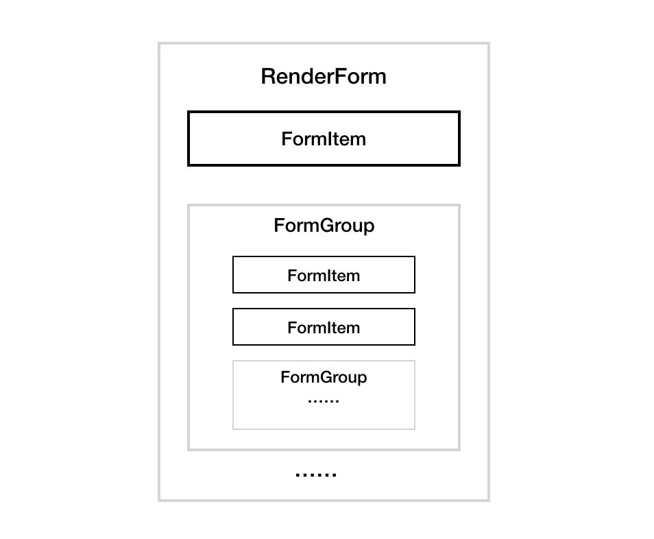
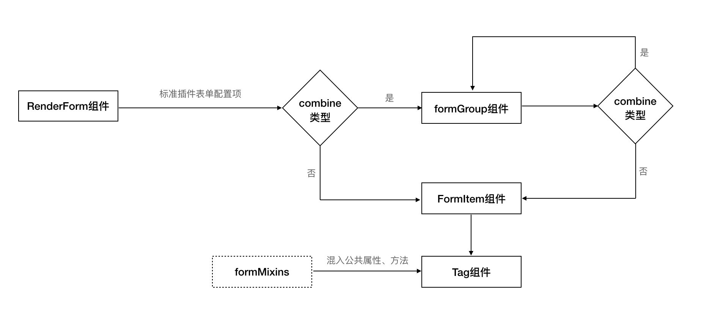

# Tag Usage and Development

The form item rendering and interaction events are based on pre-defined Tag components. A Tag component can be think of as a kind of encapsulated form  (e.g. input, textarea, table, upload, etc.). It facilitates the development and use of standard plugins by adding attributes and methods to native form element or specific business component. A standard plugin generally contains one or more Tag components. The frontend page loads standard plugin configuration file, reads the type field of each form item and renders the corresponding type of form.

# Standard plugin rendering logic

The rendering of standard plugin form items is distributed by RenderForm component. RenderForm component is based on Vue encapsulation, it uses the two-way data binding feature of Vue and realizes the v-model instruction for component form item value. When calling a component, feed the corresponding configuration item props to achieve automatic data sync between parent component and RenderForm internal component.

Each form item configuration in the configuration file corresponds to a FormItem component in the rendering layer of frontend component. Generally speaking (when not selected), the FormItem component contains a Tag* subcomponent. The type of the Tag is defined by the type field in the configuration item. Currently supported types include: input, textarea, checkbox, radio, select, table, upload, tree, password, etc. All Tag component has some pre-defined public attribute or methods. If a certain Tag type needs to support a specific event or function, it should be defined in the corresponding Tag subcomponent. If the official Tags do not meet the demands of custom-developed plugins, you can also develop new tags in accordance with the specifications.

RenderForm component structure:



The rendering process of standard plugin form:



formMixins function defines some public attributes and methods for Tag component. This method is called to mix in when adding Tag component to avoid writing repeated declarations.

Public attributes are divided into inherited attributes and non-inherited attributes. Inherited attributes are defined as props attribute in Tag component. Currently, value is the only inherited attribute. Non-inherited attributes are converted to data attribute. Its value will not update dynamically. The value defined in the configuration file of standard plugin will be used for the attribute first. If the configuration item does not contain the corresponding attribute, then default value will be used.

The private attributes of a Tag component are defined when the component is added. The value defined in the configuration file of standard plugin will be used for the attribute first. If the configuration item does not contain the corresponding attribute, then default value will be used.

# Tag Usage

Using Tag component is very simple. Define `type` field in standard plugin configuration item, add the attributes and methods supported by this type of Tag, and the corresponding form item will be rendered in the frontend page. By combining different Tag components, one can create complex interactive forms.

Currently, SOPS has the following Tag components built-in:

- button
- cascader
- checkbox
- datatable
- datetime
- time
- input
- int
- ipSelector
- password
- radio
- select
- text
- textarea
- tree
- upload
- memberSelector
- setAllocation
- TagSection
- codeEditor
# Tag component attribute and method

All attribute configurations in the Tag component are declared in the `attrs` field.

For example, to set the name attribute to "business id" and the placeholder attribute to "Please select business" for the select component.

```js
  ...
  attrs: {
    name: 'business id',
    placeholder: 'Please select business'
  }
  ...
```


When the configuration items defined by standard plugin are rendered in the page, they will be passed on to Tag components as attributes. Tage component can expand a variety of form configurations based on different attribute values. For example, `TagSelect` component can use `multiple` attribute to define whether a drop-down box is multi-select or single-select. `TagUpload` component can use `remote_data_init` attribute to customize the processing logic after loading the data.

When different standard plugins are rendered on the frontend page, there are some public interaction logics, including form item name, hidden status, hookability, validation rules, etc. These are public attributes, and all Tag components support standard plugin custom configuration. Since different Tags have their own application scenarios, they have different types of native forms or specific business scenarios encapsulated in the components, and the attributes they support are also different. Only certain tag components support standard plug-ins. Some attributes only support standard plugin custom configuration in specific Tag component, such attributes are called private attributes, such as the `remote_data_init` attribute in the `TagUpload` component.

To improve the capabilities of standard plugin, Tag components have encapsulated some public methods, which can be called in the event callback of standard plugin configuration item, such as hide form, acquire parent form component, acquire current form value, etc.

**The form item attributes and methods defined in the configuration file can only be retrieved by the component if they have been declared in the Tag component. **

## Public attributes

- `name`: the name of the form item, which controls the display of the label on the page
- `hookable`: whether it can be hooked as a global variable
- `validation`: the validation rules for form items. There are three types of form validation: `required`, `regex`, and `custom`. They should be used according to your needs:
```js
    {
      // ...
      validation: [
        { type: 'required' },
        {
          type: 'regex',
          args: RegExp, //Example: /\d{3}/
          error_message: String //Example: 'Please enter 3 numbers'
        },
        {
          type: 'custom',
          args (value, parentValue) {
            //...
            return { //The validation method must return the following format object
              result: Boolean,
              error_message: String
            }
          }
        },
      ]
    }
```
- `default`: the default value of the form item. Different Tag components support different data types.
- `hidden`: whether it is hidden by default
- `formViewHidden`: whether the form is hidden in view mode
- `col`: the number of horizontal columns, 12 maximum. Multiple forms can be laid out horizontally after this attribute is set.
- `value`: the value of form component. It needs to be manually defined in the Tag and passed on as a parameter for calling `getFormMixins` function.

## Public methods

- `updateForm`: trigger `change` event, update form value and call validation function. The parameter is `value`
- `validate`: validation function
- `show`: hide form
- `hide`: show form
- `get_form_instance`: get form instance, FormItem
- `get_parent`: get combine instance or root element instance
- `get_child`: get form instance. The parameter is tag_code in sub-form. It supports calling RenderForm or RenderGroup components
- `get_value`: get form value. It supports a Boolean parameter to be passed from configuration. The value is set to false by default. If the passed parameter's value is true, when tag form is hooked as a global variable, the corresponding value of global variable can be acquired.
-`get_tag_value`: get any form value of the current standard plugin. The parameter `path` is the path of the target tag form. The form value search starts from the outermost layer of the standard plug-in, such as `['bk_receiver_info','bk_more_receiver']`
- `set_value`: set the form value. The parameter is form value.

## Official Tag component description

### 1. TagButton

A button. Other Tag components usually monitor the `click` event of button to achieve Tag component interactions.

**Attributes**

  - `title`: button text.
  - `type`: button type. The values are :default, primary, warning, success, danger.
  - `icon`：icon class name. The value of this attribute can be found in [Blueking icon](https://magicbox.bk.tencent.com/#detail/show?id=bk_icon&isPro=1).
  - `size`: size. The values are: small, normal, large.
  - `disabled`: whether the button is disabled. When disabled, clicking the button will not trigger event.
  - `loading`: whether it is loading. When loading, clicking the button will not trigger event.
  - `text`: whether it is a text button.

**Methods**

*none*

### 2. TagCascader

Cascading component. It is generally used to view and select data with hierarchical relationship structure.

**Attributes**

  - `items`: the cascading options. E.g. [{label: '', value: '', children: [...]}, {label: '', value: '', children: [...]}]
  - `value`: the selected value of cascading selector.
  - `disabled`: set whether this component is disabled.
  - `multiple`: set whether multiple selection is allowed.
  - `filterable`: set if the options can be filtered.
  - `placeholder`: placeholder.
  - `lazy`: whether to enable remote loading.
  - `lazyLoad`: remote loading method. Reference document: lazyload instructions in cascader component section of element-ui.

**Methods**

*none*

### 3. TagCheckbox

Multi-select box. The options can be passed through configuration item for users to select.

**Attributes**

  - `items`: the options provided. E.g. [{name: 'WeChat', value: 'weixin'}, {name: 'Mail', value: 'mail}]
  - `disabled`: set whether this component is disabled.
  - `value`: the value of the selected item.

**Methods**

*none*

### 4. TagDatatable

Table. Used to display multiple lines of data in parallel. It supports loading remote data, adding individual data and data editing.

**Attributes**

  - `columns`: the configuration item of table columns. E.g. 
  [
    {
      tag_code: "name",
      type: "text",
      attrs: {
        name: gettext("Parameter Name"),
      }
    },
    {
      tag_code: "type",
      type: "text",
      attrs: {
        name: gettext("Parameter Type"),
        hidden: true,
      }
    },
    {
      tag_code: "value",
      type: "textarea",
      attrs: {
        name: gettext("Parameter Value"),
        editable: true
      }
    }
  ]
  - `editable`: display table operation column, including edit, delete, save and cancel buttons.
  - `deleteable`: display delete button. A separate display control for the delete button in table operation column.
  - `add_btn`: display add button.
  - `table_buttons`: customize table button. E.g. [{text: 'click', callback: function(){console.log(1)}, type: 'xxx or import'}, ...]. The type field is not a require field. When its value is import, click to callback internal upload function
  - `empty_text`: no data prompt.
  - `remote_url`: table data remote loading. Supports url string and url string return method.
  - `remote_data_init`: processing function after data is loaded.
  - `row_click_handler`: single-row click callback function. The call back parameters are:
    + row, eg: { key1:'value1',key2:'value2' }
    + column, eg: { label: 'name', property: 'key1' }
    + event
  - `row_draggable`: Whether table rows can be dragged
  - `pagination`: pagination display of table data, not displayed by default (false).
  - `page_size`: when the table is displayed in pages, the number of items displayed in each page. Default: 10 items per page.
  - `value`: table value

**Methods**

  - `validateSubCom`: check whether the data in the table conforms to the rules (the rules are specified by the standard plugin configuration items in the corresponding columns).
  - `set_loading`: pass a boolean parameter to set the loading status of the table.
  - `remoteMethod`: load data remotely.
  - `export2Excel`: export table data to excel file.

### 5. TagDatetime

Date and time selector.

**Attributes**

  - `placeholder`: placeholder.
  - `disabled`: set whether this component is disabled.
  - `type`: display type of date and time selector. Set to datetime by default. Values include: date, datetime, datetimerange, daterange, etc.
  - `format`: the selected time and displayed value. Set to yyyy-MM-dd HH:mm:ss by default. Please refer to [Date Format](https://element.eleme.cn/#/zh-CN/component/date-picker#ri-qi-ge-shi)
  - `value`: time value

**Methods**

*none*

### 6. TagTime

Time selector.

**Attributes**

  - `placeholder`: placeholder.
  - `startPlaceholder`: start time placeholder.
  - `endPlaceholder`: end time placeholder.
  - `disabled`: set whether this component is disabled.
  - `isRange`: whether a time range is selected.
  - `format`: the selected time and displayed value. Set to HH:mm:ss by default. Please refer to [Date Format](https://element.eleme.cn/#/zh-CN/component/date-picker#ri-qi-ge-shi)
  - `value`: time value.

**Methods**

*none*

### 7. TagInput

Text box. Generally used to input a single line of text.

**Attributes**
  - `placeholder`: placeholder
  - `min`: minumum value. Default: -Infinity
  - `max`: maximum value. Default: Infinity
  - `disabled`: set whether this component is disabled.
  - `showPassword`: set whether to display the content in asterisks.
  - `value`: text box value.

**Methods**

*none*

### 8. TagInt

Integer input box. Used to input integer.

**Attributes**

  - `placeholder`: placeholder.
  - `disabled`: set whether this component is disabled.
  - `value`: the value of integer input box.

**Methods**

*none*

### 9. TagIpSelector

IP selector. Supports single/multiple selection of static/dynamic IP.

**Attributes**

  - `isMultiple`: whether the selector is selecting multiple options (single-select means it is selecting static or dynamic IP, multi-select means it is selecting static and dynamic IP at the same time)
  - `remote_url`: call interface url configuration within the component. Supports object format and object return method, e.g. { cc_search_module: '/pipeline/cc_search_module/2/' }
  - `disabled`: set whether this component is disabled.
  - `value`: the IP value selected

**Methods**

*none*


### 10. TagPassword

Password input box.

**Attributes**

  - `pubKey`: crypto public key
  - `disabled`: set whether this component is disabled.
  - `canUseVar`: whether global variables can be used, which defaults to true
  - `textareaMode`: When entering a password manually, the form type is textarea and the default is false
  - `value`: the encrypted password value

**Methods**

*none*

### 11. TagRadio

Single-select box. The options can be passed through configuration item for users to select.

**Attributes**

  - `items`: the single-select options provided, e.g. [{name: 'WeChat', value: 'weixin'}, {name: 'Mail', value: 'mail}]
  - `disabled`: set whether this component is disabled.
  - `value`: the value of the selected item.

**Methods**

*none*

### 12. TagSelect

Drop-down box. The options can be passed through configuration item for users to select. The options can be loaded remotely.

**Attributes**

  - `items`: the drop-down box options provided, e.g. [{text: 'WeChat', value: 'weixin'}, {text: 'Mail', value: 'mail'}]
  - `multiple`: whether it is a multi-select
  - `remote`: whether to enable remote loading
  - `remote_url`:  remote loading url. Supports url string and url string return method.
  - `remote_data_init`: data processing function after remote loading.
  - `placeholder`: placeholder.
  - `empty_text`: no data prompt.
  - `hasGroup`: whether the options are grouped
  - `clearable`: whether to show the clear form value icon on the right
  - `allowCreate`: whether it supports creating option with an input box
  - `showRightBtn`: whether to show the button on the right side of the selection box. Default: false
  - `rightBtnIcon`: icon of the button on the right side of the selection box. Default: 'bk-icon icon-chain'
  - `rightBtnCb`: callback function when clicking the button on the right side of the selection box. Default: null
  - `disabled`: set whether this component is disabled.
  - `value`: the value of the selected item, the values of multiple items are separated by `,`

**Methods**

  - `set_loading`: pass in a boolean parameter to set the loading status of the dropdown box
  - `remoteMethod`: load data remotely.

### 13. TagText

Text component. It cannot be edited and is generally used to display text information.

**Attributes**

  - `raw`: whether to keep line breaks and spaces in the text. Default: `false`
  - `value`: the value of the text

**Methods**

*none*

### 14. TagTextarea

Multi-line text box.

**Attributes**

  - `placeholder`: placeholder.
  - `disabled`: set whether this component is disabled.
  - `value`: the value of the text box

**Methods**

*none*

### 15. TagTree

Tree select component. It is generally used for selecting multiple grouped hierarchical data. The options can be passed in through configuration item for users to select. The options can be loaded remotely.

**Attributes**

  - `items`: provides the options to be selected, e.g.
  ```js
  [
    {
      label: 'Notification Method',
      children: [
        {
          label: 'Information',
          children: [
            { label: 'SMS' },
            { label: 'WeChat Work' },
            { label: 'WeChat' }
          ]
        },
        { label: 'Voice Message' }
      ]
    },
    {
      label: 'Notification Group',
      children: [
        { label: 'Operation' },
        { label: 'Product' },
        { label: 'Develop' },
        { label: 'Testing' }
      ]
    }
  ]
  ```
  - `expanded_keys`: the array of key in the node that is expanded by default
  - `show_checkbox`: whether the node can be selected
  - `default_expand_all`: whether all arrays are expanded by default
  - `remote`: whether to enable remote loading
  - `remote_url`: remote loading url. Supports url string and url string return method.
  - `remote_data_init`: data processing function after remote loading.
  - `value`: the selected value

**Methods**
  - `remoteMethod`: load data remotely.


### 16. TagUpload

Upload component.

**Attributes**

  - `url`: server url
  - `multiple`: whether it support multiple uploads
  - `headers`: http request header
  - `data_params`: additional parameter for file upload, e.g. { filename: 'test.zip', filetype: 'zip' }
  - `auto_upload`: whether to enable auto upload. Set to true by default. Auto upload (Automatically uploads after the file is selected). Manual upload (User needs to click the upload button after the file is selected and use custom submit method callback)
  - `withCredentials`: Cookie credential information can be sent
  - `submit`: custom upload method
  - `limit`: number of upload files
  - `placeholder`: placeholder.
  - `text`: text on the upload button
  - `disabled`: set whether this component is disabled.
  - `value`: the uploaded file

**Methods**
  - `onSubmit`: callback when clicking manual upload button. Starts upload by default. If `submit` attribute has been passed in from configuration item. The method is executed.
  - `beforeUpload`: Hook function before uploading. If the function returns false or Promise and receives reject, upload will be canceled. Parameter: file
  - `beforeRemove`: Hook function before the file is deleted. If the function returns false or Promise and receives reject, deletion will be canceled. Parameters: file, fileList
  - `onSuccess`: Hook function when file has been uploaded successfully. Parameters: file, fileList
  - `onRemove`: Hook function when a file is removed from file list. Parameter: file, fileList
  - `fileChange`: Hook function when the uploaded file is changed. This function is called when a file is added, uploaded or fails to upload. Parameters: file, fileList
  - `onError`: Hook function when file upload fails. Parameters: err, file, fileList

### 17. TagMemberSelector

Member selection component

**Attributes**

  - `placeholder`: placeholder.
  - `disabled`: set whether this component is disabled.
  - `value`: the name of members selected, separated by ',' e.g. "xiaoming,xiaozhang,xiaoli"

**Methods**

### 17. TagLogDisplay

Log Display

**Attributes**

  - `value`: log content, \n is used as line break

**Methods**

*none*

### 18. TagSetAllocation

Resource selector

**Attributes**

  - `remote_url`: call interface url configuration within the component. Supports object format and object return method, e.g. { cc_search_module: '/pipeline/cc_search_module/2/' }
  - `disabled`: set whether this component is disabled.
  - `value`: the selected resource value and filter configuration

**Methods**

*none*

### 19. TagSection

standard plugin form separator Tag. It is generally used to group form items. The value of the name attribute in configuration item will be rendered as the group name.

**Attributes**

*none*

**Methods**

*none*

### 20. TagCodeEditor

Code editor

**Attributes**

 - `value`: code string
 - `language`: editor language. Default: python. Supports javascript, typescript, json, python, shell.
 - `height`: editor height. Default: 100px
 - `showMiniMap`: show minimap. Default: false
 - `showLanguageSwitch`: show language switch. Default: true
 - `readOnly`: read only mode. Default: false

**Methods**

*none*

# Methods defined in standard plugin

When the Tag component is being initialized and rendered, the methods in the methods attribute of the corresponding configuration item will be registered to the Tag component, and the standard plugin can add methods according to demands.

If the standard plugin needs to perform some initialization logic when the Tag component is rendered for the first time, you can define `_tag_init` method in the `methods` attribute, which will be executed by default when the component is mounted on the page.


# Event interactions between Tag components

The Tag components implement event interaction between components by publish/subscribe. For example, in the TagSelect component, after selecting a data item, the value is updated to the TagInput of the same hierarchy. When the frontend renders the component, it registers the defined event listeners according to the source + type rules configured in the events attribute of the standard plugin. Other components can call `this.$emit(${tagcode}_${event_type})` to trigger the event listener callback for the corresponding form.

The event interaction between Tag components is relatively simple. You just need to define the events rule in the standard plugin form item to listen to the events dispatched by the corresponding form, for example:

```js
  tag_code: 'biz_input',
  type: 'input',
  attrs: {
    name: 'some label'
  },
  events: [
    {
      source: "biz_info",
      type: "change",
      action: function () {
          const bizInfo = this.get_parent().get_child('biz_info')
          const value = bizInfo._get_value()
          this.updateForm(value)
      }
    }
  ]
```

The `biz_input` form item listens to the `biz_info` form item value change event, and updates its selected value to the input.

**Tag component throws init event by default when the frontend is initializing rendering (the `_tag_init` method defined in the methods configuration item of the standard plugin is executed before the init event is thrown)**

**Tips**

- Every Tag component will trigger `init` event by default when it is rendered to the frontend page. The standard plugin form item can listen to this event according to demands.
- Every Tag component will trigger `change` event by default when the form value changes. The standard plugin form item can listen to this event according to demands.
- Tag components only support event interactions in the same hierarchy level (same parent component), which corresponds to the same level form item in standard plugin configuration item or the same level form item in combine.


# Tag Development

## Custom tag development process

To add a Tag component, just add a single vue component file in the `src/components/tags/` directory of the frontend project. The file name format is `Tagxxx`, `xxx` being the name of the Tag component. The name should follow camel case rule and should be unique among all `Tags` in the project. webpack will search for files in this directory when packaging, and automatically load and register them to the `FormItem` component. It is recommended to add a `tag-xxx` `class` name to the outermost element of the template, where `xxx` being the name of the Tag.

When writing components, please keep the following points in mind:

- Display mode and edit state
  
  RenderForm component is a universal component, it is used for rendering all standard plugin forms on the pages of SOPS. Different locations of the page may have different states and modes, such as edit state, disable state, form mode, view mode. Therefore, when writing component templates, different templates are required for different scenarios. Use `formEdit` attribute to distinguish edit from disabled state. Use `formMode` attribute to distinguish form mode from view mode.

- Define private attributes. Mix in public attributes and methods.

  When writing components, you must introduce public attributes and methods. After defining private attributes, call public mixins function to pass in parameters. Private attributes must contain the value attributes. Attribute declaration should follow the format in props validation rules. mixins function is defined by the `src/components/common/RenderForm/formMixins.js` file in frontend project directory. 

- Form value binding

  Two-way binding must be implemented for Tag component values. Use a computed attribute to handle binding logic. The `get` in computed attribute is the value in the props (note that deep copy is used for reference type value), `set` needs to call the `updateForm` method to pass in the modified value to the component, triggering the change event and validation logic.
