# Mobile Version Usage Instructions

## Mobile User WeChat Work Account Linking
Authorized mobile users need to link their WeChat Work account in Blueking PaaS platform before using SOPS for the first time. In the "Personal Center" of Blueking PaaS platform, click on the avatar (and tap "Link WeChat"),
and scan the QR code using WeChat Work to complete linking. After completing WeChat Work account linking, please visit SOPS SaaS again to synchronize WeChat Work account information.
Then, the user can visit SOPS mobile version in the "workbench" section of WeChat Work.

If you cannot find the "Link WeChat" link, please contact the person in charge of deploying your Blueking environment, and follow the instructions in [Mobile Version Deployment] (../install/mobile_deploy.md).

## Mobile Version Features

### Business Selection
When you visit SOPS mobile for the first time, you will see the business selection page, where you can see the businesses that you have access to. The businesses shown here are the same as the ones in the business selection drop-down box on the PC version. Tap on a business to open the flow template list page for that business.

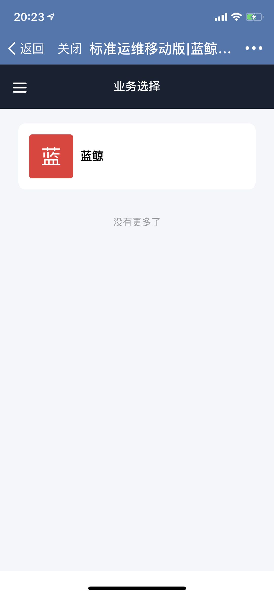

### Flow Template
The flow template page shows the list of created flow templates under the current business, and displays your bookmarked flow at the top of the list. Note that the bookmarks are shared among mobile and PC versions.
The flows you bookmarked on the PC version will also show up in the bookmark list on the mobile version. You can also use the search box to find a flow.

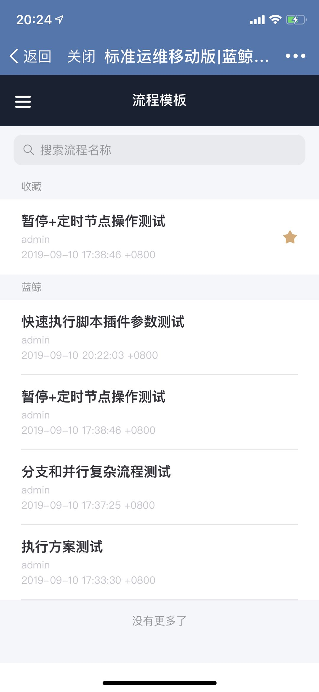

You can tap on any flow to open its "New Task" page, and then click the "Bookmark" icon to bookmark the flow.

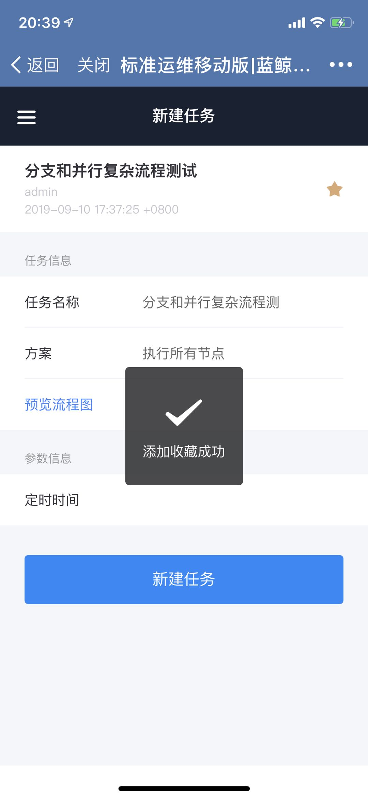

### Create and execute tasks
After tapping on a flow in the flow template page, the "New Task" page will open, where you need to fill in the global variable parameters of the flow. You can also modify the task name. Currently, only some parameter types are supported on the mobile version.
Complex interactive parameters such as table and IP selectors are not supported on the mobile version. If it is necessary to execute the flow template on the mobile version, please check the global variables when editing the flow on PC to make sure that it does not include any complex parameter types.

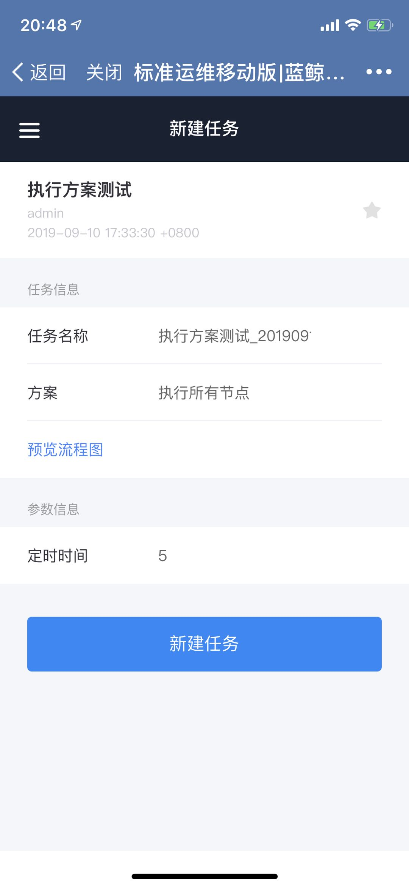

When creating a task, you can also choose the execution scheme for the flow. The default scheme is "Execute all nodes". Please use PC version to add and delete execution schemes.

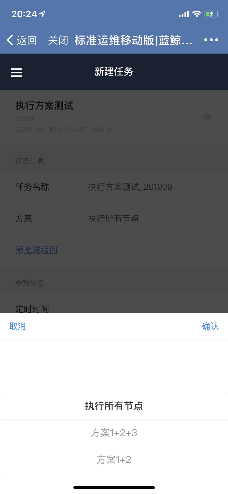

After filling out the task parameters and execution scheme, tap "New Task" to create a new task log. You will then be redirected to the "Task Details" page. You need to tap the "Start" button to start the task.
Similar to the PC version, you can tap "Undo" button to terminate the task at any time during execution. You can also tap the "View Parameters" button to review the task parameters.

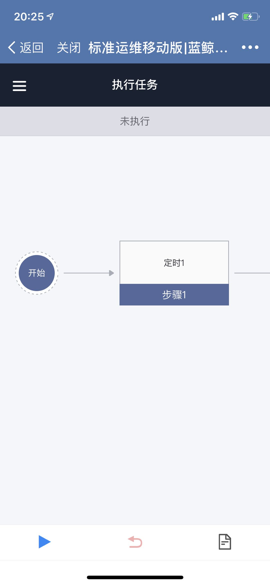

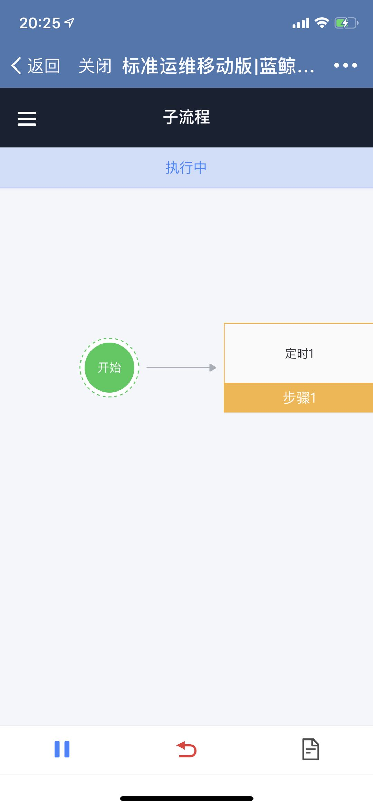

When standard plugin node execution is completed, you can tap on the node and then tap "View Details" to see the input and output parameters of the standard plugin node and the exception messages when execution failed.

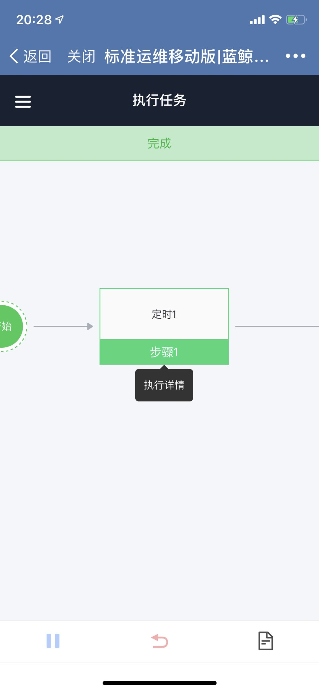

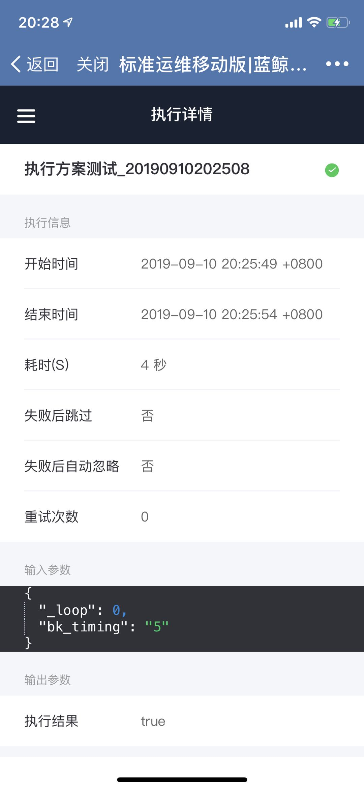

Similar to the PC version, when you encounter "BK-Pause" plugin, you can tap the node, and tap "continue" to complete the Pause plugin and continue executing the rest of the task nodes.
When you encounter "BK-Schedule" plugin, you can tap the node and tap "Modify Schedule" to reset the time for the schedule node.

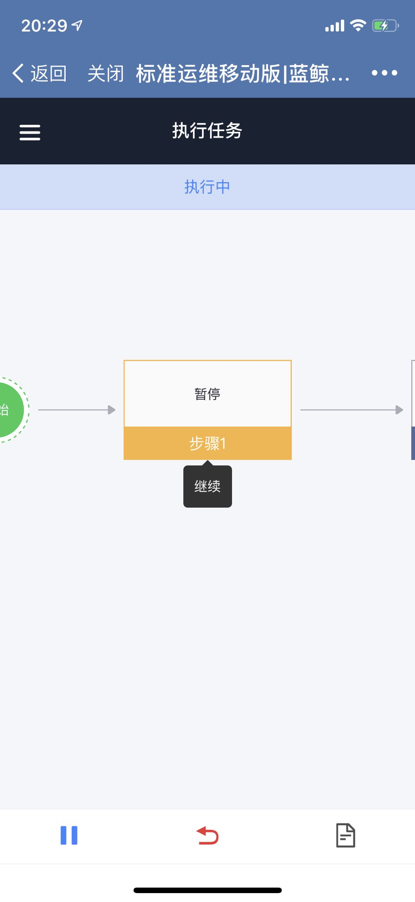

Once task execution completes, you can tap the navigation menu and return to "Flow Template" or open "Task Log".

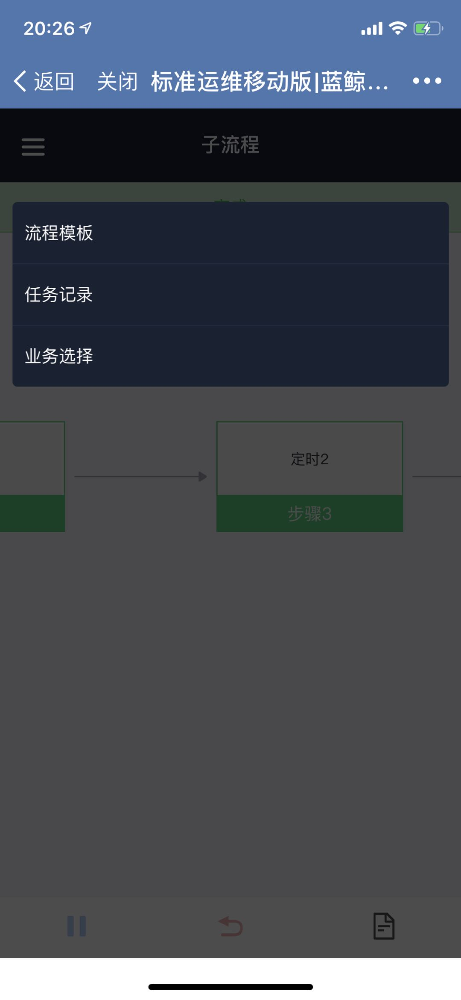

### Task Log
The Task Log page only shows the tasks created on the mobile version under the current business. You can see the task execution start time and execution status. You can also enter the task name in the search box to find the task quickly.

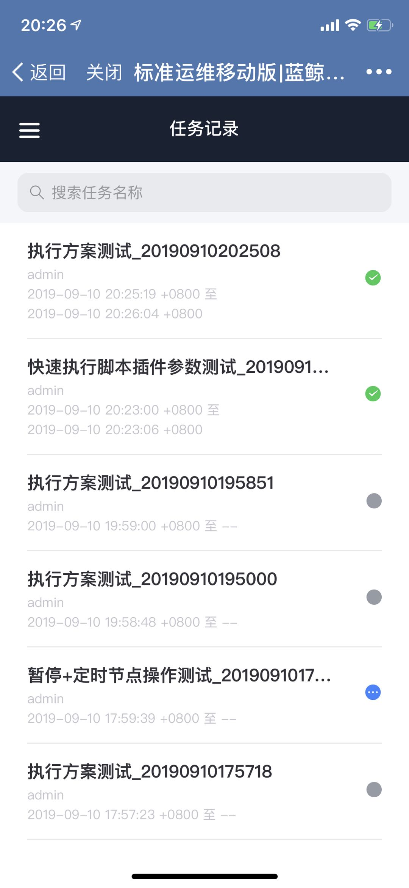
