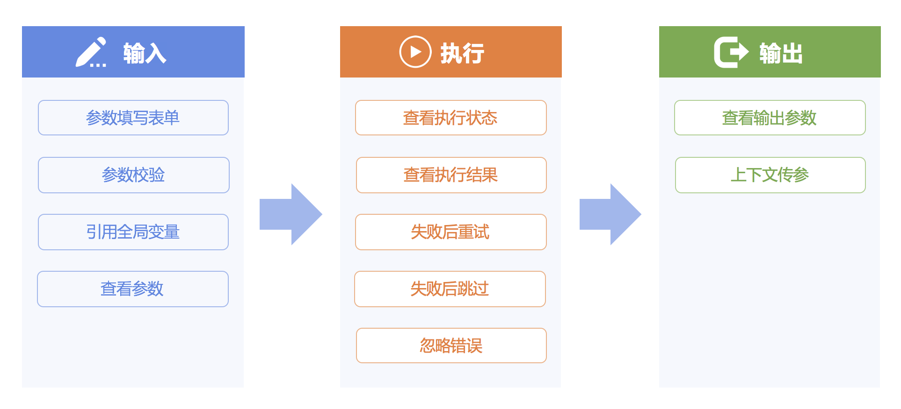
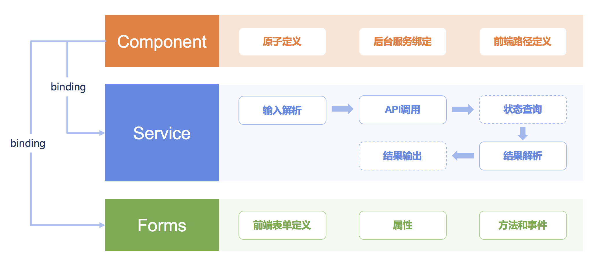

# About standard plugins

## Standard plugin definition
The standard plugin is the smallest unit of SOPS task execution. It corresponds to a certain internal service (such as cron) or a third-party system API call (such as JOB-Quick Execution Script). 
It converts API parameters into frontend form and adds features such as parameter validation, logic encapsulation and present itself to users in GUI.

Standard plugin functions include input, execution and output.


Standard plugin framework includes plugin definition: Component, background execution logic: Service, and frontend form: Forms.


## Standard plugin auto-discovery
SOPS has a plugin auto-discovery feature. It scans specific directory (including subdirectories) of registered APP (INSTALLED_APPS) in Django when SaaS service is activated, and automatically discovers and registers valid standard plugins. The directories to be scanned can be configured by editing `COMPONENT_PATH` in Django settings:

```python
COMPONENT_PATH = [
    'custom.components.path',
]
```

By default, SOPS will scan the `components.collections` directory in registered APP. It will attempt to find and register all valid standard plugins in all Python modules in this directory (including subdirectories).

Please refer to `pipeline.component_framework.apps` and `pipeline.utils.register` modules for the coding of SOPS plugin auto-discovery.

## List of official plugins

### BK Series

#### BK-Schedule
#### BK-Pause
#### BK-HTTP Request
#### BK-Send Notification

### CMDB Series

#### CMDB-Create Cluster
#### CMDB-Update Cluster Attributes
#### CMDB-Modify Cluster Service Status
#### CMDB-Clear Hosts in the Cluster
#### CMDB-Delete Cluster
#### CMDB-Update Module Attributes
#### CMDB-Transfer Host Module
#### CMDB-Update Host Attributes
#### CMDB-Transfer Host to Idle Machine Module
#### CMDB-Transfer Host to Failed Machine Module
#### CMDB-Submit Host to Resource Pool
#### CMDB-Replace Failed Machine


### Job Series

#### JOB-Execute Job
#### JOB-Quick File Distribution
#### JOB-Quick Execution Script
#### JOB-New Scheduled JOB
#### JOB-Distribute Local Files

Component version should be:

- install_ee >= v1.9.5
- job >= v2.5.18

> An update is required if component version does not meet requirements. After the update, SOPS needs to be redeployed.


Please make sure that the following variables are included in `Developer Center #### S-mart Application #### SOPS #### Environment Variables`:


- BKAPP_ENABLE_SHARED_FS: Allows NFS to be mounted. The value should be `True`
- BKAPP_FILE_MANAGER_TYPE: File management type. The value should be `host_nfs`
- BKAPP_NFS_CONTAINER_ROOT: NFS mount path. The value should be `/data/app/code/USERRES`
- BKAPP_NFS_HOST_ROOT: NFS host path. The value should be `/data/bkee/paas_agent/apps/projects/bk_sops/code/bk_sops/USERRES`


### Nodeman Series

#### Nodeman-Installation

### WechatWork Series

#### WechatWork-Send Message

Please make sure that the following variables are included in `Developer Center #### S-mart Application #### SOPS #### Environment Variables`:

- BKAPP_SOPS_WECHAT_WORK_WEB_HOOK: The webhook address where WechatWork bot will send message to.
