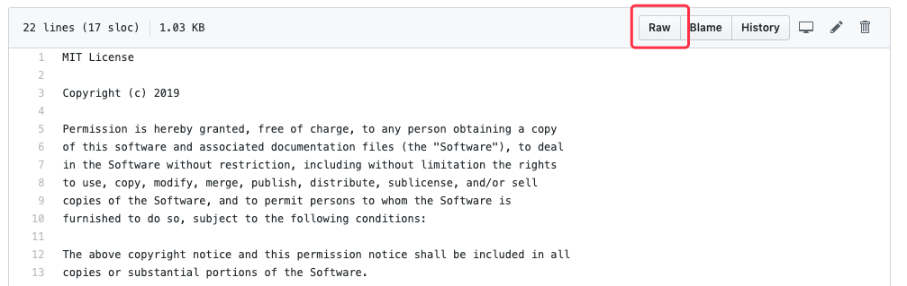
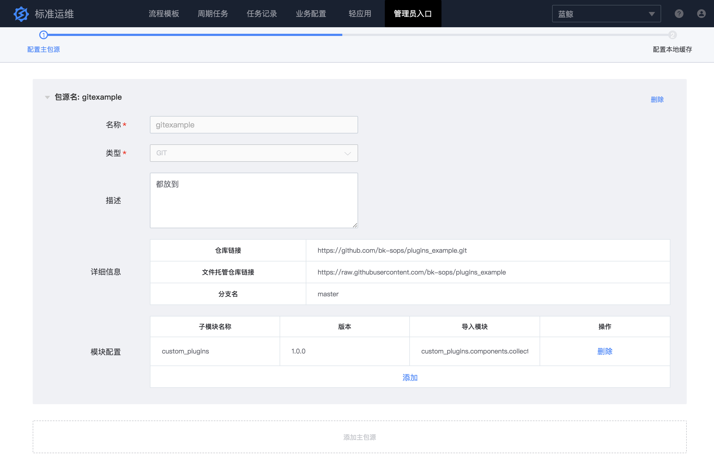
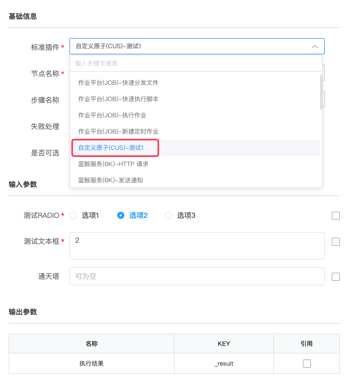

## Standard plugin remote loading

## Feature overview
The standard plugin remote loading feature allows users to load third-party plugins without modifying the SOPS source code. It simplifies the complex standard plugin development and maintenance processes. In the previous version,
if users want to develop custom plugins and release them on the official SOPS SaaS, they generally need to pull the bk-sops source code to develop plugins locally first, and after testing,
they need to decompress the official SOPS SaaS version package locally, then add the custom plugin package to the version package, and modify some settings configuration, then repackage, upload and deploy;
If the custom plugin requires additional python dependency package, then users also need to [execute the packaging script on the CentOS machine] (../install/source_code_deploy.md) to complete the official S-mart application packaging operation. 
Moreover, any subsequent version changes to the custom plugins require repackaging, uploading and deployment, which is very costly.

In response to the above pain points, the new version of SOPS provides a "Standard Plugin Remote Loading" feature. User does not need to decompress the official package and repackage, they only need to configure the custom plugin package source information in SOPS configuration after custom plugin development and testing is completed,
then redeploy the application to automatically load the plugin.

## Principle
SOPS can load python source code from Git, S3, file system and other file hosting sources by extending the `imp` module based on the recommended specification in [PEP 302 -- New Import Hooks] (https://www.python.org/dev/peps/pep-0302/),
and it exposes an interface for users to fill in the remote plugin package source configuration via page configuration.

Furthermore, to avoid pulling the plugin code from remote sources repeatedly in each release deployment, which may lead to plugin loading failure due to network policies, network fluctuation, etc.,
SOPS can sync remote Git, S3, filesystem, and other package sources to S3, file system, and other local cache sources based on [Boto 3] (https://github.com/boto/boto3) and [GitPython] (https://github. com/gitpython-developers/GitPython) modules. 
Users only need to unlock network policies when they need to update remote plugins hosted on the extranet,
and load the last synced package source code from the local cache in each normal release deployment.

## Quick start

### 1. Develop standard plugins
Please refer to [Standard Plugin Development] (../develop/dev_plugins.md), and be sure to follow the chapter "Standard Plugin Remote Loading" to complete the plugin remote loading transformation.

### 2. Hosting standard plugin package sources
SOPS supports three types of file hosting sources, Git, S3, and file system. After completing the development of the standard plugin, you need to upload the entire plugin package to the file systems supported by SOPS, such as Git, Ceph, and NFS, 
which will then be accessed by the Blueking SaaS server. Refer to "Initialize Plugin Module" chapter in the standard plugin development document for the file directory.

### 3. Configure the remote plugin package source
Log onto SOPS with an account that has administrator privileges, enter the "Backend Management Page" in the "Administrator Portal", and add the main package source configuration. If you are using Git, you need to fill in the repository link, the file hosting link,
and the branch name. The file hosting link can be acquired by clicking the "Raw" button on any file on the Git web page and copying the part of the link before the branch name.

If it is S3 type, the user needs to fill in the object storage service address, Bucket name, Access Key, and Secret Key.

If it is a file system type, the user needs to fill in the file path accessible to the SOPS SaaS backend server. It is recommended to mount it by NFS to
avoid the problem of file loss due to redeployment of SaaS or complex file synchronization shared by multiple service instances.

Regardless of which type of main package source the users choose above, they need to configure the plugin module information that the package source will load. One main package source can contain multiple plugin sets, and each plugin set needs sub-module, version number,
and import module. The sub-module is the root directory of the plugin package; The version number is used to indicate the current version of the plugin set, which is updated at each plugin change; The import module is the python import path of the files in the plugin collection,
separated by `,`.

### 4. Configure environment variables and redeploy SOPS
Go to Developer Center, find SOPS SaaS, add the environment variable with the variable name `BKAPP_EXTERNAL_PLUGINS_SOURCE_SECURE_LOOSE` in the "Environment Variables" page,
value 1 means HTTP and HTTPS protocols are allowed for remote plugin package source address, value 0 means only HTTPS protocol is allowed for remote plugin package source address. After configuring the global variables,
perform the "Quick deployment" of the official environment in the "Release Deployment" page, wait for the deployment to complete, and then you can find the custom plugins in the remote plugin package source in the flow editor.

## Example

### GitHub hosted standard plugin example

- GitHub repository plugin directory structure
https://github.com/TencentBlueKing/bk-sops/plugins_example

- SOPS remote package source configuration

- The effect when the plugin is successfully loaded after redeployment
Edit the default standard plugin node in "New Flow", and the user can see "Custom Atomic (CUS) - Test 1" in the remote plugin package source, and the page renders normally after selecting this plugin.

## FAQ

- I redeployed SOPS after adding the remote package source, but the newly developed plugin cannot be found in the flow editor, what could be the reason?
> It might be a network error or configuration error that causes remote plugins to fail to load. We suggest using logs to check if there is an ERROR level message to further investigate the specific cause.
