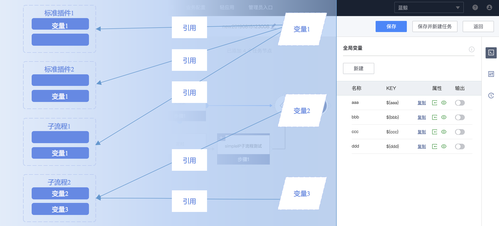
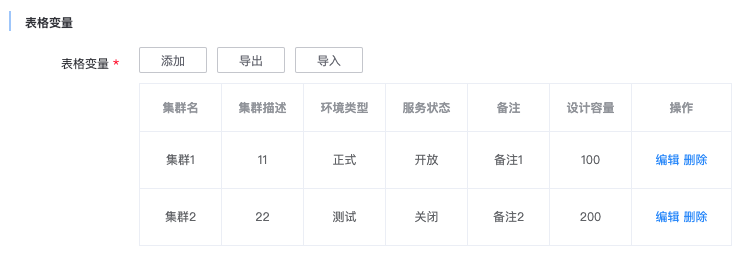
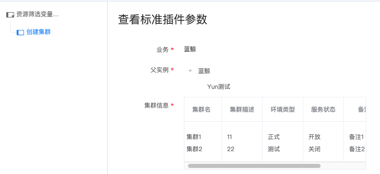

# Variable Engine

## Variables Overview

Global variables are public parameters of the flow template and are uniquely constrained by KEY. Users can use them in the input parameters of task nodes and in exclusive gateway expressions.
SOPS Variable Engine automatically replaces global variable references with the global variable values during task execution. With global variables, users can simplify task parameters and implement contextual parameter passing and other features by referencing standard plugins output parameters.
 


There are three sources of global variables.
First, global variables can be generated by selecting the input parameters of task node. The type of such global variables is "component" and they cannot be changed; The default value is the same as the form type of the input parameter of source standard plugin.
For example, if the parameter of the standard plugin node is a radio box, the global variable generated is also a radio box.

Second, global variables can be generated by selecting the output parameters of task node. The type of such global variables is also "component" and they cannot be changed either; They don't have a default value because the values of these global variables are automatically generated by
the output result of standard plugin node and sub flow node. Users cannot set these values manually; In addition, the display attribute of these global variables is "hidden" and the attribute cannot be modified, which means that users do not need to fill these parameters manually when executing tasks.

Third, global variables are generated when users click "Add Variable" in the global variable section. Users can select input box, text box, date and time, integer, IP selector and other variable types for manually added global variables. They can also be edited and modified.


## Custom global variables

### Input box
It allows single-line string and supports custom validation rules. When the user fills in the parameter value, illegal parameter values can be avoided (Currently, only frontend page parameter validation is supported. API parameters are not validated).
The default validation rule is `^.+$`, which means the input cannot be null. In most cases, it is recommended that users use the input box type when adding global variables manually.

### Text box
It allows multi-line string. If this variable is directly referenced, you will get a string separated by `\n` line break.

### Date and Time
It allows date and time to be selected. The value format of the variable is a string similar to `%Y-%m-%d %H:%M:%S`. For time format related parameters, it is recommended to create and reference a new global variable of this type.
For example, the time parameter of BK-Schedule plugin.

### Integer
The user can input or select an integer. The value of this variable is an integer. It can be used directly for mathematical operations in the variable reference syntax.

### Password
Password input form implemented by RSA asymmetric encryption algorithm. The user can input any character. The input will be saved, encrypted and then passed to the backend. When the password field is used in the backend, it must be processed by the decryption function.
```python
from pipeline.conf import settings
from pipeline.utils.crypt import rsa_decrypt_password

class AgentInstallService(Service):

    def execute(self, data, parent_data):
        value = data.inputs.pwd_tag_code
        password = rsa_decrypt_password(value, settings.RSA_PRIV_KEY)
```

Note that the password variable must be decrypted in the backend by a custom-developed plugin, otherwise you will get encrypted string that cannot be used directly. 
Because the standard plugin developed by the plugin developer does not contain encryption function, when we need the user to enter passwords, we should use input prompts to tell the user to reference password variable. However, it is up to the user to decide whether to reference the password variable or not. 
If the developer wishes to support plaintext password, the above plugin code can be changed to:
```python
from pipeline.conf import settings
from pipeline.utils.crypt import rsa_decrypt_password

class AgentInstallService(Service):

    def execute(self, data, parent_data):
        value = data.inputs.pwd_tag_code
        try:
            password = rsa_decrypt_password(value, settings.RSA_PRIV_KEY)
        except Exception:
            password = value
```

### IP Selector (Lite Version)
It has been updated to "IP selector". This might be removed in future versions. Please switch to the new version.

### IP Selector
You can select a static IP list in the business, select the dynamically generated IPs from business topology or input the dynamically generated IPs from certain layer of business topology. The value of the variable is the legal intranet IP of the host machine in the current business.
The user can decide whether to include BK-Net information. Multiple IPs are separated by comma `,` For example, `127.0.0.1,127.0.0.2` or `0:127.0.0.1,0:127.0.0.2` (assuming the BK-Net ID of these IPs is 0).
Illegal IPs (including non-IP characters and IPs not in the current business) will be automatically filtered.

### Dropdown Box
Dropdown boxes are "meta variables", the difference between them and "standard variables" is whether you can customize the metadata. When you create a new dropdown box variable, you need to fill in the data source and other configuration items.
The data source information is a string, and is written in the format of `[{"text": "", "value": ""}...]`. The `text` of each data item indicates the text that the user sees in the frontend selection box. 
The `value` indicates the value passed to the backend. If it is a remote data source, the `value` should be the target URL of the formatted data. Please don't set login authentication and other restrictions on the remote data source. After the data source is defined, 
you also need to determine whether it is "single-select" or "multi-select". The value of a single-select box is a single `value` string, the value of a multi-select box is in the format of `value1,value2... `. Finally, the "default value" is optional. 
If a default value is configured, the value must be in the same format as required by `single-select`/multi-select".

### Table
Tables are also "meta variables". When creating table variable, you need to add column configuration and default values. Table variables can be used in conjunction with plugins that fill in table parameters. Use custom table variable to simplify or reuse plugin parameter.
The column configuration format is `[{"tag_code": "name1", "type": "input", "attrs": {"name": "Column 1"}}...]`. Please refer to the datatable section in "Tag Usage and Development" for detailed information;
The default value can be null. It's format is `[{"name1": "value1", "name2": "value2"}...]`. The key of each dictionary item should correspond to the tag_code in column configuration.

The value of table variable is an object, and requires variable advanced syntax to use. For example, the code to obtain the value of the first row of the column with the `name1` tag_code is: `${table.name1[0]}`. The code for the second row is `${table.name1[1]}`;
The code to obtain all rows of the column with the `name1` tag_code is: `${table.name1}`. (This value is a list and cannot be used in plugin parameter directly. You can use advanced syntax to convert it to a string,
such as a string separated by `,`: `${",",join(table.name1)}`); By default, the table variable also provides the value of multiple rows in string format, i.e. `${table.flat__name1}`.
It is a string separated by `\n` line break that contains the values of all rows in the column with `name1` tag_code.

The following is an example of a table variable used in conjunction with CMDB-Create Cluster plugin. First, create a variable and set table_var as the KEY, and then fill in the column configuration:
```json
[{
    "tag_code": "bk_set_name",
    "type": "input",
    "attrs": {
        "name": "ClusterName",
        "editable": "true",
        "validation": [{
            "type": "required"
        }]
    }
},
{
    "tag_code": "bk_set_desc",
    "type": "input",
    "attrs": {
        "name": "ClusterDescription",
        "editable": "true"
    }
},
{
    "tag_code": "bk_set_env",
    "type": "input",
    "attrs": {
        "name": "EnvironmentType",
        "editable": "true"
    }
},
{
    "tag_code": "bk_service_status",
    "type": "input",
    "attrs": {
        "name": "ServiceStatus",
        "editable": "true"
    }
},
{
    "tag_code": "description",
    "type": "input",
    "attrs": {
        "name": "Remarks",
        "editable": "true"
    }
},
{
    "tag_code": "bk_capacity",
    "type": "input",
    "attrs": {
        "name": "Capacity",
        "editable": "true"
    }
}]
```
Then add a CMDB-Create Cluster plugin on the flow canvas. The cluster information only requires one line of data. The cluster name is `${table_var.flat__bk_set_name}`.
The cluster description is `${table_var.flat__bk_set_desc}`. Other columns have similar rules. When creating a task, the following values can be used for table parameter:



The table parameters are correctly parsed when we view task parameters. The final parameter for CMDB-Create Cluster is:



### Cluster resource filter variable
Cluster resource filter variable is based on the business topology and the host machine of the configuration platform. It is used to help users to implement bulk zone launching and allocation of host resources. This variable provides a cluster list parameter in the form of a table and
a complex form for resource filtering. The resource filter form supports the user to configure parameters such as the number of clusters, cluster templates, host resource affiliation etc. It can also automatically generate new cluster module tab; Within each module tab,
the user can configure the expected number of hosts assigned to the module and host filtering conditions. When the resource filter form parameters are filled, the assigned host and module information will automatically populate cluster list parameters when the user clicks "Confirm".
On the cluster list parameters table page, the user is required to add other attributes of the created cluster or adjust the allocated host resource. The cluster list parameter table supports import and export.

The value of cluster resource filter variable is an object. Similar to the table variable, it requires variable advanced syntax to use. For example, the code for using the value of the first row of (bk_set_name) cluster column: `${set_res.bk_set_name[0]}`;
The code for using the value of all rows of the cluster column: `${set_res.bk_set_name}` (This value is a list and cannot be used in plugin parameter directly. You can use advanced syntax to convert it to a string,
such as a string separated by `,`: `${",".join(set_res.bk_set_name)}` ); By default, the cluster resource filter variable also provides the value of multiple rows in string format, i.e. `${set_res.flat__bk_set_name}`,
It is a string separated by `,` line break that contains the values of all rows in the column with the cluster name (bk_set_name).

The module host allocation details of cluster resource filter variable are stored in `_module` attribute. For example, the code for using the value of the module in the first row (module1): `${value._module[0]["module1"]}`.
It indicates the IP of this module. Multiple IPs are separated by `,` For example: `127.0.0.1,127.0.0.2`.

The definition of attributes of cluster resource filter variable object:
- `bk_capacity`: the designed capacity list of the filtered cluster
- `bk_service_status`: the service status list of the filtered cluster
- `bk_set_desc`: the cluster description list of the filtered cluster
- `bk_set_env`: the environment type list of the filtered cluster
- `bk_set_name`: the cluster name list of the filtered cluster
- `description`: the remarks list of the filtered cluster
- `flat__xxx`: `xxx` is the string splicing result of the fields, separated by `,`
- `flat__ip_list`: the string splicing result of all machine IPs in the filtered cluster after duplication removal, separated by `,`
- `open_zone_count`: the number of clusters filtered
- `_module`: list of the allocation details of modular host


### Host attribute query
The host attribute selector variable gets the host attributes of the IP input by users by calling the interface of the configuration platform. The return value is a `python` dictionary object, with each input IP available from the CMDB as a key.
The host attributes queried from the CMDB are encapsulated in dictionary as values. The host attribute contains the built-in fields of the host in the CMDB, such as
- `bk_cpu`
- `bk_isp_name`
- `bk_os_name`
- `bk_province_name`
- `bk_host_id`
- `import_from`
- `bk_os_version`
- `bk_disk`
- `operator`
- `bk_mem`
- `bk_host_name`
- `bk_host_innerip`
- `bk_comment`
- `bk_os_bit`
- `bk_outer_mac`
- `bk_asset_id`
- `bk_service_term`
- `bk_sla`
- `bk_cpu_mhz`
- `bk_host_outerip`
- `bk_state_name`
- `bk_os_type`
- `bk_mac`
- `bk_bak_operator`
- `bk_supplier_account`
- `bk_sn`
- `bk_cpu_module`

etc. and contains the host custom fields in the CMDB.
Similar to table, the return value requires variable advanced syntax to use. For example, the code to get the `bk_host_id` attribute of host `127.0.0.1`: `${value["127.0.0.1"]["bk_host_id"]}`

## Usage

### Basic syntax
Global variables can be referenced by the `${KEY}` syntax, and other global variables can be referenced in the default value of the global variable, as long as there is no circular references.
Reference the same global variable for the input parameters of multiple task nodes to achieve parameter sharing and reduce the number of parameters to be filled in when creating a new task; Partially reference global variables in the input parameters of task nodes by using `xxx${KEY}`
to simplify the input parameters; Reference global variables generated by the output parameters of the previous task nodes in the input parameter or conditional branching
of the task nodes to control the input parameters and branching flow of the subsequent nodes according to the output of the task node.

### Advanced syntax
In addition to the `${KEY}` syntax for directly referencing global variables, SOPS also supports some advanced python syntax.

- String splicing
Syntax: `${"prefix" + KEY}`, `${"prefix%s" % KEY}`, `${"prefix{}".format(KEY)}`, `${"%s%s" % (KEY1, KEY2)}`
Scenario: Simplify user input, or limit the impact of user input. For example, if a flow needs to operate on a host directory and the user is not allowed to fill in the absolute path,
you can enter a value such as `${"/data/usr/safe/%s" % SUB_PATH}` in the path parameter, create a new environment variable with `${SUB_PATH}` as its KEY, and let the user fill in that when creating a new task.

- String transformation
Syntax: `${KEY.upper()}`, `${KEY.replace("\n", ",")}`, `${KEY[0:2]}, ${KEY.strip()}`
Scenario: The plugin parameters have strict restrictions on the input string, but the user is expected to input parameters with only some of the restrictions met.

- Arithmetic operation
Syntax: `${int(KEY) + 1}`, `${int(KEY)/10}`
Scenario: Used in certain scenarios that require arithmetic operation. For example, if a flow needs to open a batch of zones, and each zone needs 5 servers, then just let the user fill in the `${SET_COUNT}` variable, which indicates the number of zones,
and in the node parameter for server application, fill in `${SET_COUNT * 5}`.

- Type conversion
Syntax: `${KEY.split("\n")}`, `${KEY.count()}`, `${list(KEY)}`, `${[item.strip() for item in KEY.split("\n")]}`
Scenario: The plugin frontend form parameters are passed in the form of strings, and type conversion is generally not used on its own. It can be used together with other advanced syntax.

- Get object attribute
Syntax: `${KEY.attr1}`
Scenario: the value of variables such as a table, cluster resource filter is an object, and you need to get their attributes through the get object attribute syntax.


### Built-in variables
In addition to the global variables created by users in the flow, you can also directly reference global variables built into the SOPS. The built-in variables mainly contain some task information.
Such information cannot be modified by the task creator at will. They include task ID, task executor, etc. Details about the built-in global variables can be found in the global variables page of the flow editor.

There is no difference in the usage of built-in variables and user-defined variables, they can be referenced by the syntax supported by the Variable Engine, such as `${"executor is %s" % _system.executor}`.


### Date
The date can be selected using this variable. The value of the variable is a string in the format of `%Y-%m-%d`. It is recommended to create a global variable of this type and reference it in the parameters that require a formatted date string.


### Time
The time can be selected using this variable. The value of the variable is a string in the format of `%H:%M`. It is recommended to create a global variable of this type and reference it in the parameters that require a formatted time string.
