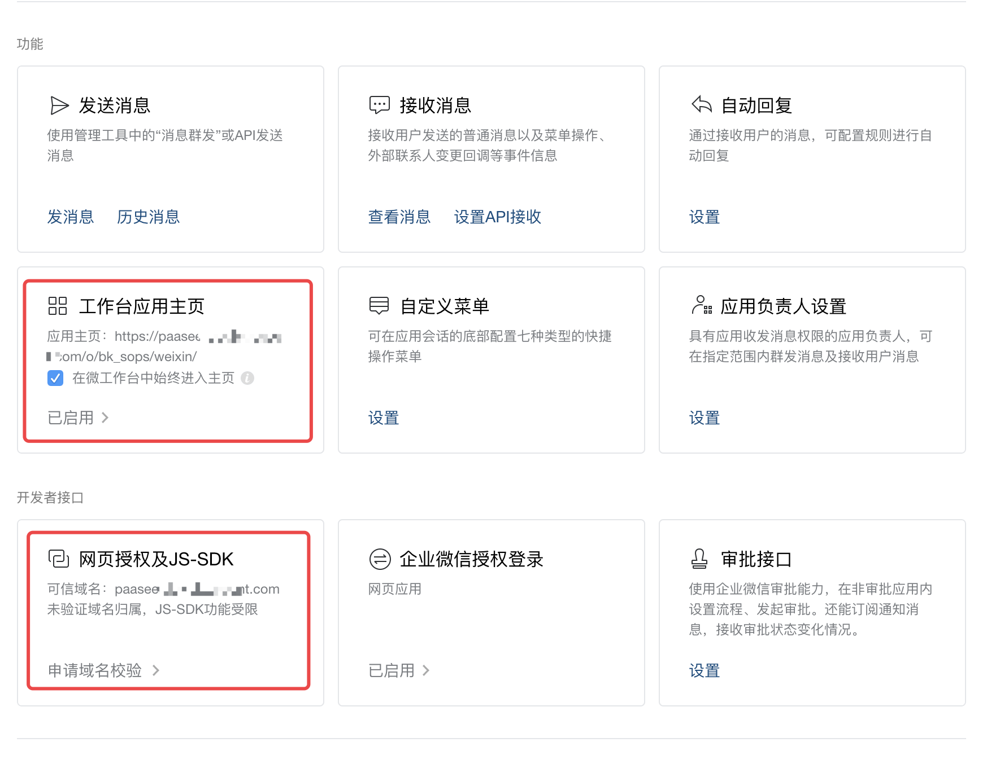
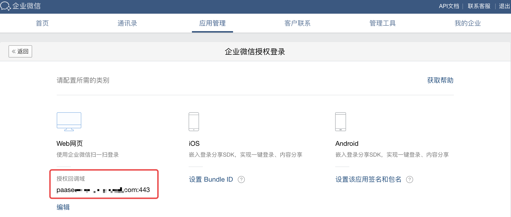
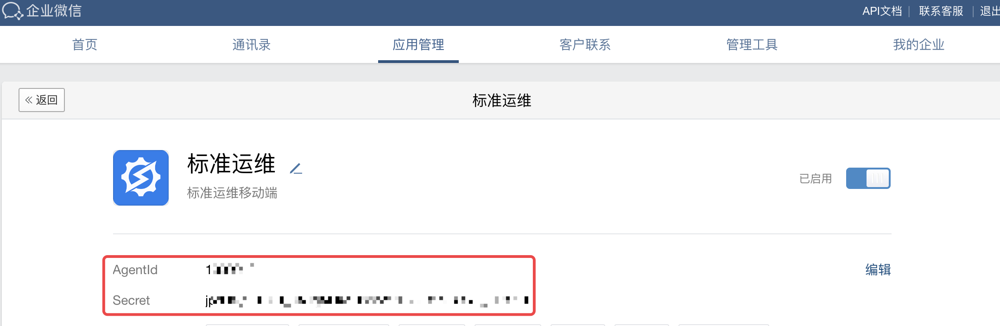
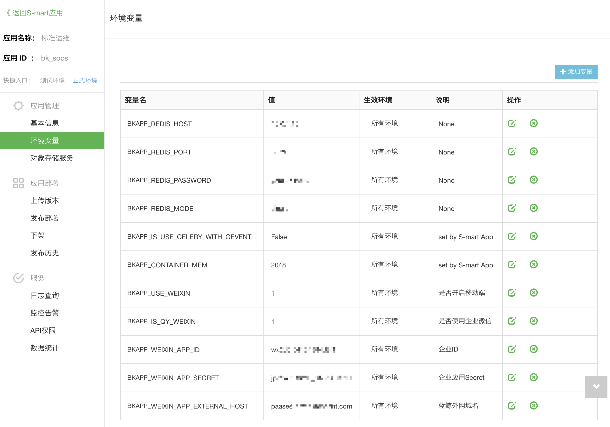
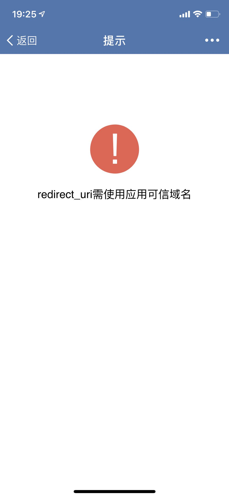

# Mobile version deployment

## WeChat Work management configuration
SOPS Mobile Version needs to be accessed via WeChat Work. Therefore, you need to link the application access link of WeChat Work to the Blueking Community Edition platform you deployed.

### Log into WeChat Work management background
Open the browser, visit the link `https://work.weixin.qq.com/` and scan the QR code to log in. Please use an account with administrator privileges.

### Create new app on WeChat Work
Click "App Management" in the navigation bar and tap "Create App" in self-created apps. Please upload SOPS SaaS logo for the app logo and use "SOPS" for app name. The app description is optional.
The access range should be configured according to your needs. If you want everyone in the company to have access, please select the root node in the organization structure.

### WeChat Work app management
- Click the SOPS app created in the previous step, locate "Workbench App Homepage" in "Features", set the app homepage as `http[https]://{BK_PAAS_HOST}/o/bk_sops/weixin/`,
and check "Always open homepage in WeChat Workbench".

- Locate "Web Authorization & JS-SDK" in "Developer Interface" and set the trusted domain name as {BK_PAAS_OUTER_HOST}.


- Locate "WeChat Work Authorization Login" in "Developer Interface" and set the authorization callback domain as {BK_PAAS_OUTER_HOST}.
{BK_PAAS_OUTER_HOST} is the extranet domain name of the Blueking platform you deployed. If it is using HTTPS protocol, please add the port number 443 in the "WeChat Work Authorization Login",
i.e. `{BK_PAAS_HOST}:443`.



## Blueking notification channel configuration
Visit Blueking Developer Center as Blueking administrator, open "Channel Management" in "API Gateway", select "[CMSI] Blueking Message Management", edit "[CMSI] Send WeChat Message",
and modify the configuration in "Component Configuration". For details, refer to "WeChat Message Component" chapter in "User Guide" for "API Gateway", note that:

- wx_type: select "WeChat Work"
- wx_qy_corpid: fill in the "Company ID" in "My Company" in WeChat Work Background Management
- wx_qy_agentid: fill in the AgentId of the SOPS app in the App Management of the WeChat Work background, which will be used as the default WeChat message notification channel.
- wx_qy_corpsecret: fill in the Secret of the SOPS app in the App Management of WeChat Work background.




## SOPS Deployment

### Package and collect frontend static resources

#### 1. Install dependencies  
Go to frontend/mobile/ and execute the following command to install NPM package
```bash
npm install
```

#### 2. Package frontend resource
Go to frontend/mobile/ and execute the following command to package the frontend static resources
```bash
npm run build -- --SITE_URL="/o/bk_sops" --STATIC_ENV="open/prod"
```

#### 3. Collect static resources
Go back to the project root directory and execute the following command to collect the frontend static resources and put them into the static/weixin/ directory
```bash
rm -rf static/weixin/open
mv frontend/mobile//dist/open static/weixin/

rm -rf static/weixin/components
cp -r static/components static/weixin/
rm -rf static/weixin/variables
cp -r static/variables static/weixin/
```

### App packaging
On a CentOS machine, after pulling your SOPS custom repository code via git, execute the following command in the project root directory to start packaging.
```bash
bash scripts/publish/build.sh
```
Note that this script will download all dependent python packages into the final version package. Please be sure to add all the dependent python packages to the requirements.txt file.
When the packaging is completed, a file named "bk_sops-CurrentTimeString.tar.gz" will be generated in the current directory, which is the version package.


### Environment variable configuration
The mobile version is not enabled by default when it is deployed. If you want to enable the mobile version, you need to configure the environment variables for SOPS app in Blueking "Developer Center" or in PaaS Admin, as shown below:

- BKAPP_USE_WEIXIN (Enable the Mobile Version) set the value to 1
- BKAPP_IS_QY_WEIXIN (Use WeChat Work) set the value to 1
- BKAPP_WEIXIN_APP_ID (Company ID) set the value to the "Company ID" in "My Company" in WeChat Work Background Management
- BKAPP_WEIXIN_APP_SECRET (Company App Secret) set the value to the Secret of the SOPS app in the App Management of WeChat Work background
- BKAPP_WEIXIN_APP_EXTERNAL_HOST (Blueking Extranet Host Name) set the value to the domain name of the Blueking platform you deployed on the extranet {BK_PAAS_OUTER_HOST}



### Redeploy
After configuring the environment variables for the SOPS app, a redeployment is required for those variables to take effect.

## Mobile User WeChat Work Account Linking
Authorized mobile users need to link their WeChat Work account in Blueking PaaS platform before using SOPS for the first time. In the "Personal Center" of Blueking PaaS platform, click on the avatar (and tap "Link WeChat"),
and scan the QR code using WeChat Work to complete linking. After completing WeChat Work account linking, please visit SOPS SaaS again to synchronize WeChat Work account information.
Then, the user can visit SOPS mobile version in the "workbench" section of WeChat Work.

## FAQ

### Unable to find WeChat Work account linking feature in My Blueking
There might be an error in the Blueking message notification channel configuration. Please follow the above instructions and make sure the variable values are correct.

### Upon launch, the mobile version gives out an error report that says "redirect_uri requires a trusted domain name"

There might be an error in the configuration of "Web Authorization and JS-SDK" in the background management of WeChat Work. Please set a trusted domain as the extranet domain for your Blueking platform.

### Upon launch, the mobile version gives out an error report that says "An error occurred on the webpage"

There might be an error in the environment variable configuration of SOPS SaaS. Please check the configuration of BKAPP_WEIXIN_APP_ID (Company ID), BKAPP_WEIXIN_APP_SECRET (Company App Secret), 
BKAPP_WEIXIN_APP_EXTERNAL_HOST (Blueking Extranet Domain).

### The business list is empty on the mobile version
After linking your WeChat Work account in "My Blueking", please launch SOPS SaaS on PC and make sure your business data is accessible before using the mobile version.
