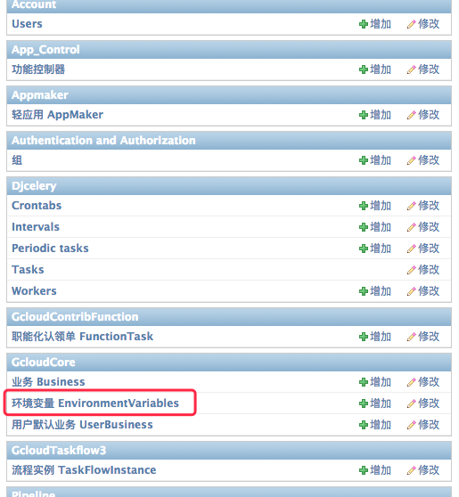
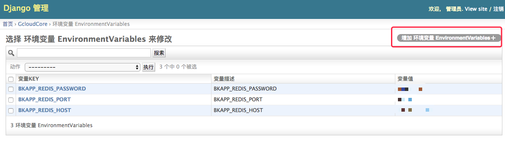

# Production environment source code deployment

## Fork source code to your own repository  
By forking source code to your own repository, you can carry out extended development and customizations. It is suggested that public feature development and bug fixes to be submitted to the official repository via pull requests. If there is no need for extended development, please retrieve a packaged version from releases, then upload, deploy and update official SOPS SaaS.


## Package and collect frontend static resources
1) Install dependencies  
Go to frontend/desktop/ and execute the following command to install
```bash
npm install
```

2) Package frontend resource
Go to frontend/desktop/ and execute the following command to package the frontend static resources
```bash
npm run build -- --SITE_URL="/o/bk_sops" --STATIC_ENV="open/prod"
```

3) Collect static resources
Go back to the project root directory and execute the following command to collect the frontend static resources and put them into the static directory
```bash
python manage.py collectstatic --noinput
rm -rf static/open static/images
mv frontend/desktop/static/open static/
mv frontend/desktop/static/images static/
```


## Create an app  
Go to your Blueking PaaS platform, click "Create App" in the "Developer Center", fill in the required parameters. You should use your Github repository address, account and password for the code repository. Note that since there is already an official "SOPS" app, you need to use a different app name and app ID, such as "SOPS Custom Edition", bk-sops-ce.
In the following documents, bk-sops-ce will be the app ID of your app. Please use your own app ID if bk-sops-ce is not your app ID.


## Modify Settings  
Go to your Blueking PaaS platform, click "Beginner's Guide" in "Developer Center", and follow the instructions to modify database configurations and set up variables such as APP_ID, APP_TOKEN, BK_PAAS_HOST.


## Enable API whitelist
Execute the following command in the controlling machine of the Blueking Community Edition to enable API gateway whitelist for Blueking PaaS SOPS access. This allows standard plugins to call the API normally.
```bash
source /data/install/utils.fc
add_app_token bk-sops-ce "$(_app_token bk-sops-ce)" "SOPS Custom Edition"
```
Please change "SPOS Custom Edition" and bk-sops-ce to your app name and app ID.


# Prepare redis resources
Create a redis service account and password on a machine in the production environment of your Blueking Community Edition. You can also use a redis service that already exists when Blueking Community Edition is deployed.


## Deploy app  
Go to your Blueking PaaS platform and click "My Apps" in "Developer Center". Find the app you just created and click "App Deploy". Please select "Enable Celery" and "Enable Recurring Tasks". This will allow you to access the "SOPS Custom Edition" app in your test environment.


## Modify the SOPS environment variable settings
Enter the URL http://{BK_PAAS_HOST}/o/bk-sops-ce/admin/ in your browser to open the SOPS management backend page.



Find the "EnvironmentVariables" table and click to edit it. Fill the redis information in step 2 into environment variables configuration, which is BKAPP_REDIS_HOST, BKAPP_REDIS_PORT, and BKAPP_REDIS_PASSWORD.
If you want to reused a redis service deployed by Blueking, the environment variables can be set as:
- BKAPP_REDIS_HOST = Obtained by executing `source /data/install/utils.fc && echo $REDIS_IP` in the controlling machine
- BKAPP_REDIS_PASSWORD = Obtained by executing `source /data/install/utils.fc && echo $REDIS_PASS` in the controlling machine
- BKAPP_REDIS_PORT=6379




## Redeploy app
Since the environment variables will only be loaded when the project launches, you must redeploy to make the changes effective. Please enter Developer Center, find your app and click "Redeploy". Please check "Enable Celery" and "Enable Recurring Tasks".


## Replace the official SOPS SaaS
After completing the previous steps, you will now have a custom SOPS on Blueking Community Edition PaaS. If it passes function test (which mainly includes core function tests such as flow template creation, task execution and task operation), you can elect to remove the official SOPS app and replace it with the custom version.  

1) If you want to keep all the data from official SOPS app, you need to modify the database settings.  
Acquire the database name, account and password of your Blueking official SOPS app. The default test environment is bk_sops_bkt, the production environment is bk_sops. Change the code in config/stag.py and config/prod.py according to the database information of official SOPS app.
```python
DATABASES = {
    'default': {
        'ENGINE': 'django.db.backends.mysql',  # Use mysql be default
        'NAME': 'bk_sops',                     # Database name (Use bk_sops_bkt for test environment)
        'USER': '',                            # Official SOPS database user
        'PASSWORD': '',                        # Official SOPS database password
        'HOST': '',                   		   # Official SOPS database HOST
        'PORT': '',                            # Official SOPS database PORT
    },
}

```

2) Because the SOPS is connected to the Blueking PaaS platform API gateway, you need to modify the SOPS gateway configuration.
Please refer to [API Gateway Replace Instructions] (https://docs.bk.tencent.com/bk_osed/guide.html#SaaS) on how to forward the SOPS API to your custom interface.
