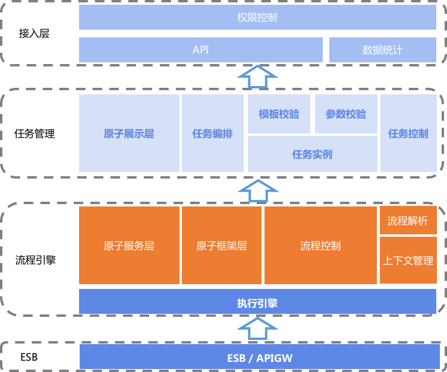

# Architecture Design

This is the architecture diagram of SOPS. The architecture can be divided into four layers:

- API Gateway Layer
It is mainly responsible for interacting with third-party platforms through API gateways. The SOPS plugin sends requests to dependent systems through this layer.
- Flow Engine Layer
It is responsible for parsing the task instances of the upper layer, mapping the services corresponding to node plugins, and calling other system APIs (such as CMDB cluster creation, JOB quick execution script, etc.) through the Blueking API gateway at the bottom layer. The flow engine also contains task execution engine, flow control, context management and other modules.
- Task Management Layer
This layer mainly involves SOPS task scheduling and task control. Task scheduling includes basic unit plugin framework and plugin display layer. Task control includes template validation and parameter validation for task instance creation and user operation interface when the task is being executed, such as pause, continue, cancel, etc.
- Access Layer
Includes permission control, API interface, statistics, etc.