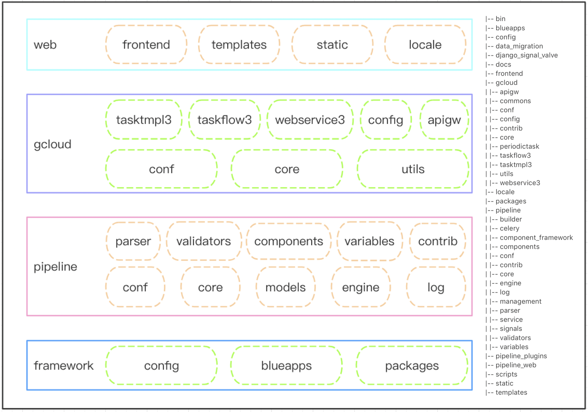

# Code Directory

The code can be divided into Blueking development framework layer (framework), flow engine service layer (pipeline), SOPS business layer (gcloud) and frontend display layer (web).

- framework

  It is a double encapsulation architecture of Blueking, based on django framework. It mainly provides basic configuration and services for SaaS operation on Blueking PaaS.

  config: the configuration of various environments in the project, including local environment, testing environment, production environment and routing configuration.

  blueapps: the core module of the new development framework. It includes Blueking unified login, authentication, middleware and public functions.

  packages: Blueking API Gateway SDK. It includes APIs provided by CMDB, JOB, etc.

- pipeline, pipeline_web, pipeline_plugins

  Flow engine framework developed in-house. It mainly includes task flow schedule page and task flow execution service.

  conf: default configuration.

  core: It defines some core elements based on BPMN2.0, such as Activity, gateway, event and data object (Data) and the overall structure of pipeline.

  models: the storage structure definition and related methods.

  engine: runtime execution logic and task state management.

  log: persistent log storage and management.

  parser: frontend data structure parsing.

  validators: data validation, such as ring structure detection and data validity check.

  component_framework: plugin framework and plugin definition.

  variables: global variable definitions.

  contrib: extended features, such as statistics and frontend API.
  
  pipeline_web: frontend data adaptation layer. It supports flow data generated by the frontend canvas.
  
  pipeline_plugins: SOPS official plugin library and custom global variables.

- gcloud

  The business adaptation layer based on the flow engine framework. It includes business permission control, flow template management, task management, business configuration, APIs, etc.

  conf: dynamic configuration adaptation layer.

  core: core business logic, permission control, business main page.

  utils: public functions and modules.

  tasktmpl3: flow template management.

  taskflow3: task management.

  webservice3: data resource API management.

  config: business configuration.

  apigw: external API modules.

- web

  Frontend resources. It includes webpack configuration and static resources.

  frontend: mainly includes flow arrangement desktop module. This module is based on vue.

  static: the frontend definition files for plugins (components) and variables. These files are placed in the static directory of their respective modules.

  templates: the main page and the django admin page.

  locale: internationalization translation files.
