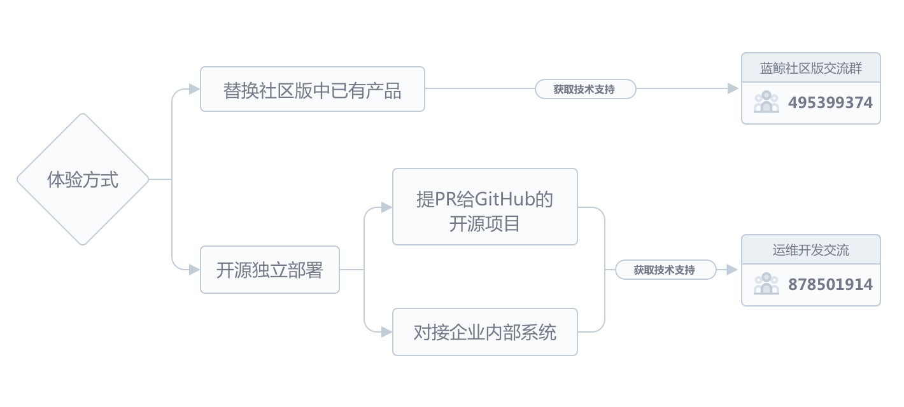

# Community Participation
Blueking encourages everyone to participate in the SOPS community. Through two ways, you can participate and interact with Blueking staff or other members of the community.
* **Issue**

    When using SOPS, if you:
    - encounter an issue and want assistance from the community;
    - find a bug;
    - have a brilliant idea that can fix the users' pain point and needs to be converted into a new demand of SOPS;
    - discover a possible feature optimization;
    - want to make some friends...
    
    Whatever you want to do, you can always [Create an Issue] (https://github.com/Tencent/bk-sops/issues/new) 
    and interact with the community. The community will respond to your issue as soon as possible. We will try our best to help you deal with the issues and the bugs.
    You can also submit PR (Pull Request) to provide a solution to this bug. If you need help from the community, you can submit an issue for us to discuss and review.
    
* **Pull Requests**

    If you are an active participant of the SOPS community, and you discovered some issues while reading the source code and the community documents, you can submit a PR (Pull Request) 
    to fix the issue or optimize the code. The PR can be about:
    
    - a bug in the source code;
    - optimization for a certain feature in the source code;
    - a description error in the documentation. Even a punctuation mark error;
    - something else that needs to be improved.
    
    You can merge your ideas and demands into the main version in the community through PR. Of course, the PR needs to be `reviewed`. For source code PR, to help the community 
    understand the context of your PR, you should create an Issue first and tell the community about your ideas before starting your work.
    The community thanks you for your hard work.
    

    
You need a GitHub account to submit an **issue** or a **PR**. You can register an account [here] (https://github.com/join) to interact with us.

You can also click the **Watch** button above the bk-sops repository and follow community updates.
    
**SOPS community is devoted to creating an open, transparent, mutually beneficial open source atmosphere. We encourage developer to participate in the community and join force to create an excellent product.**

You may find more information on community participation in other chapters of this wiki.

