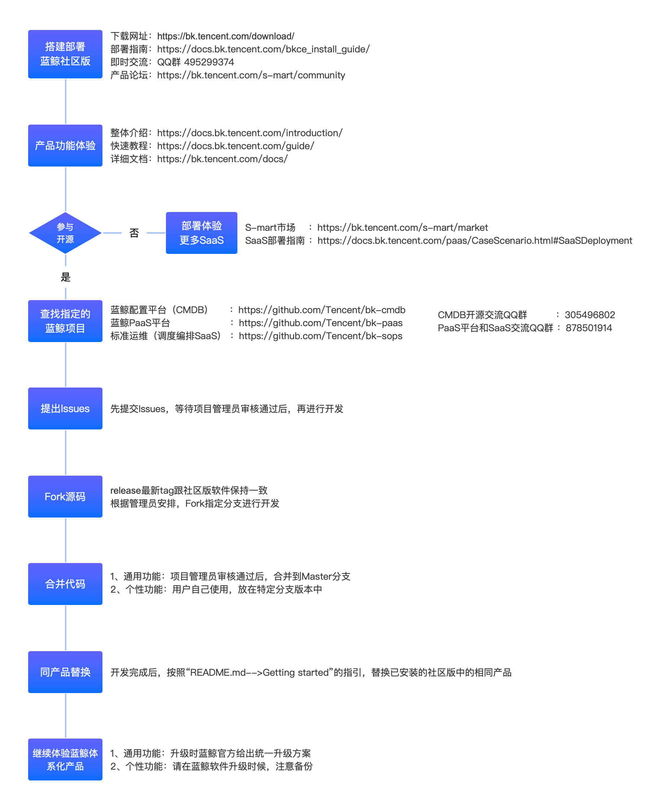

# Participate in Blueking Open Source

## Collaborating on Blueking Open Source Project

## 1. Deploy Blueking Community Edition

- [Download URL] (https://bk.tencent.com/download/)
- [Deployment Guide] (https://docs.bk.tencent.com/bkce_install_guide/)
- [Product Forum] (https://bk.tencent.com/s-mart/community)
- QQ Group: 495299374

## 2. Product Features
- [General Introduction] (https://docs.bk.tencent.com/introduction/)
- [Quick Start Guide] (https://docs.bk.tencent.com/guide/)
- [Documentations] (https://bk.tencent.com/docs/)

## 3. Deploy Other SaaS
- [S-mart Market] (https://bk.tencent.com/s-mart/market)
- [SaaS Deployment Guide] (https://docs.bk.tencent.com/paas/CaseScenario.html#SaaSDeployment)

## 4. Find a Blueking Project
- [BlueKing Configuration Management DataBase (CMDB)] (https://github.com/Tencent/bk-cmdb)
- [Blueking PaaS Platform] (https://github.com/Tencent/bk-paas)
- [Standard OPS (Scheduling and Arrangement SaaS)] (https://github.com/Tencent/bk-sops)
- CMDB Open Source QQ Group: 305496802
- PaaS Platform and SaaS QQ Group: 878501914

## 5. Submit Issues
Submit your issue to be reviewed by the project admin. Once the issue is approved, you can start development.

## 6. Fork Source Code
The latest tag of release should be consistent with the community edition. The project admin will fork the specific source code for the new development.

## 7. Merge Code
- Universal Feature: These features will be merged to Master branch once they are approved by the project admin.
- Custom Feature: These features will be implemented in specific branch versions for users to use.

##	8. Replace the same product
After development, follow the instructions in "README.md-->Getting started" and replace the same products in the installed Community Edition.

##	9. Continue using Blueking system products

- Universal Feature: Blueking staff will provide a unified update plan upon upgrading.
- Custom Feature: Please make backups before Blueking updates.
