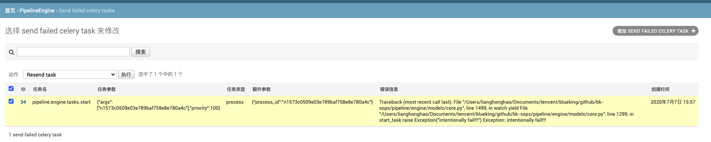

## 引擎内部消息传递错误捕获机制

由于引擎在推进过程中，消息通过 worker -> mq -> worker 的方式进行传递，从而实现流程的推进和任务的协作，如果 worker 在向 mq 推送消息时发生了错误，引擎会捕获这个错误并记录下来。你可以在 `{host}/admin/engine/sendfailedcelerytask/` 页面下看到引擎捕获的发送失败的消息。

如果你需要恢复被卡住的任务，勾选需要重新发送的任务，点击重新发送即可。

