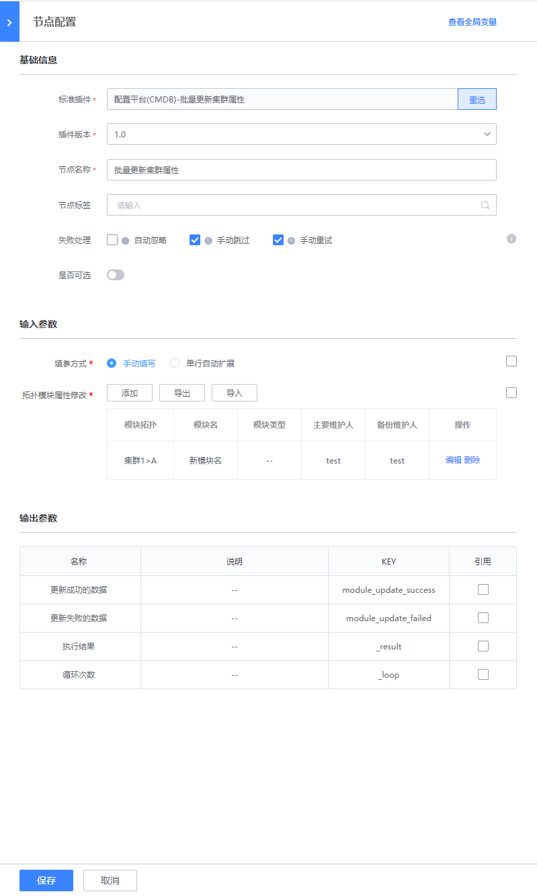

# 批量更新模块属性
> 版本`v1.0`

## 介绍

批量更新集群属性

## 标签
`cc` `cmdb` `batch_module_update`

## 参数说明

* `cc_tag_method` 填参方式：
    - 手动填写，用户按行输入
    - 单行扩展：后台支持自动解析为多行
* `cc_module_update_data`拓扑模块属性修改数据
* `cc_template_break_line` 自动扩展分隔符, 只在用户选择单行扩展时使用，默认值为`,`

## 输出参数说明

* 执行结果：

  - 更新成功的数据
  - 更新失败的数据

## 样例

## 注意事项
