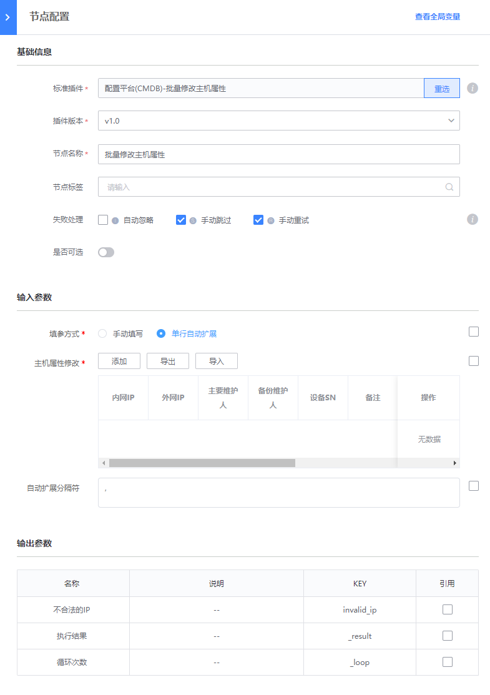
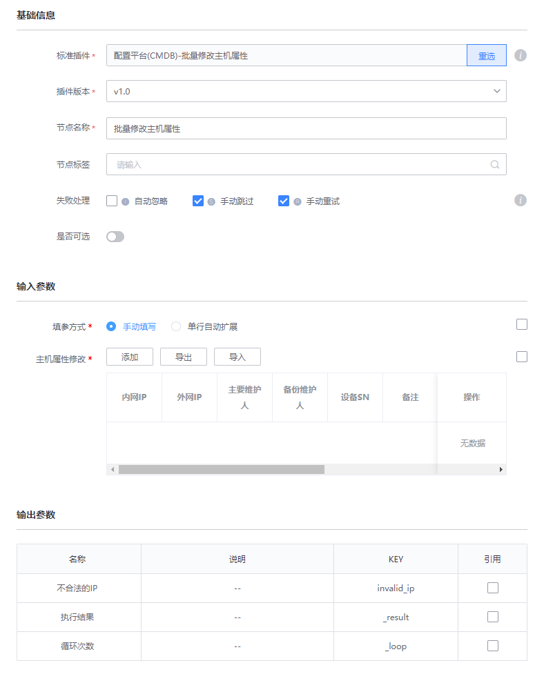

# 配置平台(CMDB)-批量修改主机属性
> 版本`v1.0`

## 介绍

批量修改主机属性

## 标签
`cc` `cmdb` `batch_update_host` 

## 参数说明

- 填参方式
    - 手动填写
    - 单行自动扩展

- 主机属性修改： 需要进行修改的主机属性表格

- 自动扩展分隔符: 默认为`,`

## 输出参数说明

* 执行结果：

  系统展示的插件执行结果
  用户输入的经过CMDB判断不合法的IP

## 样例

单行自动扩展

手动填写

## 注意事项

  